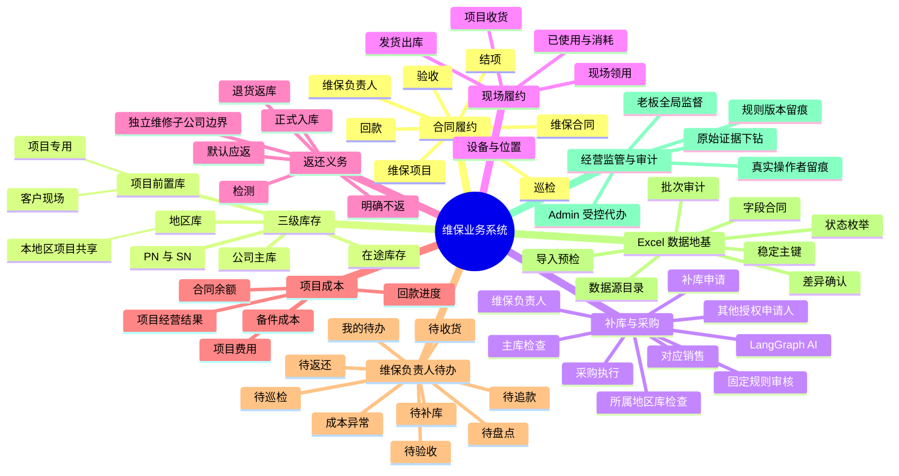
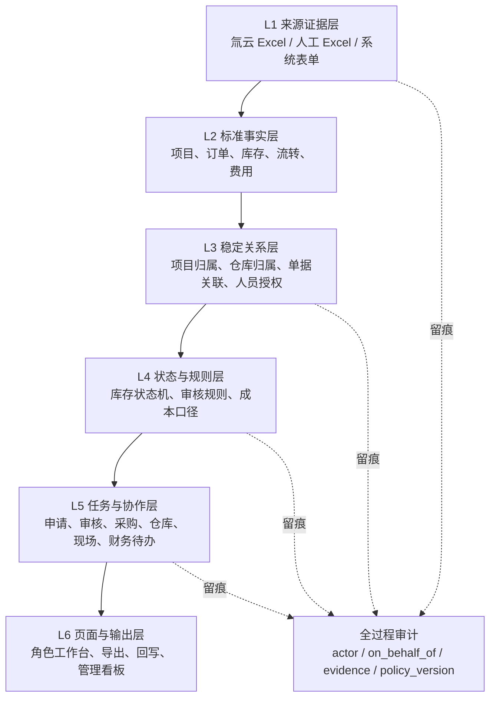
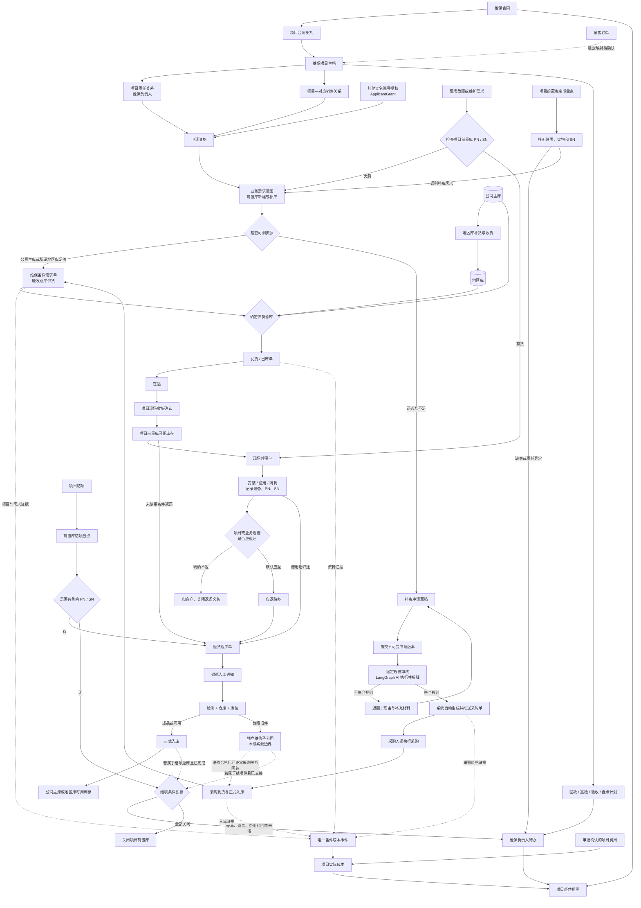
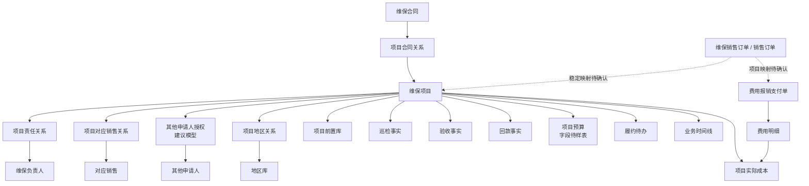
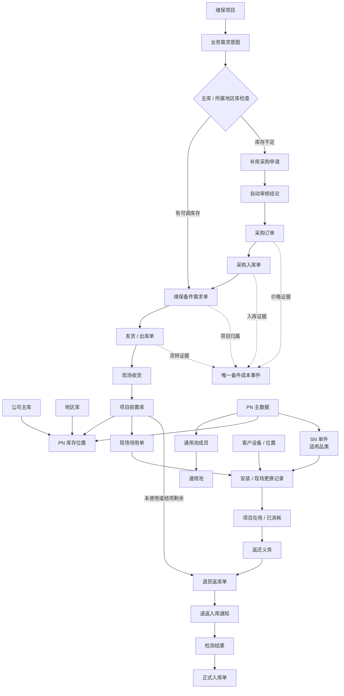
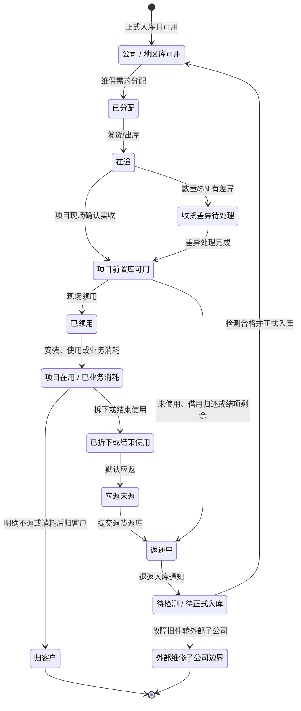
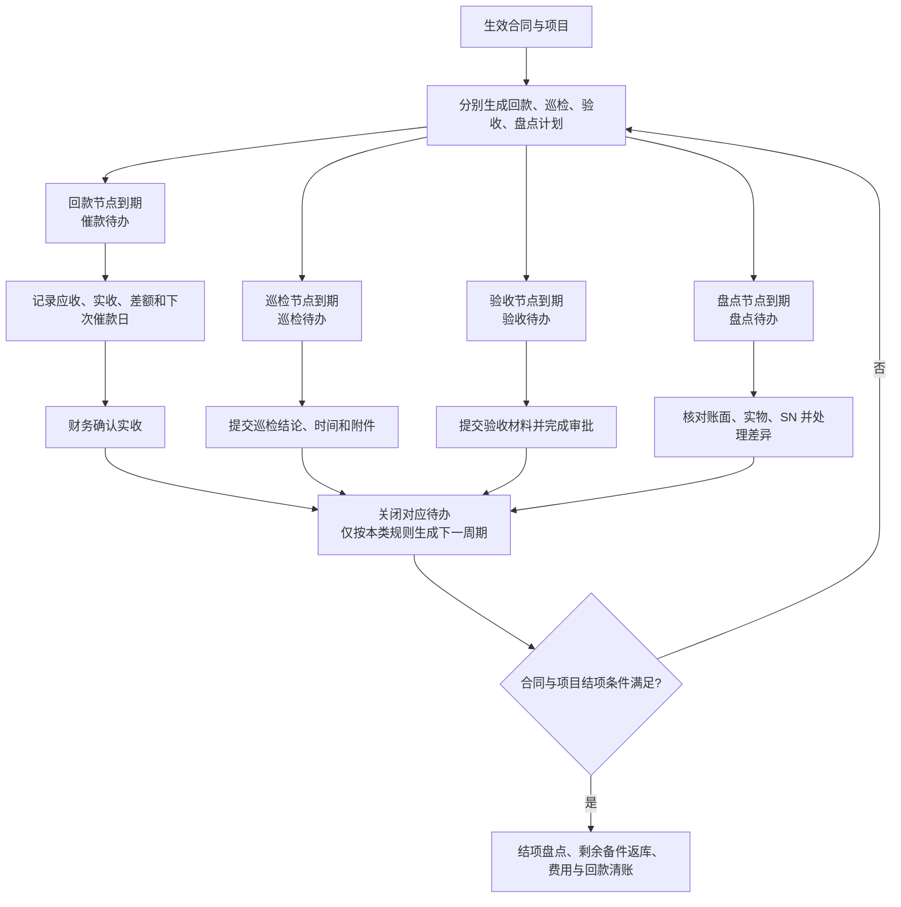
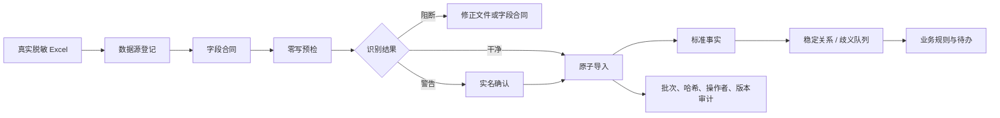

---
aliases:
  - IT_data 维保业务总模型
  - 维保真实流程模型
  - 维保业务依赖图
tags:
  - it-data/maintenance
  - business/process
  - business/excel-first
status: draft-for-review
created: 2026-08-13
updated: 2026-08-13
scope: maintenance-business-source-of-truth
---

# IT_data 维保全业务流程模型（审阅草案）

> [!abstract] 这份文档解决什么问题
> 本文先定义“真实业务怎样运转”，再决定页面、接口、Agent 和数据库怎样实现。它不是现有代码说明，也不因某个页面或 API 已存在就宣称业务已经完成。

> [!info] 建模来源与优先级
> 1. 业务方最新明确更正；
> 2. 《2026-8-5 维保真实流程》；
> 3. 已由真实脱敏 Excel 样表锁定的字段合同；
> 4. 当前系统代码和历史文档。
>
> 上层来源与下层冲突时，以上层为准。尚无样表或业务定论的内容必须标记为“待确认”，研发不得自行猜测。

> [!note] 统一术语
> 本文统一使用“维保负责人”。《2026-8-5 维保真实流程》中的“项目经理”均指同一业务责任岗位，不是另一个角色。

## 0. 结论先行

IT_data 维保业务不是一条“补库购物车”流程，而是以 `[[维保项目]]` 为中心、由七条业务链和两条治理链共同组成：

1. `[[合同履约链]]`：合同、回款、巡检、验收、结项；
2. `[[三级库存链]]`：公司主库、地区库、项目前置库；
3. `[[补库与采购链]]`：内部库存分配优先，确需采购才进入申请与审核；
4. `[[现场领用链]]`：收货、领用、消耗、PN/SN 去向；
5. `[[返还义务链]]`：应返、不返、返库、检测、正式入库；
6. `[[项目成本链]]`：备件成本与非备件费用归集，禁止重复计算；
7. `[[维保负责人待办链]]`：把业务事实转成当前责任人的行动项；
8. `[[Excel 数据治理链]]`：源表目录、字段合同、导入批次、稳定主键和版本；
9. `[[经营监管与审计链]]`：老板全过程透明，Admin 受控跨级代办，所有动作留痕。

系统主循环应当是：

```text
真实 Excel / 系统表单
    → 标准业务事实
    → 稳定业务关系
    → 状态流转与规则判断
    → 角色待办和业务操作
    → 采购、库存、履约、成本结果
    → 全过程审计与管理监督
```

当前建模判断：**页面不是业务地基，Excel 也不是系统本身。Excel 是事实入口；稳定关系和状态机把事实组织成业务；任务型页面让不同角色完成下一步。**

建议先按以下顺序审阅，不需要从头读到尾：

1. §1 看业务版图是否完整；
2. §3 看一件备件如何从需求走到采购、现场和返还；
3. §9 看哪些 Excel 已知、哪些载体仍待确认；
4. §13 裁决目前无法由研发替业务决定的问题。

### 0.1 建模方案选择

| 方案 | 优点 | 缺点 | 判断 |
|---|---|---|---|
| 页面功能清单 | 容易直接进入开发 | 看不见跨部门交接，也会把“页面存在”误当成业务完成 | 不采用 |
| 纯流程图 | 能看清业务先后关系 | 不能回答事实来自哪张 Excel、用什么键关联 | 单独使用不够 |
| 业务流程骨架 + Excel 证据主干 | 同时约束角色、状态、来源和下游结果 | 前期必须收集并核对真实样表 | **本草案采用** |

选择第三种方案，是因为每一个业务动作都必须能够同时回答：谁负责、使用什么来源事实、依据哪个稳定关系、改变什么状态、产生什么结果。

### 0.2 图中状态图例

- 实线：业务方已经确认的目标流程或必需关系；
- 标注“待确认”的虚线：业务需要存在，但来源键、先后顺序或承载表尚未锁定；
- `建议模型`：为实现已确认业务要求提出的技术表达，名称和字段仍可调整；
- `当前已实现`：只在现状差距表中使用，不能与目标流程的“应该有”混淆。

## 1. 总业务思维导图



## 2. 六层业务依赖模型



| 层 | 它解决什么问题 | 依赖的上游 | 被什么下游调用 |
|---|---|---|---|
| 来源证据层 | 回答“事实从哪里来，能否复查原表” | 氚云导出、人工表单、系统操作 | 字段解析、批次审计 |
| 标准事实层 | 把不同 Excel 转成统一业务对象 | 字段合同、稳定主键、状态枚举 | 项目、库存、成本查询 |
| 稳定关系层 | 防止按项目名、人员名或模糊文本猜关联 | 标准事实、人工裁决 | 行级权限、成本归集、单据链 |
| 状态与规则层 | 回答“当前处于哪一步，下一步是否允许” | 事实与稳定关系 | 待办、审核、库存变化 |
| 任务与协作层 | 把系统事实转成某个人现在要做的事 | 状态机、权限与责任关系 | 角色工作台、通知、升级处理 |
| 页面与输出层 | 降低使用成本并交付业务结果 | 角色任务、可解释规则 | 用户操作、Excel 输出、外部回写 |

## 3. 端到端主流程



> [!warning] 三个绝不能跨越的业务边界
> 1. `已出库 ≠ 项目已收货`：只有现场收货确认才能增加项目前置库；
> 2. `已提交返库 ≠ 已恢复库存`：只有检测合格并正式入库才能恢复公司或地区库；
> 3. `需求、采购、入库、出库 ≠ 四笔成本`：它们是同一备件成本事件的不同证据。

> [!question] WBDD 与采购申请的先后关系
> 本图先把三个概念拆开：`业务需求意图` 是缺口本身；`补库采购申请` 是内部库存不足时冻结并送审的采购依据；`WBDD` 是仓库供货依据。附件中同时出现了“WBDD 进入 AI 审核”和“采购入库后再由 WBDD 触发供货”两种表达。草案采用后一种作为单一主线，但仍把“WBDD 是否需要在采购前生成并作为申请来源单”列为 P0 待裁决，不能让系统暗中维护两套顺序。

## 4. 角色、责任与监管关系

### 4.1 角色分层

```text
业务责任层
├─ 老板 / 业务规则负责人
└─ 维保负责人

授权执行层
├─ 对应销售
├─ 其他可配置申请人
└─ 现场人员

专业履约层
├─ 仓库操作员 / 仓库负责人
├─ 采购人员 / 采购负责人
└─ 财务人员 / 财务负责人

平台与自动化层
├─ Admin
└─ LangGraph AI（规则执行器，不是责任主体）

外部边界
└─ 独立维修子公司
```

| 角色 | 解决什么问题 | 上游依赖 | 下游结果 | 明确边界 |
|---|---|---|---|---|
| 维保负责人 | 对项目履约、库存需求、验收、回款和结项负责 | 项目主档与责任指派 | 需求、待办处理、项目关闭 | 委托申请不转移项目责任 |
| 对应销售 | 作为项目默认申请人发起前置库与补库申请 | `ProjectSalesAssignment` | 草稿、正式申请、补充材料 | 申请资格不等于审核权或项目履约责任 |
| 其他可配置申请人 | 允许指定实名账号替项目发起和补充申请 | `ApplicantGrant` | 草稿、正式申请、补充材料 | 只获得被授权的项目与动作，不自动获得审批权 |
| 现场人员 | 记录实物最后一公里 | 发货、项目、前置库 | 收货、领用、消耗、返还差异 | 不得用出库记录代替收货事实 |
| 仓库 | 对保管、检测、出入库和库位事实负责 | 需求、采购到货、返库通知 | 出库、检测、正式入库 | 返库动作不能直接恢复库存 |
| LangGraph AI | 按已批准规则快速检查必要性并解释证据 | 库存、三个月购销、项目依据、池内比较 | 通过/退回、逐条理由、证据快照 | 不承担最终业务责任，不得覆盖硬规则 |
| 采购 | 执行获准的外部采购 | 审核通过的申请和证据 | 采购订单、到货 | 实质修改 PN/数量/价格时须重新检查 |
| 财务 | 确认回款、费用和项目成本口径 | 合同、回款、报销、备件证据 | 项目经营结果 | 禁止重复累计同一备件成本 |
| Admin | 落实账号、授权、导入、映射和规则发布 | 经批准的业务配置 | 可执行配置和审计 | 可代办但不得冒充业务人员 |
| 老板 | 全局经营监督、规则负责与例外处置 | 所有项目事实和完整时间线 | 规则批准、跨级处置 | 全过程透明必须可下钻到证据和操作者 |
| 独立维修子公司 | 承接故障旧件的外部业务 | 检测为故障的实物与外部交易凭证 | 合格件未来通过采购回转 | 本期不建设其内部维修过程 |

### 4.2 申请资格来自稳定关系，不来自模糊角色名

最新业务口径是“对应销售可以申请，也可以配置其他账号申请”。因此申请资格至少有两条来源：

```text
ProjectSalesAssignment（默认来源）
├─ project_id
├─ sales_user_id
├─ valid_from / valid_to
└─ status

ApplicantGrant（额外授权来源）
├─ applicant_user_id       申请人实名账号
├─ project_id              可操作的项目
├─ front_warehouse_id      可选：限定前置库
├─ allowed_actions         新建 / 修改 / 提交 / 补材料
├─ granted_by              授权人
├─ valid_from / valid_to   有效期
├─ status                  active / revoked / expired
└─ reason                  授权原因
```

这两个对象解决“对应销售默认能申请，同时还能按项目授权其他账号”的问题；上游依赖实名账号、稳定项目和授权主体；下游供补库申请行级权限使用。系统不能只检查一个笼统的 `role=sales`，而要检查“这个账号是不是这个项目当前生效的对应销售，或是否持有这个项目的有效授权”。维保负责人按附件可发起需求；若其不是对应销售，其申请资格由责任关系自动产生还是也要显式授权，列入 P1 权限定版。

### 4.3 Admin 与老板的跨级操作

跨级操作不是登录成别人的账号。每次代办至少记录：

| 字段 | 含义 |
|---|---|
| `actor_user_id` | 真正点击操作的人 |
| `acting_role` | 当时使用的角色 |
| `on_behalf_of_user_id` | 代谁办理；非代办为空 |
| `project_id` | 作用范围 |
| `action` | 执行的动作 |
| `before_state / after_state` | 前后状态 |
| `reason` | 跨级操作原因，必填 |
| `evidence_refs` | 关联单据、附件、审核依据 |
| `policy_version` | 当时生效的规则版本 |
| `occurred_at` | 发生时间 |

老板拥有全项目经营监督和异常处置视图；Admin 负责平台配置、授权和受控代办。两者都可以全过程查看，但业务责任和平台责任不能混为一类。

### 4.4 跨部门交接矩阵（RACI 草案）

`R` 表示实际执行，`A` 表示最终负责，`C` 表示协同确认，`I` 表示知会。带“待确认”的 `A` 不能由研发自行指定。

| 业务活动 | R | A | C | I |
|---|---|---|---|---|
| 建立项目主档 | 商务/项目发起人 | 合同业务负责人或老板（待确认） | 维保负责人、财务 | 仓库、Admin |
| 配置维保负责人 | Admin 落实配置 | 老板/业务负责人 | 被指派的维保负责人 | 财务、仓库 |
| 维护项目对应销售 | Admin/项目资料维护人 | 业务负责人（待确认） | 对应销售、维保负责人 | 老板 |
| 配置其他申请人 | Admin 落实配置 | 维保负责人或其上级（待确认） | 被授权申请人 | 老板 |
| 提出前置库/补库需求 | 对应销售、维保负责人或授权申请人 | 维保负责人 | 仓库、现场人员 | 老板/Admin |
| 检查主库和所属地区库 | 系统、仓库 | 仓库库存负责人 | 维保负责人、审核服务 | 申请人 |
| 执行固定采购审核 | LangGraph AI | 业务规则负责人，不是 AI | 维保负责人、仓库、采购 | 申请人、老板 |
| 执行采购 | 采购人员 | 采购负责人（待确认） | 维保负责人、仓库 | 财务、老板 |
| 出库并转在途 | 仓库操作员 | 仓库负责人 | 维保负责人 | 现场人员 |
| 项目现场收货 | 现场人员或维保负责人 | 维保负责人 | 仓库 | 申请人 |
| 现场领用和返还登记 | 现场人员 | 维保负责人 | 仓库 | 老板 |
| 返还检测和正式入库 | 仓库操作员 | 仓库负责人 | 维保负责人 | 财务 |
| 回款、验收、巡检、盘点 | 维保负责人 | 维保负责人 | 财务、现场人员 | 老板 |
| 确认费用与备件成本 | 财务 | 财务负责人（待确认） | 维保负责人、采购、仓库 | 老板 |
| 项目结束及剩余备件返库 | 维保负责人、仓库 | 维保负责人 | 财务 | 老板 |
| 故障件转外部子公司 | 仓库/外部交易接口 | 对外交易负责人（待确认） | 维保负责人、财务 | 老板 |

### 4.5 关键交接事件

RACI 回答“谁负责”，下表进一步回答“交给谁、带什么信息、系统产生什么结果”。

| 业务事件 | 发起人 → 接收人 | 最小交接信息 | 形成的单据/事实 | 状态变化 |
|---|---|---|---|---|
| 建立维保项目 | 商务/项目发起人 → 维保负责人、财务、仓库 | 合同、客户、期限、服务范围、预算、负责人、对应销售 | 项目主档、责任关系、计划 | 未建立→有效项目 |
| 提出前置库需求 | 对应销售/维保负责人/授权申请人 → 系统、仓库 | 项目、现场/库址、PN、数量、需求日、原因 | 业务需求意图 | 待检查资源 |
| 内部供货 | 仓库 → 维保负责人、现场人员 | WBDD、来源仓、目的地、PN/SN、数量、日期 | 发货/出库单 | 可用→在途 |
| 采购申请 | 申请人 → LangGraph AI | 不可变申请版本、库存、近三月购销、项目依据、池内候选 | 审核证据快照 | 草稿→审核中 |
| 采购通过 | LangGraph AI → 采购人员 | 项目、PN、数量、需求日、结论和证据 | 待执行采购单 | 通过→待采购 |
| 项目收货 | 现场人员/维保负责人 → 仓库 | 出库明细、实收 PN/SN/数量、差异、附件 | 收货确认 | 在途→前置库/差异待办 |
| 现场领用 | 现场人员 → 维保负责人、仓库 | 项目、设备/位置、PN/SN、数量、用途、应返规则 | 领用单、安装/更换记录、返还义务 | 前置库→在用/消耗 |
| 发起返库 | 现场人员/维保负责人 → 仓库 | 来源项目/领用/需求、PN/SN、数量、返还原因 | 退货返库单、退返入库通知 | 前置库/应返→返还中 |
| 返还验收入库 | 仓库 → 库存系统、维保负责人 | 检测结果、仓库、库位、PN/SN、数量 | 正式入库单 | 待检测→可用/外部边界 |
| 项目费用报销 | 报销人 → 财务、维保负责人 | 销售订单/项目关系、类别、事由、金额、日期、明细、附件 | 费用报销支付单 | 待确认→项目费用 |
| 回款与履约 | 维保负责人 → 财务/管理层 | 应收、实收、巡检/验收证据、下次日期 | 回款/巡检/验收事实 | 待办→关闭/下周期 |
| 项目结项 | 维保负责人 → 仓库、财务、老板 | 剩余 PN/SN、未结费用、未收款、履约结果 | 结项盘点与返库任务 | 运行中→结项中/已关闭 |

## 5. 核心业务对象与稳定关系

### 5.1 项目、人员与经营关系



### 5.2 备件、单据与实物流转关系



| 对象 | 稳定身份原则 | 解决的问题 | 主要下游 |
|---|---|---|---|
| 维保项目 | 氚云不可变项目 ID / 经批准的系统 ID | 聚合所有履约事实 | 权限、成本、待办、库存 |
| 项目责任关系 | 关系 ID + 项目 ID + 用户 ID + 生效区间 | 负责人变化可追溯 | 行级权限、待办 |
| 项目对应销售关系 | 关系 ID + 项目 ID + 用户 ID + 生效区间 | 证明谁是当前对应销售 | 默认补库申请资格 |
| 其他申请人授权 | 授权 ID + 项目 + 动作 + 有效期 | 可配置其他实名申请人 | 补库创建与复提 |
| 仓库主数据 | 仓库 ID + 类型 + 地区/项目关系 | 区分主库、地区库、项目前置库 | 可调库存判断 |
| PN 主数据 | 稳定 part ID，保留原始 PN 别名 | 避免文本 PN 漂移 | 库存、购销、通用池 |
| SN 单件 | SN ID + PN + 所在位置/设备 + 状态 | 追踪高价值备件去向 | 收货、领用、更换、返还 |
| 通用池成员 | 成员关系 ID + 生效期 | 限定可比较/替代的 PN | 低成本候选与风险提示 |
| 单据与明细 | 来源不可变表头/明细 ID | 幂等导入与跨表追溯 | 库存、成本、审核 |
| 审核策略版本 | 策略 ID + 版本 + 生效区间 | 解释“当时按什么规则判断” | AI 审核、复核、审计 |
| 业务时间线 | 事件 ID + 业务对象 + 时序 | 老板/Admin 全过程透明 | 管理监督、争议追溯 |

名称、人员显示名、日期加 PN、模糊文本只能作为候选检索，不能成为自动建立正式关系的依据。

### 5.3 单据各自只负责什么

| 单据/事实 | 它解决什么问题 | 上游依赖 | 对状态/成本的结果 | 明确不能代表 |
|---|---|---|---|---|
| 业务需求意图 | 描述项目为何、何时、需要什么 | 项目、申请资格、现场/前置库 | 触发资源检查 | 不是采购申请，也不改变库存 |
| 补库采购申请 | 冻结外购需求和审核证据 | 资源不足、PN/数量、项目依据 | 进入自动审核 | 不是到货或成本发生 |
| WBDD | 确定项目、PN、需求数量并触发仓库供货 | 项目需求、已可供库存 | 进入仓库分配 | 不是第二笔成本；与采购申请先后仍有 P0 待裁决 |
| 采购订单 | 记录获准的外部采购和价格证据 | 自动审核通过 | 进入采购执行 | 创建时不等于到货或入库 |
| 发货/出库单 | 证明来源库已发货 | WBDD、来源仓、PN/SN | 来源库减少、进入在途 | 不证明项目现场已收到 |
| 项目收货确认 | 证明项目现场实际收到 | 出库明细、实收与差异 | 在途转前置库 | 不能被出库状态替代 |
| 现场领用单 | 记录前置库实物去了哪里 | 项目、设备/位置、PN/SN | 前置库减少、形成使用/返还事实 | 不等于被拆旧件已经返库 |
| 退货返库单 | 记录返还动作和原因 | 未使用/借用/应返/结项剩余 | 进入返还中 | 不能恢复可用库存 |
| 退返入库通知 | 通知仓库待检测、待入库 | 退货返库单 | 进入待检测 | 仍不是正式入库 |
| 正式入库单 | 记录检测、仓库和库位 | 到货或返还通知 | 合格件恢复公司/地区库 | 故障件不能进入可用库存 |
| 费用报销支付单 | 归集备件以外费用 | 销售订单/项目稳定关系、财务状态 | 按确认口径进入项目成本 | 不能与表头重复金额多次累计 |

## 6. 三级库存与实物状态机

### 6.1 库存位置边界

| 库存位置 | 服务范围 | 是否日常可调 | 所有权/责任 |
|---|---|---|---|
| 公司主库 | 全公司 | 是 | 公司仓库 |
| 地区库 | 本地区多个项目 | 仅本地区 | 地区仓库 |
| 项目前置库 | 一个具体项目/客户现场 | 原则上否 | 维保负责人负责业务管理，现场保管 |
| 在途 | 一次发货动作 | 否 | 必须等待现场确认 |
| 独立维修子公司 | 外部业务边界 | 不属于公司可用库存 | 外部交易关系 |

本期仍包含公司内部的正常退货返库、检测和正式入库；排除的是故障旧件进入子公司后的坏件登记、子公司内部维修、内部退换与报废。维修合格件未来只能凭新的采购关系回转公司主库，不能直接改回 IT_data 可用库存。

### 6.2 实物状态机



| 业务事件 | 库存变化 | 不能产生的错误结果 |
|---|---|---|
| 创建需求或补库申请 | 不改变库存 | 不能预扣成已出库 |
| 采购订单创建 | 不改变库存 | 不能视为已经到货 |
| 采购正式入库 | 增加公司/地区库可用库存 | 缺检测或库位时不能入可用库存 |
| 发货/出库 | 来源库减少，进入在途 | 不能直接增加项目前置库 |
| 项目现场收货确认 | 在途减少，前置库增加 | 必须处理数量/SN 差异 |
| 现场领用 | 前置库减少，记录设备去向和业务消耗 | 不能只记录“已发货”；应返对象必须指向具体被拆件/借用件 |
| 未使用、借用归还或结项剩余返库 | 前置库减少，进入返还中 | 不要求先伪造一次“已消耗” |
| 提交退货返库 | 进入返还中 | 不能恢复公司可用库存 |
| 检测合格且正式入库 | 恢复公司或地区库 | 必须有仓库和库位 |

## 7. 补库申请与审核模型

### 7.1 正确的业务入口

补库不是先“去购物车挑 PN”，而是先回答：哪个项目、哪个前置库、为何缺货、何时需要、现有资源是否足够。

```text
对应销售 / 维保负责人（资格边界待定）/ 其他授权申请人
  → 选择项目
  → 判断是新建前置库还是补已有库
      ├─ 新建：填写客户现场、库址、负责人和拟建库信息
      └─ 补库：选择已经存在的项目前置库
  → 填写需求原因、日期和 PN/数量
  → 系统检查公司主库和所属地区库
      ├─ 足够：转内部调拨/供货，不进入外部采购
      └─ 不足：形成正式补库申请版本并进入审核
```

### 7.2 建议的可解释规则层

硬规则优先于 Agent。LangGraph AI 负责组织证据、解释结论和生成标准理由，不得凭语言模型自由判断覆盖硬规则。

| 规则 | 输入证据 | 暂定结果 | 待锁定内容 |
|---|---|---|---|
| 申请资格 | 有效 `ProjectSalesAssignment` 或 `ApplicantGrant`；维保负责人责任关系；项目、前置库/拟建库、需求日期 | 无权限或资料不全即退回 | 维保负责人是否天然有申请资格；谁批准额外授权 |
| PN 身份 | PN 主数据、库存记录、通用池成员、历史购销 | 必须分别检查，不能继续用“是否在库里”一个模糊条件 | “PN 不在库里”的准确含义 |
| 内部库存优先 | 公司主库、项目所属地区库的可用数量 | 足够则走内部供货，不批准外购 | 安全库存和已占用量口径 |
| 三个月活跃度 | 有效采购和销售事实，窗口截至申请日 | **采购和销售均无记录时不通过** | 边界日、有效状态、特殊新品规则 |
| 通用池价格比较 | 同池可替代 PN、可比单位、近期有效采购价 | 请求 PN 明显更贵时提示低成本候选 | “明显超过”的阈值、规格等价条件 |
| 异常与特殊说明 | 原因、附件、规则无法判定项 | 自动退回补材料，或进入人工二审 | 两种路径待业务裁决 |

### 7.3 审核证据快照

每次审核必须冻结：

```text
申请版本与内容摘要
项目 / 前置库或拟建库 / 对应销售关系或申请人授权
公司主库与所属地区库库存快照
近 3 个月采购和销售样本范围、数量、单据数
通用池成员版本与候选价格
审核策略版本
逐条通过/退回结论及原因
执行身份和发生时间
```

### 7.4 当前待裁决冲突

> [!question] 人工二审是否存在
> 《2026-8-5 维保真实流程》写明“LangGraph AI 按固定标准自动审核，不经过人工审批”；最新讨论又提出“特殊备注可以进入人工二次审核”。草案不擅自合并两种口径：
>
> - 方案 A：任何规则外情况都退回申请人补材料，不设人工审批；
> - 方案 B：硬规则正常自动处理，带特殊说明的例外进入实名人工二审。
>
> 在业务确认前，代码不能默认启用任一例外批准路径。

### 7.5 审核通过后的输出边界

已确认的目标流程是：**审核通过后，系统自动生成并把待执行采购单推送给采购人员。**

尚待确认的是这张“待执行采购单”的法律/实施属性：

1. 生成内部待执行采购任务/采购单草稿；
2. 直接形成对外有约束力的正式采购订单。

这不改变“自动生成并推送”这个业务目标，只决定推送后的单据是否已经对外生效。在供应商、价格和外部承诺责任未锁定前，建议系统内部先按“待执行采购单”建模；采购人员若更改 PN、数量或价格超过阈值，应重新触发审核。

## 8. 合同履约、待办与项目经营

### 8.1 合同履约状态闭环



项目预算、实际成本和合同余额进入同一项目经营视图；其中“项目利润”只有在收入确认和成本口径由财务锁定后才能显示，当前只称“项目经营结果”。

### 8.2 维保负责人首页不是数据看板，而是行动看板

```text
今天需要我处理什么？
├─ 待追款：应收节点、已收、差额、下次催款日
├─ 待验收：材料缺失、截止日、当前审批状态
├─ 待巡检：计划时间、逾期天数、所需证据
├─ 待盘点：前置库、PN/SN、上次盘点、差异
├─ 待收货：在途单据、预计到达、待确认差异
├─ 待补库：库存缺口、审核状态、需补材料
├─ 待返还：应返 PN/SN、逾期时间、返库状态
└─ 成本异常：缺价、费用未归属、成本率预警
```

每个待办都必须有：来源事实、责任人、形成时间、截止时间、当前状态、下一动作、关闭条件和证据。待办由业务规则派生，不允许用户脱离业务事实随意造一条“完成即消失”的提醒。

### 8.3 项目成本

```text
项目实际成本
  = 已确认的唯一备件成本事件
  + 已确认且稳定归属项目的非备件费用
```

| 概念 | 解决什么问题 | 上游 | 下游 |
|---|---|---|---|
| 备件成本事件 | 防止需求、采购、入库、出库重复相加 | WBDD 归属 + 采购/入库/出库证据 | 项目成本 |
| 项目费用 | 归集差旅、服务等非备件支出 | 报销状态、金额口径、稳定项目关系 | 项目成本 |
| 合同总额 | 明确项目收入边界 | 合同关系与生效状态 | 成本率、余额 |
| 回款事实 | 区分应收与实收 | 财务确认记录 | 回款进度、催款待办 |

备件最终采用采购价、入库成本、发货成本还是其他口径，仍需财务和真实样表确认。在确认前，只能保存多来源证据，不能选择“看起来合理”的金额。

## 9. Excel-first 数据源目录

### 9.1 三种数据类型

```text
A. 外部来源事实
   氚云或人工导出的业务 Excel，必须先登记数据源和字段合同

B. 系统内业务表单
   补库申请、授权、审核、收货确认、领用等；优先网页表单或系统签名工作簿

C. 系统派生结果
   待办、项目成本、审核建议、管理看板；不能反过来当作原始 Excel 事实
```

### 9.2 当前数据源盘点

> [!important] 关于“到底有几张表”
> 当前能识别出 **13 个候选数据源组**（5 个通用导入组 + 3 个仓库单据组 + 5 个待锁定来源组），但这既不等于 13 个业务对象，也不等于 13 个物理 Excel 文件：一个来源组可能拆成多张表，一个工作簿也可能含多个 Sheet，同一业务对象还可能有宽版/窄版导出。最终文件数必须通过“数据源登记表 + 真实脱敏样表清单”锁定。

状态说明：

- `🟢 映射已存在`：当前 `main` 有字段解析和事实落库代码，不等于生产真实数据已验收；
- `🟡 适配骨架`：有代码，但正式双表头、状态枚举或生产开关仍失败关闭；
- `🔴 待样表/载体`：业务需要，但真实表头、稳定键或承载方式未锁定。

| ID | 候选数据源组 | 来源/载体 | 稳定主键 | 生效状态 | 标准事实与下游 | 状态 |
|---|---|---|---|---|---|---|
| S01 | 项目、合同与回款全量 | 氚云或经批准全量工作簿 | 项目 ID、合同 ID、关系 ID、回款 ID | 版本化状态映射 | 项目主档、合同额、回款、权限范围 | 🔴 |
| S02 | 采购订单 | 氚云 Excel | 表头/明细不可修改数据 ID | 已生效 | 采购事实、价格、供应商、成本证据 | 🟢 |
| S03 | 销售订单 | 氚云 Excel | 表头/明细不可修改数据 ID | 已生效 | 销售量价、客户、审核证据；项目桥接仅是候选证据，稳定映射待确认 | 🟢 |
| S04 | 产品库存快照 | 氚云/盘点 Excel | 产品库存 ID；仓库+PN 受控组合 | 有效快照 | 库存快照；能否稳定覆盖主库和地区库资源检查待确认 | 🟢 |
| S05 | 维保备件需求单 WBDD | 氚云 Excel | 表头/明细不可修改数据 ID | 已生效 | 项目需求与出库关联；是否作为采购申请上游待裁决 | 🟢 |
| S06 | 费用报销明细 | 氚云或项目工作簿 | 明细 ID；受控后备组合键 | 财务确认状态待锁定 | 非备件项目费用 | 🟢 解析已存在，P0 口径未锁定 |
| S07 | 发货/出库单 | 氚云双表头 Excel | 出库单/来源 ID/明细 ID | 当前代码暂映射 `confirmed`，正式枚举未批准 | 来源库→在途 | 🟡 |
| S08 | 退货返库单 | 氚云宽/窄双表头 Excel | 返库单/来源 ID/明细 ID | 当前代码暂映射 `confirmed`，正式枚举未批准 | 返还中、入库通知 | 🟡 |
| S09 | 入库单 | 氚云双表头 Excel | 入库单/来源 ID/明细 ID | 当前代码暂映射 `confirmed`；检测/库位规则未批准 | 恢复公司或地区库 | 🟡 |
| S10 | 项目现场收货确认 | 表单或 Excel 待定 | 收货确认 ID + 出库明细 ID | confirmed | 在途→项目前置库 | 🔴 |
| S11 | 现场领用单 | 网页或 Excel 待定 | 领用单/明细 ID | confirmed/corrected | 前置库→消耗、返还义务、成本 | 🔴 真实来源合同待定 |
| S12 | 前置库盘点 | 表单或 Excel 待定 | 盘点单/明细 ID | confirmed | 账实差异、缺口、补库待办 | 🔴 |
| S13 | 巡检与验收事实 | 网页、附件或氚云表待定 | 计划/结果/材料 ID | completed/approved | 履约待办、回款证据 | 🔴 真实来源合同待定 |

### 9.3 已有或已有适配骨架的 Excel 最小字段

| 来源组 | 已识别的最小业务字段 | 主要调用链 |
|---|---|---|
| S02 采购订单 | 表头/明细数据 ID、采购单号/日期、采购人、供应商、销售订单、WBDD、PN、数量、单价、含税/未税金额 | 补库审核、采购、成本 |
| S03 销售订单 | 表头/明细数据 ID、订单号/日期、对应销售、客户、业务类型、仓库、PN、数量、含税单价、通用产品、发货 SN | 合同/项目候选关联、三月活跃度、价格与成本证据 |
| S04 产品库存 | 产品库存 ID、PN、数量、仓库、描述、品牌、整机/备件、单位、通用产品 | 三级库存、补库资源检查；仓库类型仍需主数据 |
| S05 WBDD | 表头/明细数据 ID、需求单号、销售订单、项目、客户、需求/业务类型、对应销售、出库仓库、维保期限、PN、数量、退货数量、SN | 项目需求、仓库供货、成本归属 |
| S06 费用报销 | 明细 ID 或受控后备键、报销日期、金额口径、流程状态、报销人、类别、事由、销售订单 | 非备件费用、项目经营 |
| S07 发货/出库 | 出库单号/SeqNo、来源 ObjectId、明细 ObjectId、日期、状态、WBDD、PN、SN、自贴码、数量 | 来源库→在途、项目流转证据 |
| S08 退货返库 | 返库单号/SeqNo、来源/明细 ObjectId、日期、类别/类型、WBDD/销售订单、PN、SN、数量、退返通知引用 | 返还中、退返入库通知 |
| S09 入库 | 入库单号/SeqNo、来源/明细 ObjectId、日期、类别、采购订单/退返通知/WBDD、PN、SN、数量、检测、仓库、库位、成本 | 采购到货或返还件正式入库 |

这些字段来自当前样例/代码映射盘点，只能用于建立待确认清单。S07–S09 在正式双表头、状态枚举和真实文件验收前仍必须失败关闭。

### 9.4 非交易主数据与系统配置来源

这些上游不一定来自 Excel，但必须像 Excel 一样登记所有者、稳定键和变更方式，否则主流程无法执行。

| 主数据/配置 | 最小稳定字段 | 可能来源 | 业务所有者 | 当前状态 |
|---|---|---|---|---|
| 实名账号与组织 | user_id、部门、在离职、生效期 | 账号系统/人工配置 | Admin + 人事/业务（待确认） | 待锁定 |
| 项目对应销售关系 | assignment_id、project_id、sales_user_id、生效期 | 氚云项目/销售订单/人工裁决 | 商务负责人（待确认） | **P0 待锁定** |
| 维保负责人关系 | responsibility_id、project_id、user_id、生效期 | 氚云项目或受控配置 | 业务负责人 | 待锁定 |
| PN 主数据与别名 | part_id、规范 PN、原始别名、单位、启停 | 产品主数据/库存/人工治理 | 产品/仓库负责人（待确认） | 待锁定 |
| 通用池与替代关系 | pool_id、member_id、part_id、等价条件、生效期 | 产品配置/人工治理 | 业务规则负责人 | 待锁定 |
| 仓库与库位 | warehouse_id、类型、地区/项目、库位、启停、生效期 | 仓库主数据/人工治理 | 仓库负责人 | **P0 待锁定** |
| 项目—地区库关系 | relation_id、project_id、region_warehouse_id、生效期 | 项目/区域配置 | 仓库 + 业务负责人 | **P0 待锁定** |
| 设备与现场位置 | device_id、project_id、位置、需否 SN | 资产表/现场表单 | 维保负责人（待确认） | 本期需求待确认 |
| 审核策略 | policy_id、版本、阈值、生效期、批准人 | IT_data 受控配置 | 老板/业务规则负责人 | 待锁定 |

### 9.5 数据源到业务链的调用矩阵

| 来源事实 | 合同履约 | 三级库存 | 补库审核 | 现场领用/返还 | 项目成本 | 待办/监管 |
|---|---|---|---|---|---|---|
| 项目/合同/回款 | 主来源 | 项目归属 | 项目依据 | 项目边界 | 合同额/回款 | 周期待办、全局视图 |
| 采购订单 | — | 到货上游 | 三月采购、价格 | — | 价格证据 | 采购进度 |
| 销售订单 | 合同/项目候选桥 | — | 三月销售、价格 | 客户/项目候选 | 收入候选证据 | 经营监管 |
| 产品库存 + 仓库主数据 | — | 库存锚点 | 主库/地区库资源 | 前置库覆盖待补 | — | 缺口、盘点 |
| WBDD | 项目需求 | 分配上游 | 先后待裁决 | 出库关联 | 项目归属证据 | 需求进度 |
| 出库/收货/领用/返库/入库 | 履约证据 | 实物状态主链 | 在途/可用量 | 主来源 | 数量/成本证据 | 差异、逾期、返还 |
| 费用报销 | — | — | — | — | 非备件费用 | 费用异常 |
| 巡检/验收/盘点 | 履约主来源 | 盘点校准 | 缺口触发 | 结项返库 | — | 周期待办 |

### 9.6 不可违反的 Excel 导入规则

1. 氚云第一行是内部字段码、第二行是业务字段名；按业务字段名和受控别名匹配，不依赖固定列序。
2. 退货返库存在宽版/窄版；可选列允许缺失，不能用 Excel 总列数判断模板身份。
3. 每张来源表保留原始单号、表头 ID 和明细 ID，用于去重、修正和追溯。
4. 一张表头单据可能展开为多条明细；统计表头金额先按单号去重，统计 PN/费用类别再汇总明细。
5. 导入合同只锁定最小业务字段；其余来源列作为可追溯扩展信息，不照搬上百列进入核心模型。
6. 未批准的表头、状态枚举或稳定键必须阻断正式写入，不得猜测后继续。

### 9.7 每张 Excel 必须先登记的字段

建议建立 `ExcelSourceRegistry`，任何导入器开发前必须填完：

| 登记项 | 解决的问题 |
|---|---|
| 来源系统、表单名称、导出视图 | 防止同名 Excel 来自不同口径 |
| 业务负责人、数据维护人 | 明确字段变更找谁确认 |
| 物理文件数、Sheet 名称、表头行数 | 确认“一张表”真实含义 |
| 全量/增量、导出频率、覆盖区间 | 防止漏导或重复累计 |
| 表头/明细稳定 ID | 支持幂等、修正和追溯 |
| 状态原值及生效映射 | 防止草稿、作废、退回进入正式事实 |
| 日期与金额口径 | 防止把创建日当业务日、把多种金额相加 |
| 必需列、可选列、受控别名 | 支持模板变化且失败关闭 |
| 敏感字段与脱敏规则 | 保护客户、供应商、人员和附件 |
| 脱敏样本 SHA-256、映射版本、生效日期 | 证明代码对应哪份真实模板 |

### 9.8 Excel 到业务动作的统一管道



## 10. 面向使用者的任务型界面模型

### 10.1 每个页面必须先回答五个问题

1. 这个页面是处理什么业务的？
2. 为什么这件事现在轮到我？
3. 我需要准备哪些信息？
4. 点击后会改变什么，不会改变什么？
5. 完成后交给谁，在哪里看结果？

技术字段码、摘要、版本哈希、迁移词汇和原始 F-code 不应占据普通业务页面；需要追溯时统一放到“查看数据依据”。

### 10.2 各角色首页

| 角色 | 默认看到 | 主要操作 | 完成后的结果 |
|---|---|---|---|
| 维保负责人 | 我的项目、逾期待办、库存缺口、成本与回款异常 | 处理履约、发起需求、确认收货、结项 | 项目状态推进 |
| 对应销售/其他授权申请人 | 可申请项目、草稿、退回项、等待审核、已通过 | 建单、补材料、复提 | 审核结论或待执行采购单 |
| 仓库 | 待分配、待出库、待检测、待正式入库、差异项 | 执行实物流转 | 库存状态推进 |
| 采购 | 审核通过的待执行采购单、待补供应信息、变更重审 | 补充并执行采购 | 到货和采购事实 |
| 财务 | 待确认费用、待核回款、成本归属异常 | 确认口径和归属 | 项目经营事实 |
| 老板 | 全项目状态、风险、金额、逾期和完整时间线 | 下钻、升级、受控代办 | 经营处置记录 |
| Admin | 数据源、导入批次、账号授权、规则版本、审计异常 | 配置、发布、修复映射、代办 | 平台治理结果 |

### 10.3 补库申请页面应改成步骤，而不是功能堆叠

```text
步骤 1：选择项目，并选择“新建前置库”或“补已有库”
  新建时填写现场/拟建库；补库时选择现有前置库
  结果：确定责任范围和可查询的所属地区库

步骤 2：填写需求原因、日期、PN 与数量
  结果：形成可保存草稿，不改变库存

步骤 3：系统资源与规则预检
  结果：显示内部可供、三个月活跃度、通用池候选和阻断项

步骤 4：处理阻断项或补充特殊说明
  结果：满足提交条件，或明确无法申请的原因

步骤 5：提交审核
  结果：冻结版本和证据，不能静默修改

步骤 6：跟踪结果
  结果：退回补充或已推送待执行采购单；若业务选择例外路径，才显示人工二审
```

## 11. 全过程透明：统一业务时间线

老板和 Admin 的“全过程透明”应落成同一条可查询时间线，而不是散落在多个页面：

```text
项目建立
→ 责任人/申请人授权
→ 需求提出
→ 库存检查
→ 申请版本提交
→ 规则审核
→ 待执行采购单
→ 到货与入库
→ WBDD
→ 出库
→ 在途
→ 现场收货
→ 领用与消耗
→ 应返/不返
→ 返库
→ 检测与正式入库
→ 成本确认
→ 验收、回款、结项
```

每个事件必须能下钻到：原始来源、稳定对象、操作者、代办关系、前后状态、规则版本、时间和附件。普通角色只看本人/本人项目；老板看全局；Admin 依治理职责查看和代办，但所有越级动作必须写理由。

## 12. 现有系统与目标模型的差距

| 能力 | 当前事实 | 目标缺口 |
|---|---|---|
| 通用 Excel 导入 | 采购、销售、库存、WBDD、费用已有映射 | 缺统一数据源目录、部分状态/金额仍未业务锁定 |
| 仓库三单 | 已有预览/适配骨架 | 正式表头与状态契约未批准，生产失败关闭 |
| 项目主档 | 有内部模型与维护能力 | 氚云项目/合同/回款源表合同和同步未完成 |
| 补库购物车 | 有申请、版本、逐行审核结果和导出骨架 | 入口不以项目/前置库为中心，使用指导不足 |
| 可配置申请人 | 只能拼装页面/动作权限 | 缺项目级 `ApplicantGrant` 与有效期/授权人 |
| 审核 | 只有接收外部审核结果的接口 | 固定规则、LangGraph 执行器、证据解释和采购推送均未实现 |
| Admin 监管 | admin 可跨申请读取/操作部分数据 | 缺统一代办语义和可视时间线 |
| 老板监管 | 无完整补库全局监管闭环 | 缺全局查询、跨级操作和原因审计 |
| 前置库库存 | 有部分现场领用/返还对象 | 缺现场收货事实和真实 PN/SN 库存账 |
| 自动采购 | 尚未实现 | 需先锁定采购草稿/正式订单边界与重审规则 |
| 用户体验 | 页面以字段和功能为主 | 需转成角色任务、步骤、结果和下一责任人 |

## 13. 待裁决决策清单

### P0：决定数据模型或业务合法性

1. “PN 没有出现在库里”分别指：PN 主数据不存在、库存没有记录、未加入通用池，还是三个月无交易；四项必须独立定规则。
2. 特殊说明是继续自动退回，还是允许进入实名人工二审。
3. WBDD 是只在库存可供后触发仓库供货，还是也要在采购前生成并作为补库采购申请的来源单。
4. 自动推送的“待执行采购单”在采购补充供应商/价格前只是内部草稿，还是已经对外生效。
5. 项目现场收货由哪张氚云表、Excel 或网页确认承载。
6. 主库、地区库、项目前置库的稳定 ID、类型和项目/地区关系来自哪里。
7. 项目、合同、销售订单、WBDD 和费用的稳定关联链。
8. `ProjectSalesAssignment` 从哪张氚云表或哪项受控配置产生，如何处理对应销售变更。
9. 备件最终成本采用哪一环节、什么日期和什么税务口径。
10. 项目费用的有效流程状态、正式金额字段和归属日期。

### P1：决定规则阈值或权限边界

11. 维保负责人是否天然拥有申请资格，以及谁能批准和撤销其他申请人的授权。
12. 三个月窗口的起止日、有效订单状态和新品例外。
13. “明显高于通用池”的比较公式、阈值和可替代性条件。
14. 采购人员改变供应商、PN、数量或价格到什么程度需要重审。
15. 同一项目是否允许多个前置库。
16. 哪些品类必须逐件管理 SN。
17. 老板与 Admin 分别允许哪些跨级写操作。

### P2：外部边界

18. 故障件转独立维修子公司使用哪种外部交易单据及财务口径。
19. 巡检、盘点、验收是否已有氚云表，还是由 IT_data 原生表单承载。

## 14. 业务完成定义（Definition of Done）

一条业务线只有同时满足以下条件，才可以称为“使用者可用”：

- [ ] 用户知道页面解决什么问题；
- [ ] 用户知道为什么轮到自己、需要准备什么；
- [ ] 每个按钮明确说明会改变什么、不会改变什么；
- [ ] 操作完成后能看到下一责任人和最终结果；
- [ ] 数据来自已登记的 Excel/表单，字段合同与状态枚举已锁定；
- [ ] 正式关系使用稳定 ID，不按名称猜测；
- [ ] 状态迁移和库存影响有明确业务规则；
- [ ] 自动审核冻结输入证据和规则版本，结论可解释；
- [ ] Admin/老板可以按权限下钻完整时间线；
- [ ] 跨级代办记录真实操作者、代办对象和原因；
- [ ] 异常、退回、重试和恢复路径可操作；
- [ ] 真实账号能在真实脱敏样本上完成端到端验收。

代码存在、接口返回 200、CI 通过或页面能够打开，都不能单独满足这一定义。

## 15. 推荐实施顺序

```text
Gate 0：Excel 数据源目录与真实脱敏样表
  ↓
Gate 1：字段合同、稳定主键、状态枚举、来源所有权
  ↓
Gate 2：项目/仓库/人员/单据的稳定关系
  ↓
Gate 3：三级库存和现场收货—领用—返还状态机
  ↓
Gate 4：补库硬规则、证据快照和例外路径
  ↓
Gate 5：按角色重做任务型界面
  ↓
Gate 6：LangGraph AI 解释与采购推送
  ↓
Gate 7：老板/Admin 全局监管、真实账号灰度和生产验收
```

第一阶段不应继续增加页面。应先形成《Excel 数据源登记表》，逐份拿到脱敏样表，确认物理文件、Sheet、稳定 ID、状态和业务用途。此后每一个页面需求都必须能反向指到标准事实和来源证据。

## 16. 本草案的确认状态

### 已按来源锁定

- 维保业务由多条链路共同组成，不是单一购物车；
- 维保负责人对项目履约负责；
- 公司主库、地区库和项目前置库边界不同；
- 其他项目前置库不作为日常可调资源；
- 出库、现场收货、领用、返库和正式入库是不同状态；
- 默认应返，明确不返时归客户；
- 故障旧件进入独立维修子公司，本期不建设其内部流程；
- 备件成本与非备件费用构成项目实际成本，单据证据不得重复累计；
- 维保负责人首页应优先展示本人行动项；
- Excel 第一行内部字段码、第二行业务名，导入不依赖固定列号。

### 已按最新补充锁定的原则

- 项目的对应销售默认可以申请，也可按项目配置其他实名账号；
- Admin 和老板需要全过程透明及受控跨级操作；
- 若 PN 在申请日前近三个月内采购和销售均无有效记录，则不通过；
- 请求 PN 明显高于同一通用池可替代品的采购价时，提示更低成本候选；
- 审核通过后，自动生成并推送待执行采购单给采购人员。

### 原则已明确、细节仍待裁决

- “PN 不在库里即退回”中的“库”具体指 PN 主数据、库存记录还是通用池；
- 三个月窗口边界、有效状态和新品例外；
- “明显高于”的阈值与可替代性条件；
- 特殊说明是否进入人工二审；
- 待执行采购单在采购补充信息前是否已经对外生效。

### 明确不作为当前事实

- 现有补库页面已经达到低学习成本；
- LangGraph AI 审核器已经实现；
- 当前代码尚未实现“审核通过后自动生成并推送待执行采购单”；
- 氚云项目、合同、回款同步已经完成；
- 出库已经等于前置库收货；
- 仓库三单适配代码已经通过真实生产文件验收。
