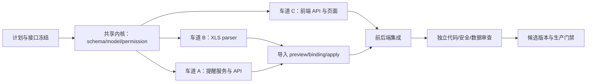

# Maintenance Collection Reminders Implementation Plan

> **For agentic workers:** REQUIRED SUB-SKILL: Use superpowers:subagent-driven-development to execute this plan task-by-task. Every implementation task also follows test-driven-development: add a focused failing test, run it and record the expected failure, implement the smallest compatible change, rerun focused tests, then run the listed regression set. Do not push, merge, deploy, connect to production, or modify unrelated user files.

**Goal:** 在现有维保工作台内实现“回款计划提醒”闭环：把项目经理 `.xls` 的 24 组横向回款排期安全地预览并转为纵向计划节点，让维保负责人按月份查看、标记已处理、改期或重新打开；这些操作只管理提醒，不产生任何财务到账事实。

**Architecture:** 复用 `MaintenanceCollectionMilestone` 作为计划事实，追加月份精度和人工跟进状态；新增不可变操作账本、专用导入批次和人工审核的订单绑定。后端提供与旧财务回款快照完全独立的 reminder-only API。前端在现有 Ant Design 维保工作台新增 38/62 主从页面和四步导入弹窗。导入采用 `preview -> reviewed bindings -> atomic apply`，preview 零领域事实写入，apply 使用冻结的规范化计划并做版本重验。

**Tech Stack:** Python 3.12、FastAPI、同步 SQLAlchemy 2、PostgreSQL 15、Alembic、Pydantic v2、`xlrd==2.0.2`、pytest；React 18、TypeScript、Ant Design 5、Axios、Vitest、Testing Library；Docker Compose 与现有 v1.21/vNext 发布控制脚本模式。

## 0. 冻结基线与唯一真值

- 工作目录固定为当前 Git 主工作区根目录，不得另建 `/tmp` 实现 worktree；脚本必须通过 `git rev-parse --show-toplevel` 或自身位置解析根目录，不写死机器用户名路径。
- 实施起点为 Git commit `eae82716329ac9ebfecf33c04c630931e240a46b`。
- 数据库唯一基线为 Alembic `d9f1a3c7e5b2`；新 revision 必须以它为 `down_revision`，不得复活已删除的 `f9b2d4e7c1a6` 项目导入链。
- 产品合同以 `.ai/MAINTENANCE_COLLECTION_REMINDERS_DESIGN.md` 为准。
- XLS 机器合同以 `.ai/contracts/maintenance-collections/project-manager-xls-v1.yaml` 为准。
- API DTO、可空性、错误体和前后端并行边界以 `.ai/contracts/maintenance-collections/collection-reminders-api-v1.yaml` 为准；两端不得自行增加同义字段。
- 真实样例仅以已冻结的 SHA-256 标识；运行时路径由外层 Codex 通过非版本化参数传入，不得写进 Git。不得复制原件进 Git、改写原件或在日志/fixture 中保存真实业务值。
- 与本功能无关的未跟踪文件必须保持不动：
  - `docs/maintenance/维保模块员工操作培训手册.md`
  - `docs/superpowers/plans/PR7-release-plan.md`
- 禁止把 `MaintenanceCollectionSnapshot`、received amount、到账率、凭证、核销或财务确认接入新页面。
- 禁止用项目名、客户名、负责人姓名、日期范围或 fuzzy matching 自动绑定项目。
- 禁止用颜色作为导入事实；颜色只由 `reminder_state` 派生并必须同时显示文字。
- API 金额统一返回十进制定点字符串或 `null`；前端不得转为 JavaScript `number` 参与业务计算。
- 新 action 对所有现有权限模板和账号默认 `false`；首发必须处于 maintenance Beta 且 allowlist 关闭状态。

## 1. 多智能体执行框架

### 1.1 阶段和依赖图



共享内核必须先串行完成并通过 migration/model/permission tests。它同时把 API v1 合同翻译为 Pydantic DTO，并完成 `xlrd` 的 direct dependency/lock/SBOM，形成不可移动的 K0 commit。之后 A、B、C 可同时开发；它们只能编辑各自所有权文件。导入集成 I 仅依赖共享 milestone helper 与 parser，不调用车道 A 私有服务。最终由唯一 integrator 处理路由、锁文件、生成物、冲突和提交。

### 1.2 Claude Code Agent Team

主实现器必须使用 Claude Code `--model fable`；握手已确认其 canonical model 为 `deepseek-v4-flash[1m]`。协调 prompt 必须显式要求创建多个子智能体，并使用以下角色：

| 角色 | 职责 | 写权限 |
|---|---|---|
| `schema_integrator` | Task 1；迁移、ORM、权限骨架、共享写 helper；后续唯一集成者 | 仅 Task 1/集成清单中的共享文件 |
| `reminder_backend` | Task 2；状态派生、目录/详情/操作服务与 API | reminder 专用 service/API/tests |
| `xls_importer` | Task 3–4；BIFF parser、批次、绑定、原子 apply、上传证据 | collection plan parser/import service/API/tests |
| `reminder_frontend` | Task 5–6；专用 API、权限、文案、主从页面和弹窗 | `frontend/` 本功能文件与明确列出的导航测试 |
| `test_reviewer` | 最终只读验收；不得修自己发现的问题 | 无写权限 |

执行约束：

1. 代理开始前先读取本计划和设计文件，不从聊天摘要猜字段。
2. 并行代理不得运行 `git add/commit/rebase/merge/push`；只有主协调器在每波验收后按精确文件清单提交。
3. 不得编辑其他代理拥有的文件；需要共享接口调整时发给 integrator，由 integrator 单独落地。
4. 不得使用 SSH、生产数据库、生产 uploads、GitHub merge 或部署命令。
5. 每个任务报告：改动文件、首个红测及失败原因、绿测命令与结果、残余风险。
6. 同一模型写出的代码不能自审通过；每波至少由一个独立 Codex reviewer 做只读复核。
7. 每波结束时所有 writer 必须明确退出或进入 idle；外层 Codex 记录精确路径 SHA-256、`git status` 和 owner 隔离 patch。Reviewer 只审该冻结包；任何修复后重新冻结。只有复核通过后，外层 Codex 才能精确 stage/commit 并启动下一波。
8. 后端依赖/lock/SBOM 生成只在 K0 串行波执行；其间不启动任何会运行 `uv run --frozen` 的并行代理。
9. 同时最多三个 writer；reviewer 不与 writer 并发审同一 diff。
10. 本计划中的 `uv`/`npm` 命令块用于说明底层验收语义；Claude writer 不直接执行它们，只能调用第 1.4 节固定 check runner 的精确 ID。外层 Codex 和 CI 可直接复跑底层命令。

### 1.3 冻结 API 合同

服务端完整路径：

```text
POST /api/maintenance/collection-reminders/search
GET  /api/maintenance/projects/stable/{project_id}/collection-milestones
POST /api/maintenance/collection-milestones/{milestone_id}/follow-ups
POST /api/maintenance/collection-plan-imports/preview
GET  /api/maintenance/collection-plan-imports/{batch_id}/binding-options
POST /api/maintenance/collection-plan-imports/{batch_id}/apply
GET  /api/maintenance/collection-plan-imports/{batch_id}/source-file
```

前端 Axios `baseURL=/api`，所以调用只写 `/maintenance/...`。

枚举固定为：

```text
date_precision: day | month
follow_up_status: pending | handled
reminder_state: needs_review | handled | incomplete | overdue | due_this_month | upcoming
follow_up_action: handle | reschedule | reopen
owner_scope: me | all
batch_status: valid | error | applied | expired
binding_status: reviewed
preview_binding_status: reviewed | pending_review
```

所有 search/detail/follow-up/preview/binding-options/apply/source-file 的完整字段、必填性、null 语义、判别规则和 403/409/422 示例均在 `collection-reminders-api-v1.yaml` 冻结。Task 1 新建 `backend/app/schemas/maintenance_collection_reminders.py` 逐项实现 Pydantic v2 DTO；Task 5 的 TypeScript 类型逐项镜像该合同。合同变更必须先修改 `.ai` 并由外层 Codex复审，不能由并行代理私下漂移。

### 1.4 可执行 Claude Code 波次协议

外层 Codex 是唯一 review、commit、push 和 release owner。Claude lead、teammate 和 reviewer 都不得执行任何 Git 写操作。禁止 `--dangerously-skip-permissions`；Claude 采用 `--permission-mode dontAsk`，writer 只预授权文件工具与固定检查器的精确命令，reviewer 只拥有 `Read/Glob/Grep`。Agent 定义与波次 prompt 固化在：

```text
.ai/claude-prompts/maintenance-collection-reminders-agents.json
.ai/claude-prompts/maintenance-collection-reminders-wave-k0.md
.ai/claude-prompts/maintenance-collection-reminders-wave-parallel.md
.ai/claude-prompts/maintenance-collection-reminders-wave-integration.md
.ai/claude-prompts/maintenance-collection-reminders-wave-repair.md
.ai/claude-prompts/maintenance-collection-reminders-wave-review.md
.ai/claude-prompts/run_collection_reminders_claude.py
.ai/claude-prompts/run_collection_reminders_checks.py
.ai/claude-prompts/guard_collection_reminders_tool.py
.ai/claude-prompts/freeze_collection_reminders_review.py
```

首次启动 writer 前，由外层 Codex 冻结两份用户文件的存在性、mode、size 和 SHA-256，同时生成本轮唯一 `run_id` 并绑定当时的 Git HEAD：

```bash
python3 .ai/claude-prompts/freeze_collection_reminders_review.py baseline
python3 .ai/claude-prompts/freeze_collection_reminders_review.py verify
```

K0 串行命令：

```bash
python3 .ai/claude-prompts/run_collection_reminders_claude.py k0
```

外层 Codex 保存返回的 `session_id`。K0 writer 停止后，外层执行 `freeze ... k0`，复审和 commit 后才使用同一 session `--resume SESSION_ID` 加载 parallel prompt；A/B/C 最多三个 writer。它们停止后，外层执行 `freeze ... parallel`，脚本必须分别产出 `reminder_backend/xls_importer/reminder_frontend` 三套 manifest 与 patch；逐 owner 复审并提交后，外层以固定检查器运行 `final-sync-package-metadata`，只允许生成 `backend/spareparts_backend.egg-info/`，再执行 `freeze ... metadata`、复审和独立提交。完成该外层 metadata barrier 后才恢复 session 运行 integration writer；Claude integration 不得修改任何生成元数据。

integration writer 退出后，外层执行 `freeze ... integration`，完成独立复审、测试并提交该波。随后执行 `freeze ... final`，从本轮 baseline HEAD 到当前 reviewed HEAD 生成一份完整累计 patch；Claude reviewer 必须使用一个全新、不 resume writer 上下文的只读调用：

```bash
python3 .ai/claude-prompts/run_collection_reminders_claude.py review
```

review prompt 只读取已冻结的六个 owner package、一个 final cumulative package 及对应 manifest；它无 `Edit/Write/Bash/Agent`。任何 P0/P1 修复必须结束 reviewer：外层先在 `.git/maintenance-collection-reminders-repairs/<finding_id>.json` 固化 finding ID、P0/P1、owner、run_id、摘要/精确 `repo/path:line` 行锚和当前 final patch/manifest SHA，再调用 `run_collection_reminders_claude.py repair --owner <owner> --finding-file <json>`；行锚路径必须属于该 owner allowlist。launcher 在任何执行分支前写入绑定 finding SHA、旧 reviewed HEAD 和已提交 launcher SHA 的 launch receipt。四个业务 owner 会启动全新单-owner Claude writer，禁用 Agent，并只开放该 owner 精确路径和检查器；`outer_codex` 只用于本功能 `.ai` 合同/框架 finding，输出 `claude_writer_started=false` 后在加载 agents/构造 Claude 命令前退出。随后外层 Git owner 复核 writer 结果，只可修改对应 owner allowlist，并以 launcher 输出/receipt 中的 run ID、finding ID、finding SHA 和 owner 四条 trailer 提交。每个 repair commit 后必须立即执行 `freeze_collection_reminders_review.py repair-close --finding-id <id>`；closure 会把 finding SHA、旧 reviewed HEAD 到修复 HEAD 的精确路径与 binary patch SHA 固化，并机器重验 commit trailer、拒绝任一跨 owner 路径。所有修复都必须由外层复跑受影响与全量测试并提交；六个既有 owner 包不得覆盖，只重新生成从同一 baseline 到新 HEAD 的 final cumulative package，再启动另一个 fresh read-only reviewer。这样既保留原实现的完整累计差异，也避免把已实现代码吸收到新 baseline 后产生空包。若修复影响 dependency/package metadata，则必须重跑 metadata barrier，并用同一 run 的新 receipt 更新 metadata attestation 后再生 final；`verify-packages` 还会机器校验 dependency-sensitive 路径的最后修改提交早于或等于 metadata package 的 `base_head`，旧 receipt 不得复用。每个 repair cycle 只允许一个 finding；其余 finding 必须在新的 fresh review 中重新确认后再启动下一 cycle。任何越界需求或 CLI tool allowlist 失效都必须停机，不能退化到 bypass permissions。

repair finding 的最小机器结构固定为：`schema=maintenance-collection-reminders-repair-v1`、`finding_id`、`severity=P0|P1`、`owner`、`run_id`、`source_final_patch_sha256`、`source_final_manifest_sha256`、非空 `summary` 和 `anchors[]`。owner 只能是 `schema_integrator/reminder_backend/xls_importer/reminder_frontend/outer_codex`；其中 `outer_codex` 只能覆盖 `OUTER_CONTRACT_PREFIXES`，且 launcher 必须在归档证据后无 Claude 进程退出。launcher 校验后才归档旧 final，并对业务 owner 启动：

```bash
python3 .ai/claude-prompts/run_collection_reminders_claude.py repair \
  --owner reminder_frontend \
  --finding-file .git/maintenance-collection-reminders-repairs/P1-example.json
```

CLI 的 `--allowedTools` 不是排他安全边界。launcher 必须同时通过显式 `--settings` 装载 `PreToolUse` deny hook：Bash 只接受当前 wave 的完整固定命令字符串，Edit/Write 只接受 freeze owner 清单内的非 symlink 路径；其余调用在执行前拒绝。启动 writer 前必须用一个未授权 `pwd` 负探针和一个授权 check 正探针证明 hook 生效，并保存结果；只靠 prompt 约束不得开工。

提醒优先级固定为：

```text
needs_review > handled > incomplete > overdue > due_this_month > upcoming
```

## Task 1: 共享内核——迁移、ORM、权限和受控计划写 helper

**Owner:** `schema_integrator`；此任务串行执行，其他写代理等待。

**Files:**

- Create: `backend/alembic/versions/c8e2a4f6b1d3_maintenance_collection_reminders.py`
- Modify: `backend/app/models/maintenance_manager.py`
- Modify: `backend/app/models/__init__.py`
- Modify: `backend/app/permissions.py`
- Modify: `backend/app/security.py`
- Create: `backend/app/services/maintenance_collection_milestones.py`
- Create: `backend/app/schemas/maintenance_collection_reminders.py`
- Modify: `backend/app/services/maintenance_manager_workbook_adapter.py`
- Modify: `backend/tests/conftest.py`
- Create: `backend/tests/test_maintenance_collection_reminders_migration.py`
- Create: `backend/tests/test_maintenance_collection_milestones.py`
- Modify: `backend/tests/test_maintenance_manager_workbook_v3_adapter.py`
- Modify: `backend/tests/test_maintenance_manager_workbook_v3_migration.py`
- Modify: `backend/tests/test_permission_center.py`
- Create: `backend/tests/test_maintenance_collection_reminder_schemas.py`
- Modify: `backend/pyproject.toml`
- Regenerate: `backend/uv.lock`
- Regenerate: `backend/requirements.lock`
- Regenerate: `backend/dependency-sbom.cdx.json`
- Regenerate: `backend/spareparts_backend.egg-info/PKG-INFO`
- Regenerate: `backend/spareparts_backend.egg-info/requires.txt`
- Regenerate: `backend/spareparts_backend.egg-info/SOURCES.txt`
- Modify: `backend/app/config.py`

### Step 1.1: 先写迁移和模型红测

测试必须断言：

- 新 revision 的 `down_revision == "d9f1a3c7e5b2"`，`alembic heads` 仍只有一个 head。
- `maintenance_collection_milestone` 新增：
  - `date_precision`，`day|month`，存量回填 `day`；
  - `collection_plan_import_batch_id`；
  - `follow_up_status`，`pending|handled`，存量回填 `pending`；
  - `follow_up_review_required`，存量回填 `false`；
  - `follow_up_note`、`followed_up_by`、`followed_up_at`。
- `handled` 必须有操作者和时间；`pending` 不得有操作者或时间。
- `follow_up_review_required=true` 只允许在 `handled`。
- `source` 和两个 batch FK 三分支互斥：
  - `direct_api`：两个 batch FK 都空；
  - `manager_workbook_v3`：仅原 `source_batch_id` 非空；
  - `project_manager_xls_v1`：仅 `collection_plan_import_batch_id` 非空。
- 新表存在且约束正确：
  - `maintenance_collection_plan_import_batch`；
  - `maintenance_collection_plan_source_binding`；
  - `maintenance_collection_milestone_operation`。
- operation `idempotency_key` 全局唯一、action 枚举受约束、DB trigger 拒绝 UPDATE/DELETE。
- binding 唯一键为 `(source_system, external_order_no)`，source 固定 `project_manager_xls_v1`。
- batch 唯一键为 `(owner_user_id, operation_key)`，`storage_key` 全局唯一；并发相同 preview 只能产生一个批次和一份原件。
- 新 action 在所有角色模板、`sys_role_template` 和存量 `sys_user.permissions` 中默认 `false`。

先运行：

```bash
cd backend
uv run --frozen --extra dev pytest -q \
  tests/test_maintenance_collection_reminders_migration.py \
  tests/test_maintenance_manager_workbook_v3_migration.py \
  tests/test_permission_center.py
```

预期：因新 revision、模型字段、表和权限尚不存在而失败。必须记录失败断言，不能先写实现再补测试。

### Step 1.2: 实现 additive migration

迁移要求：

- 使用已冻结且未占用的 revision ID `c8e2a4f6b1d3`；以 `d9f1a3c7e5b2` 为唯一父节点。
- 开头设置 `SET LOCAL lock_timeout = '5s'`。
- 对存量表采用 nullable/server-default-first，再回填和收紧约束；不得重建或删除存量计划数据。
- 保留 `(project_contract_id, sequence)` 唯一键和金额范围约束。
- 新增索引 `(project_id, follow_up_status, planned_date, sequence)`。
- operation append-only trigger 复用 `e6a9c3f1b2d4_operation_audit_append_only.py` 模式。
- downgrade 只删除本 revision 新增的对象和列，不触碰原有计划节点数据之外的表；发布回滚优先 image/flag 回退，不在生产自动执行破坏性 downgrade。

### Step 1.3: 实现 ORM

`MaintenanceCollectionPlanImportBatch` 精确列为：

```text
batch_id, owner_user_id, contract_version, file_sha256, file_size,
original_filename, storage_key, operation_key, semantic_hash, data_version,
apply_payload_hash, version, status, plan_json, issues_json, result_json,
created_by, created_at, expires_at, applied_by, applied_at
```

`MaintenanceCollectionPlanSourceBinding` 精确列为：

```text
binding_id, source_system, external_order_no, project_id,
project_contract_id, binding_status, reviewed_by, reviewed_at,
version, created_at, updated_at
```

`MaintenanceCollectionMilestoneOperation` 精确列为：

```text
operation_id, milestone_id, action, idempotency_key, expected_version,
result_version, payload_hash, before_payload, after_payload, result_json,
reason, actor_user_id, created_at
```

JSON payload 只保存受控字段，不保存整个 Excel 行、客户/负责人原值或隐藏金额。

列类型固定：ID/哈希/状态/操作者使用现有模型一致的有界 `String`；`owner_user_id` 和 `actor_user_id` 使用 `sys_user.id` FK；日期时间使用 `TZDateTime`；版本使用 `Integer >= 1`；文件大小使用 `BigInteger`；计划/issue/result/before/after 使用 `JSONB`；reason/note 使用 `Text`。`original_filename` 最大 255、`storage_key` 最大 255、`external_order_no` 最大 128、幂等键最大 128。所有 nullable 字段只按设计允许 null，不额外增加列。

`backend/app/config.py` 新增 `maintenance_collection_plan_apply_enabled: bool = False` 和 `maintenance_collection_canary_project_id: str | None = None`。preview 在 false 时仍可用；apply 在 false 时必须 fail-closed。canary project ID 非空时，follow-up 的节点项目以及 apply 整批 bindings 中任何项目不等于该 ID，都返回 HTTP 403 / `canary_scope_denied` 且零写入。该运行时门、canary scope 与实名 action/Beta 门同时满足才可写，不可互相替代。

### Step 1.4: 实现权限显式门禁

新增：

```text
action_maintenance_collection_follow_up
action_maintenance_collection_plan_import
```

同步更新 `ACTION_KEYS`、`LABELS`、角色模板、数据/页面依赖、`HIGH_RISK_KEYS` 和 `PERMISSION_META`。两者依赖 `page_maintenance`、`page_maintenance_beta`；导入额外依赖 `data_profit` 且要求 `role=admin`。

现有 `require_action()` 会对 admin 短路，不可用于本功能的最终写门。新增一个显式账号权限 helper；它必须读取实名账号快照与 override，admin 没有显式 action 仍返回 403。follow-up 也使用显式 action，不能依靠角色默认。

### Step 1.5: 实现冻结 DTO 和 direct dependency

- `backend/app/schemas/maintenance_collection_reminders.py` 必须逐项实现 API v1 YAML 中的 request/response/error schema，所有 request 使用 `ConfigDict(extra="forbid")`。
- schema test 对每个端点序列化合成 200 response，并验证 403/409/422 detail 结构；金额字段只接受 `str|null`。
- 在 `backend/pyproject.toml` 增加精确生产依赖 `xlrd==2.0.2`，然后按顺序运行：

```bash
cd backend
uv lock
uv export --frozen --no-dev --no-emit-project --format requirements-txt --no-header > requirements.lock
cd ..
python3 .deploy/generate_dependency_sbom.py --write .
python3 .deploy/generate_dependency_sbom.py --check .
```

上述命令同步生成 `uv.lock`、`requirements.lock`、egg-info 三文件和 CycloneDX SBOM；只允许预期 xlrd 与新增 source/test 路径变化。

### Step 1.6: 抽取唯一受控计划写 helper

在 `maintenance_collection_milestones.py` 提供共享函数，供 manager workbook 与 XLS apply 调用。输入包括当前节点、项目/合同/期次、计划日期/金额、完整度、来源和批次、精度、操作者。规则：

- manager workbook 写 `date_precision=day`；XLS 写 `month`。
- 创建节点初始 `pending/false`。
- 修改 handled 节点的日期或金额时，保留 handled 和处理人/时间，设置 `follow_up_review_required=true`。
- 未改变计划事实不得增加 version。
- 不删除 source-missing 节点。

### Step 1.7: 绿测与共享内核回归

```bash
cd backend
uv run --frozen --extra dev pytest -q \
  tests/test_maintenance_collection_reminders_migration.py \
  tests/test_maintenance_collection_milestones.py \
  tests/test_maintenance_collection_reminder_schemas.py \
  tests/test_maintenance_manager_workbook_v3_adapter.py \
  tests/test_maintenance_manager_workbook_v3_migration.py \
  tests/test_permission_center.py
uv run --frozen --extra dev alembic heads
uv run --frozen --extra dev alembic check
cd ..
python3 .deploy/generate_dependency_sbom.py --check .
```

Acceptance：focused tests 全绿、唯一 head、新旧 manager workbook 写入语义一致、`git diff --check` 通过。之后由独立 reviewer 复核 schema 约束、权限 fail-closed 和迁移可逆性，才开放并行车道。

## Task 2: 车道 A——提醒状态、项目目录、详情和人工操作 API

**Owner:** `reminder_backend`。依赖 Task 1；可与 Task 3、Task 5 并行。

**Files:**

- Create: `backend/app/services/maintenance_collection_reminders.py`
- Create: `backend/app/api/maintenance_collection_reminders.py`
- Create: `backend/tests/test_maintenance_collection_reminder_logic.py`
- Create: `backend/tests/test_maintenance_collection_reminders_api.py`
- Modify only through integrator: `backend/app/main.py`
- Modify only through integrator: `backend/tests/test_maintenance_beta_gate.py`

### Step 2.1: 写纯状态红测

覆盖：

- `needs_review > handled > incomplete > overdue > due_this_month > upcoming`。
- month 精度只比较自然月。
- day 精度：早于 `as_of` 为 overdue；当日或本月未来日期为 due_this_month；下月及以后 upcoming。
- `as_of` 明确传入，禁止使用浏览器时区或隐式系统日期。
- `next_actionable_milestone` 不选择普通 handled 节点。

```bash
cd backend
uv run --frozen --extra dev pytest -q tests/test_maintenance_collection_reminder_logic.py
```

### Step 2.2: 实现纯函数和只读查询

服务接口固定为：

```python
derive_reminder_state(milestone, *, as_of: date) -> str
search_collection_reminders(db, *, as_of, user_ctx, q_text, owner_scope,
                            reminder_state, page, page_size) -> dict
get_project_collection_milestones(db, *, project_id, as_of, user_ctx) -> dict | None
```

要求：

- 项目范围复用 `maintenance_project_assignments.resolve_owner_scope()` 和项目 scope helper。
- `all` 只在后端 `allowed_owner_scopes` 包含时允许。
- 搜索只查项目编号、项目名称、合同编号；分页上限 200。
- SQL/服务层进行 amount masking，无 `data_profit` 时 `planned_amount=null`。
- DTO 不包含财务回款、客户联系人、凭证或税口径。
- 排序和七类计数由服务端统一产生。

### Step 2.3: 写操作红测

覆盖：

- `handle`：仅完整 pending 节点；note 可选。
- `reschedule`：仅完整 pending；`planned_month` 与非空 reason 必填，金额不变。
- `reopen`：仅 handled/needs_review；reason 必填，清空处理人/时间/note/review_required，回到 pending。
- incomplete 无写操作；needs_review 只能 reopen。
- `expected_version` 冲突 409。
- 同 idempotency key + 同 payload 返回首次结果；不同 payload 409。
- follow-up `payload_hash` 固定包含实名 `actor_user_id`、路径 `milestone_id` 和规范化 request body；同 key 跨账号或跨节点即使 body 相同也必须 409。
- IDOR、撤权、inactive project/contract、合同不属于项目 fail-closed。
- 配置了 `maintenance_collection_canary_project_id` 时，其他项目的 handle/reschedule/reopen 固定返回 HTTP 403 / `canary_scope_denied`。
- 无显式 action 的 admin 403。
- operation 写入后 UPDATE/DELETE 被数据库拒绝。

### Step 2.4: 实现写服务与路由

写服务接口：

```python
follow_up_collection_milestone(
    db, *, milestone_id, expected_version, idempotency_key, action,
    planned_month, note, reason, operator, user_ctx, as_of
) -> dict | None
```

事务和锁：

1. 先定位可见 project_id 并重新校验 scope。
2. 按现有项目事实写锁顺序锁项目/workbook state。
3. 用 `idempotency_key` 查询 operation；若已存在，沿其 milestone 重新校验项目 scope，再比较目标 milestone、actor 和 payload hash。只有 actor、path milestone 和 body 全部相同才返回首次 `result_json`，否则 409；重放不得先比较已经递增的 milestone version。
4. operation 不存在时，`SELECT milestone ... FOR UPDATE` 并比对 expected version。
5. 更新节点并追加 immutable operation。若并发插入触发 idempotency unique violation，在 savepoint/rollback 后回读 operation，重新做 scope 和 hash 校验，再重放或 409。
6. API 统一 commit；异常 rollback。

路由严格使用冻结路径，Pydantic `extra="forbid"`；无关 action 字段返回 422。操作者使用实名账号 helper，不接受客户端 username。

### Step 2.5: 产出 router 注册请求

本车道不得修改共享文件；在报告中列出需要 integrator 注册的 router 和 Beta 路由清单。车道自身验收不运行 `test_maintenance_beta_gate.py`。

集成波由 integrator 修改：

- `backend/app/main.py`：在 maintenance Beta dependencies 下注册新 router。
- `backend/tests/test_maintenance_beta_gate.py`：kill switch 关闭时所有新路由 404；router 模块必须被覆盖。

### Step 2.6: 验证

```bash
cd backend
uv run --frozen --extra dev pytest -q \
  tests/test_maintenance_collection_reminder_logic.py \
  tests/test_maintenance_collection_reminders_api.py \
  tests/test_maintenance_manager_tracking_board.py
```

旧 tracking board 的财务口径保持原样；新页面完全走专用 API。

## Task 3: 车道 B1——专用 `.xls` parser 与依赖供应链

**Owner:** `xls_importer`。依赖 Task 1；可与 Task 2、Task 5 并行。

**Files:**

- Create: `backend/app/services/maintenance_collection_plan_xls.py`
- Create: `backend/tests/test_maintenance_collection_plan_xls.py`
- Dependency ownership: direct dependency、lock、requirements、egg-info 和 SBOM 已在 Task 1/K0 串行完成；本车道只消费冻结依赖，不再生成共享文件。

### Step 3.1: 写 parser 红测

使用合成 BIFF fixture；真实附件只用于本地只读 acceptance，不提交。测试覆盖：

- 精确 64 列签名；修改任意标签或位置 fail-closed。
- 24 组交替 `回款时间 N/回款金额`，正确解析合成数据。
- 真实样例只读 acceptance：3 个项目、19 个完整节点，只断言聚合计数和 SHA，不打印业务值。
- 非 BIFF、错误扩展名、超文件/Sheet/行/列/物理单元格/字符串预算拒绝。
- 只投影首个 Sheet，但其他 Sheet 也计入资源预算。
- 日期仅接受 `YYYY年M月`，输出月初且 precision=month。
- 金额经 `Decimal(str(value))`；零/负值、过大、小数精度越界拒绝，不静默 round。
- 日期金额孤儿、重复订单、序号断档和同一行超过 24 节点拒绝。
- 颜色/格式不参与状态；公式缓存只能作为需人工确认的观察值，不宣称验证公式。
- 第二张费用 Sheet 不进入计划。

### Step 3.2: 实现 bounded parser

公开接口：

```python
parse_project_manager_collection_xls(content: bytes, *, filename: str) -> ParsedCollectionPlan
```

预算从机器合同读取或由同一模块常量与合同测试锁定：文件 8 MiB、最多 8 Sheet、每 Sheet 2,001 行、128 列、250,000 物理单元格、单元格 2,048 字符、2,000 项目行、48,000 节点。

解析：

- 检查 `.xls` 和 OLE/BIFF magic，不信任 MIME。
- `xlrd.open_workbook(on_demand=True, ragged_rows=True, formatting_info=False)`。
- 每个 Sheet 先预算，使用后 `unload_sheet`。
- 订单号只 trim 首尾；不改变大小写、内部空格或标点。
- 规范化输出可 JSON 序列化；Decimal 以字符串进入 `plan_json`。
- semantic hash 使用字段名、类型标签、长度前缀和规范化值，顺序稳定。
- 错误信息只给 sheet/row/field code 和原因，不回显业务值。

### Step 3.3: 验证已冻结 direct dependency 和 SBOM

`xlrd==2.0.2` 必须已由 K0 成为 direct production dependency。本车道只运行冻结检查：

```bash
cd backend
uv lock --check
cd ..
python3 .deploy/generate_dependency_sbom.py --check .
```

不得手工伪造 lock 或 SBOM；生成后 review 只应包含预期 xlrd 依赖变化。

### Step 3.4: 验证

```bash
cd backend
uv run --frozen --extra dev pytest -q tests/test_maintenance_collection_plan_xls.py
cd ..
python3 .deploy/generate_dependency_sbom.py --check .
```

## Task 4: 车道 B2——上传证据、预览、人工绑定和原子 apply

**Owner:** `xls_importer`；依赖 Task 1 的共享 milestone helper/Pydantic DTO 与 Task 3 parser；不依赖或调用 Task 2 的私有 reminder service。

**Files:**

- Create: `backend/app/services/maintenance_collection_plan_imports.py`
- Create: `backend/app/api/maintenance_collection_plan_imports.py`
- Create: `backend/tests/test_maintenance_collection_plan_imports.py`
- Create: `backend/tests/test_maintenance_collection_plan_upload_security.py`
- Modify through integrator: `backend/app/main.py`
- Modify through integrator: `backend/tests/test_maintenance_beta_gate.py`

本任务不修改 `backend/app/api/maintenance.py` 或旧 roundtrip 上传链。专用 API 内实现 `.xls/8MiB` 的认证前置、Content-Length 预检和流式收包，并用新安全测试覆盖，避免改变 `.xlsx/100MiB` 旧行为。

### Step 4.1: 写 preview 红测

覆盖：

- 未鉴权/无权限/非实名 admin/无 `data_profit`/无显式 action，在读取完整 body 前拒绝。
- 只接受单个 `.xls`，8 MiB Content-Length 先验和流式限额同时生效。
- preview 创建 batch 和受控原件证据，但项目、绑定、milestone、operation 零写入。
- preview 强制接收 8–128 字符 `Idempotency-Key` header。同一次上传的网络重试复用该 key；用户显式点击“重新预览”必须生成新 key，从而允许过期批次或 409 后建立新 data baseline。
- `operation_key` 只由 owner 与客户端 idempotency key 规范化生成，绝不包含 contract version；两个并发相同 preview 由 `(owner_user_id, operation_key)` 唯一键收敛到同一 batch。命中后再比较同一行的 `file_sha256` 与 `contract_version`：二者都相同才返回首次结果，任一不同返回 409。文件内容相同但客户端 key 不同是一次新的预览，不能命中已过期旧 batch。
- `storage_key` 全局唯一且同一预览只产生一份受控文件；并发 loser 只清理自己尚未被任何 DB 行引用的临时文件，不删除已有 uploads。
- valid/error 批次都保存 file SHA、size、不可猜 storage key；日志不含原始文件名或业务行。
- 返回 row_key、batch_version、data_version、绑定缺口、create/update/unchanged/source_missing 和警告/阻断计数。
- 计划总额与订单金额不一致是 warning；日期/金额孤儿等是 blocker。

原件存储不得强行复用只属于验收 deliverable 的 `BusinessFileLink`。本功能使用 batch 自身的唯一 `storage_key`，在 `raw_file_dir/maintenance-collection-plans/` 下按不可猜 key 原子写盘；不按原文件名寻址，不修改旧 `.xlsx/100MiB` roundtrip helper。

### Step 4.2: 写 binding/apply 红测

覆盖：

- binding options 只向批次所有者或同权限 admin 返回稳定项目/合同最小字段；`q` trim 后至少 2 字符，并使用 `page/page_size`，`page_size<=50`。空/过短查询返回 422，绝不返回全量项目。
- 项目名相同也不自动绑定；人工选择的合同必须属于项目且有效。
- 新绑定 `existing_binding_version=null`；改派必须有 reason 并写 operation audit。
- 未绑定、0/多合同、批次过期、合同改派、撤权均失败关闭。
- apply 只读 batch `plan_json`，不重新解析上传文件。
- 稳定锁顺序覆盖 batch、项目、合同、binding、milestone；任一 expected version 漂移整批 409，零领域写入。
- 同 apply payload 重放首次 `result_json`；不同 payload 409。
- `(project_contract_id, sequence)` create/update/unchanged；source_missing 只报告不删除。
- 修改 handled 节点保留 handled 并设 review_required。
- 两个并发 apply 最多一个产生领域写入。
- 配置了 `maintenance_collection_canary_project_id` 时，混入或改派到其他项目整批固定返回 HTTP 403 / `canary_scope_denied`。
- 原件下载要求同一高风险权限、实名 admin、审计记录和 attachment disposition。

### Step 4.3: 实现服务

公开接口：

```python
preview_collection_plan_import(
    db: Session, *, content: bytes, filename: str, idempotency_key: str,
    owner_user_id: int, operator: str, user_ctx: UserContext, as_of: date
) -> PreviewResponse
search_collection_binding_options(
    db: Session, *, batch_id: str, q_text: str, page: int,
    page_size: int, user_ctx: UserContext
) -> BindingOptionsResponse
apply_collection_plan_import(
    db: Session, *, batch_id: str, expected_batch_version: int,
    expected_data_version: str, bindings: list[ApplyBinding],
    owner_user_id: int, operator: str, user_ctx: UserContext, as_of: date
) -> ApplyResponse
open_collection_plan_source_file(
    db: Session, *, batch_id: str, owner_user_id: int,
    operator: str, user_ctx: UserContext
) -> CollectionPlanSourceFile
```

`plan_json` 必须是不可变规范化计划；不要保存全行 raw JSON。`data_version` 应覆盖项目/合同/绑定/节点的 expected versions。apply payload hash 覆盖 `expected_batch_version + expected_data_version + sorted(bindings)`。

preview 可用进程内 semaphore 控制 CPU，但正确性依赖数据库唯一键和行锁；若生产 API 多 worker，release gate 必须明确单 worker 或增加 PostgreSQL advisory lock。不得把单进程 semaphore 描述为全局限流。

### Step 4.4: 车道验证与注册请求

本车道只报告 router 和 Beta gate 集成请求；不编辑共享文件。车道自身测试不包含尚未集成的 Beta gate。

```bash
cd backend
uv run --frozen --extra dev pytest -q \
  tests/test_maintenance_collection_plan_imports.py \
  tests/test_maintenance_collection_plan_xls.py \
  tests/test_maintenance_collection_milestones.py \
  tests/test_maintenance_collection_plan_upload_security.py
```

## Task 5: 车道 C1——前端 API、权限、文案和导航合同

**Owner:** `reminder_frontend`。可在 Task 1 后与 Task 2–3 并行；使用第 1.3 节冻结 DTO，不等待后端实现。

**Files:**

- Create: `frontend/src/api/maintenanceCollectionReminders.ts`
- Create: `frontend/src/api/__tests__/maintenanceCollectionReminders.test.ts`
- Modify: `frontend/src/components/maintenance/maintenancePermissions.ts`
- Modify: `frontend/src/components/maintenance/maintenanceLanguage.ts`
- Modify: `frontend/src/nav.tsx`
- Modify: `frontend/src/__tests__/maintenanceNavigation.test.tsx`

### Step 5.1: 写 API/权限/导航红测

DTO：

```typescript
type CollectionReminderState =
  | "needs_review" | "handled" | "incomplete"
  | "overdue" | "due_this_month" | "upcoming";
type CollectionOwnerScope = "me" | "all";
type CollectionFollowUpAction = "handle" | "reschedule" | "reopen";
```

`CollectionMilestoneRow.planned_amount` 必须是 `string | null`。测试请求路径、POST body、query、FormData `.xls`、AbortSignal、apply bindings 判别结构和 409 传播。

权限测试必须证明：

- 页面需要 maintenance Beta + `page_maintenance_beta`。
- follow-up 需要显式 action；admin 不得短路。
- import 同时需要 Beta、实名 `role=admin`、显式 import action 和 `canViewContract/data_profit`。
- 无权限时金额和写按钮都不靠前端猜测后端数据。

导航精确数组新增：

```text
/maintenance/beta/collection-reminders
维保工作台 / 回款提醒
perm=page_maintenance_beta
betaFeature=maintenance
```

### Step 5.2: 实现专用 API 与金额格式化

不得把本功能混入 `maintenanceOperations.ts`。提供：

```typescript
searchCollectionReminders(body, { signal })
getCollectionMilestones(projectId, { signal })
followUpCollectionMilestone(milestoneId, body)
previewCollectionPlan(file, idempotencyKey)
searchCollectionPlanBindingOptions(batchId, { q, page, page_size, signal })
applyCollectionPlan(batchId, body)
downloadCollectionPlanSourceFile(batchId)
formatDecimalAmount(value: string | null)
```

`formatDecimalAmount` 只校验十进制字符串并展示，不调用现有接收 number 的 money helper。

### Step 5.3: 文案单一出口

页面标题、筛选、状态、按钮、空态、导入四步、403/409/500、固定免责声明全部写入 `maintenanceLanguage.ts`。扫描并拒绝禁用口径：已到账、确认到账、实收、待收、回款率、到账率、财务确认、凭证、核销、项目经理角色。

### Step 5.4: 验证

```bash
cd frontend
npm test -- maintenanceCollectionReminders
npm test -- maintenanceNavigation
```

## Task 6: 车道 C2——主从页面、节点操作和四步导入

**Owner:** `reminder_frontend`。依赖 Task 5；可与 Task 4 并行。

**Files:**

- Create: `frontend/src/pages/maintenance/MaintenanceCollectionRemindersPage.tsx`
- Create: `frontend/src/components/maintenance/CollectionReminderDetail.tsx`
- Create: `frontend/src/components/maintenance/CollectionMilestoneFollowUpModal.tsx`
- Create: `frontend/src/components/maintenance/CollectionPlanImportModal.tsx`
- Create: `frontend/src/components/maintenance/maintenanceCollectionReminders.css`
- Create: `frontend/src/pages/maintenance/__tests__/MaintenanceCollectionRemindersPage.test.tsx`
- Create: `frontend/src/components/maintenance/__tests__/CollectionMilestoneFollowUpModal.test.tsx`
- Create: `frontend/src/components/maintenance/__tests__/CollectionPlanImportModal.test.tsx`

Do not modify unless a proven defect is found:

- `frontend/src/components/MobileDetailDrawer.tsx`
- `frontend/src/components/ResizableTable.tsx`
- `frontend/src/App.tsx`

### Step 6.1: 写页面行为红测

覆盖：

- 首次加载选中第一页第一项；空列表清空详情。
- 搜索/筛选/翻页时 abort 旧列表；当前项离开结果集时选新首项。
- 切项目 abort 旧详情，generation + `project_id` 双校验阻止慢响应覆盖。
- `allowed_owner_scopes` 决定是否显示“全部项目”，不按 role 猜。
- amount restricted 显示“无权限查看”，不显示 0。
- incomplete 无操作；needs_review 只有 reopen；pending 完整节点有 handle/reschedule；handled 有 reopen。
- 写成功后重新请求列表和详情，不 optimistic 猜计数。
- 403、409、500 保留筛选和上下文；409 提示刷新。
- 小于 768px 使用 `MobileDetailDrawer`；桌面显示双栏。
- 390/768/1024/1440 四个验收宽度都不得出现页面级横向滚动；768/1024/1440 分别验证断点与 42/58、38/62 布局，390 验证列表与 Drawer。
- 页面不存在禁用财务到账文案。

### Step 6.2: 实现主从布局

- Desktop `grid-template-columns: minmax(0,38fr) minmax(0,62fr)`。
- 768–1199px 为 42/58；`<768px` 列表 + 全高 Drawer。
- 外层和 pane `min-width:0`；仅 `ResizableTable` 使用 `scroll.x`。
- 左项使用可聚焦 Button 语义和 `aria-current`。
- 状态 Tag 同时显示中文文字，不只靠颜色。
- 详情固定提示：“已处理仅表示本次提醒已完成，不代表财务确认到账”。这句话是边界说明，不得在指标或按钮中出现到账口径。

### Step 6.3: 实现操作 Modal

- `handle`：可选 note。
- `reschedule`：月份和 reason 必填。
- `reopen`：reason 必填。
- 首次 submit 生成 idempotency key；网络重试复用相同 key/body，表单变化才生成新 key。
- 联合字段校验，禁止发送 action 无关字段。
- Modal 打开后焦点进入标题/首字段，关闭后回触发按钮。

### Step 6.4: 实现四步导入 Modal

步骤固定：选择 `.xls` -> 解析预览 -> 审核绑定 -> 确认应用。

- preview 前不显示“已写入”。
- 选择文件后首次 preview 生成 idempotency key；同一次请求的网络重试复用，用户点击“重新预览”生成新 key。
- 阻断未清零或待绑定未完成时 apply disabled。
- 搜索 binding option 可取消旧请求；不足 2 个字符不发请求，分页每页不超过 50。
- 浏览器只保存当前 binding 选择，不存整行原始数据。
- 改派 reason 必填；新绑定 `existing_binding_version=null`。
- apply 发送 batch/data/project/contract/binding versions。
- 409 保留当前步骤和选择；成功展示 create/update/unchanged/source_missing/needs_review 计数。

### Step 6.5: 绿测与 build

```bash
cd frontend
npm test -- MaintenanceCollectionRemindersPage
npm test -- CollectionMilestoneFollowUpModal
npm test -- CollectionPlanImportModal
npm test -- maintenanceCollectionReminders
npm test -- maintenanceNavigation
npm run build
```

## Task 7: 集成、全量回归和独立验收

**Owner:** `schema_integrator` 负责代码集成；`test_reviewer` 和独立 Codex reviewers 只读验收。

### Step 7.0: 外层 package metadata barrier

parallel 三个 owner 的 diff 已冻结、复审、提交且 writer 全部停止后，由外层 Codex 执行：

```bash
python3 .ai/claude-prompts/run_collection_reminders_checks.py final-sync-package-metadata
python3 .ai/claude-prompts/freeze_collection_reminders_review.py metadata
```

只允许 `backend/spareparts_backend.egg-info/` 的确定性变化；`uv.lock`、`requirements.lock`、SBOM 或业务代码一旦漂移立即阻断，回到 K0 独立修复/冻结/复审。固定检查器在成功同步后写入 `.git` receipt，绑定本轮 `run_id`、post-parallel HEAD 和完整 metadata 文件 SHA；`freeze metadata` 必须先验证 receipt 与当前内容一致。若同步结果无变化，仍生成带 `changed_paths=0` 的 mandatory metadata attestation，但不制造空 Git commit；若有合法变化，metadata package 复审并单独提交。完成该门后才启动 integration writer。所有 Claude 后端 test ID 使用 `uv run --no-sync`，避免并行测试重写共享 package metadata。

### Step 7.1: 精确文件和 worktree 审计

```bash
git status --short
git diff --check
git diff --name-only eae82716329ac9ebfecf33c04c630931e240a46b...HEAD
git diff --stat
```

执行前全部 writer 必须已退出或 idle。integration writer 退出后由外层 Codex 执行：

```bash
python3 .ai/claude-prompts/freeze_collection_reminders_review.py integration
## 独立复审、测试并提交 integration 后：
python3 .ai/claude-prompts/freeze_collection_reminders_review.py final
python3 .ai/claude-prompts/freeze_collection_reminders_review.py verify-packages
```

脚本只接受本计划内的精确文件/目录 allowlist，先复核受保护用户文件，再在 `.git/` 内生成 `integration-schema_integrator` 的 SHA-256 manifest 与 binary patch；review package 不纳入 Git。parallel 波必须已经分别生成三个 owner 的独立 package，metadata 也必须已有 `metadata-outer_codex` package；禁止把不同 owner 的分波 diff 合并成一个包来掩盖越界修改。integration 复审并提交后，`final` 另外生成 baseline→reviewed HEAD 的累计包，作为当前实现唯一权威视图，不替代六包的 owner provenance。reviewer 完成前禁止 writer 恢复写入。

`verify-packages` 必须重算六套 owner patch 和一套 final cumulative patch 的 SHA，检查 manifest 的 wave/owner/base HEAD/run_id/changed-path count，并拒绝复用其他执行轮次的旧包。metadata manifest 还必须绑定本轮 sync receipt；仅该 attestation 允许零路径、零字节 patch，其余五个 owner 包与 final 包必须非空。final manifest 必须绑定当前 HEAD、证明 baseline 是其祖先、逐字节等于 `git diff --binary baseline..HEAD`，并拒绝未提交移动 diff或 allowlist 外路径。五个 writer owner 包继续验其不可变 patch/manifest；metadata attestation 仅在依赖修复后可由同 run 的新 sync receipt 更新。当前文件内容统一由 final 包校验，因此最终审查后的修复可以提交后安全重生 final，而不会丢失累计实现证据。通过后另起全新只读会话，不 resume writer：

```bash
python3 .ai/claude-prompts/run_collection_reminders_claude.py review
```

Claude reviewer 只能读取合同和冻结包，不能运行命令或修改文件；外层 Codex 仍需完成四类独立 review，Claude 自审结果不能替代外层门禁。

确认无 `/tmp` 路径、附件路径、真实业务值、secret、未批准生产开关或两份用户未跟踪文档进入 diff。

### Step 7.2: 后端完整门

```bash
cd backend
uv run --frozen --extra dev alembic heads
uv run --frozen --extra dev alembic check
uv run --frozen --extra dev pytest -q \
  tests/test_maintenance_collection_reminders_migration.py \
  tests/test_maintenance_collection_milestones.py \
  tests/test_maintenance_collection_reminder_logic.py \
  tests/test_maintenance_collection_reminders_api.py \
  tests/test_maintenance_collection_plan_xls.py \
  tests/test_maintenance_collection_plan_imports.py \
  tests/test_maintenance_collection_plan_upload_security.py \
  tests/test_maintenance_manager_workbook_v3_adapter.py \
  tests/test_maintenance_manager_workbooks_api.py \
  tests/test_maintenance_manager_tracking_board.py \
  tests/test_maintenance_beta_gate.py \
  tests/test_permission_center.py \
  tests/test_v120_release_control.py
uv run --frozen --extra dev pytest -q
```

若本机 DB 缺失，只能报告环境阻塞；不得把连接失败称为 migration/test 通过。随后使用仓库 Compose 测试数据库重跑。

### Step 7.3: 前端完整门

```bash
cd frontend
npm test -- --run
npm run build
```

### Step 7.4: 真实样例只读 acceptance

使用附件 SHA 精确校验后，在隔离本地环境运行 parser/preview：

- 输出仅限 SHA、合同版本、3 个项目、19 个节点、warning/blocker 聚合和资源指标。
- preview 后检查项目/合同/绑定/milestone/operation 计数未变化。
- 不把原始订单号、项目名、负责人、金额或文件名写入测试日志。
- 不对真实附件执行 apply；apply 使用合成 fixture 和隔离 DB 验证。

### Step 7.5: 独立 review gates

至少四个独立结论：

1. Spec reviewer：逐条对照设计第 4–11 节。
2. Code reviewer：并发、事务、锁序、幂等、Decimal、请求竞态。
3. Security reviewer：IDOR、显式 admin action、上传预算、原件 ACL、日志泄漏、TOCTOU。
4. Data reviewer：64 列签名、月份精度、计划/到账边界、绑定稳定键、zero-write preview。

任一 P0/P1 未关闭则状态为“不可合并”。所有 focused/full tests、review 与 CI 绿后，最多为“可合并但不可生产”。

### Step 7.6: XLS 合同生产晋级门

当前 XLS 合同是 `approved_for_implementation` 且 `production_apply_allowed=false`。因此实现阶段只允许 parser、preview 和隔离 DB apply 测试；服务端 production apply flag 默认 false。Task 7 结束只形成“代码候选”，不执行合同晋级。

合同晋级不在 Task 7 执行：先完成 Task 8.1 的 apply-off 工件/构建和 Task 8.2 的一致性副本与隔离 rehearsal；证据通过后，在 Task 8.3 的独立 reviewed Git commit 中把合同提升为 `approved_for_production_candidate` 且 `production_apply_allowed=true`。该 commit 产生最终 exact candidate SHA，随后必须对最终 SHA 重跑 CI、manifest、build 和 rehearsal。没有这次晋级，release harness 必须拒绝打开 apply flag，生产 canary 也不得执行 apply。

### Step 7.7: 提交策略

按验收波次由主协调器提交，不让并行代理各自提交：

```text
feat(maintenance): add collection reminder data model
feat(maintenance): add reminder-only collection APIs
feat(maintenance): add reviewed xls collection plan import
feat(frontend): add collection reminder workbench
test(maintenance): close collection reminder integration gates
```

每次只 stage 本任务精确文件，不 stage 两份用户未跟踪文档。

## Task 8: 候选版本、备份、恢复演练与生产灰度

此任务只有在 Task 7 全绿、GitHub review/CI/merge gate 完成后才开始。用户已授权最终生产发布，但授权不取消以下硬门。

### Step 8.1: 生成 apply-off 初步候选和 v1.22 工具链

- Task 7 功能代码保持 `production_apply_allowed=false`。先在受保护分支新建、审查、测试并合并以下版本化工件，不能复用或覆盖 v1.21：
  - `.deploy/v122_collection_reminders_manifest.py`
  - `.deploy/v122_collection_reminders_build.sh`
  - `.deploy/v122_collection_reminders_rehearse.sh`
  - `.deploy/v122_collection_reminders_release.sh`
  - `.deploy/v122_collection_reminders_static_test.py`
  - `backend/tests/test_v122_collection_reminders_release_control.py`
- 只有功能代码、迁移、合同和上述 v1.22 工具链都已经进入受保护主干，才冻结 preliminary exact commit SHA。构建该 SHA 的工具必须包含在同一 SHA；若构建控制器来自独立仓库，则必须另锁 control-package SHA/signature，本仓库默认不采用该例外。
- 新 Alembic `DB_FROM=d9f1a3c7e5b2` 和唯一 `DB_TO=c8e2a4f6b1d3`。
- 在干净、非生产环境按 preliminary exact SHA 构建 apply-off app/frontend images，记录 immutable image digest；这些 image 只能用于 rehearsal，不能用于生产开启 apply。
- preliminary manifest 必须锁定 `DB_FROM=d9f1a3c7e5b2`、`DB_TO=c8e2a4f6b1d3`、exact source SHA、app/frontend image digest、合同 SHA、`production_apply_allowed=false`、SBOM、具名 canary project ID 和 rehearsal 证据槽位。finalize 子命令必须拒绝空/多值 canary ID，也必须拒绝把该 preliminary manifest 标为 production-ready。static tests 必须证明 d9 是 c8 的祖先、candidate 只有一个 head、旧 v121 工件不会被调用。
- 在干净非生产 checkout 运行 build/rehearse/static test；任何引用 f1->d9、旧 image tag 或旧 contract SHA 都失败关闭。

v122 工件 CLI 合同固定为：

```text
v122_collection_reminders_build.sh REPO TARGET_SHA OUTPUT_DIR
v122_collection_reminders_rehearse.sh DB_DUMP UPLOADS_ARCHIVE TARGET_SHA PARENT_PROD_SHA DB_IMAGE_ID APP_IMAGE_ID FRONTEND_IMAGE_ID CANDIDATE_COMPOSE OUTPUT_DIR
v122_collection_reminders_release.sh PACKAGE_DIR EVIDENCE_DIR preflight|freeze-writes|backup|restore-check|migrate|deploy|canary|observe|rollback-images
v122_collection_reminders_manifest.py build|verify|preflight|finalize [subcommand arguments]
```

候选门命令固定为：

```bash
python3 .deploy/v122_collection_reminders_static_test.py
cd backend
uv run --frozen --extra dev pytest -q tests/test_v122_collection_reminders_release_control.py
cd ..
.deploy/v122_collection_reminders_build.sh "$PWD" "$TARGET_SHA" "$V122_BUILD_OUTPUT"
```

`TARGET_SHA` 与 `V122_BUILD_OUTPUT` 由发布控制器显式设置为 exact SHA 和新建目录；脚本必须拒绝空值、非 40 位 SHA、非空输出目录、脏 checkout 和非 d9->c8 migration 图。

### Step 8.2: 一致性 rehearsal 副本与隔离恢复

此处创建的是用于迁移演练的一致性副本，不是最终发布窗口 fresh backup。先短时冻结生产写入，取得 DB 与 uploads 同一静默边界的副本，然后立即恢复旧应用服务；不部署候选，不迁移生产。

0. 先在 ingress 关闭所有上传/导入/apply/附件写入口，等待 import processing=0 和在途写请求归零；随后停止 app container，保留 db container。记录停止前运行 image digest、DB WAL LSN 和 uploads 文件数/字节数。若无法确认写入静默，立即中止并恢复旧 app/ingress。

1. PostgreSQL custom dump。
2. PostgreSQL globals/roles dump。
3. 整个 `it-spareparts_uploaded_files` volume，保留 uid/gid/mode/mtime。
4. 当前 compose 配置、release state、运行 image IDs/digests。
5. 统一 manifest 和 SHA-256 checksums。

app 停止期间依次完成 DB custom/globals dump 和 uploads archive，因此两者共享同一静默写入边界。副本完成并校验 checksum 后恢复原 exact images 与 ingress。随后在隔离 PostgreSQL/临时 uploads 目录完成恢复，查询所有 `storage_key`/raw-file 引用并逐项验证归档中存在；反向检查孤立文件只报告、不删除。

在隔离环境从 d9 升级到 DB_TO，运行 schema/data invariants、权限默认 false、append-only trigger、旧功能回归；使用真实样例只读副本做 preview 并证明 zero-domain-write，只在合成/专门 rehearsal 项目上 apply。不得删除、覆盖或轮转现有生产备份；现有 DB-only 日备不满足本门。

### Step 8.3: 合同晋级、最终候选和再次 rehearsal

- 只有 Step 8.2 全部通过，才在一个独立 review/CI 的 Git commit 中把 XLS 合同提升为 `approved_for_production_candidate` 且 `production_apply_allowed=true`；运行时 apply flag 仍默认 false。
- 合同晋级 commit 合并到受保护主干后形成 final exact candidate SHA。重新生成 SBOM/manifest，重新构建 app/frontend immutable images；manifest 同时锁定 preliminary rehearsal 证据与 final 合同 SHA。
- 对 final exact SHA 重新执行全部 CI、static tests、干净构建和 d9->DB_TO 隔离 rehearsal。不得拿 preliminary SHA 的测试、image 或 manifest 冒充 final 证据。
- final image/manifest 的 runtime apply flag 默认仍为 false。隔离 rehearsal 先证明 false 时 apply 失败关闭，再仅在隔离进程临时 override 为 true，对合成项目验证 apply 幂等、冲突、审计和回滚；测试退出后恢复 false。

### Step 8.4: 发布窗口 fresh 全量备份与生产灰度

- 生产窗口再次执行写入冻结；在任何 migration/deploy 前创建一套新的 fresh 全量备份：PostgreSQL custom dump、globals、完整 uploads、compose/release state/image manifest 和统一 SHA-256。它必须绑定 final candidate SHA 和当次 WAL LSN，不能复用 Step 8.2 副本。
- 在隔离环境对这套 fresh 备份再次完成 DB restore、uploads 解包/hash/权限和 DB↔uploads 引用一致性检查；失败则恢复旧 ingress/app 并终止发布。不得删除、覆盖或轮转任何既有生产备份或业务数据。
- 保留生产当前 maintenance Beta 的既有状态，不得为本功能盲目关闭或开启共享 Beta。若现状为 false，则 canary 必须暂停，直到完成共享影响评审或另立本功能 read gate；不得暗改已有维保页面可见性。
- 新增的两个 action 和 runtime apply flag 初始保持 false；页面还要求具名账号已有 `page_maintenance_beta` 和维护 Beta 访问资格。
- XLS 合同未完成独立生产晋级或 runtime `maintenance_collection_plan_apply_enabled` 未经 release harness 显式打开时，apply 必须继续失败关闭。
- 部署 exact image digests，再执行 health/readiness；HTTP 200 只算基础健康。
- canary 前按顺序验证：共享 maintenance Beta 现状允许访问；两个新 action 与 apply flag 继续保持 false；先通过 signed manifest 部署唯一 `maintenance_collection_canary_project_id`，重启应用以清除 `get_settings()` 缓存并从非敏感配置读回接口/发布证据核对生效值；再向具名账号授予 `page_maintenance_beta`，向一个实名 admin 开 import action、一个实名维保负责人开 follow-up action；立即用 import/follow-up 负例证明其他项目固定返回 HTTP 403 / `canary_scope_denied`；最后才由 release harness 临时开启 `maintenance_collection_plan_apply_enabled=true`。任一步失败立即恢复本功能 action/apply gate。
- 真实账号完成：页面打开、样例 preview、人工绑定、canary apply、handle/reschedule/reopen、审计查询。
- 观察 0/5/15/30 分钟：5xx、DB locks、慢查询、容器 restart、uploads、错误率和操作审计。
- 次工作日由业务 owner 对账后才扩大范围。扩大前先关闭两个新 action 和 apply flag，再通过新的 signed manifest/config 变更明确替换或清除 `maintenance_collection_canary_project_id`，重启并读回配置。随后只给具名验收账号临时开放 follow-up action（apply 仍 false）验证写路径：替换单项目时新项目正例、旧/其他项目固定 `403/canary_scope_denied`；清除限制时至少两个已授权项目正例，同时用不在账号项目 scope 的项目验证拒绝。再仅给具名 admin 临时开放 import action，并由 release harness 短时开启 apply，分别执行同口径的 import 正/负例和零写入检查。全部通过后才恢复 signed manifest 批准的账号范围与 apply 状态；任何一步失败立即全关。不得靠手工改环境变量绕过 canary 证据，也不得用 action `permission_denied` 代替新 config 的真实 scope/write-path 验证。

### Step 8.5: 回滚

- 首选关闭本功能 runtime apply flag 和两个新 action，并回到上一 exact image；不得为回滚本功能擅自改变共享 maintenance Beta。additive schema 保留。
- 不自动 downgrade，不删除新表或生产数据。
- 只有确认数据损坏并经过事故决策，才从本次 fresh DB + uploads 全量备份恢复。

最终判定标准：

- 任一实现/测试/review P0/P1 未关闭：**不可合并**。
- 代码、CI 和独立审查全绿，但未完成全量备份/恢复/canary：**可合并但不可生产**。
- exact release、全量备份、恢复演练、迁移、真实账号 canary 和观察全部通过：**可灰度/可生产**。
