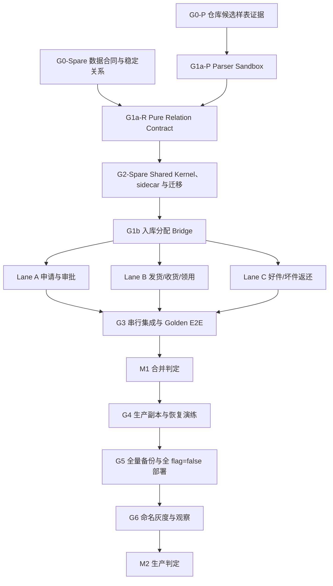

# 维保备件双闭环 Parallel Implementation Plan V2

> 本文件是当前唯一可执行计划。旧版 `MAINTENANCE_SPAREPARTS_PARALLEL_IMPLEMENTATION_PLAN.md` 已因业务架构 P0 审查不通过而停止执行。
>
> Agent 必读技能：`writing-plans`、`dispatching-parallel-agents`、`test-driven-development`、`database-migrations`、`verification-loop`。共享契约与迁移串行，冻结后才允许多 Agent 并行；所有 Agent 使用独立 worktree、独立分支和严格文件所有权。
>
> 五份真实 Excel 的数据库蓝图与提取边界以 `contracts/maintenance-spares/five-excel-source-database-design.md` 为准；本计划只编排依赖和执行顺序，不在此重复 DDL 细节。

## 0. 结论先行

目标不是再造一张“消耗表”，而是让同一件备件从申请到返还始终能回答五个问题：

1. 事实来自哪张真实单据或哪个实名表单；
2. 当前实物处于主库、地区库、在途、项目前置库、已领用还是返还中；
3. 哪个稳定 ID 把项目、仓库、PN、SN 和单据行串起来；
4. 哪个动作改变库存、哪个动作只改变审批或责任状态；
5. 数量、暂估成本、返还义务和正式入库证据是否各自守恒。

本轮分两个里程碑：

- **M1 代码闭环**：真实数据合同、稳定关系、双闭环代码、测试、独立审查与 CI 完成。M1 最多得出“可合并但不可生产”。
- **M2 生产闭环**：生产副本迁移、全量备份、隔离恢复、命名灰度、观察和次日业务对账完成，才可得出“可灰度/可生产”。

当前状态：**G0 Business/Data Contract Gate 仍为 `failed_closed`；五份用户附件已成为真实的 `observed/candidate` 证据，但均未成为 authoritative source。仅 `G1a-PARSER-SANDBOX` 可在零 apply、零 bridge、零 schema 前提下开发；S06 只可另做 pure preview。Schema/Kernel 和业务闭环开发均暂停。**

## 1. 依赖主干



每层三问：

| 层 | 解决什么问题 | 依赖谁 | 被谁调用 |
|---|---|---|---|
| G0 数据合同 | 防止研发猜表头、状态、稳定键和业务顺序 | 真实生产只读样例、最新业务更正 | G1 的适配与关系 |
| G1a-P Parser Sandbox | 安全读取真实结构，只输出候选 preview 事实 | G0-P 候选样表 | G1a-R；生产 apply 永远关闭 |
| G1a-R Pure Relation Contract | 证明 warehouse/project/part/WBDD 稳定关系并冻结 resolver/ports；不写 ready source | G0-Spare + G1a-P | G2 |
| G2-Spare Shared Kernel | 统一库存 delta、spare sidecar version、幂等、并发、权限和 DTO | G1a-R | G1b |
| G1b 入库桥 | 把 S09 版本化事实稳定分配到好件 return line | G2 | 三条并行 Lane |
| Lane A–C | 分别交付三段用户任务 | G2 frozen SHA | G3 集成 |
| G3 集成 | 证明跨 Lane 守恒而非单页可用 | A–C commits | M1 |
| G4–G6 发布 | 证明生产可恢复、可灰度、可对账 | merged exact SHA | M2 |

## 2. 全局不可违反约束

- 权威顺序：用户最新更正 > `.ai/BUSINESS_PROCESS_MODEL.md` > 已登记真实样例 > 当前代码。
- 开发基线：`origin/codex/maint-workbench-refactor@c431656bd2615102f053199801554191b2d88791`。不得在本地落后 4 个提交的 `d7168ce3` 上实现。
- 当前 Alembic head 是 `d9f1a3c7e5b2`；新 revision 只能在 G0/G1/G2 审查后从 d9 新起。失效的 `f9b2d4e7c1a6` 不得使用。
- `申请通过 != 出库`、`出库 != 现场收货`、`现场收货 != 领用`、`返还提交 != 公司库存恢复`。
- 项目名、仓库名、日期、模糊文本和 AI 推断不得成为正式关联键。
- 不直接更新或删除 append-only 事件；纠错只追加受控 reversal。
- 不直接修改 legacy `Inventory.source_qty/manual_qty`；V1 以标准事实、事件账和正式外部入库证据闭环。
- 不从生产执行 UPDATE、DELETE、TRUNCATE、DDL、导入、迁移或测试写入。
- 原始生产样例只读；如复制本地，放在 repo 外的 0700 隔离目录，不进入 Git、不打印业务行、不输出密钥。
- 所有新增 feature flag 默认 false；关闭时旧 API、旧页面和旧读口径不变。
- “candidate signature 可识别”与“production apply 获准”是两道独立门。真实 S07/S09 candidate 不得写入生产 `MAINTENANCE_WAREHOUSE_APPROVED_*` 配置；G0-Spare/source-owner/release gate 通过前，`can_apply=false`、apply 零写入。
- `read flag` 只控制新目录、普通查询响应和 UI 暴露；`ledger_validation_enabled = (write_enabled OR read_enabled)`。任何 mutation 的 candidate/preflight/preview/confirm 在 ledger validation 开启时都使用同一 projector、锁、现场收货上限和余额校验，仅双 flag=false 才走旧算法。`write=true/read=false` 也不得回退旧确认算法。
- Lane Agent 不得 push、merge、cherry-pick 或部署；Integration Owner 只能在本地 integration worktree 串行 cherry-pick；Root Release Owner 是唯一可 push、合并远端 PR 或部署的角色，且仅在所有门禁通过后执行。
- 永不删除生产业务数据；上线前先完成全量备份、checksum 和隔离恢复。

## 3. 产品裁决 V1（已由 Root Product/Release Owner 冻结）

用户已明确授权 Root Product/Release Owner 代行产品裁决，以下决定已登记在 `product-decisions.md`。产品裁决不能替代真实来源合同：凡依赖 Required S02、S03、S04、S05、S07、S09（及未来 optional S08）的字段、状态、稳定键和修正语义，仍必须有只读真实样例和 source owner 证据；若真实证据冲突，失败关闭并版本化更新决定，不得让研发猜测。

### 3.1 试点边界

- 现场收货采用 IT_data 原生实名网页表单 S10；发货 `confirmed` 不等于现场签收。
- 命名试点项目每个项目只配置一个 active 项目前置库；不得按项目名自动生成。
- 试点只开放给命名项目与命名账号；项目销售关系来源未锁定前，不宣称“销售本人全部项目闭环”。
- V1 试点项目前置库必须在部署前由实名盘点证明余额为 0；非零项目不得进入首批试点。opening-balance 导入后置，避免在无盘点来源合同下伪造 receipt/delivery。
- V1 支持同 PN 的 `replacement` 和 `new_install`；跨 PN 更换失败关闭，并明确提示当前试点不支持。
- 收货不足只展示 `remaining_receivable_quantity`，不冒充已登记的“收货差异”；差异原因/责任/解决流程后置。
- 哪些品类必须逐件管理 SN 必须来自 G0 锁定的主数据/仓库合同；来源未锁定时，对携带单个 SN 且 quantity>1 的行失败关闭，不按品类名称猜测。
- 非 SN 物料的领用批次按 `receipt event occurred_at, event_id` 稳定 FIFO；SN 物料必须精确选择 SN，不做模糊批次分配。
- 前置库和项目硬盘政策必须由 Admin 受控 provisioning 命令创建/归档：版本化、幂等、实名、原因和 append-only audit；迁移不按项目名 seed。

### 3.2 申请与审批

- 申请资格由稳定关系产生：`ProjectSalesAssignment`、`ProjectResponsibility` 或受控 `ApplicantGrant`；昵称/角色字符串不算关系。
- 先查公司主库与项目所属地区库的可用库存及保留量：
  - 可满足时进入 `InternalAllocationIntent`；
  - 不足时才进入补库采购审核。
- 其他项目前置库余量只作为管理证据，原则上不可日常调拨。
- 窗口是申请业务时间前 **90 个完整自然日**、区间 `[D-90, D)`；业务日期字段、Asia/Shanghai 边界日和有效原始状态集合按 `product-decisions.md` 锁定，任何来源字段变化必须重新进入 G0。
- 采购事实只接受 G0 冻结的采购类型 inclusion allowlist，未知/新增类型失败关闭。只有 S02/S03 对完整 `[D-90,D)` 均为 `coverage_state=complete` 时，若该 PN 在有效采购和有效销售中都无记录，才硬拦截 `NO_VALID_PURCHASE_AND_SALES_IN_90D`；任一来源 partial/stale/unavailable/missing batch 时返回证据不可用，不能把数据缺口冒充业务无记录。V1 不开放“新品例外”暗门。
- 现场领用频次可展示 180 日/累计证据，但只用于解释，不替代采购/销售硬规则，也不自动批准或驳回。
- 池价格阈值与替代等价条件未完成业务签字前，只展示候选价格、样本数和差额，不产生 `CEILING_EXCEEDED` 结论。
- 所有非硬拦截申请都要由不同于提交人的实名审核人逐行审核；硬拦截不可人工覆盖；任何 warning 决策必须实名并逐行填写理由。V1 不使用 LLM 自动批准/驳回。
- 审批输出只允许：
  - `InternalAllocationIntent`，或
  - `ApprovedPurchaseIntent(status=waiting_procurement_execution)`。
- 两者都满足 `inventory_effect=none`、`external_legal_effect=none`。WBDD/采购顺序裁决前禁止自动导出 WBDD，禁止称“已供货”。

### 3.3 前置库存与 reversal

统一 delta 规则：

```text
delta(receipt_confirmed)       = +quantity
delta(consumption_confirmed)   = -quantity
delta(good_return_dispatched)  = -quantity
delta(reversal)                = -delta(original_event)
available                      = Σ delta(event)
```

- `reversal` 必须复制原事件 aggregate key、项目、前置库、delivery line、part、SN、数量和成本证据，只能冲销一次。
- 调用方不能传 reversal 方向、任意数量或任意成本。
- serial-tracked 行要求 quantity=1；同一 SN 可以按生命周期出现在多个事件，禁止的是同时存在于两个有效位置，不能给 event 表做 SN 全局唯一。
- 写操作使用 PostgreSQL advisory/row lock 串行化同一 aggregate，先计算余额再追加事件；余额不能为负。
- `idempotency_key + request_fingerprint` 相同重放返回原响应，不同 payload 返回 409。
- 所有入口遵守同一锁顺序：`现有业务命令幂等锁 → bridge/refresh 锁 → delivery/source rows 按 stable ID 排序加锁 → stock idempotency advisory lock → aggregate lock → append command/event`。禁止调用方与 ledger 以相反顺序重复加锁。
- lock timeout、可重试冲突和 HTTP 409/503 映射由 Shared Kernel 统一；数据库 unique violation 不能裸露为 500。

### 3.4 领用、返还义务与成本

- 客户端不得提交 `return_expected=false` 作为业务结论。
- 领用请求只描述事实：`operation_type`、new part/SN、removed part/SN、quantity、设备/位置证据。
- `replacement` 由服务端根据标准品类和有效项目政策生成 `required | exempt | pending_category`；默认 required。
- 项目硬盘免返政策只对“拆下的坏硬盘”生效，必须冻结 `policy_id + version + evidence_reference`。
- 同项目政策 V1 只允许标准硬盘品类；生效区间不得重叠，多重命中失败关闭。
- 未使用的新硬盘始终走好件退回，不受坏件免返政策影响。
- 坏件到仓后只表示“返还义务已履行、仓库已实收”，`inventory_effect=none`、`disposition=pending_inspection`；不得称正式库存闭环。
- 好件正式回库使用 S09 入库**行级分配**，支持部分入库：return line 的累计 allocation 满足数量后才 `warehouse_confirmed`。
- 历史坏件义务 `rule_version=v1` 保持原值与原有解释；V2 只对开启项目 write flag 的新领用生成。V1 outbox/event 不改写，消费者显式兼容 v1/v2 payload。
- 领用时只冻结暂估成本证据：

```text
consumed_quantity
provisional_unit_cost_evidence
provisional_consumed_amount
cost_basis_state = pending_finance_confirmation | confirmed | unavailable
cost_visibility = visible | masked
```

- 申请、发货、收货和现场占用不重复进入消耗；未获 `data_purchase_cost` 权限的账号只得到 masked，不把 masked 冒充 unavailable。
- event 上的成本仅是不可变 `provisional snapshot`；财务/项目成本权威仍由现有受审计 issue-cost/read model 在口径确认后产生，避免 event 与工单形成两个财务真相。

### 3.5 逆拓扑纠错的三账原子性

- `site-issue reverse/correct` 必须在同一事务写入：consumption reversal、return obligation void/correction event、provisional issue-cost correction/version 和 command receipt；任一失败全部回滚。
- receipt event 已被下游 consumption/good-return 使用时，禁止直接 reversal；必须先按逆拓扑冲销下游。
- good-return dispatch 只有在 `allocated_quantity=0` 时可 reversal；已有部分/全部 S09 allocation 时只能走 allocation correction/replacement，不能恢复前置库余额。
- Golden E2E 必须同时断言库存、返还义务和暂估成本三账恢复，不能只看库存 delta。

## 4. G0：Business/Data Contract Gate（禁止并行写业务代码）

### 4.1 目标

在任何 ORM、迁移、状态机实现前，用生产只读样例和业务裁决锁定来源合同。`G0-Spare` 任一 Required 项缺失时，禁止建备件生产表、关系 bridge、ready delivery 或启用 apply。当前唯一仓储代码例外是 `G1a-PARSER-SANDBOX`；S06 只有在下方明确授权 `G1a-E-PREVIEW-SANDBOX` 后才可写纯 preview。两者生产 approved 配置都必须保持为空。

### 4.2 必查来源

| 来源 | 必查证据 | Gate 输出 |
|---|---|---|
| S02 采购 | 表头/明细 ID、业务日期、有效/作废状态、采购类型原始/标准字段与 allowlist、PN、数量、价格、全量/增量、覆盖区间/as-of/freshness | 90 日采购有效事实合同 |
| S03 销售 | 表头/明细 ID、业务日期、有效/作废状态、PN、销售/项目候选关系、全量/增量、覆盖区间/as-of/freshness | 90 日销售有效事实合同 |
| S04 库存快照 | 产品库存 ID、仓库稳定 ID/类型、PN、可用量、快照时间 | 主库/地区库 availability 合同 |
| S05 WBDD | 表头/明细 ID、项目稳定键、出库仓库、PN/SN、状态 | WBDD 只作何种上游证据 |
| S06 费用报销支付（post-M1） | 表头/明细稳定 ID、财务状态、金额/税/币种、费用发生与支付日期、项目/合同稳定关系 | 项目费用 allocation 合同；不阻塞备件 M1 |
| S07 发货/出库 | 双表头、表头/明细 ID、原始状态、WBDD、PN/SN、数量 | confirmed shipment 合同 |
| S08 退货返库（V1 optional） | 宽/窄双表头、表头/明细 ID、原始状态、通知引用、PN/SN、数量 | 外部 return shipment 对账合同；缺失不阻塞 native return M1 |
| S09 入库 | 双表头、表头/明细 ID、原始状态、仓库/库位、检测、PN/SN、数量 | formal receipt/allocation 合同 |
| S10 原生收货 | delivery line、实收数量/SN、实名人、时间、证据 | 在途→前置库合同 |
| S11 原生领用 | 前置库、delivery line、operation type、new/removed PN/SN | 前置库→消耗合同 |

### 4.3 必须回写的无敏感信息产物

- Create: `.ai/contracts/maintenance-spares/source-registry.yaml`
- Create: `.ai/contracts/maintenance-spares/state-mapping.yaml`
- Create: `.ai/contracts/maintenance-spares/stable-relationship-matrix.md`
- Create: `.ai/contracts/maintenance-spares/product-decisions.md`
- Create: `.ai/contracts/maintenance-spares/sample-manifest.yaml`（机器可读；旧 `.sha256` 注释文件只作迁移说明）
- Create: `.ai/contracts/maintenance-spares/five-excel-source-database-design.md`（三层数据库、版本/修订/冲正和五来源业务边界）
- Create: `.ai/contracts/maintenance-spares/five-excel-typed-field-map.md`（真实双表头 internal code 到 typed source fact 的候选映射）
- Create: `.ai/contracts/maintenance-spares/five-excel-sample-audit-2026-08-14.md`（无敏感值结构、键质量、merge 和跨源覆盖证据）

每个来源必须记录：source owner、export view、文件/Sheet 数、表头行数、header/line stable ID、业务日期、原始状态到 normalized status 的映射、required/optional columns、mapping version、样例 SHA-256、生效日期。S02/S03 还必须记录 `load_mode`、`coverage_from/coverage_to`、`source_as_of`、`latest_complete_business_date`、`export_frequency`、`freshness_sla`、`missing_batch_state` 和 `coverage_state=complete|partial|stale|unavailable`；S02 另记录采购类型原始/标准字段、观测枚举、批准 inclusion/exclusion allowlist 与 unknown fail-closed。仓库和项目关系必须记录 stable ID，不记录名称猜测。

生产上传卷里“物理文件存在”不等于“权威样例已确认”。必须先以 `sys_raw_file`/成功 import batch 的稳定 ID 和来源类型定位候选，再由 source registry/业务用途确认；禁止拿文件系统最新 Excel 或文件名相似度直接定版。

### 4.4 G0 验收

- [ ] S02、S03、S04、S05、S07、S09 每个 Required 来源至少一份真实只读样例及 SHA；找不到要明确 `missing`，不能用测试 fixture 冒充。S08 是 V1 optional 外部对账来源，不阻塞 native return M1。
- [ ] S02/S03 的覆盖模式、完整业务日期、as-of/freshness、断批状态已证明；90 日窗口任一来源非 complete 时只报证据不可用，不报“无记录”。
- [ ] S02 采购类型字段、观测枚举与批准 inclusion/exclusion allowlist 已证明；未知类型失败关闭。
- [ ] S07/S09 实际观察到的原始状态值、业务含义与正式批准的 raw→normalized `pending/confirmed/void` 映射已锁定；`corrected` 只有在源系统修正语义被证明后才可作为 IT_data 纠错事件，不冒充源状态。S08 接入时执行同一 Gate。
- [ ] S07/S09 已证明源系统修正是否复用原 header/line stable ID；若复用，必须登记 source revision/correction sequence、supersedes 证据和同一修正版的识别规则，禁止覆盖旧版本。S08 接入时执行同一 Gate。
- [ ] shipment → project/WBDD/part/SN 和 receipt → return line 的稳定链路已证明。
- [ ] 公司主库、地区库、项目所属地区关系的稳定来源已证明。
- [ ] 申请人稳定关系来源已证明；否则仅允许命名账号试点。
- [ ] 序列化品类/SN 必填来源已证明；未证明的行按 quantity/SN 一致性失败关闭。
- [ ] S10 原生表单裁决、字段和实名审计合同已记录。
- [ ] S06 source owner、正式 export view、财务有效状态、金额/税/币种、业务日期和项目/合同稳定关系已锁定；未锁定时只允许 pure preview，禁止调用通用 upload、禁止写 `f_project_expense`。
- [x] 正常申请全量实名逐行审核、warning 路径、禁止自审和硬拦截不可覆盖已由 Root Product/Release Owner 冻结。
- [x] “三个月”采用 `[D-90,D)`，业务日期字段、Asia/Shanghai 时区/边界日和有效状态集合已在 `product-decisions.md` 冻结。
- [ ] 原始样例未进入 Git，命令输出未泄漏业务行或密钥。

### 4.5 2026-08-13 真实仓库样表增量裁决

用户已提供真实 S07/S08/S09 导出，精确 SHA、header signature 和安全聚合见 `warehouse-sample-audit-2026-08-13.md`。由 Root Product/Release Owner 裁决：

- S07 `shipment_v1` 166 列和 S09 `receipt_v1` 155 列 candidate 双表头 signature 可用于 G1a-P 本地 contract TDD；这是候选识别证据，不是 production-approved contract。原始附件不得进入 Git。
- 状态候选统一为 `已生效→confirmed`、`草稿→pending`、`已取消→void`，未知值 blocked；生产 apply 仍须 G1a review 和正式 source owner 确认。
- S08 `return_v2` 120 列只作为 optional 外部对账 TDD；`return_v1` 因无稳定 header/line ID 永不成为权威正式来源。
- 当前整体 `gate_state` 仍是 failed-closed，但允许 **G1a-PARSER-SANDBOX** 只修改 `config + adapter + parser tests`；不得修改 import service/API/bridge 来放行真实合同，不得建生产业务表、不得 apply 样例、不得启动 G1a-R、G2 或 Lane。
- G1a 必须解决真实文件揭示的三个代码事实：宽表超过通用 500 万 cell 限制、header facts 采用纵向 merge、公式只出现在受控附件/报告字段。不能要求业务人员手工复制填满 5–8 万行。

### 4.6 2026-08-14 五份 Excel 数据源裁决

完整只读画像与数据库字段见 `five-excel-source-database-design.md`。Root Product/Release Owner 冻结以下框架：

- 数据统一采用 `原始 artifact/ingest evidence → immutable document/line versions → reviewed activation → domain event/read model` 三层；不把 155/166 列整行复制进 JSONB 万能表。
- S07 只投影在途 delivery source；S08v2 只做 optional 外部返还对账；S08v1 永久 non-authoritative；S09 只通过 current confirmed eligible line 做 good-return 部分 allocation；S06 只通过 append-only expense allocation 进入成本。
- 同一字节和 mapping 重传只增加 observation；内容变化产生新 version。stable ID 相同的修正版不得覆盖旧行，current 由 append-only activation 决定。
- candidate signature、contract approval 和 production apply 是三道独立门，DTO 必须拆为 `contract_approved / apply_gate_state / can_apply`。
- 现有通用费用 loader 的“按项目删除旧费用再重插”语义不适用于 S06。S06 preview 必须是无 Session、无 archive、无 batch、无 audit 的纯服务；正式 apply 后置到独立 G0-E/G2-E。
- 备件 source sidecar 与库存事件 migration 只能在 `G0-Spare` 通过后从 `d9f1a3c7e5b2` 以 additive expand 方式开始；费用 allocation 是 post-M1 的独立 `G2-E`，只有 `G0-E` 通过后才建。两条链都禁止延续失效的 f9 head。
- 正式数据链固定为 `candidate_preview → apply_source_ingest → activate_source_version → project_activation`。ingest 只写来源层；review 只写 activation command；只有最后一步按稳定顺序锁来源与下游，并在同一事务写领域新增/冲正事件、最终 activation 与 projection receipt。
- S07/S08v2/S09 的 `ParentIndex` 是候选 1-based line number；缺失/非法只进 ambiguity，绝不回退物理 Excel 行号。S09 三个上游 ref 独立保存，`receipt_origin_raw` 候选来自 `F0000032`，normalized origin 必须等待 owner 批准映射。

五来源专项并行边界：

| Lane | 可并行时点 | 文件所有权 | 输出 | 禁止事项 |
|---|---|---|---|---|
| P Warehouse Parser | 当前 | G1a-P 四文件 | S07/S09 candidate typed preview；未来 S08v2 optional preview | DB/API/bridge 写入 |
| E Expense Preview | 当前显式授权 `G1a-E-PREVIEW-SANDBOX`；与 Warehouse Parser 独立 worktree | `backend/app/services/maintenance_expense_preview.py` + `backend/tests/test_maintenance_expense_preview.py` | S06 zero-write counts/digest/ambiguity | API、Session、archive、batch、audit、通用 upload、legacy loader、任何费用写入 |
| Q Data Quality | 当前只读 | `.ai/contracts` 证据文件 | SHA、header、键、状态、merge、exact-match 覆盖 | 输出业务行或敏感原值 |
| R Relation | G0-Spare 后 | pure resolver/ports/tests | exact project/WBDD/part/warehouse/upstream relation contract；不 materialize ready source | 名称/日期/PN 模糊匹配、写 legacy bridge |
| Schema Owner | G0-Spare + R interface frozen 后串行 | models/migration/contracts | spare version sidecar 与领域 kernel | 多 Agent 同时写 migration、混入 expense schema |
| E Apply | post-M1；G0-E + G2-E 后 | expense import/bridge/API/tests | expense version + allocation event | 覆盖或删除 legacy 费用 |

### 4.7 G1a-E-PREVIEW-SANDBOX 当前授权范围

这是与 G1a-P 并列的第二个、也是唯一费用代码例外。只允许创建：

- `backend/app/services/maintenance_expense_preview.py`
- `backend/tests/test_maintenance_expense_preview.py`

输出只能包含脱敏 counts、digest、typed candidate fields 和 ambiguity；不得增加 API，不得创建或使用 DB `Session`，不得 archive 文件、创建 batch/audit、调用 loader 或产生任何业务写入。S06 的 source owner、金额/税/币种、费用发生/支付日期与项目稳定关系仍属于 `G0-E`，preview 通过不等于 apply 获批。

## 5. G1：Parser Sandbox 与稳定关系（两段串行 Gate）

### 5.0 G1a-PARSER-SANDBOX 当前授权范围

只允许修改：

- `backend/app/config.py`：新增 warehouse-only 安全预算，以及与 `approved` 完全分离的 candidate signature parser policy；通用 500 万上限不改；
- `backend/app/services/maintenance_warehouse_adapters.py`：流式 parser、受控公式、显式 merge、typed projection/digest；
- `backend/tests/test_maintenance_warehouse_adapters.py`；
- `backend/tests/test_maintenance_warehouse_spares_contract.py`（只含 synthetic/header-only fixture）；
- 当严格合同新增 required internal code 时，只允许同步更新 `backend/tests/test_maintenance_warehouse_imports.py` 与 `backend/tests/test_maintenance_warehouse_api.py` 的 synthetic approved-contract/header fixture；不得改断言语义、service/API 实现或借 fixture 绕过新门禁。

明确禁止：

- 不把真实 candidate 填入 `MAINTENANCE_WAREHOUSE_APPROVED_*`，不改变 `can_apply` 或 apply 逻辑；允许独立 candidate signature parser policy 仅提供受控 formula/merge 安全规则，但其 outward `version_state` 必须仍为 `unknown_version`，因此 `can_apply=false`；
- 不修改 `maintenance_warehouse.py`、warehouse API、site-issue bridge 或 good-return bridge；
- 不生成 ready delivery、库存事件、ORM、migration、前端或生产数据；
- `return_v1` 即使被误配置，也必须保持非权威、不可 apply。

G1a-P 通过只说明 parser sandbox 可审查；不能得出完整 G1a、G0、M1 或生产结论。

### 5.1 先测试

G1a-P 新增 parser contract tests，证明：

- 未批准表头、未知状态、缺 document header identity、header ID↔document number 非双射、全 workbook 重复 line ID 失败关闭；
- 缺 line ID/PN/quantity 在 candidate preview 中生成 line-scoped ambiguity，同一工作簿中的有效行仍保留；但 S07/S09 authoritative ingest/activation 默认把任一 required line 缺失升级为 document/workbook blocking，不允许不完整快照部分生效；
- canonical evidence digest 对同一内容确定，任一非受控内容变化会改变 digest；它只提供候选 revision identity，不在本阶段命中数据库版本或生成 supersession。
- exact S07/S09 header signature 能进入本地 contract preview；未批准 signature 继续 zero-write。
- 只有批准 metadata 标为 controlled attachment/evidence 的列可出现公式：不求值、不读缓存、不保存内容，只记录 controlled marker/digest；任何 typed fact 列公式仍整本失败关闭。
- header `ObjectId/SeqNo/status/date/stable refs` 只在 Excel 显式 merge range 内继承；普通物理空白不 fill-forward。多明细续行全部保留，跨 merge range 不串单。
- 仓库 parser 使用全 workbook 累计受控预算：物理 cell nodes `20,000,000`、merge ranges `2,000,000`、继承跨度 `8,000,000`；通用 Excel importer 的 500 万上限不改。继续保留 100 MB 上传、512 MB 解压、压缩比、行/列、XML、外链和单解析 semaphore 防护。真实 S07/S09 benchmark 还必须满足单文件 wall time ≤180 秒、peak RSS delta ≤768 MiB；240 秒硬超时或任一预算超限失败关闭。
- parser 只常驻 typed projection；未使用/敏感/附件列只进入 canonical digest 或 controlled marker，不构建上千万 cell 的 `raw_fields`。
- 少量缺 line ID/PN/quantity 的真实形态进入 ambiguity queue，不静默丢弃，也不让单个坏行污染有效行。

G1a-R 才测试项目/仓库/part/WBDD 稳定关系的 pure resolver/ports，以及同内容跨 import batch 的版本幂等与修正 supersession；它不生成 ready delivery。G1b 才测试 activation-backed S07 delivery materialization、shipment 不生成 receipt event，以及 S09 receipt line 到 good-return line 的逐行/部分 allocation，禁止 PN+日期模糊匹配。

### 5.2 G1a-R 实现输出（当前未授权，G0-Spare 后启动）

```text
WarehouseDeliveryAdapter
  confirmed shipment line
  + stable project link
  + stable warehouse link
  + stable part link
  + WBDD/source identity
  -> ResolvedWarehouseDeliveryCandidate（pure DTO；不写 MaintenanceSiteIssueDeliverySource）

WarehouseReceiptAllocationPort
  confirmed receipt line
  + stable return line
  -> auditable partial allocation

WarehouseAvailabilityPort
  company_available
  assigned_region_available
  reservation/safety_stock_basis
  snapshot_id + snapshot_at

ApplicantAuthorizationPort
  ProjectSalesAssignment | ProjectResponsibility | ApplicantGrant
  + effective interval + grantor
```

所有不确定关系只进入治理队列，不生成 ready source。

G1a-R Adapter Owner 在 G0-Spare 后独占 pure resolver/port 文件；后续 G1b 才负责 activation-backed bridge：

- Modify: `backend/app/services/maintenance_warehouse.py`
- Modify: `backend/app/api/maintenance_warehouse.py`（只在需要保持单解析/错误映射时）
- Create: `backend/app/services/maintenance_warehouse_relations.py`
- Create/Modify: `backend/tests/test_maintenance_warehouse_spares_contract.py`
- Create/Modify: `backend/tests/test_maintenance_warehouse_spares_bridge.py`
- Modify: `backend/tests/test_maintenance_warehouse_imports.py`

G1a-P 只写 parser/contract sandbox；G1a-R 在 G0-Spare 后只写 pure relation resolver/ports/ambiguity contract；G1b 在 G2 sidecar 与 allocation schema 后写 activation-backed S07 delivery 与 S09 allocation bridge。S08 仅为 optional 外部 return 对账 adapter，缺失不阻塞 M1，也不得成为 native return 状态机的隐式依赖。

G1 分为两个无循环阶段：

- **G1a-P（当前）**：candidate 合同的 parser sandbox；生产配置、apply 和 bridge 全关闭。
- **G1a-R（G0-Spare 后）**：正式合同、pure relation resolver/ports 和 fail-closed ambiguity contract；不持久化 ready delivery 或 good-return allocation。
- **G1b（G2 schema 后、并行 Lane 前）**：基于来源 activation/projection receipt 与 G2 schema，实现 S07 delivery、S09 receipt allocation bridge 及 corrected/void 处理并复审；S08 仅在其合同未来通过时接入外部对账。G1b 通过后才记录最终 `KERNEL_SHA` 并创建 Lane worktree。

### 5.3 G1a-P / G1a-R 双 Review Gate

G1a-P 和未来 G1a-R 各自由两个独立只读 Reviewer 检查：

1. 数据合同/业务语义；
2. 稳定键、幂等和纠错。

G1a-P Critical/Important=0 只允许等待 G0-Spare。G0-Spare 与 G1a-R Critical/Important=0 后才可进入 G2-Spare。G2-Spare 完成后执行 G1b；G1b 使用同样两类 Reviewer 形成独立 **G1b Review Gate**。只有 G1a-P、G0-Spare、G1a-R、G2-Spare、G1b 都通过才冻结 `KERNEL_SHA`。费用独立走 `E-preview → G0-E → G2-E → E Apply`，不阻塞备件 M1。

## 6. G2-Spare：Shared Kernel 与迁移（唯一 Owner，串行）

### 6.1 Kernel 文件所有权

唯一 Kernel Owner 可修改：

- `backend/app/models/maintenance_site_stock.py`
- `backend/app/models/maintenance_warehouse_versions.py`（新建 sidecar；不改 legacy warehouse 表唯一约束）
- `backend/app/models/maintenance_return_policy.py`
- `backend/app/models/replenishment.py`
- `backend/app/models/maintenance_project_operations.py`
- `backend/app/models/maintenance_bad_return.py`
- `backend/app/models/__init__.py`
- `backend/app/services/maintenance_site_stock_ledger.py`
- `backend/app/services/maintenance_spares_admin.py`
- `backend/app/api/maintenance_spares_admin.py`
- `backend/app/contracts/maintenance_spares.py`
- `backend/app/config.py`
- `backend/app/permissions.py`
- `backend/tests/conftest.py`
- 新 Alembic revision（从 d9 单 head 新起）
- `backend/tests/test_maintenance_site_stock_logic.py`
- `backend/tests/test_maintenance_site_stock_migration.py`
- `backend/tests/test_maintenance_spares_admin.py`
- `frontend/src/types/maintenanceSpareParts.ts`

### 6.2 Kernel 冻结内容

- `MaintenanceFrontWarehouse`：stable ID、project FK、active/archived、version、审计字段；不按名称 seed。
- `MaintenanceSiteStockCommand`：idempotency、fingerprint、action、response、actor、created_at。
- `MaintenanceSiteStockEvent`：event/source stable IDs、signed delta 语义、source_version(int)、mapping_version(str)、evidence_digest、cost evidence、aggregate_version、reversal link。
- 外部仓库单据采用新 sidecar 不可变版本表：`source_document_stable_id + source_revision`、`source_line_stable_id + source_revision`、`supersedes_document_version_id/supersedes_line_version_id`、correction evidence digest。保留 legacy `maintenance_warehouse_document/line` 的现有唯一约束和 flag-off 读写行为；V2 adapter 把批准 payload 写入 sidecar。若源系统修正复用 stable ID，也能同时保存旧版和现行版，禁止在 legacy 表上直接解除约束或覆盖历史。
- `MaintenanceGoodReturn`、line、command、line-level inbound allocation、状态时间和 replacement/correction 关系；单据头 ID 不能代替逐行/部分数量分配。
- `MaintenanceProjectReturnPolicyEvent`：append-only `activate | revoke` event、policy/version/supersedes ID、effective_from、recorded_at、evidence、approver；匹配时读取 `consumption_confirmed_at` 时点的最新未撤销版本，不更新旧行 status/effective_to，不按查询当前时点套用后来政策。
- `MaintenanceReturnObligation` 扩展：removed SN、server decision、policy snapshot；不增加客户端可控 `return_expected`。
- `MaintenanceSiteIssueLine` V2 扩展：`workflow_version/contract_version`、`operation_type`、new part/SN、removed part/SN、device/location evidence、same-PN replacement constraint 和 legacy nullable 兼容；旧行不被重新判定。
- replenishment submission/version/line 的不可变 evidence：usage、front stock、main/region availability、purchase/sales facts、risk/warning codes、policy version/as-of、digest；新增 identity 字段必须进入既有保护 trigger 与 submission digest。
- 申请关系/输出：复用 `MaintenanceProjectUserAssignment` 作为 `ProjectResponsibility`；V1 明确新增 `ApplicantGrant`。审批输出使用单表 `MaintenanceFulfilmentIntent(intent_kind=internal_allocation | approved_purchase)`，API 仍以 `InternalAllocationIntent | ApprovedPurchaseIntent` discriminated union 返回；同一 immutable application/version/line/content digest 由数据库唯一约束保证最多一个 intent，从结构上禁止两个输出同时存在。包含幂等命令、状态和 audit；Lane A 不创建迁移。
- replenishment 新行增加 `workflow_version/contract_version`；旧 draft/submitted/approved 保持 V1，只有新创建的 V2 application 进入新证据和 intent 输出。
- 权限/响应契约：project scope、named identity、action permission、cost mask；新增 action 同时进入 Python registry、DB role/user permission migration 和 flag-off tests。
- flags：shadow/write/read 独立、默认 false；shadow 不写正式 event 表。
- API DTO v2：receipt、issue、return obligation、good return allocation；三条 Lane 不得私自改共享 DTO。
- permission contract 与 v1/v2 return-event parser 在 Kernel 就绪。Lane focused API tests 显式挂载本 Lane router；正式 `app.main` 注册只由 Integration Owner 串行完成并另测，避免并行修改共享入口。
- `ApplicantGrant`：project、user、actions、effective interval、grantor、reason、version；Admin create/revoke 事件全审计。已有 `ProjectResponsibility` 与有效 ApplicantGrant 均可授权，其他关系失败关闭。
- Admin provisioning contract：前置库 create/archive、项目唯一 active；政策使用 append-only activate/revoke version event；禁止原地改政策和无审计 seed。
- Admin provisioning 由 G2 串行 Task 实现 service/API/tests：front warehouse create/archive、policy activate/revoke version、ApplicantGrant create/revoke；所有命令实名、幂等、reason、action permission、project scope 和 append-only audit。
- Kernel 只提供不公开路由的底层 `append_reversal_from_domain(...)`，并按 source domain/type 失败关闭；它不能成为绕过领域账的万能 API。公开命令必须由领域编排器拥有：receipt reversal 检查全部下游，site-issue reverse/correct 在同一事务修正库存/义务/暂估成本/site-issue 状态，good-return reversal 检查 allocation=0。`consumption_confirmed`、`good_return_dispatched` 不允许直接调用底层 reversal。
- allocation correction 使用不可变 `supersedes_allocation_id/reverses_allocation_id` 事件；S09 void/corrected 使旧 allocation 失效并按证据重开 GoodReturn，不原地 UPDATE 历史 allocation。
- G1b 的 S07/S09 corrected/void 处理必须引用同一份外部 document/line version；任何 correction event、allocation 与 stock event 的 `(source_document_version_id, source_line_version_id, mapping_version)` 组合由 FK/trigger 校验一致。S08 接入时遵守同一规则。
- S07 新 revision 的 delivered quantity 若低于其旧 revision 已累计实收/领用/返还使用量，不能自动成为 current；进入 ambiguity，只有先按逆拓扑纠正下游或业务驳回该 revision 后才能切换。
- GoodReturn allocation 除双边数量容量外，必须由组合 FK/trigger 校验 return line 与 S09 current confirmed inbound line 的 part、SN（若有）、正式仓库/project scope 和 document/line revision 一致；不允许靠两个独立 FK 拼接。
- serial-tracked mutation 在普通 aggregate lock 前先获取全局 SN advisory lock，或使用唯一有效位置 projector；阻止同一 SN 并发进入两个前置库/位置，同时保留历史事件重复出现。
- V1 不实现 opening-balance event；命名试点必须有实名零余额盘点证明。非零余额项目失败关闭并后置到 S12 盘点合同版本。
- mutation 的 candidate/preflight/preview/confirm 在 `(write=true OR read=true)` 时强制读取同一 ledger projector 并使用同一锁，只有双 flag=false 才保持旧计算。read flag 单独控制新读页面/目录是否对普通用户可见，不能只切写入不切 mutation 校验。

### 6.3 迁移硬门禁

- additive only；历史行不回填猜测项目、仓库、SN、政策或 receipt link。
- 历史返还判断保持 nullable/legacy rule version；不得用 `default true` 把未知历史行伪装成已判定 required。
- 现有“硬盘 + required_qty=0”历史 CHECK 必须重建为 v1/v2 兼容矩阵：legacy v1 无 policy 继续合法；新 exempt 必须带 policy/version/evidence；V2 仅在项目 write flag 开启时产生。
- 数量 positive；delta 由 event type 和 original event 派生。
- reversal 唯一且不能 reversal-of-reversal。
- serial-tracked quantity=1，但 SN 不做 event 全局唯一。
- policy event 在同一 scope/target 的有效时点只允许一个未撤销版本；part/category 多义失败关闭。
- source/command 幂等唯一键、常用 aggregate/query index、FK 和 check constraint 完整，包括 project/front warehouse 组合一致性、delivery/source FK、aggregate version、source identity、reversal partial unique、return allocation capacity、event/source type 组合、成本字段成对为空。
- sidecar warehouse document/line 以 `(source_system, document_type, stable_id, source_revision_or_canonical_digest, mapping_version)` 版本唯一；现行版本由 partial unique/index 或可审计 supersession 链保证唯一，不能删除或覆盖被取代版本。源系统没有 revision 字段时，G0 锁定的 canonical evidence digest 作为修正版身份；import batch 仅为证据，相同 digest 重传不得产生新版本。未知修正失败关闭。
- stock event 必须引用 exact `delivery_source_version_id`，并以组合 FK/insert trigger 同时证明 source document/line version、activation、mapping、project 与 part 都来自该不可变 delivery version；legacy `delivery_line_id` 仅作兼容 identity，不得成为 V2 数量真相。
- 跨行容量不能假装由 CHECK 完成：收货事务锁 delivery source + stock aggregate，保证 net confirmed receipt ≤ delivered quantity；allocation 事务按 stable ID 排序同时锁 good-return line 与 S09 inbound line，保证 active allocations 不超过两边 quantity；容量检查、插入和状态转换同一事务，冲突映射 409/503。
- command、event、policy version 与 allocation 均有 append-only/immutable DB trigger；不能只靠 Python 约定。
- 在线表采用 nullable expand、`lock_timeout`、必要时 `NOT VALID FK → validate`；trigger/function 创建删除顺序可重放。
- migration upgrade、downgrade on empty DB、upgrade from d9 production-shaped copy、single head、`alembic check` 均通过。存在新事实时 downgrade 必须失败关闭；生产只 forward-fix，不执行 downgrade。

### 6.4 Kernel Review Gate

三个独立 Reviewer：业务守恒、PostgreSQL 并发/迁移、安全权限。G2 review 后先执行并复审 G1b；全部通过后记录 exact `KERNEL_SHA`，先合入 integration branch，再从该 SHA 创建三条 Lane worktree。禁止从 c431 原始基线直接开 Lane。

## 7. Parallel Wave：三个 Agent 同时开发

启动条件：G0、G1、G2 全部通过，`KERNEL_SHA` 已写入执行台账。协调器必须一次性启动三个 Agent；加上 Root 正好使用四个并发槽。每个 Agent 只读共享契约，只写自己的文件。跨契约变更一律回到 Integration Owner 串行处理。

### Lane A：申请、库存分流与实名审批

拥有：

- `backend/app/services/replenishment.py`
- `backend/app/api/replenishment.py`
- replenishment focused tests
- `frontend/src/api/maintenanceApproval.ts`
- `frontend/src/pages/ReplenishmentBetaPage.tsx` 及 focused tests/styles

交付：稳定 project/front warehouse、申请资格、主库/地区库分流、90 日采购销售硬规则、不可变 evidence snapshot、逐行实名决定、warning reason、`InternalAllocationIntent | ApprovedPurchaseIntent`，零库存/零对外法律影响。所有新增快照参与 submission digest，提交后不得修改。

不得交付：WBDD 自动导出、自动采购单、LLM 自动批准、其他前置库调拨。

### Lane B：现场收货、前置库查询、领用与暂估消耗

拥有：

- 新 site-receipt service/API/focused tests
- site-issue service/API 的 V2 扩展及 focused tests
- `frontend/src/api/maintenanceSiteReceipts.ts`
- `frontend/src/api/maintenanceSiteIssues.ts`
- 新 `SiteReceiptPanel`、`FrontStockPanel`、`SiteIssueWorkflowPanel.tsx` 及 focused tests

交付：只消费 G1b activation-backed ready delivery source；原生实名收货；部分实收；`remaining_receivable_quantity`；receipt event；按 project/front/part/SN 查询当前前置库存；余额锁与扣减、`replacement | new_install`、new/removed PN/SN、server-derived obligation、消费 event、暂估成本证据与权限遮罩；同一事务内写消费事件和 obligation。

不得交付：把 shipment confirmed 当收货、修改 G1 bridge、未建差异模型却显示“差异已登记”、客户端 `return_expected`、跨 PN 猜测、财务已确认成本口径。

### Lane C：好件退回、坏件返还与正式入库证据

拥有：

- good-return service/API/focused tests
- bad-return service/API 的 SN/policy/status 扩展及 focused tests
- `frontend/src/api/maintenanceReturns.ts`
- `GoodReturnPanel`、`BadReturnPanel` 及 focused tests

交付：好件 dispatch event、部分 S09 inbound allocation、全量满足后 warehouse_confirmed；项目硬盘免返政策；坏件 required/exempt/pending_category；仓库实收后 obligation fulfilled + pending_inspection；状态时间、替代/纠错证据。

不得交付：返还提交即恢复公司库存、坏件维修/报废/变卖、虚拟采购销售单。

### 每条 Lane 的 TDD/提交规则

1. 先写具名失败测试并保存失败原因；
2. 只实现本 Lane 最小代码；
3. 跑 focused backend + frontend tests；
4. 跑 shared contract tests，防止契约漂移；
5. 提交单一可审查 commit；
6. 回报 branch、SHA、files、tests、known risks；
7. 不自行 cherry-pick 到 integration。

## 8. G3：串行集成、Golden E2E 与独立审查

### 8.1 合并顺序

Integration Owner 在独立 worktree 按 `A → B → C` cherry-pick；每次合并后跑该 Lane focused tests + shared contract tests。冲突由 Integration Owner 修，不能让多个 Lane 同时改共享文件。

Integration Owner 独占：

- `backend/app/main.py`
- `frontend/src/App.tsx`
- `frontend/src/nav.tsx`
- `frontend/src/pages/maintenance/MaintenanceProjectWorkspacePage.tsx`
- shared permission/config wiring
- release docs/scripts

### 8.2 Golden E2E

必须覆盖：

```text
company/region inventory enough
→ InternalAllocationIntent
→ stock event count unchanged

company/region inventory insufficient
→ application submit + immutable evidence digest
→ approved purchase intent
→ stock event count unchanged
→ external_legal_effect = none
```

同时覆盖硬拦截、warning/人工路径、禁止自审、版本不可变和幂等重复提交。

实物流覆盖：

```text
shipment quantity               10
site receipt confirmed           9
remaining receivable             1
site issue consumed              3
good return dispatched           2
front available = 9 - 3 - 2      4
```

另测：

- receipt reversal 后余额减少，issue/good-return reversal 后余额恢复；只允许一次；
- issue reverse/correct 后库存、obligation 与 provisional cost 三账同事务恢复；有下游事件时直接 reversal 失败关闭；
- good return 已有 S09 partial allocation 后不能 reversal dispatch，只能 allocation correction/replacement；
- 两个并发 receipt 不能超出 delivery quantity；两个并发 allocation 不能超出 return line 或 S09 inbound line 容量；
- 同一 SN 并发进入不同前置库时只能一个成功；
- 并发双领用只有一个成功，余额永不为负；
- 幂等重放同响应，异 payload 409；
- replacement 自动产生 required/exempt/pending obligation；客户端不能绕过；
- 普通硬盘 required；有效项目政策 exempt；未用新硬盘走 good return；
- good return 部分入库不提前完成；坏件仓库实收不增加公司库存；
- 暂估成本只出现一次，无权限用户 masked；
- 跨项目、无实名、无 action permission、非 allowlist 全部失败关闭；
- flags 全 false 时旧行为、旧路由和旧页面不变；
- `write=true/read=false` 时 mutation candidate/preflight/preview/confirm 全部走 ledger validation，普通新读页面仍隐藏；mutation response 如实返回 ledger 影响；
- event IDs 只在“查看数据依据”中展示，普通业务页展示状态、责任人、下一步。

### 8.3 独立多 Agent Review

并行启动至少三个只读 Reviewer：

1. 业务状态机与真实需求；
2. DB migration、锁、幂等、守恒和性能；
3. RBAC、IDOR、成本遮罩、前端可访问性和 feature flags。

Reviewer 必须提供 severity、精确文件/行、复现方式。Critical/Important 由单一 Fix Agent 串行修复，再由原 Reviewer 复审；P0/P1 不为 0 禁止进入 M1。

## 9. M1：可合并判定

必须全部满足：

- G0 来源合同与样例 SHA 完整；
- G1 真实 adapter 与 ambiguity queue 测试通过；
- G2 单 Alembic head、迁移/并发/安全审查通过；
- 三条 Lane focused tests 与 Golden E2E 通过；
- 后端全量 pytest、前端 test/build/audit 通过；
- exact candidate SHA 上 GitHub 后端/前端 CI 全绿；
- 至少两名独立代码 Reviewer 和三域 Reviewer 的 P0/P1=0；
- PR title/scope 与 diff 一致；如果基线 PR 未合并，本 PR 保持 stacked，不越基线进生产。

M1 通过后的结论只能是：**可合并但不可生产**。

## 10. G4：生产副本、恢复与发布演练

- 锁定 merged main exact SHA、image digest、DB from/to head 和 signed release manifest。
- 在隔离网络恢复最新生产备份副本，不在生产 DB 上演练。
- 验证 d9→新 head、约束/index、row counts、old app read smoke、新 app smoke、并发锁与权限。
- 验证旧镜像在 additive schema 上的安全回切路径；数据库不 downgrade。
- 演练 contain：关闭 read/write/shadow flags、应用回切、保留新事实、forward-fix。
- 恢复/演练任一失败则停在“可合并但不可生产”。

## 11. G5：上线前全量备份与全 flag=false 部署

上线前先备份并校验：

1. PostgreSQL custom-format 全量 dump；
2. globals/roles 清单；
3. 上传文件/业务附件卷；
4. compose、受控 env/config 副本（不得在日志打印 secret values）；
5. 当前 image digest、deployed SHA、DB head；
6. 每个制品的 size、SHA-256、创建时间和保留位置。

必须把备份恢复到全新隔离实例，核对 `pg_restore --list`、关键表行数、FK/constraint、附件抽样和真实账号只读 smoke。恢复失败禁止部署，备份在观察期结束前不得删除。

部署 exact merged artifact 时 flags 全 false；先验证 health、deployed SHA、image digest、DB head 和旧功能真实账号 smoke。HTTP 200 只算健康证据，不算业务验收。

## 12. G6：Shadow、命名灰度与观察

### Shadow

- shadow 只运行纯计算 projector，不写正式 event 表；
- 输入是真实 shipment + 独立的人工/表单收货样本；
- shipment confirmed 不当收货；
- 输出进入独立 shadow report；数量、稳定关系或状态不清一律失败关闭。

### Write canary

- 仅命名项目、实名现场/维保/仓库/审核账号；
- 走完申请、审批、收货、领用、好件退回、坏件返还的试点路径；
- 旧系统继续作为对照读口径，逐事件双录核对。

### Read canary

- 事件级对账为 0 差异后，只对同一命名项目开放新读口径；
- 验证前置可用、已消耗、好件在途、坏件义务和暂估成本遮罩。

### 观察

- 0/5/15/30 分钟检查 5xx、container restart、DB locks/long transaction、negative balance、duplicate event/cost、scope violation；
- 下一工作日由业务负责人核对 shipment、receipt、issue、return、allocation 和库存守恒；
- 任一停止条件触发，立即关 read/write/shadow、保存证据、应用回切、数据库不 downgrade。

全部通过后才可判定：**可灰度/可生产**。

## 13. 多 Agent 运行框架

### 13.1 角色

| 角色 | 并行性 | 权限 |
|---|---|---|
| Root Product/Release Owner | 常驻 | 裁决、门禁、最终验收、发布 |
| Data Contract Agent | G0 串行/只读生产 | 只读样例与合同，不写生产 |
| Adapter Agent | G1 串行 | 稳定关系和 adapter |
| Kernel Agent | G2 串行 | models/contracts/migration/ledger |
| Kernel Reviewers ×3 | 并行只读 | 业务、DB、安全 |
| Lane Agents A/B/C | **同时并行** | 各自独占文件/worktree |
| Integration Owner | G3 串行 | cherry-pick、共享 wiring、修冲突 |
| Final Reviewers ×3 | 并行只读 | 业务、DB、安全/UX |
| Release Owner | G4–G6 串行 | 备份、恢复、部署、灰度、观察 |

### 13.2 Worktree 规则

```text
base c431...
  -> contract/adapter branch
  -> reviewed KERNEL_SHA
       -> lane-a-approval
       -> lane-b-physical-flow
       -> lane-c-returns
       -> integration
```

- 原始脏工作树只保留用户文件和计划，不开发。
- Lane worktree 从 reviewed `KERNEL_SHA` 创建，不能从 c431 创建。
- 三条 Lane 同时启动；任何 Agent 不修改其他 Lane 文件。
- 共享 DTO/API 变更必须暂停相关 Lane，由 Integration Owner 更新 Kernel 契约、重跑 review 后恢复。

### 13.3 每次回报模板

```text
Agent / Lane:
Base SHA:
Branch / Worktree:
Owned files changed:
Failing tests observed first:
Passing tests:
Commit SHA:
Contract deviations:
Known risks / blockers:
Production touched: no
```

## 14. Definition of Done

- [ ] 真实 Required 来源 S02、S03、S04、S05、S07、S09 的合同、稳定键、状态枚举和样例 SHA 已登记；S08 optional 外部对账缺失不冒充完成，也不阻塞 native return M1。
- [ ] 申请以稳定项目/仓库/申请人关系进入；主库/地区库与采购路线正确分流。
- [ ] 审批输出零库存/零对外法律影响，无 WBDD/采购假闭环。
- [ ] 真实发货、现场收货、领用和返还使用不同事实与状态。
- [ ] 前置库存 signed delta、幂等、并发和 reversal 守恒。
- [ ] 真实消耗只来自已确认领用；成本明确是暂估且只冻结一次。
- [ ] 客户端不能绕过返还义务；项目硬盘政策有稳定证据，未用硬盘可好件退回。
- [ ] 好件按正式入库行部分分配；坏件仓库实收不恢复库存并进入待检测。
- [ ] 普通业务页可操作，内部 ID/技术证据只在“查看数据依据”。
- [ ] 全量测试、build、audit、migration、E2E、CI 与独立 review 通过。
- [ ] 生产副本迁移和隔离恢复通过。
- [ ] 上线前全量备份、checksum 和恢复验证通过。
- [ ] 命名 canary、0/5/15/30 观察和次日对账通过。

## 15. 明确后置

- LangGraph/LLM 自动审核或自动驳回；
- 自动生成对外生效采购订单及 WBDD/采购顺序自动桥；
- 跨 PN replacement、新品例外、池价阈值自动决策；
- 多前置库与其他项目前置库日常调拨；
- 坏件检测、维修、报废、变卖、虚拟采购/销售和贡献毛利；
- 报销/差旅/外包正式金额导入；
- 销售本人项目大屏、老板五模块驾驶舱；
- 测试工位、拆改配、源头 case、发票/退货/退款；
- 全量氚云同步和 legacy Inventory 事务切换。

这些事项不得塞入首版 PR，也不得用演示数据伪装完成。
