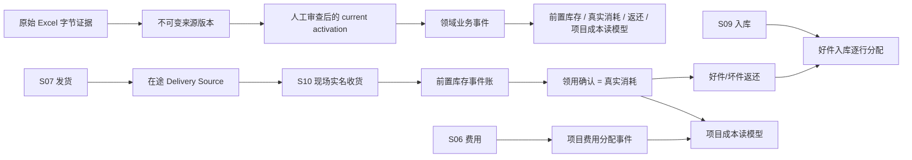
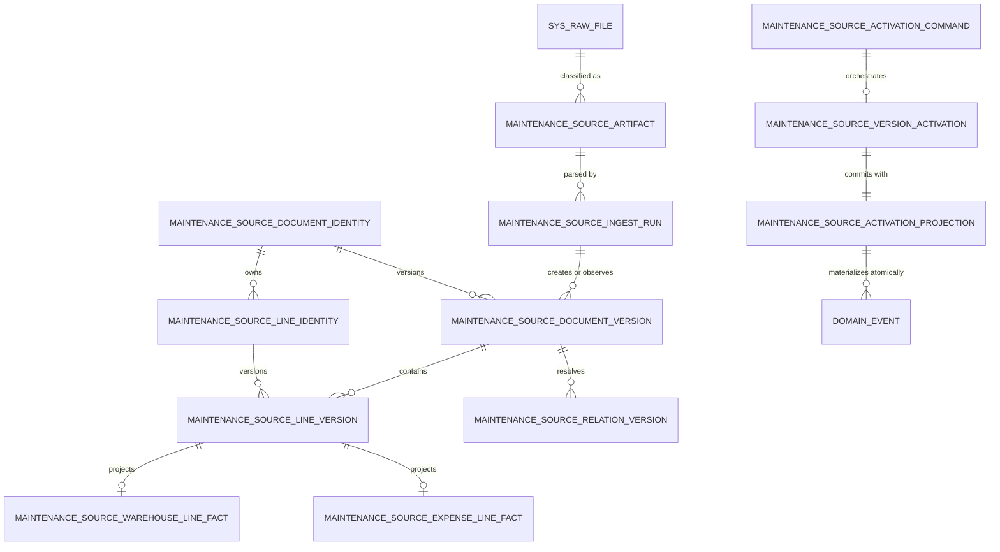

# 五份 Excel 真实数据源数据库设计

> 日期：2026-08-14
> 状态：`design-candidate-reviewed / source-contract-failed-closed / zero-production-write`
> 适用来源：S06 费用报销支付、S07 发货、S08 退货返库（宽/窄）、S09 入库
> 目标：把用户提供的真实 Excel 从“附件”升级为可追溯的候选数据源，并在来源合同批准后安全投影到维保业务闭环。
>
> 精确 `internal code → typed DB field` 映射见 `five-excel-typed-field-map.md`；样本结构与质量证据见 `five-excel-sample-audit-2026-08-14.md`。

## 1. 产品结论

这五份 Excel 不能直接当成五张业务表导入。正确模型分三层：

核心口径：

- S07 发货只证明“从来源库发出/进入在途”，不等于现场收货，更不等于消耗。
- S08 退货返库只证明“发生返运动作或外部对账”，不自动恢复任何库存。
- S09 入库只提供正式入库候选证据；只有 current、confirmed、检测及仓库口径均获批的行，才能逐行分配给好件返还。
- S06 费用只有在财务状态、金额口径、费用日期和项目稳定关系获批后，才能进入项目成本。
- 真实消耗只由实名的现场领用确认产生；前置库存只由正式现场收货增加。

## 2. 当前真实样本结论

“真实样本”不等于“权威数据源”。当前分为四级：

1. `observed`：附件 SHA、结构和聚合质量已验证。
2. `candidate`：parser 可按精确表头读取，但只能 preview。
3. `approved`：source owner、export view、字段和状态合同已审批。
4. `authoritative`：approved 版本经稳定关系、activation 与领域 bridge 写入业务事件。

| 来源 | 实际规模 | 稳定身份质量 | 当前等级 | 允许动作 |
|---|---:|---|---|---|
| S06 费用 | 43 列；15 个头、97 条明细 | 观察到头/单号/行 ID 零空缺零重复 | `observed / missing-contract` | 只做独立 pure preview；禁止调用现有通用费用 apply |
| S07 发货 | 166 列；19,572 个头、69,298 条明细 | 头 ID、单号、行 ID 零空缺零重复 | `candidate-only` | typed preview；合同批准后形成在途 delivery source |
| S08 窄表 | 49 列；27 条明细 | 没有稳定头/行 ID | `non-authoritative` | 仅结构参考和 ambiguity；永久禁止正式 apply |
| S08 宽表 | 120 列；3,019 个头、7,104 条明细 | 2 条明细缺 line ID | `candidate-only / optional` | 外部返还对账；不驱动 native return 状态机 |
| S09 入库 | 155 列；10,177 个头、82,911 条明细 | 1 条明细缺 line ID | `candidate-only` | typed preview；合同批准后作为好件入库 allocation 证据 |

五份附件 SHA 已登记在 `sample-manifest.yaml`。原始附件不得提交 Git；报告只保留结构、计数、哈希和字段合同，不保存业务行、附件内容或人员/客户/金额原值。

## 3. 为什么不直接复用旧导入表

### 3.1 旧 warehouse 表不是修订安全的事实库

现有 `maintenance_warehouse_document` 以 `(document_type, document_no)` 唯一，line 以 `(document_id, source_line_id)` 唯一。它适合旧版“当前快照”，但无法同时保留同一 stable ID 的旧版、修正版和冲正证据。

因此：

- 保留 legacy 表和现有 flag-off 行为；
- 新真实来源写入不可变 version sidecar；
- 不解除旧唯一约束，不在旧行上覆盖历史；
- legacy 表最多作为兼容读模型，不再充当权威来源事实。

### 3.2 旧通用费用导入存在破坏性语义

现有费用 loader 会按关联销售单/项目删除旧费用后重插；transform 还包含“空状态视为已结束”、固定 13% 税率、派生幂等键等未经本样本证明的假设。它违反本项目的两条底线：

- 不删除或替换生产历史数据；
- 不从样本之外猜状态、税率、日期和项目关系。

所以 S06 禁止走现有 `/api/import/upload`，禁止直接写 `f_project_expense`，preview 也不得创建 DB batch、archive 或 audit。

## 4. 三层数据库模型

图中的 source identity 是“锁和唯一性地基”，source version 是“不可变证据投影”，activation 是“经审查且已完成领域纠错的 current 决策”。下游库存和成本只消费带 projection receipt 的 activation，不直接消费 Excel 行。

### 4.1 第一层：原始证据（Evidence）

#### `maintenance_source_artifact`

粒度：一份“原始文件 × 来源分类”的不可变 registration；同一字节若被不同 `source_system/source_code` 明确分类，可分别登记，但所有 registration 仍引用现有 `sys_raw_file`，不复制文件字节、不另造原文件真相。

| 字段 | 类型 | 规则 |
|---|---|---|
| `source_artifact_id` | varchar(36) PK | 来源 registration 身份，不是第二个文件身份 |
| `sys_raw_file_id` | integer FK | 与现有 `sys_raw_file.id` 类型严格一致；正式 archive 的原文件身份 |
| `source_system` | varchar(32) | 初始为 `huyun_excel`；需 owner 批准 |
| `source_code` | varchar(8) | `S06/S07/S08/S09` |
| `content_sha256` | char(64) | 原始字节 SHA-256 |
| `size_bytes` | bigint | `>=0` |
| `media_type` | varchar(64) | 仅允许批准的 XLSX MIME |
| `header_signature` | char(64) nullable | 有双表头合同才填写 |
| `structure_digest` | char(64) | sheet/visibility/dimension/relationship 的脱敏摘要 |
| `registration_state` | varchar(24) | 登记时固定为 `retained/rejected`；candidate preview 不持久化 |
| `recorded_by` | varchar(64) | 具名身份 |
| `recorded_at` | timestamptz | server time |

约束与索引：

- `UNIQUE(sys_raw_file_id, source_system, source_code)`；同一归档在同一来源分类下只登记一次。
- `UNIQUE(source_system, source_code, content_sha256)`；同一来源分类内同一字节只有一份 artifact registration；跨来源分类可引用同一个 `sys_raw_file_id`。
- SHA 字段必须匹配小写 64 位十六进制。
- 正式持久化时 `sys_raw_file_id` 必须非空；trigger 强制被引用 `sys_raw_file.file_hash IS NOT NULL` 且与 `content_sha256` 相等，并禁止删除/改写被引用归档。candidate preview 完全零写，不创建 nullable artifact 占位。
- 整表 append-only；manifest 禁止 UPDATE/DELETE。合同审批属于 ingest/contract 版本，不通过修改 artifact 状态表达。
- artifact registration 的内容身份由原始字节决定、来源域由 `source_system/source_code` 决定；不保存 `contract_bundle_sha`。同一文件可被多个合同版本重复观察，合同包身份只属于 ingest run、document/line version。
- 原文件保存在上传卷的内容寻址归档；本表不保存文件路径、业务行或附件值。
- 不直接扩展通用 `sys_import_batch` 的成功哈希唯一语义，避免影响采购/销售等旧导入。

#### `maintenance_source_ingest_run`

粒度：某 artifact 在一组 parser/contract/mapping 下的一次解析尝试。

| 字段 | 类型 | 规则 |
|---|---|---|
| `ingest_run_id` | varchar(36) PK | 解析尝试 ID |
| `source_artifact_id` | FK | 指向来源 registration；原始归档经其 `sys_raw_file_id` 派生 |
| `attempt_no` | integer | 同一 plan 从 1 递增 |
| `adapter_key/version` | varchar | 如 `shipment/shipment_v1` |
| `mapping_version` | varchar(64) | typed mapping 版本 |
| `status_mapping_version` | varchar(64) nullable | 状态合同版本 |
| `contract_bundle_sha` | char(64) | 完整合同包 SHA |
| `contract_state` | varchar(16) | `candidate/approved` |
| `parse_state` | varchar(24) | `recognized/partial_ambiguity/rejected` |
| `apply_state` | varchar(24) | `not_requested/blocked/applied` |
| `plan_digest` | char(64) | artifact + parser + mapping + contract + schema 的签名计划 |
| `source_as_of` | timestamptz nullable | 必须来自正式导出语义，不用文件 mtime 猜 |
| `document_count/line_count/ambiguity_count` | integer | 仅计数 |
| `result_digest` | char(64) | 脱敏结果摘要 |
| `started_at/finalized_at` | timestamptz | terminal 后不可改 |
| `requested_by` | varchar(64) | 具名身份 |
| `command_namespace` | varchar(64) | 固定命令族，例如 `maintenance-source-ingest-v1` |
| `idempotency_key` | varchar(128) | 正式命令幂等键 |
| `request_fingerprint` | char(64) | 请求载荷与作用域摘要 |

硬门：

- `apply_state='applied'` 仅当 `contract_state='approved' AND parse_state='recognized'`，且不存在 blocking ambiguity。
- `partial_ambiguity` 保留有效行只属于 candidate preview 体验，不代表允许构造不完整的 authoritative 快照。S07/S09 正式 ingest 或 activation 中，任一 required line stable ID、PN、quantity 缺失都升级为 document/workbook blocking；只有 source owner 明确批准“增量/不完整导出”语义、覆盖区间与缺行处理后，才能另建版本化例外，默认绝不部分生效。
- candidate preview 不插入本表；它是纯函数，返回内存中的 summary。
- 正式 apply 必须重新读取并哈希同一原始字节，不能信任旧 preview DTO。
- 同一个 `plan_digest` 成功重放返回相同结果；同一 namespace/reviewer 下，同 key + 同 fingerprint 返回原 ingest/activation/projection receipt，不得重跑领域写入；同 key 不同 fingerprint 必须 409。
- `UNIQUE(command_namespace, requested_by, idempotency_key)`；同 key 必须复用同一 `request_fingerprint`。
- `UNIQUE(source_artifact_id, plan_digest, attempt_no)`，并以 registration/command 行加锁生成连续 attempt number。

正式链只允许四个独立命令，禁止在 ingest 内隐式调用领域 bridge：

1. `candidate_preview`：纯函数、零数据库写入；
2. `apply_source_ingest`：只写 artifact/run/identity/version/relation/ambiguity，不改变 source-current，不写领域事件；
3. `activate_source_version`：具名审查后只追加 activation command/intent，不写 activation event，不改变 current；
4. `project_activation`：消费 reviewed command，按稳定顺序锁来源 identity 与全部下游 aggregate，并在一个数据库事务内完成领域新增/冲正事件、最终 activation event 与 projection receipt。任一步失败全部回滚，旧 current 与旧业务投影保持有效。

这四个命令分别使用 `idempotency_key + request_fingerprint`。第三、四步可以由同一 API 编排，但数据库语义仍分离；不得把“解析成功”偷换成“业务已生效”。

### 4.2 第二层：不可变来源版本（Source Versions）

#### `maintenance_source_document_identity`

粒度：一个来源 document 的稳定身份；它提供跨 artifact/version 的唯一锁目标，而不是把某个版本当身份。

- `document_identity_id` varchar(36) PK
- `source_system/source_code/document_type`
- `source_document_stable_id`、`document_no`
- `recorded_by/recorded_at`

约束：

- `UNIQUE(source_system, source_code, source_document_stable_id)`；
- `UNIQUE(source_system, source_code, document_no)`；
- `UNIQUE(document_identity_id, source_system, source_code)`，供 line identity 使用 composite FK 证明来源域一致；
- 在 identity 层固定来源矩阵：S06=expense、S07=shipment、S08=return、S09=receipt。version 只继承该事实，不能用另一 source code 复用同一 identity；
- stable ID 与 document number 的双射冲突必须在 ingest 前失败关闭，不能新建第二个 identity；
- append-only，不按名称、日期或标题合并。

#### `maintenance_source_document_version`

粒度：一个来源 document stable ID 的一个不可变版本。

主要字段：

- `document_version_id` varchar(36) PK
- `document_identity_id` FK
- `revision_identity_kind`：`explicit_revision/canonical_digest`
- `source_revision` nullable、`revision_key`、`canonical_digest`
- `mapping_version/status_mapping_version/header_signature/contract_bundle_sha`
- `ingest_run_id` FK
- `document_date`、`raw_status`、`normalized_status`
- `source_warehouse_stable_id/source_location_stable_id` nullable
- `quality_state`：`ready/partial_ambiguity/blocked`
- `version_no`
- `supersedes_document_version_id` nullable self-FK
- `correction_evidence_digest` nullable
- `recorded_by/recorded_at`

约束：

- `UNIQUE(document_identity_id, revision_key, mapping_version, contract_bundle_sha)`；完整合同包变化必然产生新的 immutable projection，不能只靠 typed mapping 版本判断相同。
- `UNIQUE(document_identity_id, version_no)`；每个 identity 只允许一个 `version_no=1` 根节点（partial unique）。
- `UNIQUE(supersedes_document_version_id)`，修订链只能线性前进。
- 首版 `version_no=1 AND supersedes IS NULL`；trigger 在 identity 行锁内校验后续版 predecessor 属于同一 identity、是当前尾节点且 `version_no=旧版+1`。
- 不使用 `is_current`；current 来自下面的 activation event。
- 全表 append-only。未知 revision/correction 语义时，整份 apply 失败关闭。

#### `maintenance_source_line_identity`

粒度：一个来源 line 的稳定身份，跨 document version 保持唯一。

- `line_identity_id` varchar(36) PK
- `document_identity_id` FK
- `source_system/source_code/source_line_stable_id`
- `recorded_by/recorded_at`

约束：

- `UNIQUE(source_system, source_code, source_line_stable_id)`；
- `(document_identity_id,source_system,source_code)` composite FK 指向 document identity 的同名唯一键；普通单列 FK 不足以证明 line 与 document 属于同一来源域；
- 同一 stable line ID 不能换绑 document identity；
- S08 窄表没有 stable line ID，永远不得创建 identity。

#### `maintenance_source_line_version`

粒度：某 document version 下一个 line stable ID 的一个不可变版本。

共同字段：

- `line_version_id` varchar(36) PK
- `line_identity_id` FK
- `document_version_id` FK
- `line_no`
- `canonical_digest/evidence_digest`
- `mapping_version/contract_bundle_sha/version_no`
- `supersedes_line_version_id` nullable self-FK
- `projection_state`：`ready/partial_ambiguity/blocked`
- `recorded_by/recorded_at`

约束：

- `UNIQUE(document_version_id, line_identity_id, mapping_version, contract_bundle_sha)`。
- `UNIQUE(line_identity_id, version_no)`；每个 line identity 只允许一个根版本，后继版本号连续。
- `UNIQUE(supersedes_line_version_id)`。
- `line_identity.document_identity_id` 必须等于 `document_version.document_identity_id`；trigger 校验 predecessor 使用同一 line identity，父 document 仍属于同一 document identity，并且 `version_no=旧版+1`。
- line 不冗余保存 `source_code/document_type`；这两个属性经 `document_version_id` 派生。若实现需要校验 mapping，则父表提供 `UNIQUE(document_version_id,mapping_version,contract_bundle_sha)`，line 使用同列 composite FK。
- S08 窄表没有稳定 line ID，永远不得插入本表。
- 不保存 `raw_fields_json`；原值审计依赖不可变 artifact，数据库只保存获批 typed facts 和摘要。

#### `maintenance_source_warehouse_line_fact`

粒度：S07/S08v2/S09 line version 的一对一 typed projection。

- `line_version_id` PK/FK
- `source_part_stable_id` nullable
- `pn_raw`、`serial_number`、`self_code`
- `quantity numeric(20,6)`
- `source_warehouse_stable_id/source_location_stable_id`
- `maintenance_order_stable_ref`、`upstream_document_stable_ref`、`upstream_line_stable_ref`
- S09 专用来源字段：`return_notice_ref`、`related_notice_ref`、`purchase_order_ref`、`receipt_origin_raw`、`receipt_origin_kind`
- `inspection_raw_state/inspection_normalized_state`
- `fact_quality_state`

约束：

- ready 的 shipment/return/receipt 行必须 `quantity>0`。
- typed fact 不冗余保存 canonical `part_id`；`source_part_stable_id/PN` 只是来源证据，canonical part 只能通过 exact `part_relation_version_id` 供下游 bridge 消费，避免 fact 与 relation 形成两套真相。
- SN 强制品类及 `quantity=1` 规则须等 G0 锁定后启用。
- S09 缺 line ID 的 1 行、S08v2 缺 line ID 的 2 行只进 ambiguity，不进 ready fact。
- S07 的 inspection 字段只作为出库证据，永不赋予 receipt/return eligibility。
- S09 三个上游引用分别保存，禁止在 authoritative fact 中 fallback 压成一个值。`receipt_origin_raw` 候选来自 `F0000032 / 入库类别(必填)`；`receipt_origin_kind` 只能由 G0-Spare 批准的 raw→normalized 映射产生，不能从三个引用的 presence/优先级猜测。只有 maintenance/good-return inbound 且存在 exact return relation 的行可进入 GoodReturn eligible projection，采购入库不能关闭返还单。

#### `maintenance_source_expense_line_fact`

粒度：S06 line version 的一对一 typed projection。

- `line_version_id` PK/FK
- `expense_occurrence_date`
- `reimbursement_date/payment_date`
- `category/subcategory`
- `amount_original/amount_ex_tax/amount_inc_tax`
- `amount_basis/tax_rate/currency_code`
- `sales_order_stable_ref/project_stable_ref/project_contract_stable_ref`
- `financial_raw_status/financial_normalized_status`
- `fact_quality_state`

约束：

- 不默认 `approved`、不默认正负号、不默认 13% 税率、不默认人民币。
- 金额三口径只保存来源已明确给出的值；计算值必须带 `amount_basis/tax_rate/mapping_version`。
- 项目关系只能走稳定 ID；名称或自由文本只能进入 ambiguity。
- S06 正式字段合同未批准前，不创建任何该表事实。

#### `maintenance_source_version_observation`

粒度：一次 ingest run 对一个已存在或新建 version 的观察。

- PK：`(ingest_run_id, document_version_id)`
- `outcome`：`created/matched_existing/blocked`
- `observed_line_count/observation_digest/observed_at`

作用：同一内容跨 batch 重传不制造新版本，但每次导入都有审计证据。

#### `maintenance_source_activation_command`

粒度：具名审查者请求激活/撤销某个来源版本的不可变 intent；它本身永远不是 current。

- `activation_command_id` PK
- `document_identity_id/document_version_id`
- `action`：`activate/revoke`
- `revoke_activation_id` nullable
- `command_namespace/idempotency_key/request_fingerprint`
- `reviewed_by/reviewed_at/reason`

约束：以 `(document_version_id,document_identity_id)` composite FK 证明目标归属；目标 version 必须来自 approved contract，candidate 永远不能创建 reviewed command。`revoke` 必须唯一引用该 identity 当前生效的 activate event，不能用空泛的 source identity 猜目标。`UNIQUE(command_namespace,reviewed_by,idempotency_key)`；同 fingerprint 重放必须返回既有 command/activation/projection receipt，同 key 不同 fingerprint 返回 409。

#### `maintenance_source_version_activation`

粒度：领域 orchestrator 已成功完成全部纠错后，在同一事务最后追加的 source-current 事件。

- `activation_id` PK
- `activation_command_id` UNIQUE/FK
- `document_identity_id`、`document_version_id`
- `activation_no`
- `supersedes_activation_id` nullable
- `action`：`activate/revoke`
- `revoke_activation_id` nullable
- `activated_by/activated_at`

约束：

- `document_version` 提供 `UNIQUE(document_version_id,document_identity_id)`；command 与 activation 均以 `(document_version_id,document_identity_id)` composite FK 证明目标版本属于该 identity，来源 system/code/stable ID 从 identity 派生，不在 event 中复制。
- `UNIQUE(document_identity_id, activation_no)`、`UNIQUE(supersedes_activation_id)`；identity 级行锁下强制首个 event、连续 `activation_no`、且恰好 supersede 当前尾节点。
- 最后 event 为 `activate` 才存在 current；最后 event 为 `revoke` 则无 current。revoke 必须指向被撤的 activate event。
- 新 S07 revision 数量低于旧版已累计实收/领用/返还，S09 破坏既有 allocation，或 S06 破坏已分配费用时，command 保持 pending reconciliation，禁止写 activation。

#### `maintenance_source_activation_projection`

粒度：一次 activation event 与领域投影已原子成功的 append-only receipt。

- `projection_receipt_id` PK
- `activation_id` UNIQUE/FK
- `projection_kind/version`
- `domain_event_count/domain_event_digest`
- `projected_by/projected_at`

规则：

- activation、receipt 与其产生的全部领域新增/冲正事件在同一事务提交；任一校验或写入失败则三者全部不落库，只有 command intent 保留。
- source-current view 只选择有 receipt 的最新有效 activation；pending command 不替换旧 current。
- `activate/revoke/correct` 必须沿逆拓扑验证下游数量与状态，再追加领域事件，禁止仅切 current 指针。
- 应用角色禁止直接 INSERT activation/receipt；只可调用统一领域 orchestrator。

#### `maintenance_external_warehouse_identity` / `maintenance_external_warehouse_binding_version`

Excel 中的仓库/库位属于外部来源身份，不能直接 FK 到项目现场的 `maintenance_front_warehouse`：

- identity 保存 `external_warehouse_identity_id`、`source_system`、`warehouse_stable_id`、nullable `location_stable_id`、`warehouse_role`、display evidence digest、`recorded_by/recorded_at`；名称只展示、不参与 identity。PostgreSQL 15 使用 `UNIQUE NULLS NOT DISTINCT (source_system,warehouse_stable_id,location_stable_id,warehouse_role)`；若迁移兼容性要求不用该语法，则以 location-null/location-present 两个 partial unique index 实现同等语义。
- `warehouse_role` 由批准合同限定为 `source_dispatch/return_destination/site_front/other`，S07 出库源仓和 S09 返库目的仓默认不是项目前置库。
- binding version 保存 `external_warehouse_identity_id`、`binding_kind`、kind-specific nullable target（初始仅 `front_warehouse_id`）、`match_state`、`mapping_version/evidence_digest`、`version_no/supersedes_binding_version_id`、审计字段。只有来源合同证明同一物理现场、且管理员审定 `binding_kind=site_front_warehouse AND match_state=exact` 的 current binding，才可映射到项目现场库；公司源仓/返库目的仓不得因名称相同绑定为前置库。
- binding 是 append-only 线性链，唯一根、唯一 predecessor、identity 尾节点锁；不得因名称相同自动 seed 或改写历史。

#### `maintenance_source_relation_identity`

粒度：一个 source document/line identity 上某类关系的稳定锁目标。

- `relation_identity_id` PK
- `document_identity_id` FK、`line_identity_id` nullable FK
- `relation_kind`：Expand-1 核心为 `source_order_assignment/part/external_warehouse/upstream_document/upstream_line`；Expand-2 创建 native GoodReturn 表后再扩展 `good_return_line`；G2-E 才扩展 `expense_project_contract`
- `recorded_by/recorded_at`

约束：line scope 用 composite FK 证明 line 属于 document；分别建立 document-scope 与 line-scope 的 partial unique index，保证每个稳定 scope/kind 只有一个 relation identity。不得用 nullable 列上的普通 UNIQUE 假装完成该约束。

#### `maintenance_source_relation_version`

粒度：relation identity 在一个 source document/line version 上的一次不可变解析结果。

- `relation_version_id` PK、`relation_identity_id` FK
- `document_version_id/line_version_id`
- kind-specific nullable FK：Expand-1 为 `source_order_assignment_id/resolved_project_id/part_id/external_warehouse_identity_id/external_warehouse_binding_version_id/upstream_document_identity_id/upstream_line_identity_id`；Expand-2 再增加 nullable `good_return_line_id`、FK 与 relation-kind CHECK；G2-E 后再增加 `project_contract_id`
- `stable_key_kind/stable_key_hash`
- `match_state`：`exact/none/multiple/rejected`
- `mapping_version/evidence_digest`
- `version_no/supersedes_relation_version_id`
- `recorded_by/recorded_at`

规则：

- 只有 `exact` 关系允许领域 bridge。维保需求/项目关系必须保存命中的 active `maintenance_source_order_assignment.assignment_id`，并在创建时以 trigger 冻结校验 `resolved_project_id` 与 assignment 的 project 一致；若选择 composite FK，则先在父表建立 `UNIQUE(assignment_id,project_id)`。不得只存一个可漂移的 maintenance-order 或项目名称。
- PostgreSQL 不使用无法建 FK 的 polymorphic `target_type/target_id`。CHECK 按 relation kind 校验目标 tuple：assignment 关系需要 `source_order_assignment_id + resolved_project_id`；part 需要 `part_id`；external warehouse 需要 identity，若进入前置库业务还必须有同一 mapping 下的 exact `site_front_warehouse` binding version；上游单据/行使用各自 identity FK；`good_return_line` 必须引用 IT_data 原生 `maintenance_good_return_line`；G2-E 的 `expense_project_contract` 必须保存 `project_contract_id + resolved_project_id` 并以 composite proof/trigger 验证合同归属。`none/multiple/rejected` 时目标 FK 全空，只保存脱敏 candidate fingerprints。
- relation identity、document/line identity 和本次 document/line version 必须通过 composite FK 一致；predecessor 必须属于同一 relation identity，`UNIQUE(relation_identity_id,version_no)`、唯一根、`UNIQUE(supersedes_relation_version_id)` 与尾节点行锁保证线性版本链。
- 项目名、仓库名、PN+日期、自由文本和 AI 猜测都不得生成 `exact`；PN 本身也不能把 part relation 升格为 exact。
- zero/multiple match 必须形成 ambiguity；不得静默跳过后继续写业务事实。
- V2 bridge 只读 activation 所引用的 exact relation version；不得同时消费 legacy `maintenance_warehouse_document_link` 形成双重关系真相。

#### `maintenance_source_ambiguity`

粒度：一个不可自动处理的数据质量或关系问题。

- 关联 artifact/run/document/line version
- `ambiguity_code`、`field_code`、`source_row_no`
- `value_fingerprint`、`candidate_fingerprints`
- `severity`：`line/document/workbook/blocking`
- 主行不保存 mutable status，始终 append-only。

另建 `maintenance_source_ambiguity_resolution_event`：`resolution_event_id`、`ambiguity_id`、`resolution_no`、`action=resolve/reject/reopen`、`supersedes_resolution_event_id`、`actor/reason/at`。`UNIQUE(ambiguity_id,resolution_no)`、每个 ambiguity 唯一根、`UNIQUE(supersedes_resolution_event_id)`；在 ambiguity 行锁内校验 predecessor 是同一 ambiguity 的当前尾节点、编号连续、状态转换合法。current status 从线性事件链派生，不 UPDATE ambiguity 主行。

隐私要求：API 只返回 field code、计数和 fingerprints；不返回附件、人员、客户、SN、金额或 optional 原值。

### 4.3 第三层：领域事件和读模型

#### 保留 `maintenance_site_issue_delivery_source` identity，新增不可变 delivery version

现有 `maintenance_site_issue_delivery_source` 以 `(adapter_key,source_order_id,source_line_id)` 永久唯一，保留为 stable identity/legacy compatibility；不解除其唯一约束，也不在修订时覆盖其中的旧 quantity/date/mapping。新增 `maintenance_site_issue_delivery_source_version`：

- `delivery_source_version_id` PK、`delivery_source_id` FK；
- `source_document_version_id/source_line_version_id/activation_id/projection_receipt_id`；
- `source_order_assignment_relation_version_id/part_relation_version_id/external_warehouse_relation_version_id/external_warehouse_binding_version_id`；
- `delivered_quantity/delivery_date/mapping_version/contract_bundle_sha/evidence_digest`；
- `version_no/supersedes_delivery_source_version_id/recorded_by/recorded_at`。

约束：`UNIQUE(delivery_source_id,version_no)`、`UNIQUE(delivery_source_id,activation_id)`、唯一 predecessor、同 identity 连续版本号；版本与 activation/relations 用 composite FK/trigger 校验一致。S07 `project_activation` 在同一事务创建最终 activation、projection receipt 与 delivery version；S10/S11 必须引用 exact `delivery_source_version_id`，既有收货不会因新 S07 revision 漂移。legacy 行只作为兼容身份/旧读，不是 V2 数量真相。

#### 新增 `maintenance_front_warehouse`

一个项目最多一个 active 前置库；由 Admin 具名创建/归档，不按项目名或 Excel 仓库名自动 seed。

#### 新增 `maintenance_site_receipt` / `maintenance_site_receipt_line`

S10 IT_data 原生实名收货：每行精确引用 `delivery_source_version_id`。confirmed 后才写 `receipt_confirmed` 库存事件；累计实收不得超过该不可变 delivery version 的发货量，事务内锁 delivery source identity、exact version 与 stock aggregate。

#### 新增 `maintenance_site_stock_command` / `maintenance_site_stock_event`

`maintenance_site_stock_event` 是前置库存唯一事实账：

- `receipt_confirmed`：正 delta；
- `consumption_confirmed`：负 delta；
- `good_return_dispatched`：负 delta；
- `reversal`：严格反向原 event，禁止 reversal-of-reversal。

当前余额由 `SUM(delta_quantity)` projector/view 派生，不建第二张“当前库存真相表”。写入按 aggregate 加锁，余额不得为负；SN 跟踪件需额外全局 SN 锁。

#### 复用现场领用，新增真实消耗事件

复用 `maintenance_site_issue*`。只有 confirmed issue line 写 `consumption_confirmed`；主库发货、补库申请、待审批申请都不写消耗。

#### 新增 Good Return 与 S09 allocation

- `maintenance_good_return`
- `maintenance_good_return_line`
- `maintenance_good_return_command`
- `maintenance_good_return_inbound_allocation`
- `maintenance_source_receipt_eligibility`

`maintenance_source_receipt_eligibility` 是 `project_activation` 原子生成的不可变 event projection：

- `eligibility_event_id` PK、`source_line_identity_id`；
- `action=eligible|invalidate`、`eligibility_no`、`supersedes_eligibility_event_id/reverses_eligibility_event_id`；
- `activation_id/projection_receipt_id/document_version_id/line_version_id/mapping_version`；
- `source_order_assignment_relation_version_id/part_relation_version_id/external_warehouse_relation_version_id/external_warehouse_binding_version_id/good_return_line_relation_version_id`；
- `serial_number/eligible_quantity/origin_kind/recorded_by/recorded_at`。

只有 S09 `current + confirmed + inspection eligible + receipt_origin_kind=maintenance_good_return + exact good_return_line relation` 才能追加 `eligible`。corrected/void activation 必须在同一事务追加 `invalidate` 与所需 allocation reversal/reopen；不 UPDATE 旧行。`UNIQUE(source_line_identity_id,eligibility_no)`、`UNIQUE(source_line_identity_id,activation_id,action)`、唯一 predecessor/reversal 和尾节点锁保证单链并防止同一 activation 重复投影。

allocation 必须保存 `eligibility_event_id`，并以 composite FK/trigger 强制其 activation、receipt、line、mapping、project/part/warehouse/SN 与 allocation 完整一致；不能只靠服务层“事务校验”。写入事务同时锁 eligibility、source identity/current activation 与 good-return line，两边累计均不得超量。累计满足后才 `warehouse_confirmed`。

#### 复用 Bad Return，新增项目级返还政策事件

坏件实收只履行返还义务并进入 `pending_inspection`，不恢复可用库存。新增 `maintenance_project_return_policy_event`，按项目/合同/逐件版本化 `activate/revoke`；“硬盘免返”不能继续全局类别硬编码。

#### 新增 `maintenance_expense_project_allocation_event`

S06 authoritative expense line 经 exact `expense_project_contract` relation 后，使用 append-only `allocate/reverse` 分配金额。该 relation 必须冻结 `project_contract_id + resolved_project_id` 的一致性；事件必须保存 `source_line_version_id/activation_id`、project/contract relation version、`signed_amount`、`currency_code`、`amount_basis`、唯一 reversal、幂等键和具名审计。G0-E 必须先锁定来源金额的正负号、币种和 basis；`allocate` 的符号遵循获批合同，`reverse` 必须逐笔精确取反原事件且禁止 reversal-of-reversal。按来源行、币种、basis 加锁计算 active net，绝对分配额不得超过该来源行可分配金额，不允许跨币种相抵或用税前/含税口径相互冲抵。

S06 永不回写现有 `maintenance_project_expense_attribution` 或 `f_project_expense`。前者目前仍是可写 canonical 表且带固定税口径，不能伪装成未知币种/税基 S06 的读模型。成本查询使用带 `source_kind` 的受控 union view；read flag/cutover 保证同一来源事实任何时刻只走一条计入口径，禁止新旧两路重复计费。`G0-E` 前 authoritative S06 行数必须为 0。

项目成本读模型分别展示：

- 备件真实消耗成本；
- 前置库存结存价值；
- 采购/发货证据金额；
- approved active expense allocations；
- 未映射/待审批金额。

禁止保存一个不可解释的 `project_cost_total` 真相列。

## 5. 五来源到业务的精确输出边界

| 来源 | 允许落入来源层 | 允许的业务输出 | 明确禁止 |
|---|---|---|---|
| S07 | document/line version + typed warehouse fact | 在途 delivery source | 现场收货、前置库存增加、真实消耗 |
| S08v2 | version + optional reconciliation fact | 外部返还对账差异 | 正式入库、库存恢复、替代 native good/bad return |
| S08v1 | 当前仅内存 summary；未来只有获批的 evidence-only `apply_source_ingest` 才可登记 artifact/run/blocking ambiguity | 无 | 合成 stable ID、正式 line version、任何 bridge |
| S09 | document/line version + typed receipt fact | 好件 return 的逐行/部分 inbound allocation | 按 PN+日期关联、整单头直接关单、未检测合格即恢复库存 |
| S06 | document/line version + typed expense fact | 项目费用 allocation event | 删除旧费用重插、默认 13%、默认已结束、按项目名归集 |

## 6. 幂等、修订、冲正和并发规则

1. 同一 `content_sha256 + contract_bundle_sha + mapping_version` 重传：只增加 observation，不重复创建版本。
2. stable ID 相同且 canonical digest 变化：生成新 version；禁止 UPDATE 旧 version。
3. source owner 未证明 revision 语义：新版本保持 blocked，不自动 activate。
4. correction/void 从 source version 一直传到 delivery、stock、allocation、expense event；通过 supersedes/reverses 链完成，禁止删除历史。
5. source current 与 business eligible 分离：current void version可以成为来源现状，但必须触发领域纠错，不能作为新业务输入。
6. 所有 command 使用 `idempotency_key + request_fingerprint`；同 key 不同 payload 返回 409。
7. 跨行数量容量不能用 CHECK 假装完成：必须按稳定 ID 排序加锁，在同一事务校验、写 event、更新状态。
8. trigger 保护 artifact、version、activation、relation、stock event、allocation、policy、expense allocation 的不可变性。
9. 所有 identity/version/activation/relation/ambiguity/event 表统一保存 `recorded_by/recorded_at`（或语义等价的 actor/time），server time、非空、不可覆盖。
10. 最小索引：`document_identity_id+version_no`、`line_identity_id+version_no`、`document_identity_id+activation_no DESC`、未解决 ambiguity 的 scope/code、relation scope/kind/version、allocation 两侧 FK、domain idempotency key；current/审计查询不得依赖全表扫描。

## 7. 最快可开发闭环

### Phase F0：候选提取（当前，可并行）

- Lane P：S07/S09 安全 streaming parser、精确 header、受控 formula、显式 merge、typed preview。
- Lane E：只有计划明确授权 `G1a-E-PREVIEW-SANDBOX` 后，才开发 S06 独立 pure preview；只复用 reader/mapping 思路，不复用 destructive loader。
- Lane Q：五样本结构/键/状态/跨表 exact-match 数据质量审计。
- 所有 candidate 输出 `contract_approved=false`、`can_apply=false`、DB write count=0。

完成定义：真实 S07/S09 单文件 ≤180 秒、peak RSS delta ≤768 MiB、240 秒硬超时；focused + full regression 通过，两个独立 Reviewer P0/P1=0。

### G0-Spare / G0-E：来源合同冻结（可并行取证，不能写 schema）

- S07/S09：source owner、正式 export view、状态 raw→normalized、稳定 ID、revision/supersedes、项目/WBDD/warehouse/part 关系。
- S09：检测结果何时等于“可用正式入库”。
- S08v2：optional owner/状态/revision/通知关系；不阻塞备件全局 M1。
- S06：稳定头/行 ID、有效财务状态、金额/税/币种、业务日期、项目/合同稳定关系。

`G0-Spare` 包含备件闭环全部 Required 来源合同：既包括本次五表中的 S07/S09，也包括全计划既定的 S02–S05 稳定关系、状态与 revision 证据；optional S08v2 不阻塞 M1，S08v1 永久 non-authoritative。`G0-E` 只包含费用来源。S06 不阻塞备件全局 M1，也不得在 `G0-E` 未通过时偷偷进入备件 migration。

### Phase F1：备件来源 sidecar（G0-Spare 后，单一 Schema Owner）

从生产 head `d9f1a3c7e5b2` 新建 additive revision：先 artifact/run/version/observation/activation/relation/ambiguity；所有 write/read flags 默认 false。按“最少 sidecar”原则，该 migration 的新 source namespace 仅允许获批的 `S07/S08/S09`，明确排除 S06/expense，也不复制现有 S02–S05 事实；G0-Spare 仍必须先验证 S02–S05 的现有稳定关系/状态/revision 合同。禁止延续失效的 `f9b2d4e7c1a6`。

### Phase F2：activation-backed 业务 bridge（Schema 后可拆分）

- R0：pure relation resolver/ports（G1a-R）先冻结，不产生 ready delivery。
- R1：S07 activation → delivery source（G1b，与 projection receipt 原子提交）。
- R2：S10 → front warehouse stock receipt；site issue → consumption。
- R3：good/bad return + S09 activation-backed partial allocation。
- 费用不进入本阶段；独立链为 `E-preview → G0-E → G2-E → E Apply`。

### Phase F3：Shadow / Canary / Production

先 shadow 对账，不写正式 event；再具名项目 canary。生产前必须完成 fresh DB + globals + uploaded-files + release-state/image manifest 全量备份和隔离恢复演练。观察 0/5/15/30 分钟并做次日业务对账后才扩面。

## 8. Migration 顺序

1. **Expand-1**：来源 evidence/version sidecar，nullable FK，append-only trigger，flags 全 false；relation target matrix 暂不包含 `good_return_line`。
2. **Expand-2 / G2-Spare**：先创建 front warehouse、receipt、stock command/event、native good return/allocation、return policy；随后为 relation version 增加 nullable `good_return_line_id`、FK 与 `good_return_line` kind CHECK，最后创建 receipt eligibility。legacy 表只加 nullable traceability 字段。
3. **G2-E（post-M1 独立 revision）**：仅在 G0-E 通过后扩展 source namespace 允许 S06/expense，并增加 expense source fact/allocation/union view；不得混入备件 M1 migration。
4. **Shadow**：新链计算与旧页面并行对比，零业务写。
5. **Backfill**：只回填可证明的技术字段；不猜 project、warehouse、SN、policy、receipt link，不把 legacy expense 升格成 S06 authoritative fact。
6. **Validate**：single head、empty upgrade/downgrade/re-upgrade、d9→new head、`alembic check`、约束/触发器/并发/对账。
7. **Contract**：新链稳定并完成观察后停止 legacy 新写；历史表/列不在本次删除。有新事实后 downgrade 必须失败关闭，生产只 forward-fix。

## 9. 生产写门

必须同时为真：

- `contract_approved=true`
- `apply_gate_state=eligible`
- `can_apply=true`
- artifact SHA、header signature、contract bundle SHA、mapping/status mapping/schema version 与 signed plan 全一致
- 无 blocking ambiguity
- 具名用户拥有 action permission 与 project scope
- exact candidate image/DB head/SBOM/CI/review 全通过
- fresh 全量备份及隔离恢复演练完成
- named canary、shadow reconciliation 和观察完成

任一条件不满足：返回 preview/blocked，不允许部分写入。

## 10. 当前判定

- 数据库设计：可以进入评审。
- S07/S09 parser sandbox：通过真实大文件门禁和独立复审后可单独合并。
- 五来源 authoritative apply：当前 G0 未闭合，仍失败关闭。
- schema/migration、业务 bridge、生产发布：当前均不得启动。

**当前总状态：不可合并。**
