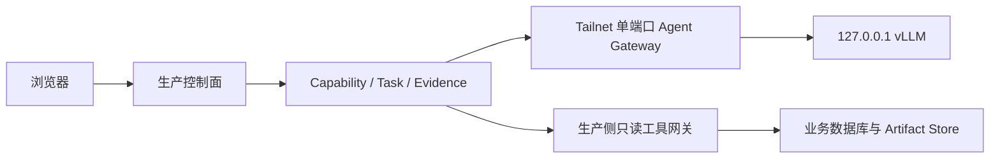

# 私网 GPU 模型平面设计与发布门禁

> 对应 #217 的 AI-P1-01。本文件只定义目标架构和验收门禁，不代表 GPU0 或生产 Tailnet 已完成变更。

## 1. 解决的问题与依赖

GPU0 只承担模型推理，生产端继续掌握身份、权限、任务、数据和审计。它依赖 #219 的
Capability/Egress Policy 和 #223 的 Durable Task；下游被 Text2SQL 规划、补库解释和模板清洗
提案调用。



模型平面永远不持有生产数据库、对象存储、用户 Token、SSH 或业务 API 凭据，也不挂载生产
文件目录。业务数据只能由生产侧先做权限交集、字段最小化和预算裁剪，再作为当前 Task 的
短生命周期上下文发给模型。

## 2. 网络边界

- 生产主机加入现有 Tailnet，使用独立机器身份标签；不开 Funnel、出口节点、子网路由或
  Tailscale Serve 公网入口。
- GPU 节点使用独立服务标签。Tailnet Grants 只允许 `production -> gpu-gateway:tcp/9443`；
  不授予 `gpu -> production` 新建连接，也不授予 GPU 访问数据库、SSH 或 Artifact 端口。
- Agent Gateway 只绑定 Tailscale 地址的单端口；vLLM 只绑定 `127.0.0.1`。主机防火墙同时
  拒绝公网和 LAN 到 Gateway/vLLM/分布式通信端口，避免仅依赖一层 ACL。
- `private` Provider 不是自由文本标签。生产配置必须把规范化 Gateway origin 放入精确
  allowlist，带 userinfo、query、fragment、重定向或未列入 origin 的地址一律拒绝。
- 初次接管只使用专用 SSH Key，并在带外核对主机指纹。口令不进入命令行、环境变量、仓库、
  Issue、日志或自动化。

GPU 主机和容器使用 **default-deny egress**，且按进程/UID/network namespace 分开执行：

- 只有 `tailscaled` 身份可访问部署时核准的 Tailscale control/DERP 传输端点；不能因为
  `tailscaled` 需要联网就给整台主机开放任意 Internet。端点清单、DNS 解析方式、证书校验和
  变更审批进入部署 Evidence；端点漂移时 fail closed 并走变更发布。
- Gateway namespace 只接受 Tailnet `tcp/9443` 入站并连接同节点受控 loopback vLLM socket；无
  DNS、无默认 Internet 路由，禁止访问公网、RFC1918/LAN、link-local/cloud metadata、其它
  tailnet 节点（包括生产的 API/DB/SSH/Artifact 端口）和宿主 Unix socket。
- vLLM namespace 只接受 Gateway 的本地单向连接；无 DNS、Internet、RFC1918、metadata、其它
  tailnet、宿主 socket 或任意出站。模型/cache 必须预置，运行时不能下载权重、tokenizer、代码
  或 telemetry。
- 主机管理员平面的临时出站不能与服务运行策略混用；安装、升级和模型同步必须在隔离维护窗口、
  固定 hash/digest 和显式变更单下完成，结束后重新验证 default-deny。

Tailscale 官方对新配置推荐使用 deny-by-default 的 Grants；标签先由 `tagOwners` 明确授权，
再按来源、目标和端口授予最小访问：

- https://tailscale.com/docs/features/access-control/grants
- https://tailscale.com/docs/reference/syntax/grants

## 3. Gateway 协议

生产侧只调用项目自有、窄化的 Gateway，不把 vLLM OpenAI-compatible API 直接暴露给生产网段。

允许的请求字段固定为：

```text
request_id, task_id, step_id, model_profile
messages[], allowed_tool_schemas[], max_input_tokens, max_output_tokens
deadline, response_schema_version
```

禁止任意 URL、文件路径、模型路径、LoRA、chat template、正则 structured output、插件、MCP、
代码解释器和服务端工具选择参数。Gateway 重建 vLLM 请求，不透明透传未知字段。

每个请求同时满足：

1. 双向 TLS 机器身份；
2. 生产控制面在实时重验 Task/Step、owner、Capability、sensitivity 和预算后签发最多 60 秒的 JWT，
   固定 `iss/aud/sub/task_id/step_id/scope/model_profile/iat/nbf/exp/jti`；
3. Gateway 不回连生产查账本，而是使用随发布离线下发、固定 `key_id` 的 issuer 公钥集合验签；严格
   校验 `iss/aud`、最大 TTL、时钟偏差、请求体与 claim 的 task/step/profile 完全一致。能签发令牌
   即是“生产账本已重验”的信任边界；Gateway 不能自行扩 scope；
4. Gateway 在调用 vLLM 前把 `(iss,jti)` 原子写入本地持久 replay ledger，`UNIQUE(iss,jti)`，保留到
   `exp + clock_skew`；重复、账本不可用或原子写失败一律拒绝。若部署多个 Gateway 副本，必须使用
   同一强一致 replay ledger，否则只允许单副本；
5. 公钥轮换随配置发布先加入新 key、再切签发、最后撤旧 key；Gateway 禁止运行时 HTTP/JWKS fetch。
   撤销 key 或 issuer 后，相关未执行请求立即 fail closed；
6. 请求体字节、消息数、上下文 Token、输出 Token、并发和 wall-clock 预算；
7. 响应只返回结构化 completion、usage/usage_unknown、模型快照和安全错误码。

日志只记录 ID、模型 profile、Token/字节计数、排队与执行耗时、状态码；不记录 prompt、tool
结果、模型正文、Authorization、证书内容或客户字段。

## 4. vLLM 隔离

- 使用非 root、只读根文件系统、最小 Linux capabilities、私有 cache/model 目录；不挂 Docker
  socket、宿主 SSH、生产目录或通用共享盘。
- 固定镜像 digest、vLLM 版本、模型 revision 和 tokenizer/chat-template hash；上线前逐条核对该
  版本的 GitHub Security Advisories，不允许浮动 `latest`。
- 保持 `trust_remote_code=false`，不加载运行时插件，不启用 demo tools、MCP、browser、Python
  code interpreter 或 gRPC；不接受调用方提供 chat template。
- vLLM 仍配置独立 API key，但其只作为纵深防御。官方说明 API key 只覆盖部分路径，因此
  `127.0.0.1` 绑定、Gateway allowlist 和防火墙不可省略。
- vLLM 的模型、tokenizer 和 chat template 在离线构建/维护阶段按固定 hash 预置；服务运行 namespace
  没有 DNS 或出站，任何缺失资源都启动失败，不能临时从 Hugging Face/GitHub/对象存储下载。
- 限制单请求 prompt、batch、并行序列、最大模型长度和并发；GPU OOM 后由 supervisor 拉起，
  不在生产 API 线程内无限重试。

参考：

- https://docs.vllm.ai/en/latest/usage/security/
- https://docs.vllm.ai/en/latest/serving/online_serving/openai_compatible_server/
- https://github.com/vllm-project/vllm/security/advisories

## 5. 数据出境和模型选择

模型 profile 由服务端版本化，至少包含 provider origin、trust zone、模型/revision、上下文上限、
支持的结构化输出、允许 sensitivity 和保留策略。Task 同时保存静态 Capability fingerprint 与
运行时 Provider policy fingerprint，恢复时不一致即暂停并重新授权。

在读取 GPU 硬件、驱动、显存、磁盘和现有运行时之前不指定模型。候选模型必须通过同一组
中文业务黄金样本：工具选择、Typed Query IR、补库解释、模板映射、JSON schema 遵循、提示
注入拒绝、长表格上下文、延迟和显存峰值。准确率、规则越权率和结构化输出成功率优先于参数量。

## 6. 故障与降级

- 生产侧 Provider client 使用连接/首 Token/总时限、并发舱壁和指数退避；Task 模式关闭 SDK
  隐式重试，由 #223 账本统一计数。
- 连续失败、超时或队列饱和触发 circuit breaker。业务 Web、导入导出和人工流程不得依赖 GPU
  健康；Agent Task 明确进入 `paused_recoverable` 或稳定失败。
- 是否允许切换到获批外部 Provider 由 sensitivity/egress policy 决定；不得为了可用性把私密
  文件或成本数据自动发往公网。
- 回滚先关闭 private Provider profile，再排空/取消任务；保留 Task/Evidence，不删除模型和日志
  来伪造成功。

## 7. 分阶段发布

### Stage 0：只读盘点

核对 SSH 主机指纹、OS/内核、GPU 型号与显存、驱动/CUDA、磁盘、Tailscale 版本与节点身份、
监听端口、容器运行时和现有工作负载。同时记录 Tailnet 当前是 direct 还是 DERP relay、往返延迟和
可用吞吐；只读，不安装、不重启、不改 ACL。未带外确认主机指纹时不得登录。

### Stage 1：离线基准

在 GPU0 本地回环运行固定版本模型和 Gateway，使用脱敏/合成黄金集，验证准确率、结构化输出、
并发、OOM 恢复和恶意请求；不连接生产。

### Stage 2：Tailnet canary

生产以专用标签加入 Tailnet；先启用单个 canary 账号、低敏 Capability 和小并发。验证 Grants、
GPU 无法反向连接生产、Gateway/vLLM 默认拒绝出站、离线 JWT 验签与 JTI 重放拒绝、断网/重启恢复
和 24 小时观测。

### Stage 3：受控开放

按 sensitivity 分级开放；每个模型/profile 变更重新跑安全 advisory、黄金集和压力门禁。生产合并、
部署和业务验收仍是三个独立状态。

## 8. 验收门禁

- 公网/LAN 无法访问 Gateway 和 vLLM；只有生产机器身份可访问 Gateway 单端口。
- 默认出站策略只允许 `tailscaled` 必要 control/DERP，因此 DERP 路径必须用最大合法请求做持续吞吐、
  p95/超时和断线测试，收紧 payload/并发并经发布审核显式接受。若未来要启用 direct peer transport，
  必须另做 tailscaled-only 精确出站例外、网络威胁复审和同等探针；不能为追求直连给 Gateway/vLLM/
  整机开放通用 UDP/Internet。
- GPU 对生产 API、数据库、SSH、Artifact 端口的主动连接探针全部失败。
- 从 Gateway 与 vLLM 各自 namespace 发起 DNS、公网 IPv4/IPv6、RFC1918、link-local/metadata、其它
  tailnet 节点、宿主 Unix socket 探针全部失败；Gateway 到唯一 loopback vLLM socket 成功，vLLM
  不存在运行时下载路径。
- 以 `tailscaled` 身份验证核准 control/DERP 可达，同时对非核准公网目的地的探针失败；以普通服务
  UID 重复同一探针仍失败。规则重载、重启和升级后重复执行。
- 无凭据、错签名/key、错 audience/scope/task/profile、TTL 超限、过期、未来时间、重复 `jti`、replay
  ledger 不可用、超大/未知字段请求全部在推理前拒绝；验签与重放检查不依赖 Gateway 回连生产。
- Gateway 重定向、DNS/Host 混淆和错误标记 private 的公网 origin 均 fail closed。
- vLLM 非 `/v1` 路由、插件、工具、gRPC 和 remote code 不可从 Gateway 到达。
- 断开 Tailnet、停止 vLLM、GPU OOM、超时和 429 时，主业务 SLO 不受拖垮，Task 状态可解释、可恢复。
- 日志/指标不含测试哨兵 prompt、客户字段、Token、密钥或原始模型输出。
- 固定镜像/模型 SBOM、许可证、安全公告检查、黄金集和负载报告齐备后，才可进入生产 canary。
