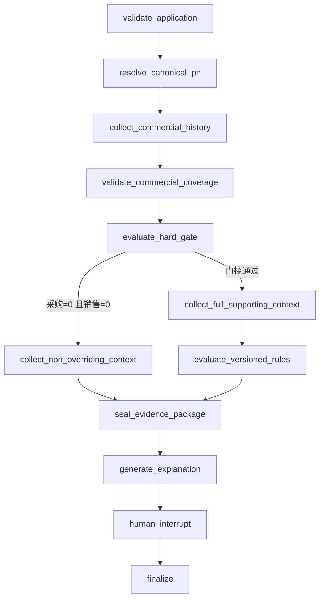

# 维保备件补库申请评审图

> 对应 GitHub #227，父项为 #217。本文定义一个单 PN、只读、可恢复的补库评审工作流；
> AI 只生成证据和解释，人工仍在原业务流程中决策。

## 1. 目标与依赖

在 #223 Durable Agent Task、#224 Query Broker 和 #226 Versioned Workflow/Human Interrupt
之上，交付维保备件补库申请的确定性评审图：

```text
结构化申请
  -> 严格 PN 解析
  -> 半年采购/销售硬门槛
  -> 库存/在途/安全库存/active 互通池/维保使用证据
  -> 版本化规则结论
  -> LLM 解释
  -> Human Interrupt
  -> 人工回到原业务流程决策
```

硬依赖：#219、#223、#224、#226。#231 完成真实申请只读绑定和审核队列前，本图只能用于
测试/受控人工结构化调用，不能进入真实业务 canary。

本工作流不接收上传文件、不生成下载制品，因此不依赖 #220/#221/#222。首版一个 Task
只评审一个 PN，不支持批量申请。

## 2. 不变量

1. 业务结论由服务端确定性规则生成；LLM 只能解释，不能修改结论、阈值或证据。
2. 近 6 个月 `purchase_order_count == 0 AND sales_order_count == 0` 时固定输出
   `recommend_reject`，且 `overrideable=false`。
3. active 互通池、维保消耗、项目理由或模型判断均不能覆盖上述硬规则。
4. AI 不批准、不驳回、不创建采购单，也不写采购、销售、库存、项目、维保或互通池事实。
5. 允许写入的只有 #223/#226 定义的 Agent 控制面账本、最小审计和不可变 Evidence。
6. “高频”和“稳定消耗”只来自经甲方确认的版本化规则；未确认前固定运行 shadow mode。
7. 查询失败、超时、撤权或数据源异常不能被解释成业务上的“0 次”。
8. 采购和销售两侧必须各自证明 `coverage_through`、成功 batch、原文件 SHA-256 与 completeness；
   已知陈旧/部分覆盖输出 `need_info`，技术查询/lineage/hash 错误则 Task 失败，二者不能混用。
9. `project_id` 只证明项目身份上下文，不能单独构成某 PN 的具体补库需求。
10. RPL-100 一旦在完整商业覆盖上命中“采购=0 且销售=0”，`recommend_reject` 立即锁定；多 active
    池等后续异常只能作为解释上下文。只有 RPL-100 通过后，多 active 池才输出 `need_info`。

## 3. Typed Application Input

通过 #223 的 Task 创建接口提交固定 `task_type`：

```json
{
  "client_request_id": "uuid",
  "task_type": "maintenance_replenishment_review_v1",
  "input": {
    "schema_version": "maintenance-replenishment-review/v1",
    "source_application_ref": "server-derived reference in production",
    "pn": "requested PN",
    "requested_qty": "5.000",
    "target_warehouse": "optional",
    "needed_by": "optional YYYY-MM-DD",
    "reason_code": "safety_stock",
    "project_id": "optional canonical project_id",
    "project_contract_id": "optional canonical project_contract_id",
    "need_fact_refs": [
      {
        "type": "maintenance_work_order_line",
        "id": "opaque stable id",
        "version": "opaque stable version"
      }
    ],
    "justification": "optional bounded text"
  }
}
```

`reason_code` 只允许：

```text
safety_stock
project_fault
planned_maintenance
contract_obligation
other
```

服务端约束：

- `pn` 必填，去首尾空白，拒绝 NUL/控制字符，最长 128 字符。
- `requested_qty` 按现有 `Numeric(14,3)` 解析，必须有限且大于 0。
- `source_application_ref` 最长 128，`target_warehouse` 最长 64，`justification` 最长 1000；生产
  `source_application_ref` 和 source snapshot 只能由 #231 Source Adapter 注入，不能相信客户端自报。
- 不接受客户端提供的 `as_of`、申请人、角色、阈值、规则版本或结论。
- `as_of` 在 Task 创建时按 `Asia/Shanghai` 日期固化，恢复执行时不得漂移。
- `project_contract_id` 存在时必须属于给定 `project_id`；二者只是 identity/context，即使核验成功也
  不能单独满足 `concrete_need`。
- `need_fact_refs` 最多 8 条；type 只允许版本化 Registry 中的
  `maintenance_work_order_line/verified_fault_requirement/contract_spare_obligation/device_service_case`。
  每条必须经服务端按当前用户权限解析为同一 canonical part、有效状态、稳定版本和有界事实投影；
  客户端 opaque ID、自由文本或只命中项目/合同身份时均保持 `verified=false`。
- 请求中的自由文本全部是不可信数据，不能生成图节点、Capability 或系统指令。
- 直接手工提交只允许测试或显式受控 shadow 入口；生产入口必须绑定 #231 的真实 source snapshot，
  同版本内容漂移或来源撤回时 fail closed。

## 4. 权限与出境

Capability 只对同时满足以下实时权限的 active 实名 `sys_user` 可见并可执行：

```text
action_agent_replenishment_review
page_chat
page_parts
page_purchases
page_inventory
page_maintenance
page_pool_analysis
own_customers_only = false
```

新增专用 action 权限，首版只给 admin 默认开启；其他职位模板默认关闭，由管理员在甲方确认评审职责
后显式授予。不能仅凭“恰好拥有多个页面”推断某账号获准执行采购评审。

真实申请队列另使用 #231 的 `action_agent_replenishment_queue`。队列是显式授权的 Agent 控制面，
不放宽普通 Task/Interrupt/Evidence 的 owner-only 规则；领取后 Task 归领取 reviewer 所有，队列完成
也不代表原申请已批准或驳回。

不要求 `data_purchase_cost`，因为本流程不得读取或输出采购价、成本、供应商、客户、利润、
订单号或 SN。Task 创建、每个节点、Evidence 读取和 Interrupt resolve 前都重新加载实时用户、
权限、Capability policy 与 Provider trust zone。用户停用或权限变窄后，下一步 fail closed；跨
owner 统一返回 404。

评审 Evidence 的 sensitivity 为 `internal_business`。只有 private 或显式获批且允许该 sensitivity
的 Provider 才能接收最小化解释投影；Provider 不满足策略时跳过模型调用，使用确定性模板解释，
不影响规则结论和人工交接。

## 5. LangGraph-compatible 固定图

本图注册为 #226 `WorkflowSpec`。LangGraph 若被采用，只能实现 Workflow/Planner Adapter；
不得直接访问数据库、文件系统、网络或业务 API。每个读取节点先落不可变 Step，再经 #219
Capability Gateway 执行。



节点边界：

- `validate_application`：纯 schema/交叉字段校验，不读业务表。
- `resolve_canonical_pn`：严格解析唯一正式 `part_id`。
- `collect_commercial_history`：固定查询半年采购/销售事实，并分别返回来源覆盖/lineage metadata。
- `validate_commercial_coverage`：先验证两侧 coverage、batch、file hash、completeness；陈旧/部分覆盖封存
  `need_info`，技术错误使 Task 失败。只有两侧都通过才进入硬门槛。
- `evaluate_hard_gate`：只对已证明完整覆盖的采购/销售计数执行不可覆盖的半年门槛。
- `collect_non_overriding_context`：硬拒绝分支仍读取 active 池和维保事实，用于解释“为什么
  这些证据不能覆盖硬规则”，但不得进入后续规则求值或改变已锁定结论；多 active 池只记 caveat。
- `collect_full_supporting_context`：读取库存、安全库存、active 池和分离的维保使用证据。
- `evaluate_versioned_rules`：只在 RPL-100 通过分支执行高频、active 池完整性、稳定消耗、库存和具体
  业务证据规则。
- `seal_evidence_package`：固化 Evidence、规则版本和统一 `integrity-envelope/v1`。
- `generate_explanation`：可降级的 LLM 解释节点，不允许工具调用。
- `human_interrupt/finalize`：复用 #226，不产生业务审批动作。

Checkpoint 只保存节点游标、计数、状态和 Evidence 引用；Task/Plan/Step/Event/Interrupt 仍是
审计事实源。查询错误进入 #223 的 retry/fail 路径，不能创建“零记录”Evidence；完整性不足产生的
`need_info` 与技术 `failed` 使用不同稳定错误/规则码。

## 6. 严格 PN 解析

只有以下情况可以进入半年历史统计：

- 唯一精确命中 `DimPart.status='active'` 的正式 PN；或
- 唯一精确命中 `PartAlias.status='active'`，且 alias 的 `part_id/pn_std` 一致指向 active
  `DimPart`；
- 命中的 `DimPart.needs_review=false` 且 `is_excluded=false`。

以下情况固定输出 `need_info`：

- 无命中、仅模糊命中或多个精确目标；
- pending、rejected 或历史 NULL 状态 alias；
- PN 待复核、治理排除或 alias/part 关系不一致；
- merged PN 未能通过唯一 active alias 明确重定向；
- 主数据明确标记为非备件。

现有 `part_resolver._exact_lookup` 只过滤 `DimPart.status != 'merged'`，没有过滤
`PartAlias.status='active'`。补库评审必须使用 strict resolver，不能直接把当前通用搜索的
`exact=true` 当作采购评审依据。模糊候选只能作为需人工消歧的展示信息。

## 7. 半年商业历史与来源覆盖单一口径

窗口按 6 个日历月计算：

```text
window_start = as_of - 6 calendar months
window_end   = as_of
闭区间：[window_start, window_end]
```

### 7.0 双侧 Coverage Gate

采购和销售 adapter 必须分别返回下面的服务端 lineage 结构，不能用“最大订单日期”猜测数据完整：

```text
side = purchase|sales
coverage_through
completeness_status = complete|partial|unknown
source_batch_refs[] = batch_id, batch_status, file_sha256, file_type
lineage_verified
last_successful_import_at
```

- `coverage_through` 是权威导入契约声明的业务覆盖日，不等于文件上传日或查询到的最大订单日期。
- 每侧引用的 batch 必须存在、`status=success`、file_type 与侧一致，`SysImportBatch.file_hash`、原始
  `SysRawFile.file_hash` 和实际归档文件 SHA-256 必须一致；所有参与统计的事实都可追溯到该侧允许的
  batch manifest。manifest 可以含多个不可变 batch，但不能只记录“最新一个”掩盖窗口内来源。
- 两侧均须 `completeness_status=complete` 且 `coverage_through >= as_of` 才可把查询结果中的 0 当作
  已证明的 0。初始版本在甲方确认更宽松 SLA 前不允许容忍滞后日数。
- metadata 自洽但 `coverage_through < as_of`、`partial`、`unknown` 或缺少可证明覆盖的 manifest 时，
  输出 `need_info`（`RPL-090-source-coverage-incomplete`），不执行 `RPL-100`。
- 查询超时/异常、batch 状态或类型错误、hash mismatch、归档文件丢失、同一 batch 身份内容漂移、
  lineage 断裂或 adapter schema 错误属于技术失败，Task 进入 retry/fail，不能生成业务 outcome。

Evidence 只保存 batch ID、file SHA-256、coverage/completeness 和计数，不保存文件名、路径、订单或原始行。

### 7.1 采购次数

- 以 canonical `part_id` 聚合。
- 只统计 `data_status=已生效`、`order_date` 非空且位于闭区间的订单。
- 明细必须 `qty > 0`。
- 按 `FPurchaseOrder.id` 去重，不按行数计数。
- 所有 `source_type` 都计入，包括“指定采购”“补库”和维保需求。
- 单价为空不影响“是否发生过采购”的判断。

### 7.2 销售次数

- 以 canonical `part_id` 聚合。
- 只统计 `data_status=已生效`、`counts_revenue=true`、`order_date` 非空且位于闭区间的订单。
- 明细必须 `qty > 0`。
- 按 `FSalesOrder.id` 去重，不按行数计数。
- 单价为空不影响“是否发生过销售”的判断。

未来日期、空日期、非正数量、取消/未生效单不计入，并分别输出数据质量计数。最新事实日期只能作为
质量信息，不能替代 7.0 的 `coverage_through/completeness` 证明。

不得复用 `ANALYSIS_FREQ_THRESHOLD=3` 或采购分析面板默认排除“指定采购”的口径：现有阈值是
7 天早会/周会高亮规则，不是半年补库门槛。

## 8. 库存、在途和安全库存

为本工作流提供可显式传入固定 `as_of` 的只读库存 Evidence Adapter，不能直接依赖现有
`dynamic_stock_map()` 内部的 `date.today()`。

证据至少包含：

```text
warehouse_snapshots[]:
  warehouse, anchor_qty, anchor_date, batch_id, file_sha256,
  completeness_status, manual_override_present
same_day_anchor_status / warehouse_coverage_status
snapshot_total (nullable)
model_level_dynamic_qty (nullable)
anchor 后 model-level purchase_in / sales_out / maintenance_out
safety_stock_total / safety_stock_coverage
```

- 每个仓库单独验证 snapshot batch/hash/completeness；目标仓没有有效 snapshot 时，该仓库存为 unknown。
  未指定目标仓时，必须显式给出期望仓库集合与已覆盖仓库集合，不能把“查到的仓库”自动当全量。
- 只有所有期望仓都有完整快照、全部 `anchor_date` 为同一日时才可计算 `snapshot_total`；异日锚点、
  缺仓、partial/unknown 或 hash/lineage 不完整时 total 为 null，并输出
  `warehouse_anchor_incomplete`。技术 hash/schema/查询错误仍使节点失败。
- 指定目标仓时，只展示该仓 snapshot 与安全库存；未指定时安全库存逐仓展示，并报告已填写仓数/
  期望仓数。部分缺失不得伪装成完整值。
- 现有采购/销售事实没有完整仓库维度，因此 anchor 后动态流水只能生成独立的型号级
  `model_level_dynamic_qty`，不能按比例分摊回仓库，也不能把分仓 snapshot 冒充当前分仓库存。
- 若 `as_of` 晚于同日 anchor，型号级 movement coverage 必须完整覆盖到 `as_of` 才能给出动态总量；
  否则 dynamic 为 null。分仓事实仍停留在各自 anchor_date，并明确陈旧天数。
- 维保历史出现 `return_qty > qty` 时，评审净消耗按 0 处理并增加异常计数，不能让负净消耗
  反向增加可用库存。

当前系统没有独立、可验证的在途订单或 `in_transit_qty` 真值，首版必须固定输出：

```json
{
  "in_transit_qty": null,
  "in_transit_status": "unavailable_in_system"
}
```

严禁把未知在途按 0 参与公式，也不得生成“已证明缺货”的表述。它不覆盖半年硬门槛，但必须作为
库存建议的限制条件持续展示。

## 9. Active 互通池与维保使用

互通池只认 `PartPool.status='active'`，Evidence 保留：

```text
group_id
pool_name
pool_version
pool_source
member_count
```

不读取池价格政策。若脏数据导致同一 PN 同时位于多个 active 池，不能像普通展示查询一样静默选择
某个 group_id；处理严格服从 RPL-100 优先级：

- 若完整商业覆盖已证明采购=0且销售=0，outcome 仍为不可覆盖的 `recommend_reject`；Evidence 增加
  `multiple_active_pools` caveat 和全部有界 pool refs，仅用于异常上下文。
- 只有 RPL-100 已通过时，多 active 池才输出 `need_info`，阻止把任一 pool 当作正向支持。

维保使用分成两套证据，禁止相加：

- `canonical_confirmed`：`MaintenanceSiteIssue` 为 mapped + confirmed 的现场消耗。
- `legacy_active`：已生效 `FMaintenanceOrder/FMaintenanceLine` 的历史 WBDD 净数量。

canonical 事实可能来自 legacy、workbook 或 direct_api，目前没有足以证明两套来源完全不重叠的
稳定去重键。因此两套统计可以并列展示，但不得简单求和制造“高频”或“稳定消耗”。

### 9.1 固定维保使用指标查询合同

两套 adapter 都只能接受 `canonical_part_id/window_start/window_end/as_of`，不接受模型字段、SQL、
任意 filter 或 group_by；输出 schema 和聚合口径固定：

`canonical_confirmed/v1`：

- `MaintenanceSiteIssue.status_mapping_state='mapped'` 且 `normalized_status='confirmed'`；
- `issue_date` 位于半年闭区间且不晚于 `as_of`；
- line 的 `part_id` 等于 canonical part，`quantity > 0`；
- 输出 `distinct_issue_count`（按 `issue_id` 去重）、`line_count`、`quantity_sum`、
  `active_month_count`、`latest_issue_date`、排除/异常计数；
- source/import batch/version 只进入 lineage/质量计数，不把不同 source 的同一 issue 重复计数。

`legacy_active/v1`：

- `FMaintenanceOrder.data_status='已生效'`，`order_date` 位于半年闭区间且不晚于 `as_of`；
- line 的 `part_id` 等于 canonical part；
- `net_quantity = greatest(coalesce(qty,0) - coalesce(return_qty,0), 0)`，只有 `net_quantity > 0`
  进入使用指标；`return_qty > qty` 单列异常计数；
- 输出 `distinct_order_count`（按 `FMaintenanceOrder.id` 去重）、`line_count`、`net_quantity_sum`、
  `active_month_count`、`latest_order_date`、排除/异常计数。

每个输出同时固化 query contract/version、窗口、结果计数和完整性状态；查询失败/超时不能返回空 metrics。
`stable_maintenance` 规则必须明确选择其中一套版本化指标或分别评估，永远不能对两套 count/qty/month
求和。不得输出 issue/order ID、项目名、客户、SN、价格或逐行事实。

## 10. 版本化确定性规则

规则顺序固定为：

```text
RPL-001 输入结构有效
RPL-010 PN 严格解析
RPL-090 采购/销售来源覆盖完整且新鲜
RPL-100 半年采购/销售硬门槛
RPL-200 高频商业活动
RPL-210 active 互通池
RPL-220 稳定维保消耗
RPL-300 库存与安全库存
RPL-400 低频/小众 PN 的 same-part 有界具体需求事实
```

结果枚举只允许：

```text
need_info
recommend_reject
human_review_required
```

系统永远不产生 `approve` 或 `recommend_approve`。确定性顺序：

```python
if pn_not_strictly_resolved:
    outcome = "need_info"

elif commercial_coverage_is_stale_or_incomplete:
    outcome = "need_info"
    rule = "RPL-090-source-coverage-incomplete"

# query/hash/lineage/schema errors do not enter this decision function;
# they fail the Task technically before an outcome is sealed.
elif purchase_order_count == 0 and sales_order_count == 0:
    outcome = "recommend_reject"
    overrideable = False

elif multiple_active_pool_memberships:
    outcome = "need_info"
    rule = "RPL-210-multiple-active-pools"

elif policy.mode == "shadow":
    outcome = "human_review_required"
    support_class = "unscored"

else:
    high_frequency = (
        commercial_order_count >= policy.min_commercial_orders_6m
        and commercial_active_months >= policy.min_commercial_active_months_6m
    )
    stable_maintenance = (
        confirmed_issue_count >= policy.min_confirmed_issues_6m
        and maintenance_active_months >= policy.min_maintenance_active_months_6m
    )
    # project/contract identity is context only, never concrete_need by itself.
    concrete_need = any(
        verified_maintenance_work_order_line_for_part,
        verified_fault_requirement_for_part,
        verified_contract_spare_obligation_for_part,
        verified_device_service_case_requiring_part,
    )

    if inventory_required_but_warehouse_anchor_or_movement_coverage_incomplete:
        outcome = "need_info"
    elif not (high_frequency or active_pool or stable_maintenance) and not concrete_need:
        outcome = "need_info"
    else:
        outcome = "human_review_required"
```

库存只增加证据标签，不新增未经确认的驳回规则：

```text
stock_below_safety
stock_may_cover_request
requested_qty_above_calculated_gap
safety_stock_unknown
in_transit_unknown
```

active 池、维保消耗和申请理由即使存在，也必须在 Evidence 中标记为
`non_overriding_support`，不能改变 `RPL-100`。硬拒绝分支中的 `multiple_active_pools` 同样只是
`non_overriding_anomaly`；不得把它升级为 `need_info` 覆盖 `recommend_reject`。

`project_id`、`project_contract_id`、项目名称或“该项目需要”文字只用于确认身份/上下文，永远不能单独
满足 `RPL-400`。有界事实必须在当前权限下解析为 same-part、有效状态和稳定版本，并证明 PN/数量/
时间需求中的至少一个约束；普通设备身份、故障文本或合同身份也不够。系统没有可核验来源时只触发
“请补充外部证明”；最终人工可以在原业务流程判断，但 Agent Evidence 仍保持 `verified=false`。

## 11. Threshold Policy 与 Shadow Mode

补库规则使用不可变、服务端注册的 Policy 版本。初始生产版本：

```text
policy_version = replenishment-v1-shadow
mode = shadow
lookback = 6 calendar months
high-frequency thresholds = unset
stable-maintenance thresholds = unset
```

在 shadow mode：

- `RPL-100` 硬门槛正式生效。
- 输出真实订单数、数量、活跃月份与 active 池事实。
- 服务端存在候选 Policy 时可以输出明确标记为 `simulation` 的结果。
- 不得输出正式 `high_frequency=true`，`support_class` 固定为 `unscored`。
- LLM、请求参数或自由文本不得定义阈值。

甲方确认后新增一个不可变 Policy 版本，记录确认依据；不得覆盖旧版本。Task/Evidence 固化
`policy_version`、规则实现版本，并用总纲统一 `integrity-envelope/v1`
（purpose=`replenishment.evidence`）封存，保证历史结论可回放；不得另创 HMAC 拼接格式。

## 12. Evidence Package

`seal_evidence_package` 生成不可变结构：

```json
{
  "schema_version": "replenishment-evidence/v1",
  "task_id": "uuid",
  "as_of": "YYYY-MM-DD",
  "window": {
    "kind": "calendar_months",
    "start": "YYYY-MM-DD",
    "end": "YYYY-MM-DD",
    "inclusive": true
  },
  "application": {
    "source_application_ref": "bounded server reference",
    "source_snapshot_fingerprint": "integrity envelope reference",
    "requested_qty": "5.000",
    "target_warehouse": null,
    "reason_code": "safety_stock",
    "declared_evidence_presence": {}
  },
  "part": {},
  "commercial_history": {
    "purchase": {"coverage": {}, "metrics": {}},
    "sales": {"coverage": {}, "metrics": {}}
  },
  "inventory": {
    "warehouse_snapshots": [],
    "same_day_anchor_status": "complete|incomplete",
    "snapshot_total": null,
    "model_level_dynamic_qty": null
  },
  "in_transit": {},
  "active_pool": {},
  "maintenance_usage": {
    "canonical_confirmed": {},
    "legacy_active": {},
    "aggregation": "separate_never_sum"
  },
  "policy": {},
  "rule_results": [],
  "deterministic_outcome": "human_review_required",
  "support_class": "unscored",
  "verified_need_fact_refs": [],
  "caveats": []
}
```

上面对象是 immutable payload；存储时在 payload 外附加统一 `integrity-envelope/v1`，不能把 envelope
塞回 payload 形成自引用。

Evidence 存入 completed AgentStep output，并受 #223 的结果体积预算约束。不得保存插值 SQL、
物理表结构、订单号、客户、供应商、价格、SN、数据库凭据或 Provider 原始请求。

#224 首版明确不包含维保和动态库存；本 Issue 只新增内部 fixed-query adapters：

- `replenishment.resolve_part`
- `replenishment.collect_commercial_history`
- `replenishment.collect_inventory_context`
- `replenishment.collect_supporting_context`

这些 adapter 复用 #224 的独立只读账号、只读事务、超时、行数/字节预算和 Query Evidence，
但不进入模型可自由组合的 Query IR Registry，不扩展成通用维保 Text2SQL。

## 13. LLM 解释边界

模型只接收最小化 Evidence Projection：

- 正式 PN 与非敏感描述；
- 采购/销售 coverage/completeness 状态、次数、数量和活跃月份；
- 库存、安全库存与在途状态；
- active 池状态；
- 分离后的维保统计；
- 确定性 rule code、outcome 与 caveat。

不得发送客户、供应商、项目名称、合同号、设备号、故障号、原始 justification、source file/batch
路径或逐单数据。事实引用只以有界 Evidence ref 出现，模型不能据此二次读取业务对象。

LLM 输出 schema：

```json
{
  "summary": "...",
  "reasons": [],
  "missing_information": [],
  "risks": [],
  "evidence_refs": []
}
```

模型输出中不存在 outcome 字段。UI 永远从确定性 Evidence 读取结论。模型不可用、超时、schema
非法、引用不存在的 Evidence ID 或试图改变规则时，使用确定性模板解释，Task 仍进入 Human
Interrupt。解释节点不得提出或调用任何 Capability。

## 14. Human Interrupt

Interrupt 的数据模型、状态机、owner-only、乐观锁、幂等 resolve、恢复和审计全部复用 #226；
本工作流不重复创建第二套 Interrupt 表或 API。

本工作流的 response schema 只允许：

```text
acknowledge
request_external_information
close_without_action
```

这些是 Agent 控制面动作，不是采购批准或驳回。Interrupt 的固定 7 天 expiry 与 #226 的
`active_compute/autonomous_wall` 两个预算独立；等待不计入前两者，但 resolve 不刷新累计预算，过期按
#226 进入失败终态。获得补充资料或更正 PN 后，创建带
`parent_task_id` 的新 Task，不覆盖旧输入、Plan 或 Evidence。

## 15. 最小界面

复用 #223 的 Task 页面，增加“维保补库评审”结构化任务模板。结果必须按数据优先顺序展示：

1. 采购/销售两侧 coverage/batch/hash/completeness 与数据新鲜度；
2. 采购/销售次数、逐仓库存锚点、安全库存、在途状态、active 池和分离的维保事实；
3. 确定性规则结果；
4. Shadow mode 与数据质量限制；
5. AI 解释；
6. Human Interrupt 操作。

不提供“批准”“驳回”“写回采购单”按钮，并固定显示“系统建议不代表业务审批”。

## 16. 审计

记录 Task/Plan/Step/Event/Interrupt ID、actor、workflow/rule/policy 版本、Evidence Envelope fingerprint、
Capability、状态、行列数、耗时和稳定错误码。日志不得记录原始输入正文、PN 文本、项目/合同/
设备/故障值、SQL、查询参数/结果、LLM prompt/response、订单、客户、供应商、价格或凭据。

Human Interrupt resolve 前重新验证 owner、用户状态、权限和 workflow fingerprint。并发双 resolve
只允许一个版本成功，另一个返回 409。

## 17. 验收

### PN 与输入

- 正式 PN、active alias、merged 后 active alias 重定向成功。
- pending/rejected/NULL alias 不得解析成功。
- 模糊、多精确命中、needs_review、is_excluded 均为 `need_info`。
- 项目不存在、合同不属于项目、数量非法和 schema 越界均稳定失败。

### 半年硬门槛

- 采购和销售两侧分别验证 `coverage_through/batch/file_sha256/completeness`；只有两侧完整且覆盖到
  `as_of` 才执行 RPL-100。
- 已知陈旧/partial/unknown/missing coverage 固定 `need_info`；查询失败、batch/type/hash/lineage/schema
  错误固定技术失败，均不能落成 0。
- 同一 batch 同一 hash 重放幂等；归档文件缺失、hash 漂移、coverage 倒退均 fail closed。
- 六个月首尾日期均计入；窗口外、未来和空日期不计。
- 同一订单多行只计一次。
- 所有采购 source type 均计入，“指定采购”不能被默认过滤。
- 无价格但正数量的有效记录仍计数。
- 非正数量、取消/未生效单、`counts_revenue=false` 销售行不计。
- 查询异常不能落成 0 次。
- 采购和销售均为 0 时，即使 active 池和维保使用存在，仍为不可覆盖的
  `recommend_reject`。
- 任一采购或销售记录通过硬门槛，但不产生批准结论。

### 支持证据与阈值

- archived 池不作为正向证据；RPL-100 通过后多 active 池为 `need_info`。
- RPL-100 命中时多 active 池只增加异常 caveat，outcome 仍为不可覆盖的 `recommend_reject`；硬拒绝
  分支不得进入 `evaluate_versioned_rules`。
- canonical 与 legacy 维保数据分别展示且不相加。
- 两套固定查询合同的 distinct count、qty、active month、日期边界与异常计数有独立 PostgreSQL 样本；
  模型不能增加 filter/group 或选择相加。
- `return_qty > qty` 不产生负消耗，并输出异常计数。
- 库存按 Task `as_of` 而不是恢复执行当天计算。
- 逐仓 snapshot 的 batch/hash/completeness 可回放；缺仓、异日 anchor、partial/unknown 时
  `snapshot_total=null`，不得用已查到的仓库冒充全量。
- 型号级动态流水不能分摊为分仓当前库存；movement coverage 不到 `as_of` 时 dynamic 为 null。
- 分仓安全库存完整、部分缺失和全部缺失均有不同状态。
- 在途固定为 unknown，任何路径都不按 0 参与公式。
- shadow mode 不产生正式高频标签；测试 Policy 在阈值边界上下结果稳定。
- 历史 Policy 不可覆盖修改。
- 无 same-part、有效且版本稳定的有界需求事实时，低频小众 PN 为 `need_info`。
- 已核验 project/project_contract 身份仍不等于 concrete_need；opaque ID、普通设备身份、故障自由文本
  或泛化合同身份不能伪装成已核验需求。

### LLM、权限与恢复

- Prompt injection 不能改变 outcome、Evidence、图或触发工具。
- LLM 不可用时确定性模板仍能完成人工交接。
- Task owner-only、共享身份拒绝、撤权、停用、取消和 7 天过期符合 #223/#226。
- #231 未完成时真实申请 canary 保持关闭；完成后 source version/fingerprint、取消传播、队列并发 claim
  和 reviewer-owned Task 均通过验收，队列完成不写原申请状态。
- 双 worker lease、创建幂等、双 resolve 冲突和进程重启恢复不重复执行 completed Step。
- `agent_reader` 无基础表、TEMP 和业务写权限；各 fixed-query adapter 均受预算限制。
- 工作流前后采购、销售、库存、维保、项目和互通池业务表零写入。
- Event/access log 不包含敏感哨兵串。
- migration upgrade/check/downgrade/re-upgrade、全量 pytest 和真实 PostgreSQL 集成测试通过。

## 18. 非目标

- 本 Issue 不建设采购申请业务表、审批流或通用跨用户收件箱；真实来源只读绑定和专用评审队列由
  #231 单独交付，并是生产启用前置条件。
- 不自动批准、自动驳回、修改库存或写回钉钉/第三方系统。
- 不支持批量 PN、上传 Excel、导出报告或 Artifact 创建。
- 不开放维保/库存任意 Text2SQL。
- 不把 LLM 输出或 LangGraph checkpoint 当业务/审计事实源。
