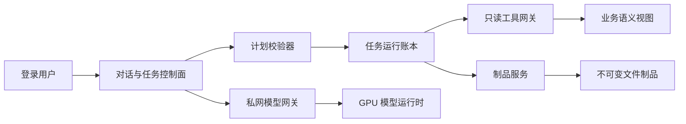

# 只读自治智能体领域模型与实施蓝图

> 对应 GitHub #217；首个交付分片为 #218。本文定义长期稳定的业务边界，具体框架和模型只是实现细节。

## 1. 先看主干

当前系统是“最多 8 轮的 ReAct 聊天”：模型选择一个工具、读取结果，再决定下一轮。它适合单次问答，但没有任务、步骤、恢复、人工中断和证据闭环。

目标不是把循环加长，而是把它拆成两个受控平面：



- **控制面**负责身份、权限、计划、状态、预算、证据和审计。
- **模型面**负责规划、归一化和解释，不持有数据库凭据，不直接写文件或业务表。
- **数据面**只通过窄化的只读能力开放；业务写能力不进入 Agent 能力集合。
- **制品面**是唯一允许生成文件的位置，只创建新对象，不覆盖输入。

## 2. 概念依赖表

| 概念 | 解决什么问题 | 依赖的上游概念 | 被什么下游调用 |
|---|---|---|---|
| Capability | 把“工具能做什么、影响什么、谁能用、数据去哪”从提示词变成服务端契约 | 登录身份、RBAC、业务服务、出境策略 | Plan Validator、Tool Gateway、审计 |
| Agent Task | 让一次复杂目标拥有稳定身份和生命周期 | 用户目标、Capability | Task Plan、运行账本、前端任务页 |
| Task Plan | 把模型建议变成可验证的 DAG，阻止无限循环和越权工具 | Agent Task、Capability、预算 | Scheduler、LangGraph adapter |
| Agent Step | 让每次能力调用可重试、可恢复、可追责 | Task Plan、依赖步骤 | Tool Gateway、Evidence Package |
| Evidence Package | 让业务建议能回放，不靠模型“说得像” | 只读事实、规则版本、步骤输出 | 补库评审、人工审核、解释生成 |
| Change Proposal | 把灵活表格处理限制为可审阅的 Patch/Diff | Human Template、输入 Artifact | Validator、Artifact Service |
| Artifact | 让文件生成、下载和会话恢复稳定 | owner、来源、Store、校验器 | 下载 API、聊天卡片、后续任务 |
| Human Interrupt | 把人工判断放进可恢复流程，而非绕过流程 | Task/Step、Evidence Package | 补库审批交接、模板确认 |

## 3. 聚合与状态机

### 3.1 Agent Task 聚合

```text
task
  id, owner_sub, intent, plan_version, status
  budgets, model_snapshot, created_at, finished_at
  steps[]
    id, capability, dependencies[], status, attempt
    input_refs[], output_refs[], evidence_refs[]
```

任务状态：

```text
pending -> planning -> validated -> running
running -> waiting_human -> running
running -> succeeded | failed | cancelled
```

不允许从终态恢复；恢复必须新建 attempt 并保留旧证据。LangGraph checkpoint 是运行实现，不是业务事实源；平台自己的 task/step 账本才是审计真相。

### 3.2 Artifact 聚合

```text
prepared -> validating -> ready
prepared | validating -> failed
ready -> expired
```

只有 `ready` 可下载。文件先写到同文件系统临时位置，完成二次打开、格式、大小和 SHA-256 校验后原子 rename；元数据发布失败时不能留下可猜测的正式对象。

生成制品还必须保存由服务端计算的 `access_scope`，而不是只保存 owner。owner 必须是非空、稳定、已认证的 token subject；匿名或共享回退身份不能创建 v2 制品。scope 显式包含可见字段组、正向 data/page 权限和行级限制，不用一个不可解释的权限 hash 代替。当前可见字段/正向权限必须覆盖 required；限制型权限不得比创建时更窄，例如创建时可看全量、后来变成 `own_customers_only=true` 就必须拒绝。每次下载/预览实时重算。用户自己上传的原件与系统生成制品分开分类；legacy generated/unclassified 默认拒绝，不能由实现自行放宽。

兼容是单向的：新代码可以读取旧 12 位 ID/旁车，新制品只写 UUID + v2 元数据/Store，不能为了“旧代码回滚后还能下载”再写一个绕过 scope guard 的旧旁车。滚动发布时隔离新旧 Agent 文件路由；若必须回滚，先关闭 v2 创建/下载，保留对象字节与数据库，修复后 forward deploy 恢复。安全回滚允许制品暂时不可用，不允许撤权失效。

## 4. 只读能力策略

允许的效果类型只有；一个复合能力可以声明多个 effect：

| Effect | 含义 | 示例 |
|---|---|---|
| `business_read` | 读取经过当前用户 RBAC 过滤的业务事实 | 库存、采购趋势、维保成本证据 |
| `file_read` | 读取当前用户拥有的不可变输入 | 表结构检查、分页读取 |
| `artifact_create` | 提交提案并由确定性服务生成新文件 | Excel 派生件、证据报告 |

`business_write`、Shell、任意 URL fetch、动态代码执行不进入注册表。例如基于原模板生成新工作簿同时具有 `file_read + artifact_create`，不能用单一标签隐藏其中一个效果。即使模型伪造工具名或参数，dispatch 也必须重新做身份、效果和资源检查。

效果与数据出境是两个正交维度。每个 Capability 还必须声明：

| Egress | 含义 | 默认策略 |
|---|---|---|
| `model_context` | 结构化工具结果会进入当前模型上下文 | 同时校验数据 sensitivity 与目标 Provider trust zone |
| `external_provider` | 原始或派生内容会直接发给第二个外部服务，如视觉识别 | 默认拒绝，需服务端显式授权和数据分级 |
| `none` | 能力本身不发起网络出境 | 允许仍取决于 effect/RBAC |

主 LLM 本身也是出境边界。Provider 必须显式标记为 `private`、`approved_external` 或 `unknown`；默认 `unknown`，且未显式允许 `model_context` 时，敏感能力不暴露、dispatch 也不执行。私网 GPU 与获批外部 Provider 可以配置不同的 sensitivity allowlist。

`read_document` 不能因为名字是“读文件”就被视为纯本地操作。首期直接拆边界：txt/docx/xlsx/文字 PDF 走本地抽取；图片或扫描 PDF 只返回 `requires_vision`，不会隐式外发。模型需要显式调用独立的视觉能力，而该能力只有在外部出境策略允许时才可见、可执行。

Capability 审计同样遵循最小化：只记录 actor、capability、参数键/集合长度、Artifact ID 与状态。正常、策略拒绝和 handler 异常都不能把 raw args/results、单元格、整行报价、SQL、文件正文、URL 或凭据复制进日志。MVP 不记录参数值 hash；将来确需跨事件关联时只能使用服务端密钥化 HMAC，不能对低熵 PN/客户名使用可枚举的裸 SHA-256。

这里“AI 只读”的准确含义是：**业务事实和源文件只读；Agent 控制面可以写自己的运行记录、审计和不可变派生制品。**

## 5. Text2SQL 边界

Text2SQL 不是给模型一个 SQLAlchemy Session，而是一个独立 Query Broker：

```text
自然语言 -> schema 子集 -> SQL 草案 -> SQLGlot AST 门禁
         -> 独立只读连接 -> 语义视图/RLS -> 结果脱敏与截断 -> Evidence
```

四层防线缺一不可：

1. 只向模型公开当前角色能见的语义视图和字段。
2. AST 只接受单条 `SELECT`、只读 CTE 和受控 `UNION`，拒绝 DML/DDL/COPY/CALL/DO/SET/LOCK、`SELECT INTO`、`FOR UPDATE`、目录表和危险函数。
3. PostgreSQL 使用独立 `agent_reader`、固定 `search_path`、只读事务、RLS、statement/lock/transaction timeout。
4. Broker 强制行数、字节、估算成本和并发预算，并在返回模型前再次应用字段/低样本推断保护。

SQLGlot 只是解析与门禁层，数据库权限才是最终安全边界。

## 6. 表格规划模型

旧接口让模型发送数千个单元格坐标，既僵硬又难审计。新流程使用高层操作：

```text
inspect -> infer schema -> propose mapping -> validate
        -> dry-run diff -> apply to copy -> reopen verify -> publish artifact
```

操作原语包括：选择工作表、定位表头、按正式业务键 join、新增列、填充列、规范化文本、保留样式和生成报告。模型只提交 Change Proposal；确定性执行器负责类型检查、公式注入中和、边界和样式策略。

## 7. 两个业务图

### 7.1 维保补库申请评审

```text
申请校验
 -> PN 解析为正式 part_id
 -> 当前库存/在途/active 互通池
 -> 近 6 个月采购/销售/维保消耗
 -> 版本化硬规则
 -> Evidence Package
 -> LLM 解释
 -> Human Interrupt
 -> 人工在原业务流程决策
```

硬规则先于模型：

- 无法解析为系统正式 PN：`need_info`。
- 近 6 个月采购次数为 0 且销售次数为 0：`recommend_reject`。active 互通池或维保消耗证据不能覆盖这条甲方硬规则。
- 低频、小众 PN 必须带明确项目、设备、故障或合同证据，否则 `need_info`。
- 在通过“半年内有采购或销售”硬门槛后，高频、active 通用池或稳定消耗才作为正向证据；仍需结合库存、在途和安全库存，不能自动批准。

“高频”的阈值必须由甲方确认并版本化；在确认前只能输出候选分布和模拟结果，不能让 LLM 临时定义。

### 7.2 人工模板驱动清洗

```text
原始 Artifact + Human Template
 -> 结构识别
 -> 字段映射提案
 -> 模板规则校验
 -> Patch/Diff
 -> 人工确认
 -> 新 Artifact
```

上传内容、批注和隐藏单元格全部视为不可信数据。模板只能由有权人员发布版本；表内“忽略系统规则”等文本不能改变能力、权限或工作流。

## 8. GPU 模型平面

目标拓扑是生产端掌握控制和数据，GPU 节点只提供私网推理：

```text
生产 API -> Tailnet 单端口 Agent Gateway -> localhost vLLM
```

- GPU 节点无生产数据库凭据、无生产文件挂载、无业务写 API。
- 模型服务不公开监听；禁止 Funnel；生产到 GPU 单向发起连接。
- 请求使用短期、限定 audience/scope/task 的服务令牌并防重放。
- 锁定容器 digest 和模型 revision，禁用 `trust_remote_code`，设置并发、上下文和输出上限。
- GPU 或 Tailnet 故障必须熔断，不能拖垮主业务 API。

## 9. 开源组件准入

候选基线：LangGraph、SQLGlot、vLLM、Polars/python-calamine、openpyxl/XlsxWriter。组件只解决局部问题，不能取代项目自身的权限和审计。

第三方 Skill 按代码供应链处理：固定 commit/hash、核许可证、递归检查脚本/引用/资产、拒绝路径逃逸/软链接/隐藏 Unicode/动态下载/密钥读取/任意网络，在无密钥无网络的非 root 沙箱中运行恶意输入评测。运行时禁止从在线市场热安装。

## 10. 实施依赖

1. #219：Capability Policy。
2. #220：Artifact Store；#221：结构化交付；#222：依赖 #220 的上传/解析隔离边界。
3. Durable Task/Step ledger 与计划校验器。
4. Query Broker 与 Text2SQL。
5. GPU 私网推理网关。
6. 维保补库评审图与人工模板清洗图。
7. 浏览器 E2E、提示注入、权限、故障恢复、大文件和并发压测。

每个分片独立 PR、独立审核、独立发布门禁；“可合并”不等于“可生产”。
