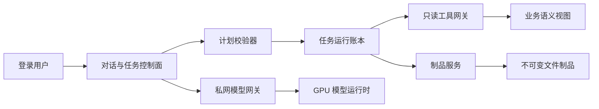

# 只读自治智能体领域模型与实施蓝图

> 对应 GitHub #217；首个交付分片为 #218。本文定义长期稳定的业务边界，具体框架和模型只是实现细节。

## 1. 先看主干

当前系统是“最多 8 轮的 ReAct 聊天”：模型选择一个工具、读取结果，再决定下一轮。它适合单次问答，但没有任务、步骤、恢复、人工中断和证据闭环。

目标不是把循环加长，而是把它拆成两个受控平面：



- **控制面**负责身份、权限、计划、状态、预算、证据和审计。
- **模型面**负责规划、归一化和解释，不持有数据库凭据，不直接写文件或业务表。
- **数据面**只通过窄化的只读能力开放；业务写能力不进入 Agent 能力集合。
- **制品面**是唯一允许生成文件的位置，只创建新对象，不覆盖输入。

## 2. 概念依赖表

| 概念 | 解决什么问题 | 依赖的上游概念 | 被什么下游调用 |
|---|---|---|---|
| Capability | 把“工具能做什么、影响什么、谁能用、数据去哪”从提示词变成服务端契约 | 登录身份、RBAC、业务服务、出境策略 | Plan Validator、Tool Gateway、审计 |
| Agent Task | 让一次复杂目标拥有稳定身份和生命周期 | 用户目标、Capability | Task Plan、运行账本、前端任务页 |
| Task Plan | 把模型建议变成可验证的有界计划；首版串行，业务图仅允许静态注册 | Agent Task、Capability、预算 | Scheduler、LangGraph adapter |
| Agent Step | 让每次能力调用可重试、可恢复、可追责 | Task Plan、依赖步骤 | Tool Gateway、Evidence Package |
| Evidence Package | 让业务建议能回放，不靠模型“说得像” | 只读事实、规则版本、步骤输出 | 补库评审、人工审核、解释生成 |
| Change Proposal | 把灵活表格处理限制为可审阅的 Patch/Diff | Human Template、输入 Artifact | Validator、Artifact Service |
| Artifact | 让文件生成、下载和会话恢复稳定 | owner、来源、Store、校验器 | 下载 API、聊天卡片、后续任务 |
| Human Interrupt | 把人工判断放进可恢复流程，而非绕过流程 | Task/Step、Evidence Package | 补库审批交接、模板确认 |

## 3. 聚合与状态机

### 3.1 Agent Task 聚合

```text
task
  id, owner_sub, intent, plan_version, status
  budgets, model_snapshot, created_at, finished_at
  steps[]
    id, capability, dependencies[], status, attempt
    input_refs[], output_refs[], evidence_refs[]
```

任务状态：

```text
pending -> planning -> validated -> running
running -> paused_recoverable -> running
running -> waiting_human -> running
pending | planning | validated | running | paused_recoverable | waiting_human
  -> cancelling -> cancelled
running -> succeeded
pending | planning | validated | running | paused_recoverable | waiting_human | cancelling
  -> failed  (only after sealing real error evidence)
```

只有 `running` 可以进入 `succeeded`。任一非终态可在封存真实错误 code/cause/phase、权限/策略快照和
可得 Evidence 后进入 `failed`；`cancelling` 的取消执行本身发生可证明错误时也允许 failed。
转换 Task 终态的同一受控事务必须先结算所有 Step：

| Task 终态 | Step 原状态/真实结果 | Step 终态 | 稳定 reason |
|---|---|---|---|
| `failed` | handler 已成功并封存输出 | 保持/`completed` | `handler_completed_before_task_failed` |
| `failed` | handler 可证明真实失败 | `failed` | 原始稳定 handler error code |
| `failed` | `planned/retry_wait` 或可证明未 dispatch | `skipped` | `task_failed_before_execution` |
| `cancelled` | handler 已成功并封存输出 | 保持/`completed` | `handler_completed_before_task_cancelled` |
| `cancelled` | handler 可证明真实失败 | `failed` | 原始稳定 handler error code |
| `cancelled` | `planned/retry_wait` 或确认未执行 | `cancelled` | `task_cancelled_before_execution` |

in-flight Step 必须按真实结果结算；若执行结果/副作用仍未知，Task 不得进入终态，应保持
`cancelling` 或进入 `paused_recoverable` 等待 reconcile。终态 Task 下不得留有
`planned/running/retry_wait` Step，也不得把未执行伪造成失败/完成，或把已完成伪造成取消。
不允许从终态恢复；终态后重跑必须创建带 `parent_task_id` 的新 Task，并保留旧 Task/Step/Evidence。
LangGraph checkpoint 是运行实现，不是业务事实源；平台自己的 task/step 账本才是审计真相。

### 3.2 Artifact 聚合

```text
prepared -> validating -> ready
prepared | validating -> failed
ready -> expired
```

只有 `ready` 可下载。`failed/expired` 都是终态；对象清理失败保留 tombstone 并由 reconciler 重试，不能删掉账本后留下不可追踪对象。文件先写到同文件系统临时位置，完成二次打开、格式、大小和 SHA-256 校验后原子 rename；元数据发布失败时不能留下可猜测的正式对象。

生成制品还必须保存由服务端计算的 `access_scope`，而不是只保存 owner。owner 必须是非空、稳定、已认证的 token subject；匿名或共享回退身份不能创建 v2 制品。scope 至少显式包含 `required_positive_permissions`、允许资源集合、可见字段组，以及正式 `row_subject + predicate_version + condition`，不用一个不可解释的权限 hash 代替。行级范围的创建主体、当前主体和 Task owner 必须一致；谓词版本未知、不可比较或发生语义漂移时 fail closed。当前正向权限必须覆盖 required，资源/字段可见范围必须覆盖制品实际内容，当前行级谓词必须仍覆盖 stored `condition`；当前范围变窄到无法覆盖原内容时拒绝，例如创建时全量、后来变成 `own_customers_only=true`。后来扩权不改写 stored scope。每次下载/预览实时重算。

多输入派生件不能把来源权限压成一个看似“更窄”的谓词。每个实际内容来源必须保存独立
`source_access_snapshot`：source Artifact/hash、owner、required positive keys、实际 contained resources/
fields、sensitivity、row subject、predicate version、row condition reference 和 classification。所有来源与
Task 必须同 owner；输出 scope 的静态内容摘要按下面规则计算：

```text
required_positive_keys      = union(all source + workflow requirements)
contained_resource_set      = union(resources actually present in output)
contained_visible_field_set = union(fields actually present in output)
sensitivity                 = max(all contributing content)
authorization_condition     = every contributing source snapshot must pass
```

resource/field union 描述“文件里实际装了什么”，不是拿各来源 allowlist 做 intersection 后隐藏内容。
每次预览/下载首选逐 source snapshot 重新授权；若实现用聚合证明优化，必须由版本化服务端算法同时证明
当前 scope 覆盖内容并集，且每个来源的正向权限、owner、row subject、predicate condition 都仍满足。
不同 predicate version/domain 不可比较、语义未知或 composition 未注册时标记 `unclassified` 并 fail closed，
不得用 `intersection`、字符串拼接或“narrowest”标签伪装已安全合并。

模板必须在进入模型/Change Plan 之前由本地确定性 classifier 完整扫描。`identity_only` 只允许
allowlisted Sheet/表头结构、列顺序和安全样式；不得含示例值、规则文本、semantic examples、批注、
隐藏业务文本或其派生内容。任一此类内容存在，或被送入模型、Change Plan、dry-run、Evidence、输出时，
模板立即是 `business_content`，按普通来源参与 union 和逐来源重授权。

`identity_only` 对输出访问条件贡献 TOP、对 contained set union 贡献空集，但仍保存 template hash、
owner、classification/proof version，且 Task 执行时必须有权读取模板。输出后的 containment scan 只是
防止分类漂移的二次门禁，永远不能把预先为 `business_content/unclassified` 的模板升级或“洗白”为
`identity_only`。Artifact Set 的聚合 scope 与任何成员都不得漏掉实际内容来源。

legacy 必须先分类再授权：

| legacy 类别 | 身份/元数据要求 | 普通下载/预览 |
|---|---|---|
| owner-owned upload | 12 hex、sidecar 完整、`kind=upload`、实名 owner 匹配 | owner 实时校验后允许 |
| generated | 即使 sidecar 有 owner，也缺少可证明的创建时业务 scope | 默认拒绝 |
| unclassified / sidecar 缺失或损坏 | 无法证明来源、owner 或 kind | 默认拒绝 |
| v2 | UUID、DB metadata、Store 对象、完整 scope | owner + 实时逐来源条件全部通过后允许 |

跨 owner 统一 404；同 owner 但撤权、scope 收窄或 legacy 分类不安全时使用稳定拒绝且写最小审计。未来管理员取证只能走独立 break-glass，不得复用普通端点。

兼容是单向的：新代码可以读取旧 12 位 ID/旁车，新制品只写 UUID + v2 元数据/Store，不能为了“旧代码回滚后还能下载”再写一个绕过 scope guard 的旧旁车。滚动发布时隔离新旧 Agent 文件路由；若必须回滚，先关闭 v2 创建/下载，保留对象字节与数据库，修复后 forward deploy 恢复。安全回滚允许制品暂时不可用，不允许撤权失效。

单个 Artifact 与 Artifact Set 的重试安全由 #230 的服务端 operation 账本提供：`UNIQUE(owner_sub, operation_id)`，同 key 同 RFC 8785 规范化请求 fingerprint 返回原输出，同 key 不同请求在 writer 前返回 409。输出 UUID/成员清单在写对象前固化；crash/retry/reconcile 必须复用这些身份。#230 验收前 Durable Task 固定 `artifact_create=false`。

## 4. 只读能力策略

允许的效果类型只有以下三类；一个复合能力可以声明多个 effect：

| Effect | 含义 | 示例 |
|---|---|---|
| `business_read` | 读取经过当前用户 RBAC 过滤的业务事实 | 库存、采购趋势、维保成本证据 |
| `file_read` | 读取当前用户拥有的不可变输入 | 表结构检查、分页读取 |
| `artifact_create` | 提交提案并由确定性服务生成新文件 | Excel 派生件、证据报告 |

`business_write`、Shell、任意 URL fetch、动态代码执行不进入注册表。例如基于原模板生成新工作簿同时具有 `file_read + artifact_create`，不能用单一标签隐藏其中一个效果。即使模型伪造工具名或参数，dispatch 也必须重新做身份、效果和资源检查。

效果与数据出境是两个正交维度。每个 Capability 不声明一个会掩盖复合链路的单值 `egress`，而是声明零到多条 `egress_edges[]`。每条边固定 `source_zone`、`destination_provider/profile`、`purpose`、允许 sensitivity、字段/媒体 projection、最大字节、保留策略和 policy version。空数组才表示本能力不产生网络出境；未知边默认拒绝。

| Egress edge 示例 | 含义 | 默认策略 |
|---|---|---|
| `tool_result -> primary_model` | 结构化工具结果进入当前主模型上下文 | 校验该结果 sensitivity 与目标 Provider trust zone |
| `artifact_projection -> vision_provider` | 有界图片/扫描页发送给独立视觉服务 | 默认拒绝，需显式字段/页/字节授权 |
| `vision_output -> primary_model` | OCR/视觉结果再次进入主模型 | 是另一条独立边，不能继承上一跳授权 |

主 LLM 本身也是全局出境边界，不是只管 `tool schema/result` 的附属检查。Provider 必须显式标记为
`private`、`approved_external` 或 `unknown`；`unknown/disabled/unlisted` 必须在 API 预检阶段拒绝，
system、当前 user message、history、tool result 和文件投影均不得调用该 Provider。预检通过不是
持久授权；每次 provider call 立即从权威策略源重读 provider status、exact allowlist/model-context、
sensitivity、`model_context_egress_opt_in`、`external_file_egress_opt_in` 和 policy version。
任一必需条件漂移、撤权或不可判定时 fail closed，
当次及后续 provider call 字节数必须为 0。

`model_context_egress_opt_in` 和 `external_file_egress_opt_in` 是两个独立、按用户封存的
可撤销同意，不能合并成一个布尔值。`approved_external` 的任意主模型上下文外发先要求
前者；payload 只要包含 `customer_file` 再叠加要求后者。两个开关分别撤销时，对应测试都必须
证明第二次及后续 provider call 为 0。全局/provider kill switch 只能收紧或禁用出境，永远不能
充当用户同意。

v1 没有可信的逐消息 content provenance，history 也可能含上轮客户文件摘录，因此**所有当前
user/history prompt payload 一律按 `customer_file` 处理**。当前代码 v1 还没有可验证的 per-user consent
真相源，因此 `approved_external + customer_file` 组合必须全部拒绝，不得从环境变量、全局开关、
旧会话字段或管理员默认值推导同意。`private` Provider 不需这两个 egress opt-in，可在身份、
exact model/purpose、sensitivity 和其余策略均通过时使用。legacy/unknown history 不得降级为普通对话。
只有未来逐消息 provenance 能由服务端可验证地封存并经过独立迁移后，才可按消息细分。

`read_document` 不能因为名字是“读文件”就被视为纯本地操作。首期直接拆边界：txt/docx/xlsx/文字 PDF 走本地抽取；图片或扫描 PDF 只返回 `requires_vision`，不会隐式外发。模型需要显式调用独立的视觉能力；像素到 Vision 与 Vision 输出到主模型必须分别命中 `egress_edges[]`，即使两者使用同一供应商也不能把一次授权传递到下一跳。

Capability 审计同样遵循最小化：只记录 actor、capability、由 schema 推导的参数键/集合长度、
已经权限校验的 Artifact ID 与状态。SSE、持久化 ChatMessage 和 trace 也只能使用这一最小元数据
投影；不得返回或保存 raw args/results/values、单元格、整行报价、SQL、文件正文、URL 或凭据。
正常、策略拒绝和 handler 异常走同一投影器，不得在 exception/debug 路径回退到原始对象。MVP 不记录
参数值 hash；跨事件只关联服务端随机 ID 或下面统一 Envelope 的 fingerprint，不能对低熵
PN/客户名做可枚举 SHA-256/HMAC correlation token。

Provider 出境与遥测必须覆盖以下威胁闭环：

| 威胁 | 失效后果 | 必需控制 |
|---|---|---|
| 只门禁 tool result，主模型先发 prompt | system/user/history 在工具前已出境 | API 预检 + 每次 provider call 复检，未授权时零网络调用 |
| 把 legacy history 当普通文本 | 上轮文件摘录被发往外部模型 | v1 全量 user/history=`customer_file`，当前代码对 approved external 全拒绝 |
| 把 global kill switch 当用户 consent | 管理员开启外部模型即代替用户同意 | 独立 per-user model-context/file opt-in，两者每 call 复检 |
| 任务运行中策略漂移/撤权 | 旧快照继续外发 | 调用时读权威策略，不一致当次零字节外发 |
| 错误/SSE/trace 序列化原始调用对象 | 拒绝路径也泄漏业务内容 | 共享 schema-derived 元数据投影器，raw keys 外的值不落盘不出 SSE |

这里“AI 只读”的准确含义是：**业务事实和源文件只读；Agent 控制面可以写自己的运行记录、审计和不可变派生制品。**

### 4.1 统一完整性 Envelope

Checkpoint、Evidence、source snapshot、Artifact operation request 等需要防篡改的 JSON 一律使用同一 `integrity-envelope/v1`，不再各自拼接 HMAC 字符串：

```text
header: schema_version, purpose, payload_schema_version,
        canonicalization=RFC8785, algorithm=HMAC-SHA-256,
        key_id, payload_sha256
payload: domain object without envelope
mac: base64url HMAC over domain-separator + RFC8785(header) + RFC8785(payload)
```

验证必须检查 allowlisted `purpose`、payload schema、key 状态、SHA-256、constant-time MAC 和大小预算；`key_id` 支持先加后删的轮换，旧 key 可保留 verify-only，撤销 key 对未完成 Task fail closed。Envelope 只提供完整性与来源认证，不提供加密或权限；敏感 payload 仍需最小化、ACL 和必要时的静态加密。日志只记录 purpose/key_id/fingerprint/状态，不能记录 payload 或对低熵业务值单独做可枚举 hash。第三方 Skill bundle 的跨环境发布使用第 9 节定义的非对称 detached signature，不用共享 HMAC 冒充供应链签名。

## 5. Text2SQL 边界

Text2SQL 不是给模型一个 SQLAlchemy Session，而是一个独立 Query Broker：

```text
自然语言 -> Typed Query IR -> 权限化 Semantic Registry
         -> 服务端确定性参数化编译 -> SQLGlot AST 二次门禁
         -> 独立只读连接 -> 语义视图/FORCE RLS -> 脱敏与截断 -> Evidence
```

四层防线缺一不可：

1. 只向模型公开当前角色能见的 Dataset/字段/指标/操作符 Registry；模型和用户都只能提交 Typed Query IR，任何 SQL 文本都不是输入协议。
2. 服务端编译器只从 Registry 模板生成单条、单 dataset、参数化 `SELECT`；首版禁止 JOIN、子查询、CTE、`UNION/INTERSECT/EXCEPT`、任意表达式和函数。SQLGlot 只复核编译产物，不解析或修复模型/用户 SQL。
3. PostgreSQL 把 guard owner、security-barrier view owner 与 `agent_reader` 三角色分离；guard 启用并 `FORCE ROW LEVEL SECURITY`，reader 固定 `search_path`、只读事务和 statement/lock/transaction timeout，且不能读取 guard/基础表、TEMP 或 SET ROLE。
4. Broker 强制行数、字节、估算成本和并发预算，并在返回模型前再次应用字段/低样本推断保护。

SQLGlot 只是确定性编译器之后的解析与门禁层，数据库权限才是最终安全边界；“SQLGlot 能拒绝”不能成为接收原始 SQL 的理由。

## 6. 表格规划模型

旧接口让模型发送数千个单元格坐标，既僵硬又难审计。新流程使用高层操作：

```text
inspect -> infer schema -> propose mapping -> validate
        -> dry-run diff -> apply to copy -> reopen verify -> publish artifact
```

操作原语包括：选择工作表、定位表头、按正式业务键 join、新增列、填充列、规范化文本、保留样式和生成报告。模型只提交 Change Proposal；确定性执行器负责类型检查、公式注入中和、边界和样式策略。

## 7. 两个业务图

### 7.1 维保补库申请评审

```text
申请校验
 -> PN 解析为正式 part_id
 -> 当前库存/在途/active 互通池
 -> 近 6 个月采购/销售/维保消耗
 -> 版本化硬规则
 -> Evidence Package
 -> LLM 解释
 -> Human Interrupt
 -> 人工在原业务流程决策
```

硬规则先于模型：

- 无法解析为系统正式 PN：`need_info`。
- 近 6 个月采购次数为 0 且销售次数为 0：`recommend_reject`。active 互通池或维保消耗证据不能覆盖这条甲方硬规则。
- 低频、小众 PN 必须带明确项目、设备、故障或合同证据，否则 `need_info`。
- 在通过“半年内有采购或销售”硬门槛后，高频、active 通用池或稳定消耗才作为正向证据；仍需结合库存、在途和安全库存，不能自动批准。

“高频”的阈值必须由甲方确认并版本化；在确认前只能输出候选分布和模拟结果，不能让 LLM 临时定义。

### 7.2 人工模板驱动清洗

```text
原始 Artifact + Human Template
 -> 结构识别
 -> 字段映射提案
 -> 模板规则校验
 -> Patch/Diff
 -> 人工确认
 -> 新 Artifact
```

上传内容、批注和隐藏单元格全部视为不可信数据。模板只能由有权人员发布版本；表内“忽略系统规则”等文本不能改变能力、权限或工作流。

## 8. GPU 模型平面

目标拓扑是生产端掌握控制和数据，GPU 节点只提供私网推理：

```text
生产 API -> Tailnet 单端口 Agent Gateway -> localhost vLLM
```

- GPU 节点无生产数据库凭据、无生产文件挂载、无业务写 API。
- 模型服务不公开监听；禁止 Funnel；生产到 GPU 单向发起连接。
- 请求使用短期、限定 audience/scope/task 的服务令牌并防重放。
- 锁定容器 digest 和模型 revision，禁用 `trust_remote_code`，设置并发、上下文和输出上限。
- GPU 或 Tailnet 故障必须熔断，不能拖垮主业务 API。

## 9. 开源组件准入

候选基线：LangGraph、SQLGlot、vLLM、Polars/python-calamine、openpyxl/XlsxWriter。组件只解决局部问题，不能取代项目自身的权限和审计。

第三方 Skill 按代码供应链处理：固定 commit/hash、核许可证、递归检查脚本/引用/资产、拒绝路径逃逸/软链接/隐藏 Unicode/动态下载/密钥读取/任意网络，在无密钥无网络的非 root 沙箱中运行恶意输入评测。运行时禁止从在线市场热安装。

## 10. 实施依赖

1. #219：Capability Policy。
2. #220：Artifact Store；#230：Artifact/Set 幂等 operation；#221：结构化交付；#222：依赖 #220 的上传/解析隔离边界。
3. #223 Durable Task/Step ledger 与计划校验器；#230 未完成前保持 `artifact_create=false`。
4. Query Broker 与 Text2SQL。
5. GPU 私网推理网关。
6. 维保补库评审图、#231 真实申请只读绑定/队列与人工模板清洗图。
7. 浏览器 E2E、提示注入、权限、故障恢复、大文件和并发压测。

每个分片独立 PR、独立审核、独立发布门禁；“可合并”不等于“可生产”。
