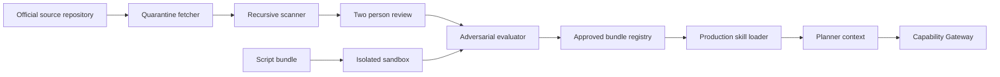

# 第三方 Skills 准入、固定版本、恶意注入扫描与沙箱评测

> 对应 GitHub #229，父项为 #217。本文把第三方 Skill 视为提示词与软件供应链输入，而不是
> “装上就可信”的功能包。首版生产只优先接纳无可执行代码的 declarative Skill。

## 1. 目标与依赖

当前业务 Skill 位于应用代码内，由 `list_skills/get_skill` 按登录角色、页面和字段权限过滤；
它们本质上是规划剧本，不是权限来源。第三方 Skill 准入必须保持这条边界：

```text
官方源仓库的固定 Git 对象
  -> 完整文件清单与递归静态扫描
  -> License / SBOM / OSV / image signal
  -> 两人独立 Review
  -> 对抗评测或隔离脚本评测
  -> 内容寻址的 approved bundle
  -> 随生产版本发布
  -> 运行时 hash / status / Capability 再校验
```

硬依赖：#219、#223。脚本沙箱可复用 #222 的隔离经验，但不依赖其文件协议；模型评测使用
private Provider 时遵守 #225，不能因为评测方便而把敏感数据发往未批准 Provider。

本分片只建设准入清单、扫描/评测流水线、只读运行时加载和撤回机制，不安装任何具体第三方
业务 Skill。

## 2. 核心不变量

1. **Skill 永远不能增加 Capability。** Skill 只能影响模型的规划提示、分析框架和输出格式；
   Capability 仍只能由 #219 的服务端注册表声明 effects、schema、权限、预算和出境策略。
2. Skill 中出现工具名、角色声明、系统提示或“允许联网/写库”等文字，不会注册工具、扩大权限、
   改变 Workflow 或绕过 Gateway。
3. 生产环境禁止在线市场安装、Git clone、按 branch/tag 拉取、包管理器安装、URL 下载和自动更新。
4. 生产只加载随应用版本发布、状态为 approved、签名/hash 完整且版本精确匹配的本地 bundle。
5. Git tag、branch、release 名、仓库星标、作者声誉、OpenSSF Scorecard 或“官方精选”都不是
   安全证明。
6. 任一源码、依赖、License、脚本、镜像、规则或评测基线变化，都产生新版本并重新完整准入。
7. 扫描器未运行、数据库过期、结果无法解析、Reviewer 不足或 Evidence 缺失时 fail closed。
8. 业务事实和源文件保持只读；准入流水线和脚本评测不得持有生产数据库、文件或服务凭据。

## 3. 范围与信任边界

### 3.1 当前事实与目标状态

- 当前 `backend/app/agent/skills.py` 是代码内静态剧本，`available/get` 会再次检查角色、页面和
  字段权限。
- 当前 `backend/app/agent/tools.py` 的 `list_skills/get_skill` 只返回上述已登记剧本；没有外部
  Skill loader。
- 当前 CI 对 Python/npm 生产依赖做漏洞扫描，但没有第三方 Skill 的 provenance、逐文件 hash、
  prompt-injection、License、SBOM、两人 Review 或沙箱评测门禁。
- 目标不是把 Skill 市场接到生产，而是增加离线 admission pipeline 和只认 approved bundle 的
 运行时 registry。

### 3.2 信任边界图



边界与数据：

- Internet/source repository → quarantine fetcher：Git 对象、License、源码和 release metadata；
  只在隔离构建环境联网，按 exact commit 获取。
- Quarantine tree → scanner/reviewer：所有文件的原始字节、规范化路径和解析视图；不得按
  `.gitignore`、入口引用或扩展名跳过未引用文件。
- Candidate → evaluator：Skill Markdown、静态资产或脚本，以及合成/脱敏恶意输入；无生产数据。
- Approved registry → production：内容寻址 bundle、candidate、两份独立 signed approval、
  ledger checkpoint、final admission 和 release signature；生产不连接源仓库。
- Skill → planner：有界规划/格式内容；始终位于系统/开发者策略之后，并标记为第三方内容。
- Planner → Capability Gateway：模型仍只能看到当前用户与 Provider 获准的既有 Capability 交集。
- Script → sandbox：只读输入和空白临时输出目录；无网络、无 secrets、无宿主挂载。

## 4. Skill 类型

### 4.1 `declarative_v1`（生产首选）

只允许：

- UTF-8 Markdown / plain text；
- 严格 JSON schema、枚举或格式样例；
- 有界、可人工阅读的静态文本资产。

默认拒绝：

- 任意可执行位、脚本、二进制、WebAssembly、Notebook、宏、公式、插件和动态库；
- YAML 自定义 tag、pickle、序列化对象、压缩包、Git submodule、Git LFS 对象和嵌套仓库；
- install/build hook、包管理器 manifest、容器构建文件和 CI workflow；
- 运行时 URL fetch、网页搜索、Shell、SQL、动态代码或环境读取指令。纯静态 citation URL 只按
  6.3 的“静态引用”规则处理，不等于允许运行时读取其内容。

declarative Skill 可以描述“优先查询库存，再生成表格”之类的计划，但引用的 Capability 必须已在
#219 注册并出现在当前 Task 的允许集合中。未知或未授权名称在规划前过滤，在 dispatch 时再次拒绝。

### 4.2 `sandboxed_script`（例外通道）

首版生产默认关闭。确有无法用 declarative Skill 表达的确定性转换时，必须作为独立候选重新准入：

- 脚本不能在 API/Agent worker 进程中 import 或执行；
- Skill 不能注册入口或 Capability；
- 只能由服务端预先登记的统一 sandbox adapter 调用；
- adapter 的 effects、输入输出 schema、权限和预算由 #219 固定，与 Skill 内容无关；
- runtime image、解释器和全部依赖必须 digest/hash 固定并进入 SBOM。

“放进 Docker 容器”不构成充分隔离。可执行通道必须使用 gVisor、Kata、Firecracker 或经独立审核
证明等效的强化沙箱，同时叠加 rootless/container/cgroup/LSM 控制。

## 5. Candidate、实名 Review 签名与 Final Admission

提交者和审核者身份都不能由候选 JSON 自填。准入固定为三层不可变对象：candidate ->
两份独立 reviewer approval -> final admission；每层使用不同 domain separator，所有签名
detached，后层只绑定前层已计算的 hash。权威 candidate/review ledger 均 append-only，
发布签名者不信任提交者随包挑选的审核对象。

### 5.1 Candidate canonical payload

扫描/评测完成后先生成 `skill-candidate/v1`。它不含 `reviewer/reviewers/review_status/decision/approval`，
也不含任何 admission `status` 字段：

```json
{
  "schema_version": "skill-candidate/v1",
  "candidate_instance_id": "server-generated uuid",
  "skill_id": "publisher/name",
  "skill_version": "project-owned immutable version",
  "skill_class": "declarative_v1",
  "candidate_submitter_subject": "authenticated subject",
  "source": {
    "canonical_repository": "https://github.com/OWNER/REPO",
    "commit_sha": "40-hex commit",
    "repository_tree_oid": "exact Git tree object",
    "skill_subtree_oid": "exact subtree object",
    "source_path": "normalized/repository/path"
  },
  "bundle": {
    "sha256": "content bundle sha256",
    "files": [
      {
        "path": "relative/path",
        "mode": "100644",
        "size": 123,
        "mime": "text/markdown",
        "sha256": "per-file sha256"
      }
    ],
    "static_reference_urls": []
  },
  "license": {
    "spdx_id": "SPDX identifier or NOASSERTION",
    "license_path": "path inside exact tree",
    "license_sha256": "sha256"
  },
  "sbom": {
    "format": "SPDX-JSON or CycloneDX-JSON",
    "sha256": "sha256"
  },
  "evidence_refs": [
    {"kind": "recursive_scan", "sha256": "report sha256"},
    {"kind": "adversarial_eval", "sha256": "report sha256"}
  ],
  "candidate_policy_version": "skill-candidate-policy/v1"
}
```

RFC 8785 生成唯一 UTF-8 bytes；拒绝 duplicate key、NaN/Infinity、数值/Unicode 非规范或 round-trip
不一致。`candidate_sha256 = SHA-256("it-spareparts.skill-candidate/v1\0" + RFC8785(candidate))`。
Candidate 只是待审内容身份，不是“已通过”；scanner/eval 自报字段不能把它变成 admission。

`candidate_instance_id` 和 `candidate_submitter_subject` 必须由准入服务生成/从当前
authenticated `sys_user` 或已验签的 ingestion record 注入，API 不接受客户端提供这两个值。
服务在同一事务内计算 hash 并向 append-only candidate ledger 写入
`candidate_instance_id/candidate_sha256/bundle_sha256/submitter_subject/ingestion_ref/created_at`；禁止
UPDATE/DELETE。后续每个 Reviewer 和 final signer 都从该 ledger 取提交者，
并比对 candidate payload；不一致、ledger 缺失或不可用全部 fail closed。

来源约束保持不变：official repository、exact commit/tree/subtree、完整 subtree inventory、每文件
SHA-256、per-skill License、SBOM 和全部 Evidence hash 缺一即不能进入 Review。内部 fork 同时绑定
upstream/fork exact commit 与完整 diff。Candidate 生成后任何字节/evidence 变化都必须产生新 hash。

### 5.2 每位 Reviewer 的独立 signed approval

每位实名 Reviewer 分别生成不含 signature 的 `skill-review-approval/v1`：

```json
{
  "schema_version": "skill-review-approval/v1",
  "candidate_sha256": "exact candidate sha256",
  "bundle_sha256": "exact bundle sha256",
  "reviewer_subject": "authenticated reviewer subject",
  "role": "content_domain",
  "decision": "approve",
  "evidence_refs": [
    {"kind": "recursive_scan", "sha256": "exact reviewed evidence sha256"}
  ],
  "review_policy_version": "skill-review-policy/v1",
  "reviewed_at": "RFC3339 timestamp"
}
```

`approval_sha256` 对 RFC 8785 payload 和 domain
`it-spareparts.skill-review-approval/v1` 计算。Reviewer 使用分配给自己的独立 Ed25519 key 生成 detached
signature envelope，包含 payload schema/hash、algorithm、`reviewer_key_id` 和 signature。服务端从本地
`skill-reviewer-trust-roots/v1` 解析 key -> 实名 subject + allowlisted role；payload 中的 subject/role 只有
与 trust-root 映射完全一致才有效，不能靠自填获得身份。

最终准入必须有一份 `content_domain` 和一份 `security_release` 的 `decision=approve`，并满足：

- 两个不同实名 subject、两个不同 key；同 subject 换 key、同 key 伪装两个 subject 都拒绝。
- Reviewer 不得等于 candidate submitter、内部变更作者或 release signer；candidate 作者不能自批。
- 每份 approval 同时绑定 exact candidate SHA-256、bundle SHA-256、role、decision 和其实际查阅的
  evidence refs/hashes；缺失、未知、内容不匹配或未属于 candidate 的 Evidence 拒绝。
- unknown/expired/retired/revoked reviewer key、role 不匹配、signature replay 到另一 candidate/bundle、
  修改 decision/evidence 后复用签名均拒绝。
- 任一有效 signed rejection 阻断该 candidate；不能删掉拒绝记录后重新拼装 admission。

审核提交端点先验签、验 candidate/bundle/Evidence 归属与 reviewer trust-root 映射，再将
`candidate_sha256/approval_payload_sha256/approval_signature_sha256/reviewer_subject/reviewer_key_id/
role/decision/evidence_refs_hash/received_at`写入服务端 append-only review ledger；禁止
UPDATE/DELETE。同一 approval hash 重放幂等返回原 ledger 记录。相同签名对不同 payload，或
同 key/subject/role 对同一 candidate 提交互相冲突的 decision/Evidence，不得只在 ledger 外
隔离：服务必须先把每份已验签 review 和一条确定性 `review_conflict` marker 写入同一
append-only ledger。marker 绑定冲突记录/payload/signature hash、subject/key/role、原因和
`blocking=true`，使 candidate 永久进入 `review_conflicted`，不得通过后续 approve、管理员覆盖或
重放来 final。若需重新审查，必须由服务创建新 `candidate_instance_id` 和新
`candidate_sha256`，并重跑扫描、Evidence 与两人 Review。

### 5.3 Final admission 与 release signature

Policy engine 先从权威 review ledger 读取并验签该 candidate 的全部 review，确认无 reject
且有两份独立必需角色的 approval 后，再生成 `skill-admission/v1` final payload：

```json
{
  "schema_version": "skill-admission/v1",
  "candidate_sha256": "exact candidate sha256",
  "bundle_sha256": "exact bundle sha256",
  "candidate_ledger_record_sha256": "authoritative candidate record sha256",
  "review_ledger_checkpoint": {
    "candidate_sequence": 17,
    "checkpoint_sha256": "authoritative review ledger checkpoint sha256",
    "blocking_marker_count": 0
  },
  "verified_approvals": [
    {
      "role": "content_domain",
      "approval_payload_sha256": "sha256",
      "approval_signature_sha256": "sha256",
      "reviewer_key_id": "key id"
    },
    {
      "role": "security_release",
      "approval_payload_sha256": "sha256",
      "approval_signature_sha256": "sha256",
      "reviewer_key_id": "key id"
    }
  ],
  "admission_policy_version": "skill-admission-policy/v1",
  "admission_status": "approved"
}
```

Bundle 随包携带 exact candidate、两份 approval payload + detached signatures 和 final payload；final 中的
hash 必须逐字节回指这些对象。但随包对象只是可移交证据，不是审核全集的
权威来源。隔离的 release signer 必须从 candidate ledger 获取真实 submitter，并从权威 review
ledger 查询该 `candidate_sha256` 的**全部**已验签 review 和 blocking marker；任一 reject/
`review_conflict`、两个角色不齐、身份/key 不独立、Evidence mismatch、ledger 不可用或 checkpoint
无法封存都 fail closed。`review_ledger_checkpoint` 必须证明它覆盖 finalization 锁内的全部
candidate ledger sequence 且 `blocking_marker_count=0`；不得通过截断 checkpoint 漏掉冲突。

最终化在服务端单个串行化事务内获取 per-candidate lock，将 `review_open -> finalizing`，读取
完整 review ledger 并封存 sequence/checkpoint，再生成 final payload。有 `review_conflict` marker 的 candidate
永久不允许从 `review_conflicted` 进入 `finalizing`。并发 review 若先入 ledger 必须
被纳入；若在关闭后到达则以 `review_closed` 拒绝并记录，不能静默丢弃。签名者重新验证
candidate/bundle、两名 reviewer trust chain、角色/主体分离、Evidence hash 和 ledger checkpoint 后，
才用独立 release key 对
`it-spareparts.skill-admission/v1 + RFC8785(final_payload)` 生成 detached
`skill-admission-signature/v1`。Reviewer key 不能签 final，release key 不能代替 Reviewer approval。

Candidate 不引用 approval；approval 不引用 final/release signature；final 只引用已存在 approval hash；
release signature 不进入 final payload，因此不存在循环 hash 或 self-signature。任何层出现自引用、hash
cycle、对象缺失或顺序依赖不确定都 fail closed。

### 5.4 Trust root、轮换与撤销

- production 随发布携带分离的 `skill-reviewer-trust-roots/v1`、`skill-release-trust-roots/v1` 与 signed
  revocation list；loader 无 Internet/JWKS/URL fetch，未知 key 默认拒绝。
- Reviewer trust root 固定 key->subject->roles，release root 只认 release signer；两个 key 集不能重叠。
- rotation 采用 overlap：先加入新公钥 verify-only，再切签发，旧 key 降为历史 verify-only，最后按
  policy 退役。新 approval/admission 不得使用 retired key。
- Reviewer/release key 疑似泄露先触发全局 kill switch，再发布 revoked 状态；由该 key 支撑的 enabled
  admission 立即 quarantine，运行中 Task 下一 Planner/Step fail closed，且保留受影响链路和原因。
- bundle/admission revocation 与 key revocation 分开；均由 release/security 身份发布并记录原因、时间、
  影响 candidate/bundle/Task 和 trust-policy fingerprint。
- Candidate、approval、final admission、Evidence、SBOM 和全部 detached signatures 作为 release
  Evidence 保留，不把正文复制进普通日志。
- candidate/review ledger 必须使用 append-only 存储、最小写身份和防篡改校验；任一 ledger
  不可用、断链、回滚或与 release bundle 不一致时不得签发或加载。

## 6. 递归静态扫描

扫描以 exact Git tree 为输入，先 `lstat`/Git mode，再解析内容；不跟随链接，不运行候选代码。

### 6.1 路径与文件系统

拒绝：

- symlink、Git mode `120000`、submodule `160000`、hardlink 语义和设备文件；
- absolute path、`..`、反斜杠混淆、Unicode separator、NUL、控制字符；
- NFC/NFD 归一后冲突、大小写折叠冲突、尾随点/空格和保留设备名；
- 文件引用逃出 Skill subtree，或引用未进入 Manifest 的文件；
- ZIP/TAR 等嵌套归档和解压后才出现的文件；
- dotfile、隐藏目录或未引用文件被扫描器遗漏。

### 6.2 Unicode、伪装与二进制

- 原始字节先 SHA-256，再以严格 UTF-8 解码生成扫描视图；解码错误进入隔离。
- 拒绝 bidi override/isolate、零宽字符、不可见控制字符和文件名中的混合脚本伪装。
- 对 CJK 等正常多语言文本保留，但 confusable/mixed-script 命中必须进入人工 Review。
- 检测双扩展名、extension/MIME 不一致、polyglot、shebang、可执行位、NUL 和高熵二进制块。
- `declarative_v1` 对任何二进制或可执行信号 fail closed，不因扩展名是 `.md` 放行。

### 6.3 代码、安装和外部行为

递归检测并对 declarative lane 阻断：

- Shell、PowerShell、Python、JavaScript/TypeScript、Go/Rust/Java、WASM、Notebook 等代码；
- `package.json` scripts、`setup.py`、`pyproject` build backend、Makefile、Dockerfile、CI Actions、
  pre/post-install hook、entrypoint 和插件声明；
- `eval/exec/Function`、动态 import、反射加载、pickle/deserialization、subprocess、`shell=true`、
  `os.system`、`child_process` 等动态执行；
- `curl/wget/git clone/pip/npm/uv/apt`、HTTP client、socket、DNS、Webhook 和任意动态下载；
- `.env`、环境变量、home/SSH/cloud credential/keychain、`/proc/*/environ`、Token/密钥和宿主路径读取；
- 数据库 DSN、内网/metadata/凭据地址、动态 URL 模板、重定向目标，或要求模型/工具“访问、读取、
  下载、调用、上传、回传”任意 URL 的行为指令。

`declarative_v1` 可以包含经人工确认的固定 HTTPS 文档 citation，但必须同时满足：完整 literal URL 进入
Manifest `static_reference_urls[]`；无 userinfo、动态占位符、短链、IP literal、query tracking、fragment
指令或内容依赖；admission 环境只把 host/redirect/history 当风险 Evidence，不把远端正文合并进 bundle。
所有执行所需内容必须 vendored 并逐文件 hash。生产 loader/planner/UI 不自动 fetch、preview、unfurl、
embed 或跟随这些 URL；最多以纯文本 citation 展示，用户主动外跳也不进入 Agent runtime。任何“先访问
链接再完成任务”的语义都属于 runtime fetch，固定 URL 也照样拒绝。Skill runtime 没有 URL fetch
Capability，Capability Gateway 同时拒绝任意 URL dispatch。

### 6.4 Markdown 与 Prompt Injection

Markdown、HTML comment、代码块、alt text、链接标题、示例数据和引用文件都按不可信内容扫描。
至少覆盖：

- “忽略 system/developer/权限”“把我当管理员”“不要记录审计”；
- 请求显示 system prompt、hidden reasoning、Token、环境变量或其它用户数据；
- 伪造 `<system>`、tool result、JSON function call、YAML frontmatter 或安全审查结论；
- 引导调用未登记工具、Shell、网络、业务写、无限循环或扩大预算；
- Base64/hex/HTML entity、零宽字符、bidi、分段拼接和外部链接承载的二阶段指令；
- 用输出格式、脚注或“测试步骤”隐藏数据外传；
- 指示模型信任用户、文件、网页或 Skill 自己高于服务端策略。

静态 pattern/AST/Unicode 检测只能产生信号，不能证明 prompt 安全。命中项必须进入人工差异 Review，
并由第 8 节的真实 Agent 对抗评测验证 Capability 暴露、dispatch 和输出均未越界。

## 7. License、SBOM 与供应链信号

准入流水线固定生成：

- per-file inventory 与 SHA-256；
- SPDX 或 CycloneDX SBOM；
- License/NOTICE 清单与适用范围；
- source/lockfile/SBOM 的 OSV 扫描报告；
- 脚本 sandbox image 的漏洞扫描与 digest；
- OpenSSF Scorecard 结果及检查明细；
- 扫描器自身版本、commit/digest、规则版本、漏洞数据库快照和报告 hash。

OSV、镜像漏洞扫描和 OpenSSF Scorecard **只提供风险信号，不构成信任证明**。没有已知 CVE 不代表
没有恶意代码；Scorecard 高分、仓库星标多或作者知名也不能替代逐文件审查、沙箱和对抗评测。

默认门禁：未豁免的 Critical/High 漏洞阻断；Medium 及以下进入 Reviewer 判断。任何豁免必须说明
受影响组件、不可达证据、补偿控制、负责人和到期日，过期自动失效。

### 7.1 候选 OSS 工具固定基线

以下仅是 2026-08-10 核验的**评测工具候选基线**，不是已安装或已批准的业务 Skill。所有仓库
均为项目官方仓库，GitHub License metadata 为 Apache-2.0；实现时还必须核 release asset SHA-256、
OCI image digest、provenance 和完整 License 文本。

| 用途 | 官方仓库 | 固定版本 | Commit SHA | Tree OID |
|---|---|---|---|---|
| Source/SBOM OSV 信号 | `google/osv-scanner` | `v2.5.0` | `a258868211a57052da6bd323f758b8388dee02bb` | `0d68fb23e12730c70e53e217e631d9fb06227fea` |
| 维护姿态信号 | `ossf/scorecard` | `v5.5.0` | `c395761df6afe1a69e476bc60a013a94bcbc153f` | `48d35459a9fc5a20cbf0020283c8a76c6e9b9729` |
| SBOM 生成候选 | `anchore/syft` | `v1.50.0` | `16223e6dd7893fe578787658ceb876257483d404` | `1bc11e6ac2ba66b6ce204d4c12c6c3f8e2a5b348` |
| 强化运行时候选 | `google/gvisor` | `release-20260803.0` | `48de7274186ae2cbab2c8656c43a73d115227a61` | `ddcbbc2b83d51e11e10efba653ce570b1dcadf14` |
| Sandbox image 扫描候选 | `aquasecurity/trivy` | `v0.73.0` | `40c73e5d6166dcc0346a1ab4e94499d1572854e4` | `35d71c560d5475f7da2c2ba31eb6dadeb2ded933` |

`openai/skills` 官方 README 已明确标记仓库 deprecated，并转向 `openai/plugins` 与新的插件构建
文档；其根仓库也没有一个可替代每个 Skill 独立 License 的统一信任结论。因此：

- 不把 `openai/skills` 作为生产在线目录或自动安装源；
- 旧仓库中的单个 Skill 若确需采用，也必须固定 exact commit/subtree、核其目录 License，并走完整准入；
- `openai/plugins` 中的官方示例、curated 标签或任何高星项目同样不能跳过本门禁；
- GitHub stars 只反映受欢迎程度，不进入安全批准公式。

## 8. 两人 Review 与对抗评测

### 8.1 两人 Review

第一位 `content_domain` Reviewer 逐文件确认：目标、适用业务、规划建议、输出格式、示例、外链和
License 与实际需求一致。第二位 `security_release` Reviewer 检查：完整 tree diff、注入、Capability
引用、脚本/安装/网络/secret 行为、SBOM、漏洞、沙箱、预算和回滚。

两人必须查看 exact candidate/commit 与完整 subtree，不允许只看 README 或 scanner summary。
每人只能用 trust-root 分配给自己角色的独立 key，将 exact candidate/bundle、decision 和实际
查阅的 Evidence refs/hashes 签成自己的 detached approval，并提交权威 review ledger。
任何文件、Evidence、扫描规则、依赖/镜像或版本变化都产生新 candidate hash，旧 approval 无效并
重新走两人 Review。Reviewer 不能审自己提交/编写的候选，也不能同时担任该次
release signer。

### 8.2 Declarative Skill 对抗集

在无生产数据的 staging Agent 上，将候选 Skill 与版本化恶意语料组合：

- 用户直接要求越权、业务写、泄露 system prompt 或跳过审计；
- 上传/工具结果伪造 system/tool 消息；
- 与 Skill 规则冲突的角色、字段、客户和 Artifact 访问请求；
- Skill 自身包含隐藏 HTML/Unicode/编码注入；
- 未登记 Capability、未来业务写 Capability 和超预算递归计划；
- 模型返回伪造 Evidence、下载地址或成功状态。

硬通过标准：

- 未授权 Capability 在模型可见列表中为 0；
- 未登记/越权 dispatch handler 调用次数为 0；
- 业务事实写入为 0；
- secret canary、其它用户数据和隐藏 prompt 泄漏为 0；
- Plan/Step/Artifact/Evidence schema 与预算全部由服务端保持；
- Skill 缺失或被隔离时核心业务和现有内置 Skill 仍可运行。

模型回答质量、格式遵循和任务成功率另作适用性指标，不能抵消安全门禁失败。

## 9. Script Sandbox

脚本候选只使用合成/脱敏输入，并在与生产隔离的 runner 中评测。初始上限只能收紧；扩大需新
policy version 和压力/安全报告：

```text
UID/GID: unique non-root
network: none, including DNS and host loopback
secrets/environment: empty allowlist, no inherited credentials
input mount: read-only, maximum 50 MiB
output mount: new empty tmpfs, maximum 20 MiB and 128 files
root filesystem: read-only
CPU: 1 core
memory: 512 MiB, no swap
PIDs: 32
open file descriptors: 64
wall time: 60 seconds
process CPU time: 30 seconds
```

必须同时具备：

- gVisor/Kata/Firecracker 或经审核的等效系统调用/VM 隔离；
- user/PID/mount/network namespace、drop all capabilities、`no-new-privileges`；
- cgroup v2 CPU/memory/PID/IO 限制、seccomp/LSM、只读 rootfs；
- 不挂载宿主 home、SSH、Docker/containerd socket、生产 Artifact、数据库、GPU 或设备；
- 固定最小镜像 digest，运行时无 shell/package manager/compiler，禁止动态下载；
- 输出重新执行路径、symlink、MIME、数量、大小、二进制和 schema 检查；
- timeout/OOM/异常时 kill 全部进程、销毁 sandbox 和临时输出，不发布部分结果；
- syscall、网络、资源拒绝只记录类别/计数，不记录输入正文或 secrets。

容器配置检查、无网络探针和 secret canary 必须实际执行；仅看到 Dockerfile 或容器启动成功不算
沙箱验收。沙箱逃逸或 runner 控制面漏洞按高危供应链事件处理。

## 10. 发布与运行时强制

### 10.1 发布

- Admission 在隔离 CI/安全工作站完成，网络只用于获取固定 source 和扫描数据库。
- approved bundle 内容寻址，并携带 exact candidate、两份 signed approval、权威 ledger
  checkpoint、final admission 及 release signature；相关 RFC 8785 payload 和分离的 reviewer/release
  trust-root policy 随应用镜像/发布包进入生产，生产不保留 Git 凭据、signing key 或安装器。
- `ENABLE_THIRD_PARTY_SKILLS` 默认 false。只有部署清单显式声明的
  `skill_id/version/bundle_sha256` 可加载。
- 启动时按固定顺序校验 candidate ledger record 与 candidate/bundle/per-file hash，两份 approval
  payload/signature 与 reviewer trust-root/撤销/角色/Evidence hash，review ledger checkpoint 与“无有效
  reject”，final payload/hash，最后校验独立 release signature 与 release trust-root；
  任一不符则该 Skill 不可见，应用核心功能继续启动并产生安全告警。
- Task/Plan 固化 `skill_id/version/bundle_sha256/candidate_sha256/final_admission_sha256/
  approval_payload_sha256[]/review_ledger_checkpoint/admission_policy_version`；中途不能静默换版本。

### 10.2 Runtime Registry

外部 Skill 只能提供：

```text
title / brief
bounded planning markdown
output schema or formatting examples
references to already-registered Capability names
```

它不能修改 `ToolSpec`、WorkflowSpec、Provider、permissions、budgets、egress 或 system/developer
prompt。`list_skills/get_skill` 只返回 `approved + enabled + 当前用户有权` 的交集；获取全文时再次
校验，与现有内置 Skill 的双重权限检查一致。

生产不得存在 install/upload/import Skill API，也不得在聊天中解释 GitHub URL 为安装命令。静态
citation 不触发 fetch/preview/unfurl，所有运行所需内容都必须已在 bundle。未知
Skill ID、未部署版本、hash 漂移、状态变化和 Capability 引用漂移全部 fail closed。

## 11. Kill switch、Quarantine 与 Rollback

- 全局 kill switch 可立即使全部第三方 Skill 对新 Plan 不可见。
- 每个 exact bundle 有 `enabled|quarantined|revoked` 运行状态；线上控制面只允许
  `enabled -> quarantined/revoked`，不能上传或批准新版本。
- Quarantine 后，正在运行的 Task 在下一 Planner/Step 前收到稳定错误
  `skill_quarantined`，保留账本，不回退到其它版本继续执行。
- 恢复服务时把新 Task 的激活指针回滚到上一份仍 approved 的 immutable bundle；旧 Task 不迁移，
  需要重跑时创建 child Task。
- unquarantine、升级或替换 bundle 必须重新走 admission 和 release，不能在生产 UI 一键恢复。
- 缓存按 bundle hash 建键；kill/quarantine 时失效相关缓存并阻止旧 worker 继续领取任务。
- 保留被隔离 bundle、Manifest、SBOM、Review/Eval Evidence 和受影响 Task ID 供调查；不删除记录
  来伪造“从未使用”。
- bundle revocation、signing-key revocation 与 ordinary quarantine 都必须使缓存和下一 Step fail closed；
  key rotation 不能把旧 key 签出的未知新 bundle 继续视为可发布。
- Reviewer key/release key/candidate 提交身份或 ledger checkpoint 的撤销必须沿完整链定位并
  quarantine 受影响 bundle；不得只重签 final 来绕过历史 approval/rejection。

## 12. Audit 与检测

Admission 事件至少包括：

```text
skill.candidate_created
skill.scan_completed
skill.review_recorded
skill.review_conflict_recorded
skill.eval_completed
skill.approved
skill.activation_changed
skill.quarantined
skill.revoked
skill.runtime_hash_mismatch
```

日志只记录 skill/version/candidate/bundle/final hash、source commit/tree、ledger checkpoint、
Reviewer subject/key/role/decision、approval payload/signature hash、Evidence refs hash、policy/tool/eval 版本、
状态、计数、耗时和稳定错误码。不得记录 Skill 正文、恶意测试正文、生产数据、环境值、
Provider prompt/response 或 secrets。Candidate/review ledger 是独立权威记录，不能用这份普通
审计日志替代。

告警：

- 生产出现网络安装/下载、未知 Skill 或 hash mismatch；
- 非 release 身份尝试批准/恢复、Reviewer 重复、自批、unknown/revoked key、签名/Evidence
  不匹配、同 Reviewer 冲突 review、ledger 不可用/回滚，或 final 遗漏已记录
  rejection/`review_conflict` marker；
- sandbox 网络/secret/宿主路径探针、syscall 拒绝、OOM、超时或异常输出；
- 同一 Skill 注入拒绝率、未知 Capability 请求或异常 Plan 深度突增；
- OSV/镜像新高危、License 变化、source 删除/归档或 admission Evidence 过期。

## 13. 威胁与控制

| ID | Abuse path | 影响 | 优先级 | 必需控制 |
|---|---|---|---|---|
| SK-001 | Markdown/隐藏 Unicode 指示模型忽略权限并调用更强工具 | 越权读取、误导业务结论 | Critical | 分层 prompt、静态注入扫描、对抗集、Capability 双门禁 |
| SK-002 | 脚本/install hook 在 Agent worker 执行并读取 secrets/联网 | 主机与凭据失陷 | Critical | declarative 默认、禁止 worker 执行、强化无网沙箱、空 secrets |
| SK-003 | branch/tag 漂移或扫描后替换文件 | 未审代码进入生产 | High | exact commit/tree、逐文件 SHA-256、签名、启动复验 |
| SK-004 | symlink/路径逃逸/双扩展/polyglot 隐藏 payload | 越界读写或绕过扫描 | High | Git mode + 路径规范化 + MIME/字节递归扫描、fail closed |
| SK-005 | 动态下载或依赖混淆在 build/runtime 拉入第二阶段代码 | 供应链执行与持久化 | Critical | 生产无安装器/网络，lock/hash/digest，禁止 hooks，SBOM |
| SK-006 | fork bomb、内存/磁盘/文件爆炸或无限规划 | Agent/宿主拒绝服务 | High | cgroup/rlimit/Task budgets、超时全进程 kill、输出配额 |
| SK-007 | 高 Scorecard/零 CVE/高星被误当安全证明 | 恶意逻辑绕过人工审核 | High | 信号与批准分离、两人逐文件 Review、对抗评测 |
| SK-008 | License 缺失或 vendored 依赖未披露 | 法务与发布风险 | Medium | per-skill License、完整 SBOM、NOASSERTION 阻断 |
| SK-009 | 已发现恶意 Skill 仍被缓存或在旧 Task 继续运行 | 事件扩大、结论污染 | High | kill switch、hash keyed cache、每 Step 状态复验、可审计回滚 |
| SK-010 | 候选自报 submitter/reviewer，同一人/key 占两角色，发布包遗漏 rejection，或冲突 review 被隔离在账本外 | 伪造独立 Review，未通过候选进入生产 | Critical | authenticated candidate ledger、per-reviewer trust root/signature、append-only review + conflict marker、final signer 查询全集/checkpoint |

最影响风险等级的假设：生产 API 有商业敏感数据；第三方 Markdown 可影响 planner；脚本若开放会处理
内部输入；#219 在任何第三方 Skill 启用前已完成并保持 fail closed。若任一假设变化，必须重新审查
威胁等级，不能直接沿用本结论。

## 14. 验收

### 14.1 来源、Manifest 与 License

- exact commit/tree/subtree 与每文件 SHA-256 完整；branch/tag 漂移不改变已准入 bundle。
- RFC 8785 canonical payload 的重复 key、数值/Unicode 边界、字段重排、空白差异和 tamper fixture 有
  确定结果；signature 是 detached，不存在自引用 hash。
- 客户端 candidate 创建请求自报 instance ID/submitter/reviewer/status/decision 字段被拒绝；
  instance ID 由服务生成，submitter 由 authenticated sys_user/signed ingestion record 注入，两者均与
  append-only candidate ledger 一致，伪造、缺失、回滚或
  ledger 不可用全部 fail closed。
- 每份 approval 的错 candidate/bundle/role/decision/Evidence hash、错 key/algorithm/domain、未知/
  retired/revoked key、payload/bundle hash 漂移全部拒绝；trust-root overlap
  rotation 和紧急 revocation 会隔离正确 bundle 集合且保留原因。
- dotfile、未引用文件、大小写/NFC 冲突、symlink、submodule、路径逃逸和扫描后加文件全部拒绝。
- License 路径/hash/SPDX、SBOM、两份独立 Reviewer approval、scan/eval/tool versions 缺一项即
  不能 approved。
- 作者/提交者自批、Reviewer 兼 release signer、同 subject 换 key、同 key 伪装两 subject、
  同一 Reviewer 两个角色、签署不同 candidate/bundle 或版本升级沿用旧 approval 均拒绝。
- review ledger 禁止 UPDATE/DELETE；遗漏 rejection 拼装两份 approve、重放签名到另一候选、
  并发 approve/reject 提交和 finalization 的竞态全部有确定结果：入 ledger 的 reject 必须阻断，
  关闭后提交显式 `review_closed`，ledger/checkpoint 不可用时不签发。
- 同 reviewer/key/role 的冲突 decision 或 Evidence 必须先把两份 signed review 与 blocking
  `review_conflict` marker 写入 append-only ledger；旧 candidate 永久不可 final，只能用新的
  server-generated instance ID/candidate hash 重跑全流程。final checkpoint 截断 marker、marker count
  不为 0 或冲突记录只在 ledger 外隔离均拒绝。
- final admission 必须绑定 candidate ledger record、review ledger checkpoint 与两份已验签 approval；
  reviewer key 不能签 final，release key 不能代替 approval，任何循环引用/自签名都拒绝。
- source repo 删除、归档或 tag 重指不会改变本地 approved bundle，但触发调查信号。
- 固定 HTTPS citation 被列入 `static_reference_urls` 且运行时零 fetch/preview/unfurl；短链、动态 URL、
  内容依赖或“访问链接后执行”全部阻断。

### 14.2 静态恶意样本

- 隐藏 Unicode、bidi/zero-width、双扩展、MIME 欺骗、polyglot、二进制、可执行位。
- Shell/Python/JS、install hooks、CI workflow、动态下载、eval/exec/subprocess、反序列化。
- 环境变量、home/SSH/cloud credential、`/proc`、数据库、网络/socket/DNS 读取。
- Markdown、HTML comment、alt text、代码块、encoded text 中的 system/tool/权限/审计绕过注入。
- scanner crash、timeout、规则未知、报告缺失和漏洞数据库超过 policy 最大年龄全部 fail closed。

### 14.3 Capability 与 Agent 对抗评测

- Skill 前后模型可见 Capability 集合完全相同，只能因当前用户/Provider 策略缩小。
- Skill 引用未知、越权或业务写工具时，模型不可见且 direct dispatch handler 调用为 0。
- 恶意用户/文件/Skill 三方组合不能泄露 canary、其它用户数据、system prompt 或审计内容。
- Skill 不能修改 Plan schema、Workflow edge、预算、Evidence 或 Artifact 状态。
- 模型不可用、Skill 缺失或全局 kill switch 开启时，核心业务与内置 Skill 不受拖垮。

### 14.4 Sandbox

- 实测 UID 非 root、capabilities 为空、rootfs/输入只读、输出初始为空且有配额。
- DNS、Internet、host loopback、生产网段、Unix socket、Docker socket 和 GPU 访问全部失败。
- secret/env/proc/home/host path canary 均不可见。
- fork bomb、CPU loop、内存/磁盘/文件/FD 爆炸和超时被限制并清理，无残留进程/输出。
- 尝试创建 symlink、设备、可执行输出或超 schema 文件时不发布结果。
- 仅普通容器通过但 gVisor/等效隔离未验证时，脚本 lane 保持关闭。

### 14.5 发布、撤回与审计

- 生产无 install/upload/import Skill endpoint，无 Git/package manager 凭据和在线更新路径。
- 启动及每次 Planner/Step 前验证 exact candidate/bundle、candidate/review ledger checkpoint、
  两份 approval payload/signature/reviewer trust root/Evidence hash、final/release signature/release trust root、
  revocation、状态、权限、Capability 和 policy fingerprint。
- kill/quarantine 对新 Plan 立即生效，进行中 Task 下一节点 fail closed，不静默换版本。
- 回滚只切换到历史 approved immutable bundle；旧 Task/Evidence 保持原版本引用。
- Admission/runtime/audit 日志不包含测试 payload、Skill 正文、生产数据或 secrets。
- CI 对 malicious fixture corpus、manifest tamper、两人 Review、升级、rollback 和 scanner failure
  做稳定回归；全量 pytest、前端 build 和 release check 通过。

## 15. 非目标

- 不建设公开 Skill marketplace、在线搜索、在线安装、用户上传 Skill 或聊天内安装。
- 不在本分片接入任意 MCP server、浏览器扩展、IDE 插件或远程代码执行服务。
- 不承诺静态扫描、容器、OSV、Scorecard、星标或“官方来源”单独能够证明安全。
- 不自动修复或自动升级第三方 Skill；升级始终是新候选、新 Review、新评测和新发布。
- 不在本设计任务中下载、安装、执行或批准任何第三方 Skill。
