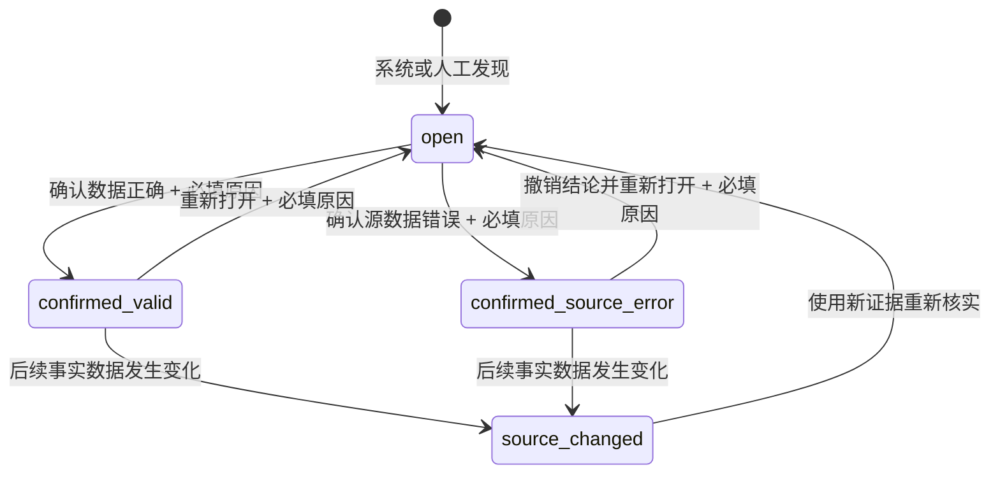

# DEV-05A 数据疑点确认地基

## 1. 目标

先建立一套不会误伤员工、不会擅自改变经营数字的行级数据疑点地基。第一版只负责记录疑点、展示证据、逐条人工核实和实名审计。

本 Slice 不启用相邻采购价倍率、数量单位或 SN 自动判定，不回扫历史数据，不自动排除任何记录，也不影响利润、成本、库存、越线次数或员工排名。

## 2. 不可突破的业务规则

1. 疑点只是“需要核实”，不是错误结论；待核实记录继续参与现有全部统计。
2. 只有明确的“确认源数据错误”结论，才有资格在后续 Slice 进入正式参考口径排除；本 Slice 尚不接统计排除。
3. 原始采购/销售事实行永不删除，确认后仍能查看订单和原始上传批次。
4. `anomaly_flags` 是技术/经营提示，不能整体当作数据疑点。
5. `product_data_quality_issues` 是 PN 主数据问题，不能承载采购/销售行级问题。
6. `DimPart.is_excluded` 是型号级治理，不能用于排除单笔事实。
7. 所有人工结论必须逐条处理、填写原因、记录真实账号，并以 version 乐观锁拒绝并发覆盖。
8. 第一版不提供批量确认、自动确认、自动排除或“错误采购/违规员工”等定性文案。

## 3. 领域模型

新增行级问题模型 `FactDataQualityIssue`：

| 字段 | 规则 |
|---|---|
| `id` | 稳定主键 |
| `side` | `purchase` 或 `sales` |
| `line_id` | 对应采购/销售事实行 ID；与 side 共同定位 |
| `part_id` | 对应 PN，便于检索与展示 |
| `import_batch_id` | 原始导入批次，可为空但不可伪造 |
| `rule_code` | 稳定规则代码，不使用展示文案作主键 |
| `rule_version` | 规则版本 |
| `evidence` | JSON 证据快照，不存员工评价 |
| `source_fingerprint` | 关键源字段指纹，供以后识别重导变化 |
| `status` | `open`、`confirmed_valid`、`confirmed_source_error`、`source_changed` |
| `detected_by/at` | 系统或真实发现人及时间 |
| `reviewed_by/at` | 最近核实人及时间 |
| `review_note` | 人工结论必填原因 |
| `version` | 乐观锁，从 1 开始 |
| `created_at/updated_at` | 创建与更新时间 |

唯一性：同一 `side + line_id + rule_code` 只保留一条当前问题；状态变化的完整历史进入 `SysAuditLog`，不靠复制当前行冒充历史。

## 4. 状态机

本 Slice 实现 `open → 两种人工结论 → reopen`。`source_changed` 写入模型和契约，但事实重导自动联动留给后续 Slice，不能用旧结论静默处理新数据。

## 5. 权限

- 读取队列：仍走 `page_governance`。
- 写入人工结论：新增 `action_data_quality_review`。
- 写权限必须依赖 `page_governance=true`；若页面不可见，不允许只靠 API 写。
- 事实价格继续受既有敏感字段权限保护；无相关数据权限者不能借疑点队列读取原始价格。
- 默认模板：管理员和数据维护角色可写；老板、采购、销售、库管、维保默认只读或无入口，按现有模板体系配置。

## 6. API 契约

- `GET /api/data-quality/issues`：按状态、side、规则、PN/单号搜索，分页返回。
- `GET /api/data-quality/issues/{id}`：返回证据、事实摘要、原订单与导入批次定位。
- `POST /api/data-quality/issues/{id}/decision`：`decision=confirmed_valid|confirmed_source_error`，必须带 `version` 和非空 `note`。
- `POST /api/data-quality/issues/{id}/reopen`：必须带 `version` 和非空 `note`。

所有写接口：无动作权限 403；版本冲突 409；不存在 404；非法状态 409；空原因 422。第一版没有批量写接口。

服务层提供内部 `create_or_refresh_issue(...)`，供未来检测器调用，但本 Slice 不提供普通用户创建疑点的 HTTP 接口。

## 7. 前端

在现有“数据治理”页新增“价格与数量疑点”页签：

- 队列列：状态、采购/销售、日期、单号、PN、经办人、数量/单位、单价、规则、导入批次、更新时间。
- 详情抽屉：原始事实、规则证据、订单定位、批次定位、已有结论与审计摘要。
- 有动作权限：逐条“确认数据正确”“确认源数据错误”“重新打开”；结论必须二次确认并填写原因。
- 无动作权限：只读展示，不渲染写按钮。
- 文案统一使用“待核实”“确认数据正确”“确认源数据错误”，禁止红色员工定性。
- 空队列要明确说明“当前尚未启用自动阈值规则”，不能让用户误以为数据已经全部正确。
- 390px 使用卡片与全屏抽屉，写操作键盘可达。

## 8. 测试与验收

### 合并门槛

1. 无问题记录时，现有价格、利润、库存和池分析测试逐项不变。
2. 待核实、确认正确、确认源错误三种状态都不改变任何现有统计。
3. 决策与 reopen 状态机、403、409、422、404 全有 HTTP 回归。
4. `SysAuditLog` 保存 before/after、问题 ID、真实用户名和原因。
5. 无价格权限账号的清单、详情、搜索、排序和导出均不能反推价格。
6. 前端覆盖只读/可写两类账号、逐条确认、必填原因、冲突刷新、390px 和键盘操作。
7. 迁移为纯新增；Alembic upgrade/check、downgrade 空表往返和存量表零变化均有测试。
8. 后端全量、前端全量、TypeScript、生产构建和 GitHub CI 全绿；Standards/Spec 双轴 PASS 后才可合并。

### 生产门槛

1. 先备份，再在生产快照 staging 演练迁移与回滚。
2. 上线时自动检测器仍关闭，历史回扫为 0，问题表初始为空。
3. 新表、权限、队列和审计冒烟通过；任何现有经营数字前后逐分一致。
4. 回滚优先关闭页面/写入口并回退应用；产生记录后不以 downgrade 删除问题和审计历史。

## 9. 后续 Slice（不属于本 PR）

- DEV-05B：只读阈值 preview 与甲方黄金样本回填。
- DEV-05C：经确认的自动检测规则和历史分层回扫。
- DEV-05D：正式参考口径与原始追溯口径双统计，只排除已确认源错误。
- DEV-09：图表待核实橙色描边、确认源错误空心点和订单下钻。
