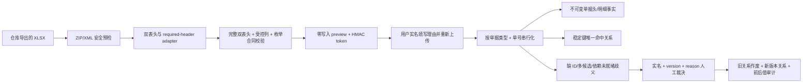

# 维保仓库单据多版本适配与歧义工作台

## 1. 边界

本模块把发货/出库、退货返库、收货/入库工作簿转换为可追溯的仓库单据事实，并维护这些事实与维保需求、PN 和上下游仓库单据之间的稳定关系。

- 本模块只新增仓库单据事实、关系证据和歧义审计。
- 本模块不修改 `inventory`、维保成本字段或返还率。
- 附件、图片、测试报告的内容不进入事实库；只记录“该受控字段存在”，交给人工在原系统查看。
- 项目名称、日期邻近、PN 邻近和列数都不是关系键。

## 2. 数据流

## 3. 适配器与版本的区别

适配器由必填内部编码集合识别，并在多个匹配项中选择 required set 最具体的唯一项。因此，可选列移动或新增不会把文件误判成另一种单据，也不会按 49/120/155/166 等列数猜类型。

完整、有序的 `(内部编码, 业务表头)` 合同用于判断是否为已经审核过的模板版本，SHA-256 用于展示、token 绑定和审计。每个获批 SHA-256 还必须同时配置人工复核的受控列位置、来源状态映射和全部约定枚举；缺少其中任一字段策略时服务端按配置错误失败关闭，不能由 adapter 内置猜测。必填集合仍匹配、但完整合同没有经过代码审查批准或发生任何增删、移动、改名时：

1. 适配器仍能解析已声明的稳定字段；
2. `version_state` 为 `unknown_version`；
3. preview 展示逐项表头差异，但 `can_apply=false`，apply 服务端再次校验并拒绝，数据库保持零写入；
4. 不会因为相同中文表头而丢失字段——字段身份始终是内部编码，中文表头只用于展示和完整合同校验；
5. 测试夹具可以临时注入合成合同来验证 49/120 列机制，但合成签名不得进入生产配置。

宽版返库只要出现任一宽版稳定 ID 指示列，就必须按宽版解析；即使部分 ID 缺失，也不能降级到窄版。真正的窄版返库没有稳定单据 ID 和明细 ID，因此只产生 `missing_document_id` / `missing_line_id` 歧义，不生成伪造事实键。

## 4. 失败关闭规则

以下情况在事实写入前拒绝整个文件：

- 未知或多义的 required-header adapter；
- 重复内部编码、空内部编码或数据列没有双表头；
- 任意工作表中的公式；
- 外部 relationship、external link、宏、ActiveX 或嵌入对象；
- 加密 ZIP、路径穿越、异常压缩比、超成员/解压体积/工作表/行/列/单元格/文本上限；
- 关键稳定 ID、PN/SN、单号或状态超过存储边界。

只有完整双表头合同已批准时，以下情况才允许固化可确认事实；系统禁止自动猜关系，统一进入 `maintenance_warehouse_ambiguity`：

- 缺少稳定单据或明细 ID；
- 稳定键零命中或多候选；
- 同一稳定 ID 对应不同事实指纹；
- 未知枚举；
- 受控附件字段非空。

附件是否受控只按该精确合同人工批准的列位置判断，不依赖中文/英文业务表头，也不会假设新版本继续使用旧附件编码；附件值只固化“存在”标记，不保存文件名、路径或可识别内容。Mac 1904 日期系统按工作簿 epoch 转换，不能按 Windows 1900 epoch 偏移。

## 5. preview、apply 与重放

- `POST /api/maintenance/warehouse-imports/preview` 不接收数据库 Session，不产生任何事实、缓存行或审计行。
- preview token 绑定文件 SHA-256、adapter version、完整表头签名和事实/歧义计数。
- `POST /api/maintenance/warehouse-imports/{id}/apply` 要求重新上传同一文件、同一 token、实名账号和业务理由。
- 单据头按 `document_type + document_no` 去重并获取 PostgreSQL transaction advisory lock，ObjectId 只作为不可变来源证据；因此同一单号即使被导出为不同 ObjectId，也只保留一张头事实并产生冲突证据。明细仍按单据头内的稳定 line ID 去重。没有可固化单号时才退回 adapter + 文件 hash 锁。
- 头、行、关系、歧义、批次和审计在同一事务内写入，任一步失败全部回滚。
- `(source_file_hash, adapter_version)` 是幂等键；成功文件再次应用时所有业务表均为 0 新增、0 更新。

## 6. 稳定关系依赖与失败关闭

本分支不复制其他需求单尚未合并的数据模型，只消费其正式稳定契约：

- 项目：`maintenance_source_order_assignment.source_order_id -> project_id`，只接受唯一有效映射；
- 项目经理行级权限：`maintenance_project_user_assignment` 的有效 `primary_manager` 与 `sys_user.username`；
- 现场领用：#209 不反向要求 `maintenance_site_issue` 先存在。已确认发货单及其唯一有效 WBDD、项目、PN 关系构成 #207 的可领来源；#207 必须把本模块的 `maintenance_warehouse_document_line.line_id` 原样保存为 `delivery_line_id`。正常“已发货、尚未领用”不是歧义，也不产生 blocker；未来显式回链只能按 `delivery_line_id`，不得比较两个系统各自的 raw `source_line_id`；
- 坏件返还：`maintenance_bad_return` 的显式 `warehouse_reference` 或 `inbound_reference`，且项目必须一致。

必需依赖表或所需字段尚未部署、项目关系缺失或稳定键不能唯一命中时，产生 `integration_blocker`/待人工项，绝不按项目名、日期邻近、PN 或文本描述猜测；坏件返还桥已部署但项目尚未唯一解析时也必须显式阻塞，不能静默跳过。`integration_blocker` 不能被人工“确认完成”，当前裁决接口只展示阻塞证据并保持 open；后续专用 reconciliation 必须在依赖恢复、重新核对成功后才能解除。正式模板 apply 启用前，reconciliation 需随组合分支一并验收。非全量角色在项目经理分配契约不可用时查询条件恒为 false；文件级、无项目归属的歧义也不会暴露给项目经理。

发货关系不是一次导入后永久可信。每次查询可领/可迁移候选时都必须重新读取 #201 当前唯一有效的 `source_order_id -> project_id`：只有单据状态仍为 `confirmed`、单据级 WBDD 与项目关系各唯一有效、当前项目仍与关系目标一致，并且该明细仍有唯一有效且目标 PN 未停用的 part 关系，才进入候选。项目改派、撤销、重复有效归属、项目停用或依赖契约暂不可用时均失败关闭；工作台以 `project_link_state` 和 `eligible_line_count` 显示实时结果，不能仅凭历史 link 的 `status=active` 继续消费。

## 7. 人工裁决

人工裁决使用 `version` 乐观锁。多候选和带候选的关联冲突只能从固化候选集合建立关系，不能用“已核实”绕过；不可变事实载荷冲突只能在展示逐字段前后值与双方 SHA-256 后明确“保留原事实”；依赖阻塞、未知枚举、缺稳定 ID/关系及证据不足的关键冲突保持 open，只有受控附件允许在来源系统核验后实名确认。建立关系时，`ambiguity_type`、`field_code`、`link_kind` 和目标类型必须严格匹配，而且所选 `(target_type, target_id)` 必须来自歧义创建时固化的完整候选集合；裁决时还会重新确认目标仍为有效状态、仍属于同一项目且没有作废或被合并，不能只凭主键仍存在继续关联。每次成功裁决会：

1. 把歧义从 `open` 单向转为 `resolved`；
2. 同一 `document_id + line_id + link_kind` 最多保留一条有效关系；目标发生更正时，旧关系单向转为 `superseded`，新关系版本加一并通过 `supersedes_link_id` 指向旧关系；
3. 追加 before/after、理由、实名操作人和时间审计；
4. 数据库触发器禁止关系删除、身份字段改写和反向恢复，只允许上述一次性作废变更；其他事实、批次和审计仍完全不可变。

工作台默认可查全部 open/resolved 历史，并在裁决前展示批次、文件名、文件/表头 hash、表头差异、当前与已作废关系、冲突前后值及历次裁决审计。前端搜索与预览使用请求代次保护，较早请求晚返回时不得覆盖最新结果。

已有任何仓库业务历史时，迁移 downgrade 在第一条破坏性 DDL 之前中止；生产回滚应走应用回退或 forward-fix。

## 8. 生产启用闸门

当前仓库没有 Issue #209 要求的四类去敏、结构不失真的权威工作簿，也没有逐版本正式标识、受控列位置、来源状态及其他枚举清单。因此生产配置中的完整合同和字段策略必须保持为空：preview 可以解释结构，`can_apply=false`，apply 保持零写入拒绝。合成 49/120 列测试只证明机制可运行，不构成任何正式版本批准证据。
