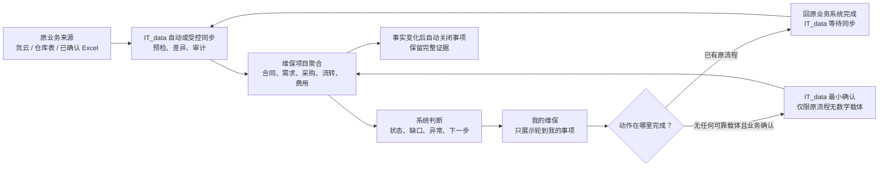

---
aliases:
  - IT_data 维保模块 PRD
  - 维保工作台重构 PRD
tags:
  - it-data/maintenance
  - product/prd
  - status/draft-for-review
status: draft-for-review
version: 0.1
created: 2026-08-15
updated: 2026-08-15
owner: IT_data PM/BA
scope: maintenance-product-reset
---

# IT_data 维保模块 PRD（审阅草案）

> [!important] 文档用途
> 这是一份供业务方直接修改的第一版，不是已经确认的最终需求，也不代表当前代码已经达到目标状态。
>
> 本稿以当前工作区 `codex/maint-workbench-refactor@76704f4f` 的代码、测试和文档为现状基线。该分支状态不等于生产部署状态。

> [!abstract] 最新产品纠偏
> 维保模块的目的不是在 IT_data 内重新造一套工作流程，而是**减少重复录入、减少查找和交接成本，让员工沿用原有流程完成工作**。
>
> 一句话原则：**一次业务动作只在一个系统完成；IT_data 负责同步、聚合、判断和提示，不要求员工为了“喂系统”再做一遍。**

## 0. 结论先行

当前维保板块的主要问题不是缺少功能，而是产品中心放错了：

1. 页面按技术模块和内部数据对象拆分，没有按员工的真实任务组织；
2. 旧版、工作台、数据维护、补库分别存在入口，同一项目动作被拆到多个页面；
3. IT_data 出现了项目手工建档、月度全量表回传、提醒手工完成等“影子流程”；
4. 真正应当先完成的氚云项目同步、现场收货、正式库存回库等上游事实仍未闭环；
5. 系统因此要求员工维护大量系统状态，却不能稳定减少原工作中的 Excel、氚云和线下交接。

本 PRD 推荐将维保模块重新定义为：

> **以氚云和已确认业务表为事实来源，以维保项目为聚合对象，以异常和下一步行动为交互中心的履约协同工作台。**

目标系统只做四件事：

```text
同步已有业务事实
    → 按项目自动聚合
    → 识别真实异常或下一步
    → 把人送到正确动作或原业务系统
```

不再把“上传一张 IT_data 生成的表”“手工点已处理”“维护系统自建项目”本身当作业务完成。

## 1. PRD 要解决的问题

### 1.1 用户真正要达成的目的

- 维保负责人打开系统后，能快速知道自己现在要处理什么；
- 项目、合同、需求、采购、发货、领用、返还、费用和回款能按同一个项目查看；
- 已经在氚云、仓库表或现有 Excel 中完成的动作，不在 IT_data 重复填写；
- 系统自动完成能自动完成的同步、关联、计算和提醒；
- 只有出现缺失、冲突、无法稳定关联时，才让对应的人处理；
- 管理层能看项目进展和风险，但不以增加一线员工填报为代价。

### 1.2 当前系统偏离目的的表现

| 优先级 | 现状问题 | 对员工造成的成本 | 本 PRD 的纠偏 |
|---|---|---|---|
| P0 | IT_data 可以手工新建项目，而项目本应在氚云建立 | 同一项目存在两套建档入口和来源冲突 | IT_data 只同步项目；取消日常手工新建 |
| P0 | 每月必须下载全量工作簿、修改、上传、预览、确认；即使无变化也要确认 | 为关闭系统任务而新增固定工作 | 默认从原来源同步；没有真实变化时不产生人工任务 |
| P0 | 回款提醒可独立“已处理/改期/重新打开”，但不代表真实到账 | 多维护一套与财务事实分离的状态 | 提醒由计划和真实事实派生；跟进记录不能冒充业务关闭 |
| P0 | 现场收货来源未确认、仓库适配器未就绪，但下游领用和返还页面已存在 | 员工被要求操作一个不能形成真实库存闭环的流程 | 上游事实未就绪时保持只读并明确缺口，不把半成品当正式流程 |
| P1 | 旧版、工作台、数据维护和销售补库共约 14 个维保相关菜单入口 | 不知道从哪里开始，同一任务需要跨页面找 | 普通用户只保留“我的维保”和“项目”两个主入口 |
| P1 | 项目详情已有验收、领用、返还和工作簿，侧栏又有月度更新、验收、回款提醒独立页 | 同一项目的同类动作重复出现 | 独立页改为项目内上下文入口或统一待办筛选 |
| P1 | “维保负责人”“项目经理”“经理月报”等术语并存 | 角色和责任边界不清 | 业务界面统一使用“维保负责人” |
| P1 | 迁移、歧义、哈希、模板版本、成本补录等治理能力作为菜单暴露 | 普通员工被迫理解技术和数据治理概念 | 只进入 Admin 的异常处理队列；普通页只显示业务影响 |
| P2 | 项目卡同时堆放合同、金额、返还率、待办、期限和缺失标签 | 信息密度高，但“下一步是什么”不突出 | 卡片只突出当前卡点、下一动作、截止时间，其他内容进入项目详情 |

### 1.3 典型操作成本（按当前代码可达路径估算）

> [!note] 验证边界
> 本轮没有真实业务账号和浏览器运行态，因此以下数字用于定位摩擦，不作为正式可用性测试结果；定稿前需用真实账号逐步计时复核。

| 任务 | 当前路径 | 估算成本 | 本质问题 |
|---|---|---:|---|
| 现场领用 | 项目总览 → 项目详情 → 现场领用 → 新建 → 选发货明细 → 保存 → 预览 → 确认 | 约 6–8 次点击、至少 4 个手填字段 | 完成后仍不改变公司库、地区库或前置库库存，不能替代原库存动作 |
| 坏件返还 | 新建草稿 → 提交 → 在途登记 → 仓库确认 | 约 7 次动作、至少 3 个说明/单号字段 | 仓库确认仍不恢复正式库存；前端没有好件退库入口 |
| 补库 | 从维保项目离开 → 销售管理 → 无项目归属购物车 → 导出 Excel → 外部审核/再录入 | 跨模块并至少一次文件往返 | 申请不带稳定项目/需求关系，未真正缩短原流程 |
| 月度更新 | 下载全量表 → 本地编辑 → 上传 → 校验 → 确认应用 | 同类入口至少出现 3 处 | 系统把文件往返本身定义成必须完成的任务 |

## 2. 当前版本为什么会变乱

### 2.1 根因一：按“功能模块”建页面，而不是按“工作任务”建入口

当前导航同时存在：

- 维保项目（旧版）：项目数据、下载中心、项目提醒；
- 维保工作台：项目总览、月度项目更新、经理月报、验收与结项、回款提醒；
- 维保数据维护：项目主档、异常维保单、仓库单据、缺价补录、历史迁移；
- 销售管理：补库申请。

这种结构在研发视角中能对应不同 API 和数据表，但员工面对的是“我要把这个项目推进下去”，不会先判断自己应该进入哪个技术模块。

### 2.2 根因二：把数据安全步骤直接变成员工日常流程

预览、版本、幂等、审计和冲突检测都很有价值，但它们应该是系统保护机制，不应该自然演变为每月固定的“下载—编辑—上传—校验—确认”工作。

当前代码甚至把“本月全量工作簿已应用”作为月度任务唯一关闭条件。这样关闭的是 IT_data 自己定义的上传任务，不是某个真实维保业务动作。

### 2.3 根因三：事实、提醒、治理各自拥有独立状态

当前系统中可能同时存在：

- 财务确认的真实回款事实；
- 项目计划回款节点；
- 回款提醒的 `pending / handled / needs_review`；
- 月度工作簿批次的 `valid / applied / expired`；
- 项目卡上的系统任务状态。

这些状态各自合理，但如果都要求员工操作，就形成多套需要人工同步的“真相”。

### 2.4 根因四：上游未闭环，先做了大量下游操作

当前已经存在领用、返还、成本、验收和回款提醒界面，但仍有以下基础缺口：

- 氚云项目、合同、期限和回款计划同步没有在当前代码中形成可用主链；
- 现场收货确认的业务载体未锁定；
- 仓库发货/返库/入库模板仍有未批准版本和稳定关系阻塞；
- 正式前置库库存和回库库存没有完成端到端切换；
- 返还率正式分子、费用正式金额字段等口径仍待确认。

这会产生“页面看起来很完整，实际业务结果没有闭环”的错觉。

## 3. 产品定位与边界

### 3.1 产品定位

IT_data 维保模块是：

1. **同步投影层**：读取氚云、仓库和经确认 Excel 中已有的业务事实；
2. **项目聚合层**：把不同单据稳定归入同一个 [[维保项目]]；
3. **判断层**：计算项目状态、库存去向、成本、返还义务和数据完整性；
4. **协同层**：只在需要人处理时生成明确的异常或下一步；
5. **证据层**：让用户能下钻查看来源、时间、操作者和变更记录。

### 3.2 不属于本产品的职责

- 不在 IT_data 重新发起业务立项；
- 不替代氚云现有合同、项目、采购、财务和审批流程；
- 不要求员工为了关闭 IT_data 任务而重复上传无变化文件；
- 不把“提醒已处理”解释为“业务已完成”或“款项已到账”；
- 不按项目名、人员显示名、日期或相似文本自动建立正式关系；
- 不在字段和流程未确认时补造库存、费用、回款或验收事实；
- 本期不扩展到销售退换货、坏件变现、维修子公司内部、工单系统、AI 自主审批等外围主题。

### 3.3 三种重构方式

| 方案 | 做法 | 优点 | 代价与风险 | 结论 |
|---|---|---|---|---|
| A. 只整理菜单 | 合并入口、改文案，不改任务和数据流 | 上线快 | 影子流程和重复录入仍存在 | 不足以解决本质问题 |
| B. 同步优先、异常驱动 | 保留现有数据能力，撤销重复流程，以项目聚合和异常协同为中心 | 最符合“减少流程”，能复用现有后端 | 需要重新确认数据源所有权和少量真正的人工动作 | **推荐** |
| C. IT_data 全面接管维保 | 所有项目、领用、返还、验收、回款均在 IT_data 操作 | 单系统理论上完整 | 直接改变原流程，培训和迁移成本最高 | 不采用 |

## 4. 目标业务主干



### 4.1 最小可运行闭环（P0）

第一阶段只完成下面这条主线：

```text
氚云建立项目
→ IT_data 同步项目身份及已确认来源字段
→ 已有 WBDD、采购和维保出库按稳定关系归入项目
→ 维保负责人只看本人项目和真实异常
→ 在原系统修正或由 Admin 处理关系异常
→ 下一次同步后自动消除异常
```

这里当前只能锁定“项目在氚云建立”。合同、维保期限、计划回款等字段究竟来自氚云哪张表或其他现有载体，必须等脱敏样表和业务确认后再写入字段合同。

P0 不要求新建现场领用、返还、验收或回款人工流程。已有能力可以保留在受控范围内，但不能作为全员必走步骤。

### 4.2 备件履约闭环（P1，必须先确认来源载体）

```text
维保备件需求单
→ 仓库发货/出库
→ 项目现场收货
→ 前置库可用
→ 现场实际领用/消耗
→ 好件退回 / 坏件返还
→ 仓库检测与正式入库
```

每个箭头优先同步原有单据。只有“项目现场收货”或“实际领用”等环节确认没有现成数字载体时，才设计 IT_data 最小确认表单。

## 5. 核心产品概念

| 概念 | 它解决什么问题 | 依赖的上游 | 被什么下游调用 |
|---|---|---|---|
| [[维保项目投影]] | 把氚云项目在 IT_data 中形成可查询身份，不再双重立项 | 氚云不可变记录 ID、字段合同、同步批次 | 权限范围、项目详情、单据归集 |
| [[业务事实]] | 表示真实发生的合同、需求、采购、发货、领用、返还、费用或回款 | 原系统单据或经确认的最小表单 | 状态计算、成本、库存、审计 |
| [[派生待办]] | 告诉某人为什么现在轮到他，不另造业务事实 | 业务事实、责任关系、规则和截止条件 | 我的维保、项目卡片、消息提醒 |
| [[数据异常]] | 承接无法稳定关联、来源缺失、模板漂移等治理问题 | 同步预检、稳定关系、字段合同 | Admin 异常队列、修复和重放 |
| [[最小确认]] | 补上原流程确实没有数字证据的一步 | 已确认的前序事实、实名账号、业务授权 | 下一状态、审计、后续同步 |

原则：`派生待办` 不允许脱离 `业务事实` 独立存在；其关闭条件必须是事实发生变化，而不是用户点一下“完成”。

回款、验收等场景必须把两个维度分开：

- `business_state`：由计划、实际到账、正式验收等权威事实派生；
- `follow_up_state`：记录谁在何时联系过、备注了什么、希望何时再次提醒。

`follow_up_state` 只能帮助协作，不能覆盖 `business_state`，也不能修改权威日期或冒充业务完成。某一次“联系客户”的协作任务是否允许标记完成，属于待业务确认项；即使允许，本次跟进完成也不能隐藏仍然存在的逾期业务状态。

## 6. 角色与权限

| 角色 | 默认看到 | 可以做什么 | 不应看到或承担什么 |
|---|---|---|---|
| 维保负责人 | 我的未完成事项、本人项目、最近风险 | 查看项目、处理真正轮到自己的动作、查看来源依据 | 数据迁移、模板哈希、跨项目异常、日常建档 |
| 对应销售/实名授权申请人 | 可申请项目、补库草稿和审核结果 | 在业务确认后发起项目范围内补库申请 | 其他项目数据、系统级库存和迁移 |
| 仓库人员 | 待发货、待确认差异、待检测/入库事项 | 完成原仓库流程，必要时处理最小确认 | 成本和利润、项目主档维护 |
| 财务 | 项目费用与回款事实、待确认归属异常 | 在原财务流程确认事实；IT_data 只读或处理归属异常 | 维护提醒状态替代真实到账 |
| 管理层 | 全项目风险、金额、逾期和数据完整性 | 查看、下钻、升级 | 要求一线重复填报以满足看板 |
| Admin/数据维护 | 同步批次、关系异常、模板异常、权限和审计 | 预检、应用、人工裁决、重放 | 冒充业务人员完成日常动作 |

权限硬规则：普通维保负责人只看本人负责项目；Admin 看全量；未分配项目的普通账号看到 0 个项目。项目范围必须由后端校验，不能只靠隐藏按钮。

## 7. 目标信息架构

### 7.1 普通维保负责人

```text
维保
├─ 我的维保（默认入口）
│  ├─ 现在要处理
│  ├─ 即将到期
│  └─ 数据异常（仅显示对业务的影响）
└─ 项目
   ├─ 我的项目
   └─ 项目详情
```

### 7.2 Admin/数据维护

```text
数据治理
└─ 维保数据异常
   ├─ 项目同步异常
   ├─ 单据归属异常
   ├─ 仓库模板/关联异常
   ├─ 成本缺失异常
   └─ 历史迁移（仅切换期显示）
```

### 7.3 不再作为独立主菜单的页面

- 旧版项目数据、下载中心、项目提醒；
- 月度项目更新；
- 经理月报；
- 验收与结项目录；
- 回款提醒目录；
- 领用缺价补录；
- 异常维保单处理；
- 仓库单据核对；
- 历史数据迁移核对。

这些能力并非全部删除：能复用的放回项目上下文或 Admin 异常队列，旧链接保留兼容跳转。

## 8. 功能需求

### 8.1 P0-1：我的维保

#### 用户目标

维保负责人进入系统后，在 10 秒内回答：

1. 今天需要处理什么？
2. 为什么轮到我？
3. 去哪里完成？
4. 完成后系统如何知道？

#### 页面要求

- 默认只显示本人未完成且可行动的事项；
- 每条事项显示项目、业务原因、来源事实、截止时间、下一动作和自动关闭条件；
- 事项按“逾期 → 今天/本周 → 数据阻塞 → 仅提醒”排序；
- 能在原系统完成的动作，按钮明确写“去氚云处理”“查看仓库单据”等；
- 需要 IT_data 最小确认的动作，直接打开已带项目和来源上下文的表单；
- 不允许用户手工新建一个没有来源事实的待办；
- 不用“已处理”隐藏仍然存在的业务缺口。

#### 验收标准

- 无需先选择模块或项目即可看到本人最重要事项；
- 同一来源事实只生成一个当前有效事项；
- 来源事实修正后，事项在下一次同步/重算后自动关闭；
- 任何事项都能下钻到“查看数据依据”。

### 8.2 P0-2：项目同步，不在 IT_data 立项

#### 业务规则

- 维保项目由氚云建立；IT_data 同步并履约跟进；
- 普通页面取消“新建项目”；
- Admin 日常也不手工创建业务项目；
- 如需灾备或历史迁移，使用明确标识的受控导入，不开放常驻建档入口；
- 氚云拥有的字段只能由同步更新；IT_data 已确认的负责人账号关系、人工裁决和审计字段不得被来源文件静默覆盖。

#### 同步流程

```text
上传/拉取氚云项目表
→ 字段、版本和关系预检
→ 已批准模板且无冲突：自动幂等应用
→ 模板漂移、关系冲突或高风险变化：进入 Admin 预览与确认
→ 项目投影更新
→ 所有批次和差异可审计
```

#### 安全要求

- 使用氚云不可变记录 ID，不按项目名称自动合并；
- 字段映射必须来自脱敏真实样表；
- 未知模板、未知状态和多候选关系失败关闭；
- 同一文件重放幂等；并发版本漂移返回冲突，不部分写入。

### 8.3 P0-3：项目总览与详情

#### 项目列表只显示

- 项目名称和编号；
- 维保负责人；
- 当前阶段/期限；
- 当前最重要卡点；
- 下一动作和截止时间；
- 数据更新时间与完整性状态。

合同金额、成本、返还率、全部缺失标签等进入详情，不在卡片首屏堆叠。

#### 项目详情按业务结果组织

```text
概况
├─ 当前状态、下一动作、负责人、最近同步
├─ 合同与回款（只读事实）
├─ 备件流转（需求→发货→收货→领用→返还）
├─ 成本与费用（只读聚合和异常）
└─ 验收与结项（来源事实和缺口）
```

项目详情不是强制五步向导。不同项目可以并行发生采购、回款、领用和验收，页面只按业务主题聚合，不强迫用户按页面顺序推进。

### 8.4 P0-4：待办必须由事实自动关闭

| 事项 | 产生条件 | 正确关闭条件 | 禁止的关闭方式 |
|---|---|---|---|
| 项目资料缺失 | 氚云同步缺字段或关系冲突 | 来源修正并同步成功，或完成实名裁决 | 普通用户点击忽略 |
| 回款业务逾期 | 权威计划到期且真实回款条件未满足 | 财务事实满足，或权威计划被正式调整 | 把一次联系记录标成完成并隐藏逾期 |
| 本次回款跟进 | 业务规则要求在某时点联系，且轮到当前责任人 | 待业务确认：可能是已联系、取得有效承诺或升级完成 | 用它生成到账事实、修改权威日期或覆盖业务逾期 |
| 验收缺失 | 权威来源显示验收材料/状态缺失 | 原流程提交并同步，或经确认的 IT_data 最小表单完成 | 为关闭提醒上传无业务效力附件 |
| 领用缺成本 | 已确认消耗但没有可靠价格证据 | 新采购/销售证据自动匹配，或授权人员补充有依据的成本 | 用 0 代替缺失成本 |
| 待返还 | 已确认领用形成返还义务且未满足 | 正式返还/仓库接收事实满足口径 | 仅填写备注后关闭 |

### 8.5 P1-1：备件流转

#### 页面目标

在一个项目内看清：要了什么、发了什么、现场有什么、实际用了什么、应返什么、已经返到哪一步。

#### 业务规则

- 发货不等于现场收货；
- 现场收货不等于实际领用；
- 实际领用才代表消耗；
- 好件退回和坏件返还分开记录；
- 返还登记不等于正式恢复可用库存；
- 只有检测合格并正式入库才恢复公司/地区可用库存；
- 项目约定明确不返还的品类从返还率分母排除；
- 未确认来源载体前，相关状态只读且显示“数据来源待确认”。

#### 最小表单原则

如果现场收货或领用已在氚云/仓库表存在，IT_data 不再填一次；如果业务确认没有任何数字载体，最小表单只采集推进下一状态所必需的字段，并自动带入项目、需求、发货、PN/SN 和剩余数量。

### 8.6 P1-2：补库申请

补库申请保留与否，先由业务方确认其是否替代了现有流程。若保留，必须满足：

- 从项目和目标前置库进入，不从自由购物车开始；
- 先检查公司主库和所属地区库，内部可供时不进入外购；
- 自动展示历史使用、历史成本和其他可调库存证据；
- 申请人只填写业务尚不知道的信息，不重复填写系统已有的项目、负责人和来源关系；
- 审核结果形成可执行交接，不要求再手工抄到另一份 IT_data 表；
- WBDD 与采购申请的先后关系未确认前，不自动生成正式单据。

### 8.7 P1-3：验收、回款与项目结项

- 优先同步现有验收、回款和结项来源；
- 不把“每月上传 IT_data 全量表”设为所有项目必做动作；
- 若现有项目经理 Excel 是真实日常载体，允许直接导入该原文件，不要求先从 IT_data 下载再回传；
- 计划回款、实际到账和跟进记录是三类事实，页面明确区分；
- 跟进备注可以留痕，但不能单独关闭真实逾期；
- 业务状态与个人跟进状态分别保存、分别展示；“已联系”可以结束本次协作动作与否待业务确认，但不能把“仍逾期”改成“已完成”；
- 项目结项只由业务方确认后的硬条件派生；确认前不新增结项阻塞条件。验收、剩余备件、费用和回款当前仅是候选检查维度，不预设它们全部都是硬门槛。

### 8.8 P1-4：Admin 异常处理队列

所有需要人介入的治理问题统一进入一个队列，并按影响分组：

- 阻塞项目读取；
- 阻塞业务动作；
- 只影响金额/成本完整性；
- 只影响审计追溯的信息不生成待办，只进入可检索日志。

每条异常显示业务影响、来源批次、建议处理人和可执行动作。技术详情、哈希、版本、字段码放在折叠的“查看数据依据”中。

## 9. 数据来源与字段所有权

| 业务对象 | 首选权威来源 | IT_data 默认动作 | 人工动作边界 |
|---|---|---|---|
| 项目身份（项目 ID、编号、名称） | 氚云项目表 | 同步为项目投影 | 只处理映射冲突，不日常建档 |
| 合同、维保期限 | 待脱敏样表和业务确认 | 来源确认后只读同步 | 未确认前不猜字段、不生成正式状态 |
| 维保需求单 | 氚云 WBDD | 导入并关联项目 | 未归属时由 Admin 裁决 |
| 采购订单 | 氚云采购订单 | 只读关联 WBDD 和项目 | 不在维保模块重复采购 |
| 发货/出库 | 经确认仓库导出 | 同步为在途事实 | 模板/关系异常进入 Admin 队列 |
| 现场收货 | 待业务确认 | 有来源则同步 | 无来源时才设计最小确认 |
| 现场领用 | 待业务确认真实载体 | 有来源则同步并计算实际消耗 | 无来源时才设计最小确认 |
| 返还与入库 | 经确认退返/入库单 | 同步流转与库存资格 | 仓库在原流程完成检测/入库 |
| 项目费用 | 经财务确认的来源 | 只读归集 | 金额字段未锁定时失败关闭 |
| 计划回款 | 待确认：氚云或现有维保负责人表 | 来源确认后同步计划节点 | 仅在权威来源中调整计划 |
| 实际回款 | 财务确认事实 | 只读展示和计算 | 不由提醒操作生成 |
| 验收与结项 | 待确认氚云表/现有载体 | 同步状态和材料引用 | 无来源时才设计受控表单 |

所有字段合同必须来自真实脱敏样表，不从页面名称、旧文档或口述猜测。

## 10. 当前能力的处理建议

| 当前能力 | 处理建议 | 原因 |
|---|---|---|
| 稳定项目读模型、项目范围权限 | 保留并复用 | 是项目聚合和权限地基 |
| 项目总览和项目详情 | 保留骨架，重做信息层级 | 已有大量可复用查询和组件 |
| 采购订单→WBDD→项目只读证据链 | 保留后端和现有组件，接入项目页并完成真实账号验收 | 当前已有基础能力，但普通用户页面尚未挂载，不能按可用功能计算 |
| 成本证据、缺价识别、权限遮罩 | 保留 | 属于自动计算和异常识别 |
| 仓库文件预检、歧义、审计 | 移入 Admin 异常队列 | 是数据治理能力，不是一线主流程 |
| 手工新建项目主档 | 撤出日常入口 | 与“氚云立项、IT_data 同步”冲突 |
| 项目月度四表回传 | 取消强制；仅作为兼容导入/导出 | 当前会制造固定重复工作 |
| 负责人全量月报 | 取消必做任务；若原表仍在使用则直接导入原表 | 不应为关闭系统任务而上传无变化文件 |
| 验收独立目录 | 并入我的维保和项目详情 | 列表本质是项目事项筛选 |
| 回款提醒独立目录 | 并入我的维保/合同回款；重新定义关闭条件 | 当前存在与真实到账分离的影子状态 |
| 现场领用和坏件返还 | 代码保留但暂不扩面 | 上游发货/收货/库存来源未闭环 |
| 补库购物车 | 暂停扩面，待确认是否替代原流程 | 可能重复 WBDD 或现有审批 |
| 旧版项目/下载/提醒 | 保留数据和旧 URL，统一跳转 | 保护历史收藏和已有导出，不保留重复导航 |
| 历史迁移控制 | 仅切换期 Admin 可见 | 迁移不是长期业务模块 |

## 11. 非功能要求

### 11.1 可理解性

- 普通页面不出现 `Beta`、`dry-run`、`manifest`、稳定 ID、协议版本、原子应用等内部术语；
- 每个动作必须说明：为什么轮到我、会改变什么、不会改变什么、完成后交给谁；
- 统一使用“维保负责人”。

### 11.2 数据安全

- 正式关系使用稳定 ID；
- 未知模板和未知状态失败关闭；
- 批量导入、高风险关系变更和破坏性操作采用“预览与应用分离”；普通低风险动作由后台自动预检并单次提交，不额外增加用户确认步骤；所有应用保持幂等，冲突整批不写；
- 不删除历史业务数据；旧状态和人工裁决可追溯；
- 技术异常不得把敏感原始行、附件内容或客户信息写入普通日志。

### 11.3 权限与审计

- 后端强制项目范围；
- 成本、利润、客户等字段继续独立授权；
- Admin 代办必须记录真实操作者、代办对象和原因；
- 所有关键写入保存来源、前后状态、规则版本和时间。

### 11.4 性能与可用性

- 我的维保和项目列表采用分页/受控搜索；
- 普通用户首屏不等待大批量导出或迁移计算；
- 同步失败不覆盖最后一次已确认事实，并明确显示数据更新时间；
- 导出是辅助能力，不阻塞在线查看和日常处理。

## 12. 成功指标与验收

### 12.1 产品验收

- [ ] 普通维保负责人侧栏只出现两个维保主入口；
- [ ] 进入“我的维保”后 10 秒内能说出最重要的下一件事；
- [ ] 项目无需在 IT_data 日常手工创建；
- [ ] 已经存在于权威来源的数据不要求员工再次录入；
- [ ] 没有变化的月份不生成“必须上传并确认”的人工任务；
- [ ] 待办由来源事实变化自动关闭；
- [ ] 回款提醒的处理记录不会被展示为实际到账或业务关闭；
- [ ] Admin 治理问题不会出现在普通员工主导航；
- [ ] 旧链接可跳转，历史数据和导出能力不丢失。

### 12.2 业务闭环验收

- [ ] 随机抽取一个项目，可从项目追到合同、WBDD、采购和发货证据；
- [ ] 不唯一或缺失的关系进入异常队列，不按名称猜测；
- [ ] 发货、收货、领用、返还、入库五个状态不互相替代；
- [ ] 实际消耗与仍在现场的备件可分开；
- [ ] 好件退回、坏件返还和明确不返还可分开；
- [ ] 正式返还率口径未确认时不展示为权威 KPI；
- [ ] 缺失成本不按 0 计入。

### 12.3 真实账号验收

- [ ] Admin：看全部项目和全部数据异常；
- [ ] 有项目的维保负责人：只看本人项目和本人事项；
- [ ] 无项目普通账号：项目和事项均为 0；
- [ ] 仓库/销售/财务账号：只看到与其职责相关的上下文入口；
- [ ] 浏览器宽度 1440、768、390 均能完成主流程；
- [ ] 使用真实脱敏样本完成端到端验收。

### 12.4 效率指标（建议目标，定稿前先测现状基线）

- [ ] 同一业务事实的重复录入次数为 0；
- [ ] 普通事项从“我的维保”进入后，最多跳转 1 次即可到达实际处理位置；
- [ ] 无变化项目的月度人工操作次数为 0；
- [ ] 维保负责人每月用于整理、重复录入和寻找入口的总耗时，相比现状基线下降至少 50%；
- [ ] 上线验收同时记录“原流程步骤数/耗时”和“新流程步骤数/耗时”，没有基线对照不得宣称效率提升。

## 13. 实施优先级

### P0：先停止增加工作量

1. 冻结新增维保页面和新的人工状态，记录当前真实操作基线；
2. 确认字段所有权、原流程载体和本 PRD 的 P0 决策；
3. 完成氚云项目字段合同与“正常自动、异常人工”的受控同步；
4. 把现有项目、WBDD、采购、维保出库能力聚合到项目，并接入采购证据面板；
5. 建立事实驱动的“我的维保”，以真实账号和同一批项目并行影子验证；
6. 验证通过后再切换默认导航，并停止新建 IT_data 手工项目和新的强制月度任务；
7. 观察期保留旧 URL、旧数据读取和明确回退路径，确认无遗漏后再收口。

#### P0 切换门槛

- 新入口完成 Admin、有项目维保负责人、无项目普通账号三类真实账号验收；
- 已确认权威来源的项目覆盖率达到业务方批准阈值，冲突全部可见且不静默猜测；
- 影子运行期间，新旧流程对同一批项目的关键事实一致；
- 新流程步骤数和耗时不高于现状，并达到 §12.4 的效率目标或经业务方批准的调整值；
- 旧入口在观察期可一键回退，且不会产生新旧两套写入事实。

### P1：完成备件真实闭环

1. 确认现场收货、领用、退返和正式入库的真实载体；
2. 接入并验收仓库真实模板；
3. 建立现场库存、实际消耗、好件退回和坏件返还状态；
4. 把治理问题统一放入 Admin 异常队列；
5. 以命名项目和实名账号做小范围试点。

### P2：在主链稳定后再做

- 补库自动审核与采购推送；
- 回款跟进日志和升级机制；
- 经营层跨项目指标；
- 巡检、盘点、结项自动化；
- AI 解释或辅助判断。

## 14. 需要业务方修改或确认的决策

> [!question] 这些问题的答案会改变流程或数据模型，研发不能替业务方猜。

### P0：先确认，否则不能定稿

1. 当前实际使用的“项目经理/维保负责人全量表”是谁维护、多久维护一次、它是原工作流还是 IT_data 新增的？
2. 项目、合同、维保期限、计划回款、实际回款分别在哪个系统或表中维护？
3. 员工当前是否已经在氚云处理验收、巡检、盘点和结项？对应表或状态是什么？
4. 现场收货、现场领用、好件退回、坏件返还当前分别用什么单据或 Excel？
5. IT_data 对氚云是只读同步，还是允许把结果回写氚云？哪些对象允许回写？
6. 补库购物车是否要替代现有 WBDD/采购申请，还是只提供分析和录入辅助？
7. 回款提醒的真正关闭条件是“已联系客户”“承诺日期变化”还是“财务确认到账”？三者是否需要分别记录？

### P1：主干确认后补充

8. 同一项目是否允许多个现场前置库？
9. 哪些品类必须逐件记录 SN？
10. 哪些项目/品类明确不返还，返还率分子和分母怎样定义？
11. 验收审批由谁负责，是否已经存在正式审批流？
12. 项目结项必须满足哪些硬条件，哪些只是提示？

## 15. 本稿与旧口径的关系

以下旧设计不能直接继续作为新实现依据，需由业务方重新确认：

- “所有维保负责人每月必须下载并回传 IT_data 全量工作簿”；
- “即使无变化，也必须确认应用后才能关闭月度任务”；
- “IT_data 可以作为日常项目建档入口”；
- “回款提醒可以通过手工标记已处理独立关闭”；
- “验收截止日必须先通过月度全量表配置，才能提交验收材料”；
- “已存在页面就代表该流程已经可供全员使用”。

在业务方确认本 PRD 前，以上内容应视为**待复核旧假设**，不是自动生效的新结论。

## 16. 现状证据索引

| 结论 | 当前代码/文档证据 |
|---|---|
| 维保入口分为旧版、工作台、数据维护三组，补库另在销售管理 | `frontend/src/nav.tsx:156-208` |
| IT_data 当前仍有新建项目入口 | `frontend/src/pages/MaintenanceProjectMasterPage.tsx:101-140,339-400` |
| 已有计划明确项目应由氚云建立、IT_data 不日常建档 | `docs/superpowers/plans/2026-08-12-maintenance-business-workbench.md:19-26` |
| 项目卡把月度全量表上传作为操作 | `frontend/src/components/maintenance/MaintenanceProjectCard.tsx:60-95` |
| 服务端每月无条件生成全量工作簿任务，并以应用批次关闭 | `backend/app/services/maintenance_project_operations.py:3722-3765` |
| 即使项目缺负责人、期限、合同、成本和验收配置，测试仍要求生成无负责人的月度任务 | `backend/tests/test_maintenance_project_manager_assignments.py:388-438` |
| 月报需要下载、修改、校验、确认四步 | `frontend/src/pages/maintenance/MaintenanceManagerWorkbookPage.tsx:234-300` |
| 单项目又有一套四表下载/回传 | `frontend/src/pages/maintenance/MaintenanceProjectUpdatesPage.tsx:106-164` |
| 项目详情内还存在同一工作簿操作 | `frontend/src/pages/maintenance/MaintenanceProjectWorkspacePage.tsx:442-451` |
| 验收可能被“先通过月度全量表补截止日”阻塞 | `backend/app/services/maintenance_acceptance.py:285-302` |
| 回款提醒拥有独立的已处理、改期、重新打开操作 | `frontend/src/components/maintenance/CollectionReminderDetail.tsx:85-124` |
| 回款提醒设计明确不代表真实到账 | `.ai/MAINTENANCE_COLLECTION_REMINDERS_DESIGN.md:11-20` |
| 服务端让本地“已处理”优先于业务逾期，且允许本地改计划日期 | `backend/app/services/maintenance_collection_reminders.py:188-232,704-850` |
| 现场领用确认不写库存，且真实发货适配器未就绪时禁用生产确认 | `frontend/src/components/maintenance/SiteIssueWorkflowPanel.tsx:409-428,680-714` |
| 仓库桥接只投影发货候选，不产生库存移动或实际消耗 | `backend/app/services/maintenance_warehouse_site_issue_bridge.py:1-6,303-386` |
| 领用确认会写实际消耗和坏件义务，但明确没有库存影响 | `backend/app/services/maintenance_project_operations.py:1218-1329` |
| 坏件可凭手填仓库引用标记仓库已确认，正式入库引用可以为空 | `backend/app/services/maintenance_bad_returns.py:1067-1102,1147-1200` |
| 正式业务手册承认现场收货载体和前置库/回库闭环尚未完成 | `docs/maintenance/business-handbook.md:112-127,241-255` |
| 目标模型已指出应按角色任务组织、第一阶段不应继续加页面 | `.ai/BUSINESS_PROCESS_MODEL.md:822-867,961-981` |
| 采购证据面板已有组件和 API，但当前项目页尚未挂载 | `frontend/src/components/maintenance/ProjectProcurementPanel.tsx:70-190`、`frontend/src/pages/maintenance/MaintenanceProjectWorkspacePage.tsx:1-460` |

## 17. 评审方式

请业务方优先直接修改以下三处：

1. §4 目标业务主干是否符合真实工作；
2. §8 哪些动作应该留在原系统、哪些确实需要 IT_data 最小表单；
3. §14 十二个待确认问题的答案。

确认这三部分后，再拆页面、接口和开发计划。当前阶段不应继续以已有页面为前提倒推业务流程。

## 18. 本会话补充确认（2026-08-15 工作会话，待并入正文）

> 以下为 2026-08-15 会话中业务方直接确认的增量决策与事实，评审时请与 §14 合并处理。

### 18.1 业务方直接确认的决策

1. **前置库 = 真实账本**：项目×PN 结存 + 流水（入=补库到货/采购直发；出=项目结束收回/变卖）。**现场领用单不写前置库账本**，只登记消耗事实与应返义务（为坏件返还率提供分母）。
2. **不返还标记 = 行级默认**：项目级提供默认值（如硬盘项目级=不返还），领用行级可覆盖；返还率分母按行级标记排除。
3. **回款单口径 = 月度累计快照**（报告月份 + 累计金额）；回款计划节点以台账工作簿为**唯一事实源**。
4. **台账「订单金额」= 含税金额**（实测 44,756 = 39,607.08 × 1.13），与系统未税销售单按税率对账。
5. **前置库未上线字段固定显示「尚未接入」**。
6. **补库购物车核心证据**：365 天无采购/销售记录提醒、通用池替代建议、成本区间、高频件统计；防止非常用/错 PN 进前置库。
7. **看板一体化**：一键下载全部项目维保订单（7/14 天时间窗口）；项目进度条缺数据不隐藏、只提示；项目详情内下载五 sheet 工作簿。

### 18.2 输入契约（业务方明确「只上传这些，不增加」）

- 氚云机打单 ×4：发货单 CKD（166 列，明细自带成本单价/金额）、入库单 RKD（155 列，明细自带采购/销售单价）、退货返库单（49/120 列两版）、费用报销支付单 BXD（43 列）。
- 台账工作簿（手工维护）：维保项目清单 + 项目成本。**现 64 列含 24 组横向「回款时间N/金额」对，需按新模板纵向化。**
- 其余业务对象（WBDD/采购/销售）已存生产库，不新增上传文件。

### 18.3 Excel 交互架构（三级管线）

py 规则 adapter（主路径，字段码优先）→ AI 映射助手（仅失败兜底，只做列映射+搬值，金额不猜、不直写库）→ 确定性校验器（合计对账/存在性/异常清单/零写入失败拒绝）。
系统生成的往返工作簿：颜色契约（灰底只读、黄底唯一可编辑）、缺行≠删除、隐藏技术 Sheet 放稳定 ID。两本模板（台账/项目工作簿）单向同步，交叉列只读。

### 18.4 生产数据基线（2026-08-15 只读实测）

- WBDD 19,046 单（报修供货 16,318 / 补库供货 2,724），100% 挂 XSDD；采购 18,173 张挂 WBDD；
- 库存 22,461 行仅公司仓维度（含北京废品仓 ¥172 万），**无前置库维度**；
- 稳定项目 415 个全是 LEGACY 占位，合同 7 行全是 CANARY/REHEARSAL 测试数据，回款快照 0 行；
- Beta 操作表（领用/返还/仓库单/补库申请）生产全部 0 行——工作台从未被真实使用；
- 报销表仅 14 行；台账 BXD 归集与氚云 BXD 导出、生产 f_project_expense 是三份不同数据，需逐条对账。

## 19. §14 十二问的业务方答复（2026-08-15，权威确认）

| # | 问题 | 业务方答复 | 对实现的影响 |
|---|---|---|---|
| Q1 | 全量表谁维护、多久一次 | **项目经理维护；另有几个单独成员账号，需要给权限** | 台账上传权限 = 项目经理 + 指定成员账号（账号体系配置） |
| Q2 | 项目/合同/期限/回款在哪维护 | **大部分在氚云；项目、合同、期限、计划均以 Excel 上传字段为准，系统不手填；保留手动修改入口** | 台账 Excel = 唯一事实源；系统只读聚合 + 后台修正通道 |
| Q3 | 验收/巡检/盘点/结项在氚云吗 | **不在氚云；巡检验收只是 Excel 表内状态，不是重点，重点在提醒回款** | 验收/巡检不做独立流程，只展示台账状态；重心 = 回款提醒 |
| Q4 | 收货/领用/退回/返还载体 | **现场没有收货环节，只有发货单；前置库一般以项目名为库名；领用单在 IT_data 系统上做；坏件返还 = 氚云收货入库单** | **取消现场收货环节**：发货单(维保供货)→直接入前置库；领用单 = 系统表单；入库单 = 坏件返还确认 |
| Q5 | 是否回写氚云 | **不用管回写** | 只读同步，零回写 |
| Q6 | 回款提醒关闭条件 | **提交上传巡检报告/图片/PDF 凭证为关闭依据；数据库只记 md5，文件存独立目录，每个文件一个 yml 元信息** | 凭证附件 = md5 + 文件存储 + yml 元数据（与现有 business_file 设计同向） |
| Q7 | 补库购物车替代还是辅助 | **购物车 = WBDD 采购申请的前置审核；审核 PN 合理性，通过后一键导出 Excel（PN+数量+采购金额+销售金额），后续走人工渠道，系统不管采购执行** | 购物车产出 = 审核结论 + 四列导出文件；不接采购流程 |
| Q8 | 是否多个前置库 | **上传的 Excel 里怎么写就怎么填** | 前置库维度以 Excel 仓库名/项目名为准，不强建模 |
| Q9 | 哪些品类记 SN | **不需要记录 SN，只统计 PN 和数量** | 明细不强制 SN；SN 字段降级为可选保留 |
| Q10 | 不返还认定 | **审批系统负责，系统自动审批** | 不返还标记由规则自动判定（项目级默认 + 规则），无需人工逐行审批 |
| Q11 | 返还率定义 | **分母 = 领用件数去掉不返还；分子 = 已返还（入库订单里有的）；领用单件数/入库订单 = 返还率** | 返还率 = 已返还件数(入库单) / (领用件数 − 不返还件数) |
| Q12 | 项目结项硬条件 | **结项只是提示；项目名自带项目期限** | 结项 = 软提示；期限从项目名称解析（如 `阿里专有云20260608-20291205`） |
