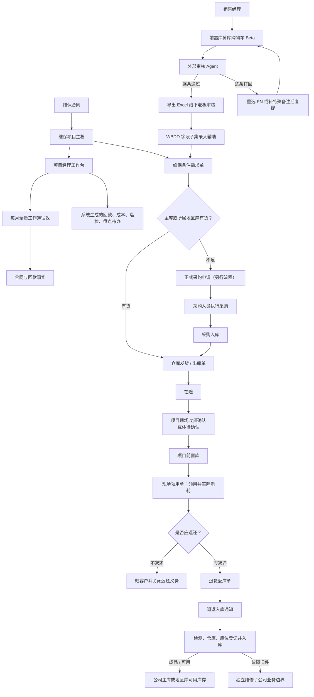
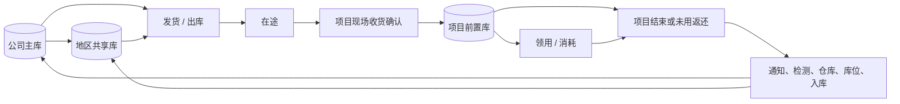

# 维保业务运行手册

| 元数据 | 内容 |
|---|---|
| 状态 | 已确认业务口径；目标流程与当前实现分层维护 |
| 业务负责人 | 甲方维保业务负责人（文档不记录个人姓名） |
| 维护人 | IT_data PM/BA 与发布总控 |
| 最近核对日期 | 2026-08-10 |
| 适用范围 | 维保合同履约、备件流转、项目费用、项目经理待办及相关数据治理 |
| 关联 Issue | [#193 建立维保业务运行手册与单据关联规范](https://github.com/Jinchen-Yang/it-spareparts/issues/193) |
| 关联 PR | 待本分支 Draft PR 创建后由 GitHub 关联 |

> 本手册合并到 GitHub `main` 后，才成为维保业务正式口径。原始会议记录、聊天记录和字段分析只用于追溯来源，不与本手册形成第二份可编辑真相。当前代码能力、目标业务流程和待确认事项必须分开阅读。

## 1. 业务主干

维保业务解决的不是单一“备件出库”问题，而是把合同履约、库存位置、现场消耗、返还义务、项目费用和责任人待办连成可追溯闭环。

业务链依赖关系如下：

1. 维保项目主档聚合该项目关联的全部有效合同，逐份标注合同编号、金额和状态；
2. 项目经理用维保备件需求单表达项目需求；
3. 公司主库或项目所属地区库供货时，仓库执行并形成发货/出库单；
4. 出库只把实物推进到“在途”，项目现场确认收货后才增加项目前置库库存；
5. 已确认的现场领用单记录实际消耗，并建立应返或不返还义务；
6. 返还先有退货返库单，再经过退返入库通知、检测、仓库和库位登记形成入库单；
7. 系统按已确认取价瀑布估算领用成本，叠加审批完成的报销金额形成当前项目成本；首版退货只保留事实，不冲减成本；
8. 项目经理每月下载当前全量工作簿、在表尾追加新记录并回填上传；系统比较版本并生成回款、成本和数据完整性待办。



## 2. 核心业务对象与统一术语

| 对象 | 解决的问题 | 上游依赖 | 下游使用 |
|---|---|---|---|
| 维保合同 | 定义服务承诺、金额和履约期限 | 商务事实 | 项目主档、回款、合同级盈亏 |
| 维保项目主档 | 给项目、负责人和服务范围稳定身份 | 合同及商务单据关系 | 前置库、需求、待办、成本台账 |
| 回款全量表 | 记录项目关联合同的累计回款事实 | 项目主档、全部有效合同 | 回款进度、月度更新待办 |
| 公司主库 | 公司层面的可调配库存 | 采购入库、合格返还入库 | 地区补货、项目供货 |
| 地区共享库 | 为本地区多个项目供货 | 公司主库补货、区域入库 | 本地区项目前置库 |
| 项目前置库 | 存放在客户现场、按项目管理的库存 | 项目现场收货确认 | 现场领用、盘点、项目结束返库 |
| 补库申请版本 | 冻结销售经理一次补库意向及当时的价量证据 | 目标前置库、PN、数量、所属池和半年价格事实 | 外部审核反馈、打回复提、人工审核 Excel、WBDD 录入辅助 |
| 维保备件需求单 | 表达哪个项目需要什么、需要多少 | 项目主档、现场需求 | 资源检查、采购申请、发货/出库 |
| 发货/出库单 | 证明仓库实际发出什么 | 维保需求及库存 | 在途、现场收货确认、成本证据 |
| 现场收货确认 | 证明项目现场实际收到什么 | 发货/出库 | 项目前置库增加、差异待办 |
| 现场领用单 | 证明现场实际消耗什么 | 项目前置库 | 消耗事实、成本取价、返还义务 |
| 退货返库单 | 记录返还动作已经发起 | 领用、项目结束或未用返还 | 退返入库通知；不直接恢复库存 |
| 退返入库通知 | 把返还动作交接给库房 | 退货返库单 | 检测及正式入库 |
| 入库单 | 记录检测结果、仓库和库位 | 采购或退返入库通知 | 可用库存、成本证据或维修边界 |
| 费用报销支付单 | 归集备件以外的项目支出 | 费用事实及商务关联 | 项目费用、贡献毛利 |
| 项目经理待办 | 告诉负责人下一步必须处理什么 | 系统规则及合同、回款、领用、费用和数据异常 | 处理证据、系统复核、自动关闭或继续逾期 |

## 3. 已确认业务口径

### 3.1 三类库存位置

- **公司主库**是公司层面的可调资源。
- **地区共享库**服务本地区多个项目，可以向区域内项目供货。
- **项目前置库**位于客户现场并按项目管理，原则上只服务所属项目。其他项目前置库不作为日常可调资源，不能因为系统看见“有库存”就跨项目调拨。
- 项目结束或备件正式返还公司，并完成检测、仓库和库位登记后，剩余备件才能重新成为公司可调资源。



“已出库”“在途”“现场已收货”“前置库结存”“已领用并消耗”“应返未返”“返还待入库”和“可用库存”是不同状态，不得互相替代。

### 3.2 需求、发货与收货

- 项目经理只需以维保备件需求单发起业务需求，不重复填写第二张发货申请。
- 库房实际执行后必须形成发货/出库单，记录仓库、PN、必要的 SN、数量、日期和关联需求。
- 发货/出库单证明“仓库已发出”，不证明“项目现场已收到”。只有项目现场确认实收数量、SN 和差异后，项目前置库库存才增加。
- 现场收货确认的载体尚未确认。在载体明确前，系统不得把出库时间静默当成收货时间。

### 3.3 现场领用与返还

- “已使用”以已确认且未作废的现场领用单为权威事实，表示已经从项目前置库领用并实际消耗，不等于发货或收货。
- 现场领用单至少保留领用单号、稳定明细键、项目、日期、PN、按品类要求的 SN、数量、领用人、现场位置和单据状态。项目、数量或稳定身份缺失时不得进入项目成本。
- 备件默认属于公司并需要返还；项目或业务规则明确标注“不返还”时，才归客户并关闭返还义务。
- 退货返库单只表示返还动作已发起，不能直接恢复公司或地区库的可用库存。
- 返还件必须经过退返入库通知、检测、入库仓库和库位登记，并形成入库单。只有检测为成品/可用且正式入库，才恢复可用库存。
- 故障旧件进入独立维修子公司。本期系统到业务交接边界为止，不建设维修、换件、报废或内部结算流程；维修合格件未来通过采购关系回到公司库。
- 首版项目成本不因退货、返库或正式入库而冲减。相关单据和数量仍按原始事实展示，后续启用冲销必须新增经确认的会计事件和迁移方案，不能追溯改写旧结果。

### 3.4 销售经理前置库补库与外部审核

- 销售经理在补库购物车中搜索 PN、选择数量和目标前置库。任何没有所属池或近半年价格的数据仍必须展示，只用小字标注缺失，不能因资料不完整而隐藏 PN。
- 选购时展示当前所属池，以及截至操作日最近六个月有效采购和销售的数量加权价、总数量和单据数。它们是只读决策证据，不是系统建议价，也不自动改变数量、库存或采购价格。
- 提交时冻结精确版本、逐行证据快照和内容摘要，再交给外部审核 Agent。审核 Agent 和审核规则本身不属于本次系统开发；系统只提供受控、幂等、逐条的审核结果回传接口。
- 审核结果必须明确通过和打回条数及每条原因。被打回的 PN 可以移除、重新选择，或填写特殊情况备注后生成下一版本再次提交；已通过行和历史版本不得被覆盖。
- 销售经理可导出人工审核 Excel 给老板在线下审批，线下审批不与系统自动联动；系统保留每次提交和审核版本，防止 Excel 往返覆盖历史。
- 全部需要的条目通过后，可导出维保备件需求单（WBDD）字段子集作为录入辅助。当前子集不含氚云源数据 ID、明细 ID、需求单号和 F 字段码，因此不得标成“可直接导入”，也不得自动回灌。
- 补库 Beta 与稳定版共用数据库基础设施，但使用独立业务表、API、页面、权限和服务端总闸；稳定版默认可用，Beta 仅对白名单实名账号开放，并始终提供返回稳定版入口。

### 3.5 项目经理工作台

项目经理登录后应优先看到自己负责项目的行动项，而不是先看无行动意义的提醒总览：

- 待追款及下一次催款时间；
- 缺失验收报告；
- 待巡检；
- 待盘点；
- 返还、收货差异及其他逾期待办。

已确认边界是待办全部由系统规则生成，项目经理不能手工新建业务待办。待办的接收、转派、处理说明、复核、忽略、自动关闭和去重键属于实现建议，需在待办开发 Issue 中单独确认，不能由研发把建议直接当成已确认流程。

建议首批规则覆盖月度全量表逾期、上传校验或版本冲突、现场领用单无法关联项目、领用成本缺失、成本率达到黄色或红色阈值、合同/领用/报销关键字段缺失，以及审批完成的报销无法关联项目；每条规则的周期、负责人、关闭条件和证据仍需在实现 Issue 中确认。

### 3.6 项目实际成本

```text
项目合同总额 = 截至 as_of 当前项目关联且明确纳入统计的全部合同金额之和
项目当前成本 = 现场领用备件的已取价成本 + 审批完成报销的已确认计入金额
项目成本率 = 项目当前成本 / 项目合同总额
```

- 维保备件需求单确定项目归属和需求；采购订单提供采购价格证据；入库单提供实际入库、价格和质量证据；发货/出库单提供实际流转和出库成本证据。
- 这些单据描述同一批备件在不同环节的证据链，不是四笔可以直接相加的成本。
- 现场领用明细逐行按以下优先级取价：能稳定关联的采购单价；否则同 PN、以领用日为中心前后 7 天的有效采购按数量加权；否则同一窗口的有效销售按数量加权并明确标记“销售估算”；仍无样本则成本留空并标记“成本待补”。每层必须保存来源、样本数、窗口和价格时间，不能只保存结果。
- 加权单价统一为 `Σ(单价 × 数量) / Σ数量`。零价、负数、零数量、无效/作废订单、打包占位 PN 和已确认源错误不得成为样本。
- 退货返库单和返还入库首版均不冲减项目成本。
- 费用报销支付单归集差旅、服务和其他备件以外支出；只有流程已经审批完成的报销单具备进入项目成本的状态资格，其他状态只保留事实。正式取哪一个金额字段仍需用样板锁定，在确认前不得从报销、备用金、借款、核销、实付或明细金额中自行选择或相加。
- 成本率小于 80% 正常；达到 80% 且不超过 100% 黄色提示；超过 100% 红色报警并展示真实超出比例。进度条视觉宽度可以封顶，但数值不得封顶。
- 任一领用行成本缺失时不得按 0 计入。页面显示 `已知成本率 ≥ X%`、待补行数和缺失金额状态；明细仍完整展示。

### 3.7 回款全量表与进度

- 项目经理每月下载系统当前全量工作簿，在 `01_总览` Sheet 的固定“回款明细”表尾追加新记录，再将整本工作簿上传回系统；这不是仅上传当月增量。该 Sheet 同时包含只读“合同清单”，让每笔回款能关联并核对所属合同。
- 实现建议使用稳定实体 ID、基础版本和行签名定位已有行，保证原样回填不重复累计；删除 Excel 行不得直接解释成删除系统事实，历史金额更正应显式留痕。这些安全机制需要在全量往返实现 Issue 中验收，不改变“下载全量、表尾追加、整本回填”的业务口径。
- 实现建议在写入前展示新增、变更、缺失、冲突和拒绝行，旧版本或关键校验失败时整本零写入；具体可写列、更正权限和冲突处理仍需结合样板锁定。
- 回款进度为 `已确认累计回款 / 项目合同总额`。总览同时展示全部合同的编号、金额、状态和合计，不能只给一个无法追溯的总数。
- 合同是否进入总额由规范化关系上的明确“纳入统计”标记和生效区间决定：`effective_from <= as_of < effective_to`，结束时间为空表示持续生效。每条关系必须保留来源状态的映射结果和非空映射规则集版本；未映射关系不得计入。来源状态未映射、金额缺失、同一合同重复关系冲突或同一合同跨项目冲突时，总额为 `null` 并显示完整性原因，不得静默选择或按 0 计算。

### 3.8 页面与四表导出

- 下载能力与项目面板融合，不再把独立下载中心作为主路径。用户先确定项目、数据版本和筛选条件，再预览四个可见 Sheet、各 Sheet 行数、截止时间和缺失数据后下载。
- 四个可见 Sheet 固定为：`01_总览`、`02_备件消耗`、`03_报销单`、`04_项目经理追踪与提醒`。`01_总览` 至少包含只读合同清单和可追加回款明细两个固定表。协议、行签名、版本和字典可以使用隐藏技术 Sheet，不计入业务可见四表。
- 页面和工作簿必须使用同一项目读模型；同一项目、筛选和 `as_of` 下，金额、行数、状态、缺失标记和预警结果必须一致。
- 总览只使用金额行和横向进度条展示回款、成本与数据完整性；不使用成本构成扇形图。成本缺失记录仍显示，并提供带上下文的“去补录”入口。
- 兼容入口必须保留：旧 `/maintenance/downloads` 路由跳到项目工作台并打开导出面板；旧域名访问保持原路径和查询参数后跳转到 `hbzgc.icu`，避免用户重新输入地址。

详见[维保导入字段契约](./import-field-contract.md)。合同级双税毛利及安全往返工作簿继续以 [DEV-15 规格](./dev15-roundtrip-and-tax-policy-spec.md)为实现依据；本手册不把合同级结果伪分摊为项目收入。

## 4. 目标业务流程与角色交接

下表描述目标业务协作，不代表每项均已在 IT_data 上线。

| 业务事件 | 发起/负责 | 接收/协作 | 必须交接的信息 | 目标结果 |
|---|---|---|---|---|
| 建立维保项目 | 商务或项目负责人 | 项目经理、财务、仓库 | 合同、期限、负责人、服务范围、合同金额 | 项目主档和周期计划 |
| 更新合同与回款 | 项目经理 | 系统、财务 | 当前全量工作簿、稳定行 ID、全部合同和新增回款 | 差异预检、版本化导入、回款进度和逾期待办 |
| 申请前置库或补库 | 销售经理 | 系统、仓库 | 目标前置库、PN、数量、备注、所属池和近半年价量证据 | 冻结补库申请版本并等待外部审核 |
| 回传补库审核结果 | 外部审核 Agent | 销售经理、系统 | 精确版本摘要、逐条通过/打回、理由和外部引用 | 全部通过，或仅对打回行形成下一版复提 |
| 线下老板审核 | 销售经理 | 老板 | 系统导出的人工审核 Excel | 系统外完成；系统只保留版本和人工备注，不伪造线上审批结论 |
| 生成 WBDD 录入辅助 | 销售经理 | 维保需求单录入人员 | 累计已通过行和字段子集 | 导出录入辅助；不直接回灌氚云 |
| 仓库供货 | 仓库 | 项目经理、现场人员 | 需求单、仓库、PN/SN、数量、出库和发货信息 | 发货/出库单与在途状态 |
| 项目现场收货 | 项目经理或现场人员 | 仓库 | 实收数量、SN、差异和证据 | 前置库增加或差异待办 |
| 现场领用 | 现场人员 | 项目经理、仓库 | 已确认现场领用单、项目、设备、PN/SN、数量、时间、返还要求 | 前置库减少、消耗事实、成本取价和返还义务 |
| 发起返还 | 现场人员或项目经理 | 仓库 | 项目、需求单、PN/SN、数量、原因 | 退货返库单和退返入库通知 |
| 返还件验收入库 | 仓库 | 项目经理、库存系统 | 检测结果、入库仓库、库位、数量 | 可用库存恢复或维修边界交接 |
| 提交项目费用 | 报销人员 | 财务、项目经理 | 关联订单、费用类别、事由、日期、金额、流程状态和附件 | 审批完成后具备计入资格；正式金额字段待样板确认 |
| 项目结束 | 项目经理 | 仓库、财务、管理层 | 剩余备件、未结费用、未收款、验收材料 | 剩余备件返库并关闭项目事项 |

## 5. 当前能力分层

以下状态截至 2026-08-10。GitHub `main`、当前集成候选和生产部署必须分别判断。

### 5.1 GitHub `main` 已具备

- 项目方块工作台、项目内四表可视化和导出入口；旧下载/提醒路径兼容跳转到稳定项目流程；
- 按维保终止日期区分进行中、已结束和期限缺失，并在项目、合同看板和导出中保持一致，见 [DEV-12](./dev12-lifecycle-spec.md)；
- 对维保需求号与采购关联做只读、脱敏的归因审计，不自动修复，见 [DEV-13A](./dev13a-match-audit-spec.md)；
- 合同级含税/未税备件毛利和贡献毛利、缺失成本证据状态，以及固定、签名、可幂等回填的往返工作簿，见 [DEV-14 确认记录](./dev14-client-confirmation-checklist.md)和 [DEV-15](./dev15-roundtrip-and-tax-policy-spec.md)；
- 项目成本 CSV、合同详细盈亏 CSV、单合同 XLSX 和批量 ZIP 等受权限控制的下载能力。

`main` 中存在这些代码不自动证明生产已经部署同一 SHA。

### 5.2 当前集成候选已实现、但尚未发布

- 稳定项目主档、项目经理归属和来源单精确指派；
- 维保需求单搜索、跨页选择、逻辑删除墓碑、理由、两次确认和服务端 7 秒闸门；
- 项目经理本人任务看板、月度全量工作簿和验收报告提交/复核；
- 现场领用事实、成本证据冻结、坏件应返义务、标准品类硬盘自动免返和返还率；
- 仓库文件零写预览、稳定事实入库、歧义工作台，以及已确认发货到现场领用候选的精确投影；
- 成本/库存迁移 dry-run、证据对账、职责分离审批和哈希绑定 manifest；生产切换总闸仍为关闭；
- 销售经理补库购物车 Beta、独立白名单权限、半年价量证据、逐条审核反馈、打回复提、版本留存、人工审核 Excel 和 WBDD 字段子集导出；Beta 总闸仍为关闭。

这些能力只表示集成分支代码和聚焦验证已完成；在 PR 合并、CI、正式独立审核、真实数据映射、生产快照迁移演练和生产验收完成前，不得称为已上线。

## 6. 现状差距与待办

| 差距或冲突 | 事实判断 | 处理建议 |
|---|---|---|
| 真实项目与合同/销售订单尚未完成稳定映射 | 数据结构和人工指派流程已有集成候选，但真实映射尚未迁移和验收 | 先完成项目清单、歧义裁决和双人签认，再生成迁移 manifest；不得按名称批量猜测 |
| 出库到现场收货缺少确认载体 | 发货单只能证明仓库发出 | 在 [#193](https://github.com/Jinchen-Yang/it-spareparts/issues/193) 保留待确认，确认后另建实现 Issue |
| 前置库收货和正式库存回库尚未闭环 | 现场领用、应返义务和返还记录已有集成候选，但发货不等于收货，返还登记不等于正式入库 | 保持库存零写；只有经确认的仓库发货、现场收货和正式可用入库事实才可推进库存状态 |
| 费用生效状态已有新口径，金额、项目映射与日期仍需落契约 | 只有审批完成的报销单具备计入资格；正式金额列仍未确认 | 在样板中锁定状态、金额、关联键和日期；未知口径失败关闭 |
| 现场领用取价切换尚未生产启用 | 新口径允许领用日前后 7 天采购/销售数量加权，但历史基线和真实样本仍需对账 | 只在 #210 审批 manifest 与生产开关双重满足后切换；缺价永不按 0 |
| 外部审核 Agent 未实现 | 当前系统只负责冻结申请版本和接收逐条审核结果，不能自行审核 | 由独立 Agent 团队实现固定规则、身份和回传契约；未接入前可导出 Excel 走线下审核 |
| 补库 WBDD 子集不能直接导入氚云 | 当前缺少源数据 ID、明细 ID、需求单号和 F 字段码 | 明确标成“录入辅助”；真实直导需另做模板契约、权限和回滚验收 |
| 旧说明把“销售成本池排除维保采购”写成“维保不计成本” | 两个统计范围不同，旧措辞会否定维保项目成本 | 对历史文件加最小范围提示；维保项目成本以本手册为准 |
| 旧成本方案用需求行 `return_qty` 直接冲减成本 | 最新口径明确首版退货不冲项目成本 | 新实现停止以退货数量冲成本；保留退货事实和旧结果追溯 |

## 7. 仍待确认事项

1. 项目主档的权威项目编号，以及合同、预付/正式/补充/续签/变更销售单到项目的稳定关系；
2. 同一项目是否允许多个不同地点的前置库；
3. 哪些品类必须按 SN 逐件管理，哪些只按 PN 和数量管理；
4. 项目现场收货确认的单据或状态，以及差异处理责任；
5. 现场领用单的真实字段名、有效状态原值、稳定表头/明细 ID 和项目关联键；
6. 回款全量表的真实表头、实际回款确认字段、每月截止日和更正权限；
7. 费用报销到项目唯一编号的映射、审批完成状态原值、正式计入金额字段和归属日期；
8. 系统待办的周期、责任人、处理状态、关闭条件与证据；
9. 外部审核 Agent 的规则、阈值、调用身份、回传签名、审计记录和标准打回原因；
10. 补库目标仓库的正式主数据和可选范围，替代当前 Beta 的受控自由文本；
11. WBDD 真实直导所需的来源 ID、字段码、单号生成和失败回滚契约。

未确认问题集中跟踪于 [#136](https://github.com/Jinchen-Yang/it-spareparts/issues/136) 和 [#193](https://github.com/Jinchen-Yang/it-spareparts/issues/193)。不同答案会改变数据模型、权限、统计或流程时，研发不得自行猜测。

## 8. 变更与治理规则

1. 正式业务口径只在 GitHub `main` 的本手册维护；所有修改必须走 PR。
2. 未确认问题先进入 GitHub Issue，确认日期和原回答必须保留，不覆盖历史讨论。
3. 实现规格必须链接本手册章节和对应 Issue；聊天记录、会议纪要和旧设计稿只能作为来源。
4. Mermaid 代码块是流程图源文件，不并行维护手工 PNG。
5. 实现和发布分别验收；“目标流程已确认”“代码已合并”“生产已部署”是三种不同状态。
6. 不在仓库手册保存真实客户、供应商、联系人、账户、附件地址或业务样例行。

返回[维保文档入口](./README.md)。
