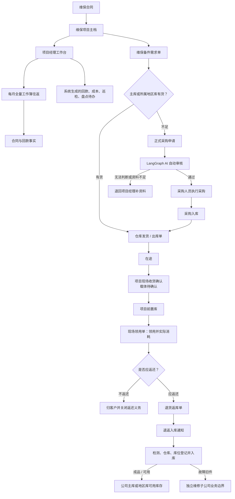
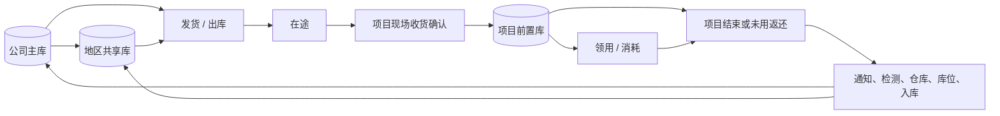

# 维保业务运行手册

| 元数据 | 内容 |
|---|---|
| 状态 | 已确认业务口径；目标流程与当前实现分层维护 |
| 业务负责人 | 甲方维保业务负责人（文档不记录个人姓名） |
| 维护人 | IT_data PM/BA 与发布总控 |
| 最近核对日期 | 2026-08-09 |
| 适用范围 | 维保合同履约、备件流转、项目费用、项目经理待办及相关数据治理 |
| 关联 Issue | [#193 建立维保业务运行手册与单据关联规范](https://github.com/Jinchen-Yang/it-spareparts/issues/193) |
| 关联 PR | [#194 建立共用业务手册与字段契约](https://github.com/Jinchen-Yang/it-spareparts/pull/194) |

> 本手册合并到 GitHub `main` 后，才成为维保业务正式口径。原始会议记录、聊天记录和字段分析只用于追溯来源，不与本手册形成第二份可编辑真相。当前代码能力、目标业务流程和待确认事项必须分开阅读。

## 1. 业务主干

维保业务解决的不是单一“备件出库”问题，而是把合同履约、库存位置、现场消耗、返还义务、项目费用和责任人待办连成可追溯闭环。

业务链依赖关系如下：

1. 维保项目主档聚合该项目关联的全部有效合同，逐份标注合同编号、金额和状态；
2. 项目经理用维保备件需求单表达项目需求；
3. 公司主库或项目所属地区库供货时，仓库执行并形成发货/出库单；
4. 出库只把实物推进到“在途”，项目现场确认收货后才增加项目前置库库存；
5. 已确认的现场领用单记录实际消耗，并建立应返或不返还义务；
6. 返还先有退货返库单，再经过退返入库通知、检测、仓库和库位登记形成入库单；
7. 系统按已确认取价瀑布估算领用成本，叠加审批完成的报销金额形成当前项目成本；首版退货只保留事实，不冲减成本；
8. 项目经理每月下载当前全量工作簿、在表尾追加新记录并回填上传；系统比较版本并生成回款、成本和数据完整性待办。



## 2. 核心业务对象与统一术语

| 对象 | 解决的问题 | 上游依赖 | 下游使用 |
|---|---|---|---|
| 维保合同 | 定义服务承诺、金额和履约期限 | 商务事实 | 项目主档、回款、合同级盈亏 |
| 维保项目主档 | 给项目、负责人和服务范围稳定身份 | 合同及商务单据关系 | 前置库、需求、待办、成本台账 |
| 回款全量表 | 记录项目关联合同的累计回款事实 | 项目主档、全部有效合同 | 回款进度、月度更新待办 |
| 公司主库 | 公司层面的可调配库存 | 采购入库、合格返还入库 | 地区补货、项目供货 |
| 地区共享库 | 为本地区多个项目供货 | 公司主库补货、区域入库 | 本地区项目前置库 |
| 项目前置库 | 存放在客户现场、按项目管理的库存 | 项目现场收货确认 | 现场领用、盘点、项目结束返库 |
| 维保备件需求单 | 表达哪个项目需要什么、需要多少 | 项目主档、现场需求 | 资源检查、采购申请、发货/出库 |
| 发货/出库单 | 证明仓库实际发出什么 | 维保需求及库存 | 在途、现场收货确认、成本证据 |
| 现场收货确认 | 证明项目现场实际收到什么 | 发货/出库 | 项目前置库增加、差异待办 |
| 现场领用单 | 证明现场实际消耗什么 | 项目前置库 | 消耗事实、成本取价、返还义务 |
| 退货返库单 | 记录返还动作已经发起 | 领用、项目结束或未用返还 | 退返入库通知；不直接恢复库存 |
| 退返入库通知 | 把返还动作交接给库房 | 退货返库单 | 检测及正式入库 |
| 入库单 | 记录检测结果、仓库和库位 | 采购或退返入库通知 | 可用库存、成本证据或维修边界 |
| 费用报销支付单 | 归集备件以外的项目支出 | 费用事实及商务关联 | 项目费用、贡献毛利 |
| 项目经理待办 | 告诉负责人下一步必须处理什么 | 系统规则及合同、回款、领用、费用和数据异常 | 处理证据、系统复核、自动关闭或继续逾期 |

## 3. 已确认业务口径

### 3.1 三类库存位置

- **公司主库**是公司层面的可调资源。
- **地区共享库**服务本地区多个项目，可以向区域内项目供货。
- **项目前置库**位于客户现场并按项目管理，原则上只服务所属项目。其他项目前置库不作为日常可调资源，不能因为系统看见“有库存”就跨项目调拨。
- 项目结束或备件正式返还公司，并完成检测、仓库和库位登记后，剩余备件才能重新成为公司可调资源。



“已出库”“在途”“现场已收货”“前置库结存”“已领用并消耗”“应返未返”“返还待入库”和“可用库存”是不同状态，不得互相替代。

### 3.2 需求、发货与收货

- 项目经理只需以维保备件需求单发起业务需求，不重复填写第二张发货申请。
- 库房实际执行后必须形成发货/出库单，记录仓库、PN、必要的 SN、数量、日期和关联需求。
- 发货/出库单证明“仓库已发出”，不证明“项目现场已收到”。只有项目现场确认实收数量、SN 和差异后，项目前置库库存才增加。
- 现场收货确认的载体尚未确认。在载体明确前，系统不得把出库时间静默当成收货时间。

### 3.3 现场领用与返还

- “已使用”以已确认且未作废的现场领用单为权威事实，表示已经从项目前置库领用并实际消耗，不等于发货或收货。
- 现场领用单至少保留领用单号、稳定明细键、项目、日期、PN、按品类要求的 SN、数量、领用人、现场位置和单据状态。项目、数量或稳定身份缺失时不得进入项目成本。
- 备件默认属于公司并需要返还；项目或业务规则明确标注“不返还”时，才归客户并关闭返还义务。
- 退货返库单只表示返还动作已发起，不能直接恢复公司或地区库的可用库存。
- 返还件必须经过退返入库通知、检测、入库仓库和库位登记，并形成入库单。只有检测为成品/可用且正式入库，才恢复可用库存。
- 故障旧件进入独立维修子公司。本期系统到业务交接边界为止，不建设维修、换件、报废或内部结算流程；维修合格件未来通过采购关系回到公司库。
- 首版项目成本不因退货、返库或正式入库而冲减。相关单据和数量仍按原始事实展示，后续启用冲销必须新增经确认的会计事件和迁移方案，不能追溯改写旧结果。

### 3.4 采购申请与 AI 审核

- 系统检查资源时只查询公司主库和项目所属地区库，不把其他项目前置库当作候选。
- 确需采购时，项目经理提交购物车形成正式采购申请。
- 目标流程由 LangGraph AI 按固定标准自动审核，不经过人工审批。规则能够明确判断时给出通过或退回结论；无法判断、证据不足或风险条件不满足时，必须退回项目经理补资料并说明原因。
- 通过后自动生成并推送待执行采购单给采购人员。AI 审核不等于采购执行，采购人员仍负责实际采购。
- 审核标准、阈值、证据和标准化退回原因尚待结构化；在实现完成前，不得把这条目标流程写成已上线能力。

### 3.5 项目经理工作台

项目经理登录后应优先看到自己负责项目的行动项，而不是先看无行动意义的提醒总览：

- 待追款及下一次催款时间；
- 缺失验收报告；
- 待巡检；
- 待盘点；
- 返还、收货差异及其他逾期待办。

已确认边界是待办全部由系统规则生成，项目经理不能手工新建业务待办。待办的接收、转派、处理说明、复核、忽略、自动关闭和去重键属于实现建议，需在待办开发 Issue 中单独确认，不能由研发把建议直接当成已确认流程。

建议首批规则覆盖月度全量表逾期、上传校验或版本冲突、现场领用单无法关联项目、领用成本缺失、成本率达到黄色或红色阈值、合同/领用/报销关键字段缺失，以及审批完成的报销无法关联项目；每条规则的周期、负责人、关闭条件和证据仍需在实现 Issue 中确认。

### 3.6 项目实际成本

```text
项目合同总额 = 截至 as_of 当前项目关联且明确纳入统计的全部合同金额之和
项目当前成本 = 现场领用备件的已取价成本 + 审批完成报销的已确认计入金额
项目成本率 = 项目当前成本 / 项目合同总额
```

- 维保备件需求单确定项目归属和需求；采购订单提供采购价格证据；入库单提供实际入库、价格和质量证据；发货/出库单提供实际流转和出库成本证据。
- 这些单据描述同一批备件在不同环节的证据链，不是四笔可以直接相加的成本。
- 现场领用明细逐行按以下优先级取价：能稳定关联的采购单价；否则同 PN、以领用日为中心前后 7 天的有效采购按数量加权；否则同一窗口的有效销售按数量加权并明确标记“销售估算”；仍无样本则成本留空并标记“成本待补”。每层必须保存来源、样本数、窗口和价格时间，不能只保存结果。
- 加权单价统一为 `Σ(单价 × 数量) / Σ数量`。零价、负数、零数量、无效/作废订单、打包占位 PN 和已确认源错误不得成为样本。
- 退货返库单和返还入库首版均不冲减项目成本。
- 费用报销支付单归集差旅、服务和其他备件以外支出；只有流程已经审批完成的报销单具备进入项目成本的状态资格，其他状态只保留事实。正式取哪一个金额字段仍需用样板锁定，在确认前不得从报销、备用金、借款、核销、实付或明细金额中自行选择或相加。
- 成本率小于 80% 正常；达到 80% 且不超过 100% 黄色提示；超过 100% 红色报警并展示真实超出比例。进度条视觉宽度可以封顶，但数值不得封顶。
- 任一领用行成本缺失时不得按 0 计入。页面显示 `已知成本率 ≥ X%`、待补行数和缺失金额状态；明细仍完整展示。

### 3.7 回款全量表与进度

- 项目经理每月下载系统当前全量工作簿，在 `01_总览` Sheet 的固定“回款明细”表尾追加新记录，再将整本工作簿上传回系统；这不是仅上传当月增量。该 Sheet 同时包含只读“合同清单”，让每笔回款能关联并核对所属合同。
- 实现建议使用稳定实体 ID、基础版本和行签名定位已有行，保证原样回填不重复累计；删除 Excel 行不得直接解释成删除系统事实，历史金额更正应显式留痕。这些安全机制需要在全量往返实现 Issue 中验收，不改变“下载全量、表尾追加、整本回填”的业务口径。
- 实现建议在写入前展示新增、变更、缺失、冲突和拒绝行，旧版本或关键校验失败时整本零写入；具体可写列、更正权限和冲突处理仍需结合样板锁定。
- 回款进度为 `已确认累计回款 / 项目合同总额`。总览同时展示全部合同的编号、金额、状态和合计，不能只给一个无法追溯的总数。
- 合同是否进入总额由规范化关系上的明确“纳入统计”标记和生效区间决定：`effective_from <= as_of < effective_to`，结束时间为空表示持续生效。每条关系必须保留来源状态的映射结果和非空映射规则集版本；未映射关系不得计入。来源状态未映射、金额缺失、同一合同重复关系冲突或同一合同跨项目冲突时，总额为 `null` 并显示完整性原因，不得静默选择或按 0 计算。

### 3.8 页面与四表导出

- 下载能力与项目面板融合，不再把独立下载中心作为主路径。用户先确定项目、数据版本和筛选条件，再预览四个可见 Sheet、各 Sheet 行数、截止时间和缺失数据后下载。
- 四个可见 Sheet 固定为：`01_总览`、`02_备件消耗`、`03_报销单`、`04_项目经理追踪与提醒`。`01_总览` 至少包含只读合同清单和可追加回款明细两个固定表。协议、行签名、版本和字典可以使用隐藏技术 Sheet，不计入业务可见四表。
- 页面和工作簿必须使用同一项目读模型；同一项目、筛选和 `as_of` 下，金额、行数、状态、缺失标记和预警结果必须一致。
- 总览只使用金额行和横向进度条展示回款、成本与数据完整性；不使用成本构成扇形图。成本缺失记录仍显示，并提供带上下文的“去补录”入口。
- 兼容入口必须保留：旧 `/maintenance/downloads` 路由跳到项目工作台并打开导出面板；旧域名访问保持原路径和查询参数后跳转到 `hbzgc.icu`，避免用户重新输入地址。

详见[维保导入字段契约](./import-field-contract.md)。合同级双税毛利及安全往返工作簿继续以 [DEV-15 规格](./dev15-roundtrip-and-tax-policy-spec.md)为实现依据；本手册不把合同级结果伪分摊为项目收入。

## 4. 目标业务流程与角色交接

下表描述目标业务协作，不代表每项均已在 IT_data 上线。

| 业务事件 | 发起/负责 | 接收/协作 | 必须交接的信息 | 目标结果 |
|---|---|---|---|---|
| 建立维保项目 | 商务或项目负责人 | 项目经理、财务、仓库 | 合同、期限、负责人、服务范围、合同金额 | 项目主档和周期计划 |
| 更新合同与回款 | 项目经理 | 系统、财务 | 当前全量工作簿、稳定行 ID、全部合同和新增回款 | 差异预检、版本化导入、回款进度和逾期待办 |
| 申请前置库或补库 | 项目经理 | 系统、仓库 | 项目、PN、数量、需求日期、原因 | 资源检查或正式采购申请 |
| 自动审核采购申请 | LangGraph AI | 项目经理、采购 | 库存、近期消耗、项目依据、建议数量、风险证据 | 通过并推送采购，或退回补资料 |
| 仓库供货 | 仓库 | 项目经理、现场人员 | 需求单、仓库、PN/SN、数量、出库和发货信息 | 发货/出库单与在途状态 |
| 项目现场收货 | 项目经理或现场人员 | 仓库 | 实收数量、SN、差异和证据 | 前置库增加或差异待办 |
| 现场领用 | 现场人员 | 项目经理、仓库 | 已确认现场领用单、项目、设备、PN/SN、数量、时间、返还要求 | 前置库减少、消耗事实、成本取价和返还义务 |
| 发起返还 | 现场人员或项目经理 | 仓库 | 项目、需求单、PN/SN、数量、原因 | 退货返库单和退返入库通知 |
| 返还件验收入库 | 仓库 | 项目经理、库存系统 | 检测结果、入库仓库、库位、数量 | 可用库存恢复或维修边界交接 |
| 提交项目费用 | 报销人员 | 财务、项目经理 | 关联订单、费用类别、事由、日期、金额、流程状态和附件 | 审批完成后具备计入资格；正式金额字段待样板确认 |
| 项目结束 | 项目经理 | 仓库、财务、管理层 | 剩余备件、未结费用、未收款、验收材料 | 剩余备件返库并关闭项目事项 |

## 5. 当前系统已具备的能力

以下只描述 GitHub `main` 的代码能力，不据此推断生产已经部署或真实业务数据已经就绪。

截至 2026-08-09，PR [#196](https://github.com/Jinchen-Yang/it-spareparts/pull/196)、[#198](https://github.com/Jinchen-Yang/it-spareparts/pull/198) 和 [#200](https://github.com/Jinchen-Yang/it-spareparts/pull/200) 已合并到 `main@7bfe7fc0543652e829c4904e2d5364b3ffa5714f`，该合并 SHA 的 push CI 前后端、迁移链和生产依赖扫描全绿。代码已具备：

- 稳定项目主档、稳定项目编号、项目经理、受控建档、归档和恢复；
- 稳定项目与合同的有效期、纳入统计状态及多合同聚合；
- 项目合同总额、实际回款、已定价现场领用、审批完成报销、含税/未税成本及双进度；
- 成本率达到 80% 且不超过 100% 的黄色提示，以及超过 100% 的红色报警；
- 方块式项目工作台、缺成本明细持续展示、项目内补价和项目内四表工作簿下载/回填；
- 四个可见 Sheet、全量快照、表尾追加回款、签名/版本校验、原子导入及旧入口兼容；
- 由业务事实派生的缺合同、缺成本、费用未就绪、成本阈值和回款未完成提醒。

这些代码能力仍不等于真实项目经营闭环已经可用：

- 历史维保来源单中的 `project_raw/project_std` 尚未被业务人员逐单确认并归属稳定项目；同名项目不能自动合并。
- Draft PR [#202](https://github.com/Jinchen-Yang/it-spareparts/pull/202) 只提供人工归属、改派、撤销和审计工具；它尚未合并，也不会自动生成真实映射。
- 项目主档、项目—合同关系、来源维保单归属和真实经营事实没有完成盘点、回填与对账时，项目工作台可能为空或只显示少量新建数据。
- 生产当前运行 `ab42005b5b94bf98b3db0e4bff87e5df9da2f7ca`，不包含 `main@7bfe7fc`；因此 #200 尚未部署、迁移或完成真实账号验收。
- #200 的正式独立审核已记录在 [PR 评论](https://github.com/Jinchen-Yang/it-spareparts/pull/200#issuecomment-5230745772)：Spec 轴通过，Standards 轴发现 2 个 P1、1 个 P2 和 1 个 P3 判断项，产品/数据就绪未通过；[#203](https://github.com/Jinchen-Yang/it-spareparts/issues/203) 关闭前不得进入真实映射、迁移或生产发布。

## 6. 现状差距与待办

| 差距或冲突 | 事实判断 | 处理建议 |
|---|---|---|
| #200 正式审核仍有生产阻断项 | 搜索词日志可能记录项目/合同敏感文字；销售窗口参考价是否计入实际成本及是否允许重算与旧领域口径冲突；无利润权限用户仍可提交财务提醒筛选；稳定项目新词汇未完整同步 | 在 #203 中先完成隐私修复、成本口径决策与测试、权限拒绝语义和领域词汇同步，再重新进行独立审核 |
| 稳定项目主档已有代码，但没有完成真实项目盘点 | 建表和页面不会自动产生可信项目；直接上线可能得到空工作台 | 先由业务负责人确认项目清单、稳定编号、负责人、生命周期和重复/同名边界，再创建或导入主档 |
| 历史来源维保单尚未归属稳定项目 | `project_raw/project_std` 只用于核对，不能作为稳定身份；#202 只是待合并工具 | 按单据头人工归属，保留原项目文字；同名可分项目，改名不新建项目，禁止名称自动推断 |
| 项目—合同关系只完成基础关系 | 已支持多合同聚合和有效期，但预付、正式、补充、续签、变更的商务角色链尚未闭环 | 先盘点真实合同/销售单角色，再建立可审计、无环的关系链；未映射或冲突时合同总额失败关闭 |
| 代码迁移与业务数据迁移尚未分开验收 | Alembic 全绿只证明结构迁移可执行，不证明真实项目数据正确 | 独立准备映射清单、dry-run、数量/金额对账、失败回滚和业务签字，不在代码部署时猜测生产关系 |
| 生产尚未包含 #200 | 当前生产 SHA 为 `ab42005b`；`.deploy/backup.sh`、`.deploy/monitor.sh` 相对该旧 HEAD 为 tracked 改动，但文件哈希与 `main@7bfe7fc` 完全一致 | 将其作为已知 main 版本的生产覆盖层纳入发布计划，避免 checkout/清理误伤；锁定备份和回滚 SHA，部署、数据迁移和真实账号验收分别放行 |
| 出库到现场收货缺少确认载体 | 发货单只能证明仓库发出 | 在 [#193](https://github.com/Jinchen-Yang/it-spareparts/issues/193) 保留待确认，确认后另建实现 Issue |
| 前置库、收货、返还义务和正式入库尚未闭环 | #200 已建立现场领用和成本事实，但不能替代完整实物生命周期 | 返件事实继续保留且首版不冲成本；收货、返还和入库按独立 Issue 建设 |
| 费用生效状态已有新口径，金额、项目映射与日期仍需落契约 | 只有审批完成的报销单具备计入资格；正式金额列仍未确认 | 在样板中锁定状态、金额、关联键和日期；未知口径失败关闭 |
| AI 自动审核未实现，且旧 backlog 仍写“不得自动审批” | 2026-08-05 最新确认已改为 LangGraph AI 自动审核 | 手册采用最新目标口径；另行修订 [#128](https://github.com/Jinchen-Yang/it-spareparts/issues/128) 与 [#136 D2](https://github.com/Jinchen-Yang/it-spareparts/issues/136)，本 PR 不改 backlog |
| 旧说明把“销售成本池排除维保采购”写成“维保不计成本” | 两个统计范围不同，旧措辞会否定维保项目成本 | 对历史文件加最小范围提示；维保项目成本以本手册为准 |
| 旧成本方案用需求行 `return_qty` 直接冲减成本 | 最新口径明确首版退货不冲项目成本 | 新实现停止以退货数量冲成本；保留退货事实和旧结果追溯 |

## 7. 仍待确认事项

1. 真实项目全量清单、权威稳定编号、同名/改名边界，以及每张历史来源维保单的人工归属；
2. 合同、预付/正式/补充/续签/变更销售单到项目的商务角色和稳定关系；
3. 同一项目是否允许多个不同地点的前置库；
4. 哪些品类必须按 SN 逐件管理，哪些只按 PN 和数量管理；
5. 项目现场收货确认的单据或状态，以及差异处理责任；
6. 现场领用单的真实字段名、有效状态原值、稳定表头/明细 ID 和项目关联键；
7. 回款全量表的真实表头、实际回款确认字段、每月截止日和更正权限；
8. 费用报销到项目唯一编号的映射、审批完成状态原值、正式计入金额字段和归属日期；
9. 系统待办的周期、责任人、处理状态、关闭条件与证据；
10. LangGraph AI 自动审核的规则、阈值、所需证据、审计记录和标准退回原因。

未确认问题集中跟踪于 [#136](https://github.com/Jinchen-Yang/it-spareparts/issues/136) 和 [#193](https://github.com/Jinchen-Yang/it-spareparts/issues/193)。不同答案会改变数据模型、权限、统计或流程时，研发不得自行猜测。

## 8. #200 上生产前的固定顺序

以下五道门必须顺序通过，任何一道失败都不得用“页面能打开”替代：

1. **代码审核门（当前未通过）**：已固定 #200 的 base/head 和合并 SHA，PR CI 与合并后 `main` CI 全绿；正式独立审核的 Spec 轴通过，但 Standards 轴和产品/数据就绪未通过。必须先关闭 #203 并重新审核，才可进入项目映射门。
2. **项目映射门**：业务负责人签署真实项目清单；每张来源维保单按单据头归属唯一稳定项目，未归属和有歧义记录单独列出，禁止按名称自动猜测。
3. **数据迁移门**：在生产副本或隔离环境 dry-run；分别核对项目数、来源单据头数、合同关系数、回款金额、已定价/未定价领用数和审批完成报销金额。任一关键数量或金额不一致则停止。
4. **生产发布门**：识别并保护生产目录中与当前 main 一致的运维脚本覆盖层，完成数据库与应用备份，锁定目标 SHA、迁移版本、回滚 SHA 和回滚步骤，再取得单独部署授权。
5. **真实验收门**：使用真实管理员和受限业务账号检查项目列表、项目详情、权限、四表下载/原样回填、缺成本补录及旧地址跳转；核对非空项目和抽样金额，完成观察窗口后才可宣布生产可用。

最低数据就绪指标必须包括：稳定项目总数、已归属/未归属来源单据头数、歧义数、项目—合同已确认/未确认数、合同金额完整率、领用成本完整率、报销关联完整率。没有这些数据，#200 只能判定为“代码已合并”，不能判定为“业务工作台可用”。

## 9. 变更与治理规则

1. 正式业务口径只在 GitHub `main` 的本手册维护；所有修改必须走 PR。
2. 未确认问题先进入 GitHub Issue，确认日期和原回答必须保留，不覆盖历史讨论。
3. 实现规格必须链接本手册章节和对应 Issue；聊天记录、会议纪要和旧设计稿只能作为来源。
4. Mermaid 代码块是流程图源文件，不并行维护手工 PNG。
5. 实现和发布分别验收；“目标流程已确认”“代码已合并”“生产已部署”是三种不同状态。
6. 不在仓库手册保存真实客户、供应商、联系人、账户、附件地址或业务样例行。

返回[维保文档入口](./README.md)。
