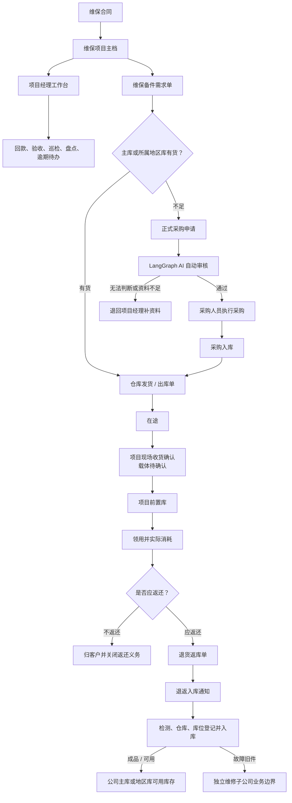
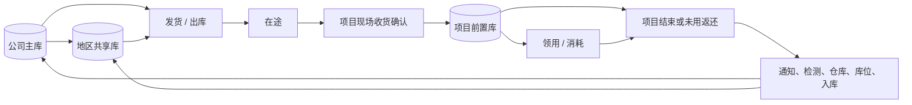

# 维保业务运行手册

| 元数据 | 内容 |
|---|---|
| 状态 | 已确认业务口径；目标流程与当前实现分层维护 |
| 业务负责人 | 甲方维保业务负责人（文档不记录个人姓名） |
| 维护人 | IT_data PM/BA 与发布总控 |
| 最近核对日期 | 2026-08-06 |
| 适用范围 | 维保合同履约、备件流转、项目费用、项目经理待办及相关数据治理 |
| 关联 Issue | [#193 建立维保业务运行手册与单据关联规范](https://github.com/Jinchen-Yang/it-spareparts/issues/193) |
| 关联 PR | 待本分支 Draft PR 创建后由 GitHub 关联 |

> 本手册合并到 GitHub `main` 后，才成为维保业务正式口径。原始会议记录、聊天记录和字段分析只用于追溯来源，不与本手册形成第二份可编辑真相。当前代码能力、目标业务流程和待确认事项必须分开阅读。

## 1. 业务主干

维保业务解决的不是单一“备件出库”问题，而是把合同履约、库存位置、现场消耗、返还义务、项目费用和责任人待办连成可追溯闭环。

业务链依赖关系如下：

1. 维保合同与项目主档确定服务范围、期限和项目经理；
2. 项目经理用维保备件需求单表达项目需求；
3. 公司主库或项目所属地区库供货时，仓库执行并形成发货/出库单；
4. 出库只把实物推进到“在途”，项目现场确认收货后才增加项目前置库库存；
5. 现场领用记录实际消耗，并建立应返或不返还义务；
6. 返还先有退货返库单，再经过退返入库通知、检测、仓库和库位登记形成入库单；
7. 已确认备件成本与已确认项目费用共同构成项目实际成本；
8. 项目经理持续处理回款、验收、巡检、盘点和逾期待办。



## 2. 核心业务对象与统一术语

| 对象 | 解决的问题 | 上游依赖 | 下游使用 |
|---|---|---|---|
| 维保合同 | 定义服务承诺、金额和履约期限 | 商务事实 | 项目主档、回款、合同级盈亏 |
| 维保项目主档 | 给项目、负责人和服务范围稳定身份 | 合同及商务单据关系 | 前置库、需求、待办、成本台账 |
| 公司主库 | 公司层面的可调配库存 | 采购入库、合格返还入库 | 地区补货、项目供货 |
| 地区共享库 | 为本地区多个项目供货 | 公司主库补货、区域入库 | 本地区项目前置库 |
| 项目前置库 | 存放在客户现场、按项目管理的库存 | 项目现场收货确认 | 现场领用、盘点、项目结束返库 |
| 维保备件需求单 | 表达哪个项目需要什么、需要多少 | 项目主档、现场需求 | 资源检查、采购申请、发货/出库 |
| 发货/出库单 | 证明仓库实际发出什么 | 维保需求及库存 | 在途、现场收货确认、成本证据 |
| 现场收货确认 | 证明项目现场实际收到什么 | 发货/出库 | 项目前置库增加、差异待办 |
| 领用记录 | 证明现场实际消耗什么 | 项目前置库 | 消耗事实、返还义务 |
| 退货返库单 | 记录返还动作已经发起 | 领用、项目结束或未用返还 | 退返入库通知；不直接恢复库存 |
| 退返入库通知 | 把返还动作交接给库房 | 退货返库单 | 检测及正式入库 |
| 入库单 | 记录检测结果、仓库和库位 | 采购或退返入库通知 | 可用库存、成本证据或维修边界 |
| 费用报销支付单 | 归集备件以外的项目支出 | 费用事实及商务关联 | 项目费用、贡献毛利 |
| 项目经理待办 | 告诉负责人下一步必须处理什么 | 合同节点、巡检、盘点、费用和库存异常 | 处理证据、关闭或继续逾期 |

## 3. 已确认业务口径

### 3.1 三类库存位置

- **公司主库**是公司层面的可调资源。
- **地区共享库**服务本地区多个项目，可以向区域内项目供货。
- **项目前置库**位于客户现场并按项目管理，原则上只服务所属项目。其他项目前置库不作为日常可调资源，不能因为系统看见“有库存”就跨项目调拨。
- 项目结束或备件正式返还公司，并完成检测、仓库和库位登记后，剩余备件才能重新成为公司可调资源。



“已出库”“在途”“现场已收货”“前置库结存”“已领用并消耗”“应返未返”“返还待入库”和“可用库存”是不同状态，不得互相替代。

### 3.2 需求、发货与收货

- 项目经理只需以维保备件需求单发起业务需求，不重复填写第二张发货申请。
- 库房实际执行后必须形成发货/出库单，记录仓库、PN、必要的 SN、数量、日期和关联需求。
- 发货/出库单证明“仓库已发出”，不证明“项目现场已收到”。只有项目现场确认实收数量、SN 和差异后，项目前置库库存才增加。
- 现场收货确认的载体尚未确认。在载体明确前，系统不得把出库时间静默当成收货时间。

### 3.3 现场领用与返还

- “已使用”表示已经从项目前置库领用并实际消耗，不等于发货或收货。
- 备件默认属于公司并需要返还；项目或业务规则明确标注“不返还”时，才归客户并关闭返还义务。
- 退货返库单只表示返还动作已发起，不能直接恢复公司或地区库的可用库存。
- 返还件必须经过退返入库通知、检测、入库仓库和库位登记，并形成入库单。只有检测为成品/可用且正式入库，才恢复可用库存。
- 故障旧件进入独立维修子公司。本期系统到业务交接边界为止，不建设维修、换件、报废或内部结算流程；维修合格件未来通过采购关系回到公司库。

### 3.4 采购申请与 AI 审核

- 系统检查资源时只查询公司主库和项目所属地区库，不把其他项目前置库当作候选。
- 确需采购时，项目经理提交购物车形成正式采购申请。
- 目标流程由 LangGraph AI 按固定标准自动审核，不经过人工审批。规则能够明确判断时给出通过或退回结论；无法判断、证据不足或风险条件不满足时，必须退回项目经理补资料并说明原因。
- 通过后自动生成并推送待执行采购单给采购人员。AI 审核不等于采购执行，采购人员仍负责实际采购。
- 审核标准、阈值、证据和标准化退回原因尚待结构化；在实现完成前，不得把这条目标流程写成已上线能力。

### 3.5 项目经理工作台

项目经理登录后应优先看到自己负责项目的行动项，而不是先看无行动意义的提醒总览：

- 待追款及下一次催款时间；
- 缺失验收报告；
- 待巡检；
- 待盘点；
- 返还、收货差异及其他逾期待办。

每个待办需要负责人、业务截止点、完成证据和关闭状态。具体字段仍依赖项目主档、收款与验收数据源确认。

### 3.6 项目实际成本

```text
项目实际成本 = 已确认备件成本 + 已确认项目费用
```

- 维保备件需求单确定项目归属和需求；采购订单提供采购价格证据；入库单提供实际入库、价格和质量证据；发货/出库单提供实际流转和出库成本证据。
- 这些单据描述同一批备件在不同环节的证据链，不是四笔可以直接相加的成本。
- 备件最终采用采购价、入库成本、出库成本、移动平均成本或其他口径，仍需财务确认。任何未确认口径必须失败关闭并保留证据状态。
- 退货返库单本身不构成库存恢复，也不自动构成成本冲回。成本何时、按什么检测结果和计价规则冲回仍待确认。
- 费用报销支付单归集差旅、服务和其他备件以外支出。真实表头同时包含报销、备用金、借款、核销和实付等金额，不能全部相加；计入金额、有效流程状态和归属日期仍由财务确认。

详见[维保导入字段契约](./import-field-contract.md)。合同级双税毛利及安全往返工作簿继续以 [DEV-15 规格](./dev15-roundtrip-and-tax-policy-spec.md)为实现依据；本手册不把合同级结果伪分摊为项目收入。

## 4. 目标业务流程与角色交接

下表描述目标业务协作，不代表每项均已在 IT_data 上线。

| 业务事件 | 发起/负责 | 接收/协作 | 必须交接的信息 | 目标结果 |
|---|---|---|---|---|
| 建立维保项目 | 商务或项目负责人 | 项目经理、财务、仓库 | 合同、期限、负责人、服务范围、合同金额 | 项目主档和周期计划 |
| 申请前置库或补库 | 项目经理 | 系统、仓库 | 项目、PN、数量、需求日期、原因 | 资源检查或正式采购申请 |
| 自动审核采购申请 | LangGraph AI | 项目经理、采购 | 库存、近期消耗、项目依据、建议数量、风险证据 | 通过并推送采购，或退回补资料 |
| 仓库供货 | 仓库 | 项目经理、现场人员 | 需求单、仓库、PN/SN、数量、出库和发货信息 | 发货/出库单与在途状态 |
| 项目现场收货 | 项目经理或现场人员 | 仓库 | 实收数量、SN、差异和证据 | 前置库增加或差异待办 |
| 现场领用 | 现场人员 | 项目经理、仓库 | 项目、设备、PN/SN、数量、时间、返还要求 | 前置库减少、消耗事实和返还义务 |
| 发起返还 | 现场人员或项目经理 | 仓库 | 项目、需求单、PN/SN、数量、原因 | 退货返库单和退返入库通知 |
| 返还件验收入库 | 仓库 | 项目经理、库存系统 | 检测结果、入库仓库、库位、数量 | 可用库存恢复或维修边界交接 |
| 提交项目费用 | 报销人员 | 财务、项目经理 | 关联订单、费用类别、事由、日期、金额和附件 | 经确认的项目费用事实 |
| 项目结束 | 项目经理 | 仓库、财务、管理层 | 剩余备件、未结费用、未收款、验收材料 | 剩余备件返库并关闭项目事项 |

## 5. 当前系统已具备的能力

以下只列 GitHub `main` 已有规格和实现，不据此推断生产部署状态：

- 维保项目数据、合同级详细盈亏、下载中心和项目提醒三个并列入口；
- 按维保终止日期区分进行中、已结束和期限缺失，并在项目、合同看板和导出中保持一致，见 [DEV-12](./dev12-lifecycle-spec.md)；
- 对维保需求号与采购关联做只读、脱敏的归因审计，不自动修复，见 [DEV-13A](./dev13a-match-audit-spec.md)；
- 合同级含税/未税备件毛利和贡献毛利、缺失成本证据状态，以及固定、签名、可幂等回填的往返工作簿，见 [DEV-14 确认记录](./dev14-client-confirmation-checklist.md)和 [DEV-15](./dev15-roundtrip-and-tax-policy-spec.md)；
- 项目成本 CSV、合同详细盈亏 CSV、单合同 XLSX 和批量 ZIP 等受权限控制的下载能力。

这些能力不等于已经实现项目前置库收货、领用/消耗、返还入库、项目主档或 LangGraph AI 采购自动审核。

## 6. 现状差距与待办

| 差距或冲突 | 事实判断 | 处理建议 |
|---|---|---|
| 项目与合同/销售订单缺少稳定映射 | 尚无可审计的项目唯一编号和收入分摊依据 | 继续由 [#128](https://github.com/Jinchen-Yang/it-spareparts/issues/128) 的项目主档与商务单据关系承接 |
| 出库到现场收货缺少确认载体 | 发货单只能证明仓库发出 | 在 [#193](https://github.com/Jinchen-Yang/it-spareparts/issues/193) 保留待确认，确认后另建实现 Issue |
| 前置库、领用、返还义务和正式入库尚未闭环 | 当前维护数据与成本能力不能替代实物生命周期 | 由 [#128](https://github.com/Jinchen-Yang/it-spareparts/issues/128) 的库存/返件工作项分切片实现 |
| 费用计入金额、状态和日期未确认 | 字段已验证，但财务口径未确认 | 回填 [#136 E2](https://github.com/Jinchen-Yang/it-spareparts/issues/136) 后再开发 |
| AI 自动审核未实现，且旧 backlog 仍写“不得自动审批” | 2026-08-05 最新确认已改为 LangGraph AI 自动审核 | 手册采用最新目标口径；另行修订 [#128](https://github.com/Jinchen-Yang/it-spareparts/issues/128) 与 [#136 D2](https://github.com/Jinchen-Yang/it-spareparts/issues/136)，本 PR 不改 backlog |
| 旧说明把“销售成本池排除维保采购”写成“维保不计成本” | 两个统计范围不同，旧措辞会否定维保项目成本 | 对历史文件加最小范围提示；维保项目成本以本手册为准 |
| 旧成本方案用需求行 `return_qty` 直接冲减成本 | 最新流程要求返库不直接恢复库存；成本冲回规则尚未确认 | 保留历史实现事实并加提示，不把它升级为目标业务口径 |

## 7. 仍待确认事项

1. 项目主档的权威项目编号，以及合同、预付/正式/补充/续签/变更销售单到项目的稳定关系；
2. 同一项目是否允许多个不同地点的前置库；
3. 哪些品类必须按 SN 逐件管理，哪些只按 PN 和数量管理；
4. 项目现场收货确认的单据或状态，以及差异处理责任；
5. 备件实际成本的最终计价来源，正式入库后何时、如何冲回项目成本；
6. 费用报销到项目唯一编号的映射、正式计入金额、有效流程状态和归属日期；
7. LangGraph AI 自动审核的规则、阈值、所需证据、审计记录和标准退回原因；
8. 待追款、验收、巡检和盘点待办的权威数据源、周期、责任人与关闭证据。

未确认问题集中跟踪于 [#136](https://github.com/Jinchen-Yang/it-spareparts/issues/136) 和 [#193](https://github.com/Jinchen-Yang/it-spareparts/issues/193)。不同答案会改变数据模型、权限、统计或流程时，研发不得自行猜测。

## 8. 变更与治理规则

1. 正式业务口径只在 GitHub `main` 的本手册维护；所有修改必须走 PR。
2. 未确认问题先进入 GitHub Issue，确认日期和原回答必须保留，不覆盖历史讨论。
3. 实现规格必须链接本手册章节和对应 Issue；聊天记录、会议纪要和旧设计稿只能作为来源。
4. Mermaid 代码块是流程图源文件，不并行维护手工 PNG。
5. 实现和发布分别验收；“目标流程已确认”“代码已合并”“生产已部署”是三种不同状态。
6. 不在仓库手册保存真实客户、供应商、联系人、账户、附件地址或业务样例行。

返回[维保文档入口](./README.md)。
