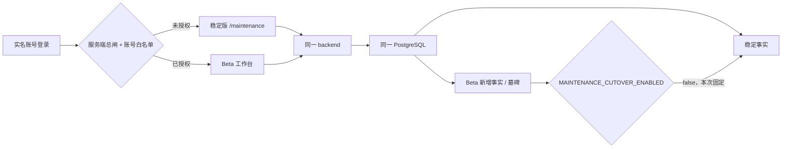

# v1.21 维保 / 补库 Beta 独立发布 Runbook

## 1. 发布目标与隔离边界

本次不是把稳定版替换成 Beta，而是在同一套 HTTPS、backend 和 PostgreSQL 上增加两条
受控入口：稳定版仍是默认入口，Beta 只对实名白名单开放。



三道全局开关在部署、迁移和稳定版 smoke 期间必须同时为 `false`：

- `MAINTENANCE_BETA_ENABLED=false`
- `REPLENISHMENT_BETA_ENABLED=false`
- `MAINTENANCE_CUTOVER_ENABLED=false`

前两项仅在空白名单隔离验证后打开；第三项本次绝不打开。关闭 Beta 只隐藏入口并拒绝
Beta 请求，不删除已经形成的 Beta 事实。稳定版继续读取原有事实；维保删除墓碑等 Beta
状态只有未来另行批准 cutover 后才影响稳定计算。

## 2. 不可绕过的上线门禁

以下任一项不成立即停止：

1. 候选 PR 已合并，`origin/main` 的 exact 40 位 SHA 与 GitHub `main` 一致；合并后
   `main` 的后端、前端两个必需 check 均成功。
2. 两轮独立审核在同一个 exact SHA 上均无 P0/P1。
3. 生产父 SHA、DB head、Compose hash、旧镜像 ID 都从生产实时读取，不从旧 Runbook
   或聊天记录抄写。
4. Alembic 必须且只能从 `f1c8e4a7b2d9` 前进到 `d9f1a3c7e5b2`；manifest 自动记录
   其间每个迁移文件的路径、父 revision、SHA-256、总数和总摘要。
5. 候选镜像必须从 exact merged SHA 的 `git archive` 构建；生产只 `docker load`，不在
   生产 checkout 里构建。
6. 先在隔离的生产副本上完成 `f1→d9` 演练，再在发布窗口对生产 DB 做一份新的完整
   dump，验证 checksum、TOC，并在 `--network none` 的临时 PostgreSQL 中完整恢复。
7. 生产迁移前无 `processing` 导入、无 blocked session、无等待锁、无超过 60 秒事务。
8. 首批 Maintenance Beta 名单不得含 admin、共享口令或泛化账号。名单逐账号记录
   `page_maintenance`、`page_maintenance_beta` 和全部 Maintenance action 的有效值；所有
   写 action 默认 `false`，任何 `true` 都必须绑定 exact target SHA 的 canary 验收证据。
9. Replenishment 可使用独立实名白名单，但必须同时记录价格权限、create 和 review
   action；任何写 action 的 `true` 同样必须有 canary 证据。
10. `.env` 中 `MAINTENANCE_MANIFEST_ACTIVE_HMAC_KEY` 必须存在；manifest 只记录 key id
    与密钥 SHA-256 fingerprint，任何脚本和证据均不得打印密钥本身。

历史 `.deploy/*v120*` 只服务 v1.20，严禁复用或修改。本 Runbook 只调用
`.deploy/v121_beta_*`。

## 3. 在可信控制机锁定 exact SHA 与 CI

以下目录必须位于加密磁盘，权限 `700`。命令中的 SHA 均由实时状态生成，不存在可误用的
示例 SHA。

```bash
REPO_ROOT=$(git rev-parse --show-toplevel)
git -C "$REPO_ROOT" fetch --prune origin
TARGET_SHA=$(git -C "$REPO_ROOT" rev-parse refs/remotes/origin/main)
test "$(git -C "$REPO_ROOT" rev-parse "$TARGET_SHA^{commit}")" = "$TARGET_SHA"

CONTROL_ROOT=$(mktemp -d)
chmod 700 "$CONTROL_ROOT"

python3 "$REPO_ROOT/.deploy/v121_beta_manifest.py" capture-ci \
  --repository Jinchen-Yang/it-spareparts \
  --target-sha "$TARGET_SHA" \
  --required-check '后端测试（pytest + 迁移链验证）' \
  --required-check '前端类型检查 + 构建' \
  --output "$CONTROL_ROOT/github-main-ci.json"
```

`capture-ci` 会直接读取 GitHub `main` 和该 commit 的 check-runs。SHA 不是当前 GitHub
`main`、check 未完成或必需 check 不是 `success` 都会失败；保存的 CI 文件随后写入
manifest 的路径与摘要。

## 4. 从生产实时捕获父版本与旧制品

生产只读快照至少包含：v1.20 state 中的 `TARGET_COMMIT`、DB head、当前 Compose、DB / app /
frontend 正在运行的镜像 ID、DB restart count、三道 flag 和 HMAC fingerprint。密钥本身不能
离开生产。

```bash
PROD=it-spareparts-prod
APP_DIR=/home/ubuntu/apps/it-spareparts

ssh "$PROD" sudo cat "$APP_DIR/docker-compose.yml" \
  >"$CONTROL_ROOT/current-production-compose.yml"
chmod 600 "$CONTROL_ROOT/current-production-compose.yml"

ssh "$PROD" sudo bash -s >"$CONTROL_ROOT/production-baseline.json" <<'ROOT'
set -Eeuo pipefail
umask 077
app_dir=/home/ubuntu/apps/it-spareparts
state=/var/lib/it-spareparts-release-control/v120-state.state
compose() {
  env -u COMPOSE_FILE -u COMPOSE_PROJECT_NAME -u COMPOSE_PROFILES \
    docker compose --project-name it-spareparts --env-file "$app_dir/.env" \
      -f "$app_dir/docker-compose.yml" "$@"
}
python3 - "$state" "$app_dir/.env" \
  "$(compose ps -q db)" "$(compose ps -q app)" "$(compose ps -q frontend)" <<'PY'
import hashlib,json,pathlib,shlex,subprocess,sys
state_path,env_path,db_cid,app_cid,frontend_cid=sys.argv[1:]
state={}
for raw in pathlib.Path(state_path).read_text(encoding="utf-8").splitlines():
    if "=" in raw:
        key,value=raw.split("=",1); state[key]=value
wanted={"MAINTENANCE_BETA_ENABLED","REPLENISHMENT_BETA_ENABLED",
        "MAINTENANCE_CUTOVER_ENABLED","MAINTENANCE_MANIFEST_ACTIVE_KEY_ID",
        "MAINTENANCE_MANIFEST_ACTIVE_HMAC_KEY"}
env={}
for raw in pathlib.Path(env_path).read_text(encoding="utf-8").splitlines():
    if "=" not in raw: continue
    key,value=raw.split("=",1)
    if key in wanted:
        parsed=shlex.split(value.strip()) if value.strip().startswith(("'",'"')) else [value.strip()]
        if len(parsed)!=1 or key in env: raise SystemExit("invalid protected env")
        env[key]=parsed[0]
for key in ("MAINTENANCE_BETA_ENABLED","REPLENISHMENT_BETA_ENABLED",
            "MAINTENANCE_CUTOVER_ENABLED"):
    env.setdefault(key,"false")
if wanted-env.keys(): raise SystemExit("protected HMAC env key missing")
def inspect(cid,field):
    return subprocess.check_output(["docker","inspect","-f",field,cid],text=True).strip()
db_head=subprocess.check_output(["docker","exec",db_cid,"psql","-X","-U","spareparts",
                                 "-d","spareparts","-At","-c",
                                 "SELECT version_num FROM alembic_version;"],text=True).strip()
payload={"parent_production_sha":state["TARGET_COMMIT"],"db_head":db_head,
 "db_container_id":db_cid,"db_image_id":inspect(db_cid,"{{.Image}}"),
 "db_restart_count":int(inspect(db_cid,"{{.RestartCount}}")),
 "old_app_image_id":inspect(app_cid,"{{.Image}}"),
 "old_frontend_image_id":inspect(frontend_cid,"{{.Image}}"),
 "maintenance_beta_enabled":env["MAINTENANCE_BETA_ENABLED"],
 "replenishment_beta_enabled":env["REPLENISHMENT_BETA_ENABLED"],
 "maintenance_cutover_enabled":env["MAINTENANCE_CUTOVER_ENABLED"],
 "manifest_hmac_key_id":env["MAINTENANCE_MANIFEST_ACTIVE_KEY_ID"],
 "manifest_hmac_key_fingerprint_sha256":hashlib.sha256(
     env["MAINTENANCE_MANIFEST_ACTIVE_HMAC_KEY"].encode()).hexdigest()}
print(json.dumps(payload,sort_keys=True,separators=(",",":")))
PY
ROOT
chmod 600 "$CONTROL_ROOT/production-baseline.json"
```

人工核对三个 flag 均为 `false`、DB head 为 `f1c8e4a7b2d9`，并把生产旧镜像和 DB 镜像
以 `docker save` 导出到可信控制机。导出文件逐个 SHA-256 校验，不通过网络引用/tag 猜镜像。

## 5. exact-SHA 构建候选镜像

```bash
"$REPO_ROOT/.deploy/v121_beta_build.sh" \
  "$REPO_ROOT" "$TARGET_SHA" "$CONTROL_ROOT/build"

python3 - "$CONTROL_ROOT/build/build-evidence.json" <<'PY'
import json,sys
row=json.load(open(sys.argv[1],encoding="utf-8"))
print(row["target_sha"], row["app_image_id"], row["frontend_image_id"])
PY
```

构建器使用 `git archive` 创建独立 source tree，并输出：source tar、app/frontend exact image
ID、离线 image bundle 及其摘要。它拒绝 target 不是当前 `origin/main` 的情况。

## 6. 在隔离生产副本上演练 f1→d9

从生产创建一份只读窗口内的新 custom-format dump，传到可信控制机后设为 `600`。同时将
生产 DB/旧业务镜像加载到可信控制机。演练容器使用 internal Docker network 与 tmpfs，绝不
连接生产网络或生产卷。

```bash
BASELINE="$CONTROL_ROOT/production-baseline.json"
PARENT_PRODUCTION_SHA=$(python3 -c \
  'import json,sys; print(json.load(open(sys.argv[1]))["parent_production_sha"])' "$BASELINE")
DB_IMAGE_ID=$(python3 -c \
  'import json,sys; print(json.load(open(sys.argv[1]))["db_image_id"])' "$BASELINE")
OLD_APP_IMAGE_ID=$(python3 -c \
  'import json,sys; print(json.load(open(sys.argv[1]))["old_app_image_id"])' "$BASELINE")
OLD_FRONTEND_IMAGE_ID=$(python3 -c \
  'import json,sys; print(json.load(open(sys.argv[1]))["old_frontend_image_id"])' "$BASELINE")
NEW_APP_IMAGE_ID=$(python3 -c \
  'import json,sys; print(json.load(open(sys.argv[1]))["app_image_id"])' \
  "$CONTROL_ROOT/build/build-evidence.json")
NEW_FRONTEND_IMAGE_ID=$(python3 -c \
  'import json,sys; print(json.load(open(sys.argv[1]))["frontend_image_id"])' \
  "$CONTROL_ROOT/build/build-evidence.json")

"$REPO_ROOT/.deploy/v121_beta_rehearse.sh" \
  "$CONTROL_ROOT/production-copy.dump" \
  "$TARGET_SHA" "$PARENT_PRODUCTION_SHA" "$DB_IMAGE_ID" \
  "$NEW_APP_IMAGE_ID" "$OLD_APP_IMAGE_ID" "$OLD_FRONTEND_IMAGE_ID" \
  "$CONTROL_ROOT/stable-test-credential.json" \
  test-old-images "$CONTROL_ROOT/rehearsal"
```

演练记录迁移耗时、`pg_locks`、blocked session、长事务、`statement_timeout=120s` 和
`lock_timeout=5s`。`test-old-images` 还要求旧 app image 在 d9 上完成稳定接口 smoke；成功
才生成 `old-images-on-d9-rehearsal.json`。若这一步失败，重新以 `forward-only` 完成迁移
演练，但生成 manifest 时不传旧镜像演练文件；发布后旧镜像回切将被永久拒绝。

演练成功只证明“这一份生产副本”通过，不替代发布窗口的新备份/恢复，也不证明真实用户
验收通过。

## 7. 实名 Beta 权限图

准备 `v121-beta-allowlist-v1` JSON。每个账号必须写明 role、两类页面和所有相关 action
的最终 effective 值。Maintenance 首批账号不能是 admin；所有写 action 默认 `false`。

任何写 action 改为 `true` 前，先在 exact target SHA 的隔离 canary 中验收，并提供
`v121-action-canary-v1` JSON，至少包含：`username`、`action`、`target_sha`、
`conclusion: passed`。allowlist 通过路径和 SHA-256 绑定该文件。manifest 只保留整张
权限图、Maintenance 投影、Replenishment 投影的摘要和账号数，不暴露用户名。

全局 Beta 闸打开、白名单仍为空是必经安全阶段；目标权限图不能提前写进生产。

## 8. 生成不可变 manifest 包

```bash
HMAC_KEY_ID=$(python3 -c \
  'import json,sys; print(json.load(open(sys.argv[1]))["manifest_hmac_key_id"])' "$BASELINE")
HMAC_FINGERPRINT=$(python3 -c \
  'import json,sys; print(json.load(open(sys.argv[1]))["manifest_hmac_key_fingerprint_sha256"])' "$BASELINE")

GENERATOR_ARGS=(
  --repo "$REPO_ROOT"
  --repository Jinchen-Yang/it-spareparts
  --target-sha "$TARGET_SHA"
  --parent-production-sha "$PARENT_PRODUCTION_SHA"
  --current-compose "$CONTROL_ROOT/current-production-compose.yml"
  --old-app-image-id "$OLD_APP_IMAGE_ID"
  --old-frontend-image-id "$OLD_FRONTEND_IMAGE_ID"
  --new-app-image-id "$NEW_APP_IMAGE_ID"
  --new-frontend-image-id "$NEW_FRONTEND_IMAGE_ID"
  --db-image-id "$DB_IMAGE_ID"
  --ci-evidence "$CONTROL_ROOT/github-main-ci.json"
  --required-check '后端测试（pytest + 迁移链验证）'
  --required-check '前端类型检查 + 构建'
  --build-evidence "$CONTROL_ROOT/build/build-evidence.json"
  --source-tar "$CONTROL_ROOT/build/source.tar"
  --image-bundle "$CONTROL_ROOT/build/images.tar"
  --migration-rehearsal "$CONTROL_ROOT/rehearsal/production-copy-migration-rehearsal.json"
  --beta-allowlist "$CONTROL_ROOT/beta-allowlist.json"
  --manifest-hmac-key-id "$HMAC_KEY_ID"
  --manifest-hmac-key-fingerprint "$HMAC_FINGERPRINT"
  --output-dir "$CONTROL_ROOT/release-package"
)

# 只有 old-images-on-d9 演练真实通过时才追加这一参数；否则保持 forward-only。
if test -f "$CONTROL_ROOT/rehearsal/old-images-on-d9-rehearsal.json"; then
  GENERATOR_ARGS+=(--old-image-d9-rehearsal \
    "$CONTROL_ROOT/rehearsal/old-images-on-d9-rehearsal.json")
fi

python3 "$REPO_ROOT/.deploy/v121_beta_manifest.py" generate "${GENERATOR_ARGS[@]}"
python3 "$CONTROL_ROOT/release-package/v121_beta_manifest.py" verify \
  "$CONTROL_ROOT/release-package"
```

manifest 固定：exact merged SHA、父生产 SHA、f1→d9、迁移 inventory count/hash、当前与
候选 Compose hash、旧/新 app/frontend image ID、DB image ID、CI/build/rehearsal 路径与
摘要、HMAC fingerprint、实名权限图摘要和 rollback policy。输出目录已存在时生成器拒绝
覆盖。

## 9. 传输与生产 preflight

把 `release-package` 和 `build/images.tar` 传到生产 root 私有 staging；在可信控制机和
生产各计算一次 SHA-256。先验证 bundle 摘要，再 `docker load`。不要在生产执行 build。

```bash
PACKAGE=/var/lib/it-spareparts-release-control/v121-beta/package
IMAGE_BUNDLE=/var/lib/it-spareparts-release-control/v121-beta/images.tar
EVIDENCE=/var/lib/it-spareparts-release-control/v121-beta/evidence

sudo python3 "$PACKAGE/v121_beta_manifest.py" verify "$PACKAGE"
sudo "$PACKAGE/v121_beta_release.sh" "$PACKAGE" "$EVIDENCE" \
  preflight "$IMAGE_BUNDLE"
```

preflight 会重新确认：manifest 全部 artifact 摘要、当前 Compose、候选 Compose 在现有
`.env` 下确实解析出三 flag=false、旧/新镜像、DB 容器与镜像、DB head=f1、restart
count、HMAC id/fingerprint、无活跃导入、无
阻塞/长事务，以及生产 Beta 白名单为空。任何一项漂移即退出。

## 10. 发布窗口：新备份、隔离恢复、迁移、稳定版上线

```bash
sudo "$PACKAGE/v121_beta_release.sh" "$PACKAGE" "$EVIDENCE" backup-restore
sudo "$PACKAGE/v121_beta_release.sh" "$PACKAGE" "$EVIDENCE" migrate
sudo "$PACKAGE/v121_beta_release.sh" "$PACKAGE" "$EVIDENCE" deploy \
  /root/stable-credential.json /root/beta-denied-credential.json
```

`backup-restore` 创建完整 custom dump、globals、TOC 与各自 checksum，并在
`--network none`、tmpfs 临时 PostgreSQL 中执行完整 restore；恢复后的 head 必须仍为 f1。

`migrate` 原子安装 manifest 中的 candidate Compose，但先后核对 DB container ID、image
ID 和 restart count 不变；旧 app/frontend 停止后，使用 candidate app image 执行
`alembic upgrade d9`。迁移全程每秒记录 locks / blocked / long transaction，结束记录真实
耗时。脚本没有 downgrade 或生产 restore 路径。

`deploy` 只执行：

```text
docker compose up --no-deps --no-build --force-recreate -d app frontend
```

因此不会创建、重建或重启 DB。随后验证容器 image ID、HTTPS health、稳定版维保读取，
并用未授权实名账号确认 Beta 被拒绝。此时三道 flag 仍为 false。

## 11. 空白名单阶段与实名 pilot

先打开两个全局 Beta 闸，但保持账号白名单为空：

```bash
sudo "$PACKAGE/v121_beta_release.sh" "$PACKAGE" "$EVIDENCE" \
  open-empty-beta /root/beta-denied-credential.json
```

脚本修改 `.env` 后必须通过 `docker compose up --no-deps --no-build --force-recreate -d app`
重新创建 app，随后证明：两个全局闸为 true、cutover=false、白名单摘要为空、实名账号仍
不能访问任一 Beta API。

安全阶段通过后，才由权限中心逐账号写入 manifest 中的权限图。权限变更会吊销旧 token；
操作员重新登录后执行：

```bash
sudo "$PACKAGE/v121_beta_release.sh" "$PACKAGE" "$EVIDENCE" pilot-smoke \
  /root/beta-denied-credential.json /root/beta-allowed-credential.json
```

脚本从 DB 计算账号数、完整权限图、Maintenance / Replenishment 投影摘要，只输出摘要，
不输出用户名；它们必须逐项等于 manifest。随后同时证明“名单外拒绝”和“名单内允许”。

## 12. 0 / 5 / 15 / 30 分钟观察

以 `pilot-smoke` 成功时间为零点分别执行：

```bash
sudo "$PACKAGE/v121_beta_release.sh" "$PACKAGE" "$EVIDENCE" observe 0 \
  /root/stable-credential.json /root/beta-denied-credential.json \
  /root/beta-allowed-credential.json
sudo "$PACKAGE/v121_beta_release.sh" "$PACKAGE" "$EVIDENCE" observe 5 \
  /root/stable-credential.json /root/beta-denied-credential.json \
  /root/beta-allowed-credential.json
sudo "$PACKAGE/v121_beta_release.sh" "$PACKAGE" "$EVIDENCE" observe 15 \
  /root/stable-credential.json /root/beta-denied-credential.json \
  /root/beta-allowed-credential.json
sudo "$PACKAGE/v121_beta_release.sh" "$PACKAGE" "$EVIDENCE" observe 30 \
  /root/stable-credential.json /root/beta-denied-credential.json \
  /root/beta-allowed-credential.json
```

每个点都重跑稳定版读取、Beta deny、Beta allow、HTTPS/DB health、DB container identity、
restart count、blocked/长事务探针和实名权限图摘要。脚本拒绝提前写入某个时间点的“通过”
证据。30 分钟通过只表示技术灰度可继续，不等于真实业务验收完成。

## 13. 故障收口与回滚边界

任何 Beta 异常先关总闸并保持 cutover=false：

```bash
sudo "$PACKAGE/v121_beta_release.sh" "$PACKAGE" "$EVIDENCE" contain
```

配置变化后脚本必定 recreate app；若 app 无法恢复，flag 文件仍保持 false，并转人工
forward fix。

一旦 d9 提交，禁止自动执行 Alembic downgrade，也禁止把生产 DB restore 到 f1。旧镜像
应用层回切只有在 manifest 的 rollback mode 为 `old_images_on_d9_allowed`，且绑定的
`old-images-on-d9-rehearsal.json` 摘要仍一致时才允许：

```bash
sudo "$PACKAGE/v121_beta_release.sh" "$PACKAGE" "$EVIDENCE" rollback-app
```

若 manifest 为 `forward_only_after_d9`，上述命令只会关闭 Beta、保持 d9 和候选应用，随后
以非零状态拒绝旧镜像；处置方式只有 forward fix。即使允许旧镜像回切，DB 也继续保持 d9。

## 14. 必须归档的证据

- exact target/parent SHA 与 manifest SHA-256；
- GitHub main CI evidence 及摘要；
- source tar、image bundle、build evidence 与 old/new image IDs；
- migration inventory count/hash；
- 当前/候选 Compose hash；
- 隔离生产副本 f1→d9 演练、耗时、locks/blocked/long transaction；
- 发布窗口完整 dump/globals/TOC/checksum 和 `--network none` 恢复证据；
- 生产迁移耗时、timeout 与锁压力采样；
- HMAC key id/fingerprint（禁止密钥）；
- 空白名单 deny、目标实名权限图摘要、allow/deny smoke；
- 0/5/15/30 四份观察结果；
- 若发生 contain/rollback，归档最终 flag、DB head、业务镜像 ID 和处理时间。

真实发布前仍必须现场产生的证据是：合并后 exact-SHA CI、生产实时 baseline、production-copy
dump 演练、发布窗口新备份/恢复、生产迁移和四个观察点。本仓库中的静态测试只能验证控制
逻辑与语法，不能替代这些现场事实。
