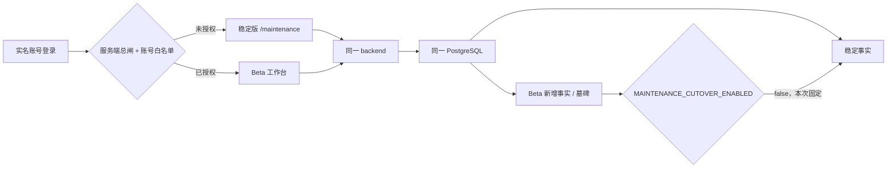

# v1.21 维保 / 补库 Beta 独立发布 Runbook

## 1. 发布目标与隔离边界

本次不是把稳定版替换成 Beta，而是在同一套 HTTPS、backend 和 PostgreSQL 上增加两条
受控入口：稳定版仍是默认入口，Beta 只对实名白名单开放。



三道全局开关在部署、迁移和稳定版 smoke 期间必须同时为 `false`：

- `MAINTENANCE_BETA_ENABLED=false`
- `REPLENISHMENT_BETA_ENABLED=false`
- `MAINTENANCE_CUTOVER_ENABLED=false`

前两项仅在空白名单隔离验证后打开；第三项本次绝不打开。关闭 Beta 只隐藏入口并拒绝
Beta 请求，不删除已经形成的 Beta 事实。稳定版继续读取原有事实；维保删除墓碑等 Beta
状态只有未来另行批准 cutover 后才影响稳定计算。

本次独立审核与 manifest 的正式 scope 固定为
`stable-plus-beta-pilot-cutover-disabled`。它只证明稳定版兼容、Maintenance 只读 Pilot 和
经真实 canary 约束的 Replenishment Pilot 可以灰度，不声称完整业务迁移或正式切换已完成：

| 能力 | 首发状态 |
|---|---|
| 稳定版服务 | 纳入发布与 smoke |
| Maintenance Beta 读取 | 纳入实名 Pilot |
| Maintenance 全部写 action | 排除，逐账号必须为 `false` |
| Maintenance 业务数据迁移 | 延后到正式 cutover |
| Maintenance cutover | 延后，flag 固定 `false` |
| Replenishment create | 纳入实名 Pilot；必须有价格权限和 exact-SHA、GitHub 在线复验通过的真实 canary |
| Replenishment review | 延后；代码保留，但首发生产权限必须为 `false` |
| Alembic 数据库 schema `f1→d9` | 仍是发布前置条件，必须完整演练与备份恢复 |

这里“业务数据迁移延后”不等于跳过数据库 schema migration；两者是不同门禁。

## 2. 不可绕过的上线门禁

以下任一项不成立即停止：

1. 候选 PR 已合并，`origin/main` 的 exact 40 位 SHA 与 GitHub `main` 一致；合并后
   `main` 的后端、前端两个必需 check 均成功。
2. 两轮独立审核必须在同一个 exact SHA、同一个
   `stable-plus-beta-pilot-cutover-disabled` scope 上均无 P0/P1；不得以
   `full-release-candidate` 冒充尚未完成的正式 cutover 审核。
3. 生产父 SHA、DB head、Compose hash、旧镜像 ID 都从生产实时读取，不从旧 Runbook
   或聊天记录抄写。
4. Alembic 必须且只能从 `f1c8e4a7b2d9` 前进到 `d9f1a3c7e5b2`；manifest 自动记录
   其间每个迁移文件的路径、父 revision、SHA-256、总数和总摘要。
5. 候选镜像必须从 exact merged SHA 的 `git archive` 构建；生产只 `docker load`，不在
   生产 checkout 里构建。
6. 先在隔离的生产副本上完成 `f1→d9` 演练，再在发布窗口对生产 DB 做一份新的完整
   dump，验证 checksum、TOC，并在 `--network none` 的临时 PostgreSQL 中完整恢复。
7. 生产迁移前无 `processing` 导入、无 blocked session、无等待锁、无超过 60 秒事务。
8. 首批 Beta 名单不得含任何 admin、共享口令或泛化账号。名单逐账号记录
   `page_maintenance`、`page_maintenance_beta` 和全部 Maintenance action 的有效值；所有
   写 action（包括 `action_maintenance_migration_review`）必须为 `false`，本次即使有 canary
   也不能打开。
9. Replenishment 可使用独立实名白名单，但必须同时记录价格权限、create 和 review
   action。首发至少一名非 admin 创建人具备页面、价格与 create 权限，并提供绑定 exact
   target SHA、生成 manifest 时经 GitHub API 再次在线核验的真实 create canary；review
   必须为 `false`，不因代码中已有接口而提前开放。
10. `.env` 中 `MAINTENANCE_MANIFEST_ACTIVE_HMAC_KEY` 必须存在；manifest 只记录 key id
    与密钥 SHA-256 fingerprint，任何脚本和证据均不得打印密钥本身。

历史 `.deploy/*v120*` 只服务 v1.20，严禁复用或修改。本 Runbook 只调用
`.deploy/v121_beta_*`。

## 3. 在可信控制机锁定 exact SHA 与 CI

以下目录必须位于加密磁盘，权限 `700`。命令中的 SHA 均由实时状态生成，不存在可误用的
示例 SHA。

```bash
REPO_ROOT=$(git rev-parse --show-toplevel)
git -C "$REPO_ROOT" fetch --prune origin
TARGET_SHA=$(git -C "$REPO_ROOT" rev-parse refs/remotes/origin/main)
test "$(git -C "$REPO_ROOT" rev-parse "$TARGET_SHA^{commit}")" = "$TARGET_SHA"

CONTROL_ROOT=$(mktemp -d)
chmod 700 "$CONTROL_ROOT"
git -C "$REPO_ROOT" show "$TARGET_SHA:docker-compose.yml" \
  >"$CONTROL_ROOT/candidate-compose.yml"
chmod 600 "$CONTROL_ROOT/candidate-compose.yml"

python3 "$REPO_ROOT/.deploy/v121_beta_manifest.py" capture-ci \
  --repository Jinchen-Yang/it-spareparts \
  --target-sha "$TARGET_SHA" \
  --required-check '后端测试（pytest + 迁移链验证）' \
  --required-check '前端类型检查 + 构建' \
  --output "$CONTROL_ROOT/github-main-ci.json"
```

`capture-ci` 会直接读取 GitHub `main` 和该 commit 的 check-runs。SHA 不是当前 GitHub
`main`、check 未完成或必需 check 不是 `success` 都会失败；保存的 CI 文件随后写入
manifest 的路径与摘要。生成 manifest 时还会再次在线查询 GitHub，并逐项比较 main head、
check 名称、状态、结论和详情地址；手写或已经漂移的 CI JSON 不能通过生成闸门。

两名独立审核者必须分别用自己的 GitHub 实名协作者账号，在合并后的 exact commit 页面
提交一条未编辑的 commit comment。comment body 只能是如下 JSON（`report_url` 指向该仓库
内的完整审核报告）：

```json
{"format":"v121-independent-review-attestation-v1","target_sha":"由审核者填写实时 TARGET_SHA","scope":"stable-plus-beta-pilot-cutover-disabled","p0_count":0,"p1_count":0,"conclusion":"approved","report_url":"该仓库内审核报告的 GitHub HTTPS URL"}
```

记录两条 comment id 后，由控制器直接通过 GitHub API 捕获：

```bash
python3 "$REPO_ROOT/.deploy/v121_beta_manifest.py" capture-review \
  --repository Jinchen-Yang/it-spareparts --target-sha "$TARGET_SHA" \
  --comment-id "$REVIEW_COMMENT_ID_1" --output "$CONTROL_ROOT/reviews/review-1.json"
python3 "$REPO_ROOT/.deploy/v121_beta_manifest.py" capture-review \
  --repository Jinchen-Yang/it-spareparts --target-sha "$TARGET_SHA" \
  --comment-id "$REVIEW_COMMENT_ID_2" --output "$CONTROL_ROOT/reviews/review-2.json"
```

控制器要求 GitHub API 证明：两名不同的人类 reviewer 均为仓库 OWNER/MEMBER/COLLABORATOR、
comment 直接挂在 exact target、从未编辑、报告仍在本仓库且 P0/P1=0；生成 manifest 时会
再次在线查询并逐字段比对，手写 JSON 或 PR 评论摘要都不能过闸。scope 必须逐字等于上述
受限 Pilot scope；旧的 `full-release-candidate` 证明会被拒绝，防止把延期项包装成已审核。

## 4. 从生产实时捕获父版本与旧制品

生产只读快照至少包含：v1.20 state 中的 `TARGET_COMMIT`、DB head、当前 Compose、DB / app /
frontend 正在运行的镜像 ID、DB restart count、三道 flag 和 HMAC fingerprint。密钥本身不能
离开生产。

```bash
PROD=it-spareparts-prod
APP_DIR=/home/ubuntu/apps/it-spareparts

ssh "$PROD" sudo cat "$APP_DIR/docker-compose.yml" \
  >"$CONTROL_ROOT/current-production-compose.yml"
chmod 600 "$CONTROL_ROOT/current-production-compose.yml"

ssh "$PROD" sudo bash -s >"$CONTROL_ROOT/production-baseline.json" <<'ROOT'
set -Eeuo pipefail
umask 077
app_dir=/home/ubuntu/apps/it-spareparts
state=/var/lib/it-spareparts-release-control/v120-state.state
compose() {
  env -u COMPOSE_FILE -u COMPOSE_PROJECT_NAME -u COMPOSE_PROFILES \
    docker compose --project-name it-spareparts --env-file "$app_dir/.env" \
      -f "$app_dir/docker-compose.yml" "$@"
}
python3 - "$state" "$app_dir/.env" \
  "$(compose ps -q db)" "$(compose ps -q app)" "$(compose ps -q frontend)" <<'PY'
import hashlib,json,pathlib,shlex,subprocess,sys
state_path,env_path,db_cid,app_cid,frontend_cid=sys.argv[1:]
state={}
for raw in pathlib.Path(state_path).read_text(encoding="utf-8").splitlines():
    if "=" in raw:
        key,value=raw.split("=",1); state[key]=value
wanted={"MAINTENANCE_BETA_ENABLED","REPLENISHMENT_BETA_ENABLED",
        "MAINTENANCE_CUTOVER_ENABLED","MAINTENANCE_MANIFEST_ACTIVE_KEY_ID",
        "MAINTENANCE_MANIFEST_ACTIVE_HMAC_KEY"}
env={}
for raw in pathlib.Path(env_path).read_text(encoding="utf-8").splitlines():
    if "=" not in raw: continue
    key,value=raw.split("=",1)
    if key in wanted:
        parsed=shlex.split(value.strip()) if value.strip().startswith(("'",'"')) else [value.strip()]
        if len(parsed)!=1 or key in env: raise SystemExit("invalid protected env")
        env[key]=parsed[0]
for key in ("MAINTENANCE_BETA_ENABLED","REPLENISHMENT_BETA_ENABLED",
            "MAINTENANCE_CUTOVER_ENABLED"):
    env.setdefault(key,"false")
if wanted-env.keys(): raise SystemExit("protected HMAC env key missing")
def inspect(cid,field):
    return subprocess.check_output(["docker","inspect","-f",field,cid],text=True).strip()
db_head=subprocess.check_output(["docker","exec",db_cid,"psql","-X","-U","spareparts",
                                 "-d","spareparts","-At","-c",
                                 "SELECT version_num FROM alembic_version;"],text=True).strip()
payload={"parent_production_sha":state["TARGET_COMMIT"],"db_head":db_head,
 "db_container_id":db_cid,"db_image_id":inspect(db_cid,"{{.Image}}"),
 "db_restart_count":int(inspect(db_cid,"{{.RestartCount}}")),
 "old_app_image_id":inspect(app_cid,"{{.Image}}"),
 "old_frontend_image_id":inspect(frontend_cid,"{{.Image}}"),
 "maintenance_beta_enabled":env["MAINTENANCE_BETA_ENABLED"],
 "replenishment_beta_enabled":env["REPLENISHMENT_BETA_ENABLED"],
 "maintenance_cutover_enabled":env["MAINTENANCE_CUTOVER_ENABLED"],
 "manifest_hmac_key_id":env["MAINTENANCE_MANIFEST_ACTIVE_KEY_ID"],
 "manifest_hmac_key_fingerprint_sha256":hashlib.sha256(
     env["MAINTENANCE_MANIFEST_ACTIVE_HMAC_KEY"].encode()).hexdigest()}
print(json.dumps(payload,sort_keys=True,separators=(",",":")))
PY
ROOT
chmod 600 "$CONTROL_ROOT/production-baseline.json"
```

人工核对三个 flag 均为 `false`、DB head 为 `f1c8e4a7b2d9`，并把生产旧镜像和 DB 镜像
以 `docker save` 导出到可信控制机。导出文件逐个 SHA-256 校验，不通过网络引用/tag 猜镜像。

## 5. exact-SHA 构建候选镜像

```bash
"$REPO_ROOT/.deploy/v121_beta_build.sh" \
  "$REPO_ROOT" "$TARGET_SHA" "$CONTROL_ROOT/build"

python3 - "$CONTROL_ROOT/build/build-evidence.json" <<'PY'
import json,sys
row=json.load(open(sys.argv[1],encoding="utf-8"))
print(row["target_sha"], row["app_image_id"], row["frontend_image_id"])
PY
```

构建器使用 `git archive` 创建独立 source tree，并输出：source tar、app/frontend exact image
ID、离线 image bundle 及其摘要。它拒绝 target 不是当前 `origin/main` 的情况。

## 6. 在隔离生产副本上演练 f1→d9

从生产创建一份只读窗口内的新 custom-format dump，传到可信控制机后设为 `600`。同时将
生产 DB/旧业务镜像加载到可信控制机。演练容器使用 internal Docker network 与 tmpfs，绝不
连接生产网络或生产卷。默认 restore tmpfs 上限为 `4g`；若生产 dump 的实测恢复空间更大，
执行前显式设置 `V121_RESTORE_TMPFS_SIZE`（仅接受正整数 `m/g`），并确保宿主机可用内存
充足。该值会写入演练和发布窗口恢复证据。

```bash
BASELINE="$CONTROL_ROOT/production-baseline.json"
PARENT_PRODUCTION_SHA=$(python3 -c \
  'import json,sys; print(json.load(open(sys.argv[1]))["parent_production_sha"])' "$BASELINE")
DB_IMAGE_ID=$(python3 -c \
  'import json,sys; print(json.load(open(sys.argv[1]))["db_image_id"])' "$BASELINE")
OLD_APP_IMAGE_ID=$(python3 -c \
  'import json,sys; print(json.load(open(sys.argv[1]))["old_app_image_id"])' "$BASELINE")
OLD_FRONTEND_IMAGE_ID=$(python3 -c \
  'import json,sys; print(json.load(open(sys.argv[1]))["old_frontend_image_id"])' "$BASELINE")
NEW_APP_IMAGE_ID=$(python3 -c \
  'import json,sys; print(json.load(open(sys.argv[1]))["app_image_id"])' \
  "$CONTROL_ROOT/build/build-evidence.json")
NEW_FRONTEND_IMAGE_ID=$(python3 -c \
  'import json,sys; print(json.load(open(sys.argv[1]))["frontend_image_id"])' \
  "$CONTROL_ROOT/build/build-evidence.json")

"$REPO_ROOT/.deploy/v121_beta_rehearse.sh" \
  "$CONTROL_ROOT/production-copy.dump" \
  "$TARGET_SHA" "$PARENT_PRODUCTION_SHA" "$DB_IMAGE_ID" \
  "$NEW_APP_IMAGE_ID" "$OLD_APP_IMAGE_ID" "$OLD_FRONTEND_IMAGE_ID" \
  "$CONTROL_ROOT/candidate-compose.yml" \
  "$CONTROL_ROOT/stable-test-credential.json" \
  test-old-images "$CONTROL_ROOT/rehearsal"
```

演练记录迁移耗时、`pg_locks`、blocked session、长事务、`statement_timeout=120s` 和
`lock_timeout=5s`；采样器必须正常退出、首尾覆盖迁移且相邻采样间隔不超过 2.5 秒。
每次演练使用随机独立的容器、network 与 Compose project 名，不会清理另一场并发演练。
`test-old-images` 还要求旧 app image 在 d9 上完成稳定接口 smoke；成功
才生成 `old-images-on-d9-rehearsal.json`。若这一步失败，重新以 `forward-only` 完成迁移
演练，但生成 manifest 时不传旧镜像演练文件；发布后旧镜像回切将被永久拒绝。

演练成功只证明“这一份生产副本”通过，不替代发布窗口的新备份/恢复，也不证明真实用户
验收通过。

## 7. 实名 Beta 权限图

准备 `v121-beta-allowlist-v1` JSON。每个账号必须写明 role、两类页面和所有相关 action
的原始运行时 effective 值。role 必须精确使用系统已有的小写角色；首批任何账号都不能是
admin，补库 create 账号必须是 `sales` 角色；所有 Maintenance 写 action 必须
逐项为 `false`，包括工作簿回填、项目管理、批量删除、现场领用、坏件返还、验收、仓库应用和
`action_maintenance_migration_review`。提供 Maintenance canary 也不会放宽这一限制。

只有 Replenishment 的 `action_replenishment_create` 可在本次设为 `true`，且必须先在 exact
target SHA 的隔离 canary 中真实执行。执行人随后用自己的
GitHub 实名协作者账号在 exact commit 下提交未编辑的 JSON commit comment，字段必须
恰好为：`format: v121-action-canary-v1`、`username`、`action`、`target_sha`、
`environment: isolated`、`request`、`result`、`conclusion: passed`。`request` 包含 HTTP 写方法、
真实 API path、canonical route template 和 payload SHA-256；`result` 包含预期/实际 2xx 状态码
及 response SHA-256。然后从 GitHub API 捕获而不是手写证据：

```bash
python3 "$REPO_ROOT/.deploy/v121_beta_manifest.py" capture-canary \
  --repository Jinchen-Yang/it-spareparts --target-sha "$TARGET_SHA" \
  --comment-id "$CANARY_COMMENT_ID" --output "$CONTROL_ROOT/canaries/action-canary.json"
```

控制器从 API 绑定实名执行人、协作者身份、comment id/URL、exact SHA、未编辑时间和 body
摘要；生成 manifest 时再次在线查询。请求还必须命中控制器内该 action 的 canonical route，
拿另一个成功接口冒充会被拒绝。allowlist 通过路径和 SHA-256 绑定捕获文件。manifest 只保留
整张权限图、Maintenance 投影、Replenishment 投影的摘要和账号数，不暴露用户名。未被
Replenishment create 实际使用的 canary 会按“多余证据”拒绝，不能预埋未来权限。

首发清单至少包含一名 Maintenance 只读账号和一名 create 账号；两者必须是不同业务角色，
不能为减少 smoke 参数而互相跨域授权。reader 账号必须至少存在一条未归档的 active `primary_manager`
项目负责人关系，并满足 `page_maintenance=true`、
`page_maintenance_beta=true`、全部 Maintenance 写 action=false，且 Replenishment 页面、create
与 review action 均为 false；既有共享价格数据权限不扩张，也不为 smoke 强制撤销。create 账号
必须使用精确 `sales` 角色，并满足 `page_maintenance_beta=false`、`page_replenishment_beta=true`、
`data_pool_price_governance=true`、`action_replenishment_create=true`、
`action_replenishment_review=false`，并绑定 create canary。外部审核 Agent、机器认证和审核 UI
尚未形成受控生产契约，因此 review 接口虽保留在代码中，本轮所有账号的 review action 均为
`false`；相应 canary 也会因未被使用而被拒绝。清单内每个账号必须完整匹配 reader 或 creator
二选一 profile；双 Beta 页面、只有 Replenishment 页面但没有 create、或两个页面都没有的第三种
profile 一律拒绝。reader 可以保留既有共享价格数据权限，但该权限不能绕过已关闭的
Replenishment 页面与动作。

manifest 除既有权限图摘要外，还固定 `pilot_eligibility_sha256`，并要求
`maintenance_reader_without_active_assignment_count=0` 与
`replenishment_creator_non_sales_count=0`。这些字段只证明目标名单的资格前提；生产开闸前仍会
从实时数据库重新计算，任一负责人关系归档、账号角色漂移或摘要不一致都会失败关闭。

Maintenance 全局闸打开、Maintenance/Replenishment 页面白名单仍为空是必经安全阶段；
Replenishment 总闸此时必须保持 false，目标权限图也不能提前写进生产。

## 8. 生成不可变 manifest 包

```bash
HMAC_KEY_ID=$(python3 -c \
  'import json,sys; print(json.load(open(sys.argv[1]))["manifest_hmac_key_id"])' "$BASELINE")
HMAC_FINGERPRINT=$(python3 -c \
  'import json,sys; print(json.load(open(sys.argv[1]))["manifest_hmac_key_fingerprint_sha256"])' "$BASELINE")

GENERATOR_ARGS=(
  --repo "$REPO_ROOT"
  --repository Jinchen-Yang/it-spareparts
  --target-sha "$TARGET_SHA"
  --parent-production-sha "$PARENT_PRODUCTION_SHA"
  --current-compose "$CONTROL_ROOT/current-production-compose.yml"
  --old-app-image-id "$OLD_APP_IMAGE_ID"
  --old-frontend-image-id "$OLD_FRONTEND_IMAGE_ID"
  --new-app-image-id "$NEW_APP_IMAGE_ID"
  --new-frontend-image-id "$NEW_FRONTEND_IMAGE_ID"
  --db-image-id "$DB_IMAGE_ID"
  --ci-evidence "$CONTROL_ROOT/github-main-ci.json"
  --required-check '后端测试（pytest + 迁移链验证）'
  --required-check '前端类型检查 + 构建'
  --review-evidence "$CONTROL_ROOT/reviews/review-1.json"
  --review-evidence "$CONTROL_ROOT/reviews/review-2.json"
  --build-evidence "$CONTROL_ROOT/build/build-evidence.json"
  --source-tar "$CONTROL_ROOT/build/source.tar"
  --image-bundle "$CONTROL_ROOT/build/images.tar"
  --migration-rehearsal "$CONTROL_ROOT/rehearsal/production-copy-migration-rehearsal.json"
  --migration-pressure-samples "$CONTROL_ROOT/rehearsal/migration-pressure.jsonl"
  --beta-allowlist "$CONTROL_ROOT/beta-allowlist.json"
  --manifest-hmac-key-id "$HMAC_KEY_ID"
  --manifest-hmac-key-fingerprint "$HMAC_FINGERPRINT"
  --output-dir "$CONTROL_ROOT/release-package"
)

# 只有 old-images-on-d9 演练真实通过时才追加这一参数；否则保持 forward-only。
if test -f "$CONTROL_ROOT/rehearsal/old-images-on-d9-rehearsal.json"; then
  GENERATOR_ARGS+=(--old-image-d9-rehearsal \
    "$CONTROL_ROOT/rehearsal/old-images-on-d9-rehearsal.json")
fi

python3 "$REPO_ROOT/.deploy/v121_beta_manifest.py" generate "${GENERATOR_ARGS[@]}"
python3 "$CONTROL_ROOT/release-package/v121_beta_manifest.py" verify \
  "$CONTROL_ROOT/release-package"
```

manifest 固定：exact merged SHA、父生产 SHA、f1→d9、迁移 inventory count/hash、当前与
候选 Compose hash、旧/新 app/frontend image ID、DB image ID、CI/build/rehearsal 路径与
摘要、HMAC fingerprint、实名权限图摘要和 rollback policy；还会逐字段固定
`initial_pilot_policy`，明确 Maintenance writes 被排除、业务数据 migration/cutover 延后、
cutover flag=false、Replenishment create 必须有在线 canary、review 延后，同时保留 schema
migration 为必需前置。输出目录已存在时生成器拒绝覆盖。

## 9. 传输与生产 preflight

把 `release-package` 和 `build/images.tar` 传到生产 root 私有 staging；在可信控制机和
生产各计算一次 SHA-256。先验证 bundle 摘要，再 `docker load`。不要在生产执行 build。
安装后将 package 目录设为 `700 root:root`、manifest/证据设为 `600 root:root`、两个控制
脚本设为 `700 root:root`；发布执行器会逐项拒绝宽松权限、非 root owner、symlink、
hardlink、子目录和额外的非普通文件。

```bash
PACKAGE=/var/lib/it-spareparts-release-control/v121-beta/package
IMAGE_BUNDLE=/var/lib/it-spareparts-release-control/v121-beta/images.tar
EVIDENCE=/var/lib/it-spareparts-release-control/v121-beta/evidence

sudo python3 "$PACKAGE/v121_beta_manifest.py" verify "$PACKAGE"
sudo "$PACKAGE/v121_beta_release.sh" "$PACKAGE" "$EVIDENCE" \
  preflight "$IMAGE_BUNDLE"
```

preflight 会重新确认：manifest 全部 artifact 摘要、当前 Compose、候选 Compose 在现有
`.env` 下确实解析出三 flag=false、旧/新镜像、DB 容器与镜像、DB head=f1、restart
count、HMAC id/fingerprint、无活跃导入、无
阻塞/长事务，以及生产 Beta 白名单为空。任何一项漂移即退出。

## 10. 发布窗口：新备份、隔离恢复、迁移、稳定版上线

```bash
sudo "$PACKAGE/v121_beta_release.sh" "$PACKAGE" "$EVIDENCE" backup-restore
sudo "$PACKAGE/v121_beta_release.sh" "$PACKAGE" "$EVIDENCE" migrate
sudo "$PACKAGE/v121_beta_release.sh" "$PACKAGE" "$EVIDENCE" deploy \
  /root/stable-credential.json /root/beta-denied-credential.json
```

`backup-restore` 创建完整 custom dump、globals、TOC 与各自 checksum，并在
`--network none`、tmpfs 临时 PostgreSQL 中执行完整 restore；恢复后的 head 必须仍为 f1。

`migrate` 原子安装 manifest 中的 candidate Compose，但先后核对 DB container ID、image
ID 和 restart count 不变；旧 app/frontend 停止后，使用 candidate app image 执行
`alembic upgrade d9`。迁移全程每秒记录 locks / blocked / long transaction，结束记录真实
耗时；采样器必须正常退出，首尾覆盖迁移且相邻采样间隔不超过 2.5 秒，否则迁移即使返回 0
也不会被记为通过。脚本没有 downgrade 或生产 restore 路径。

`deploy` 只执行：

```text
docker compose up --no-deps --no-build --force-recreate -d app frontend
```

因此不会创建、重建或重启 DB。随后验证容器 image ID、HTTPS health、稳定版维保读取，
并用未授权实名账号确认 Beta 被拒绝。此时三道 flag 仍为 false。
`stable-credential.json` 与 `beta-denied-credential.json` 可使用同一个实名测试账号，但该
账号必须拥有稳定版 `page_maintenance` 且没有任何 Beta page；密码只存在 root mode-600
文件，不进入命令参数、manifest 或证据。

## 11. 空白名单阶段与实名 pilot

先只打开 Maintenance 全局闸并保持页面白名单为空。Replenishment 的 create 属于写路径，
因此空名单阶段必须保持其全局闸为 false：

```bash
sudo "$PACKAGE/v121_beta_release.sh" "$PACKAGE" "$EVIDENCE" \
  open-empty-beta /root/beta-denied-credential.json
```

脚本修改 `.env` 后必须通过 `docker compose up --no-deps --no-build --force-recreate -d app`
重新创建 app，随后证明：Maintenance 总闸为 true、Replenishment 总闸与 cutover 为
false、页面白名单摘要为空、实名账号仍不能访问任一 Beta API。验证完成后脚本立即把两个
Beta 总闸都恢复为 false 并再次 recreate app，避免配置名单时提前形成访问窗口。

安全阶段通过后，才由权限中心逐账号写入 manifest 中的权限图。首发 Pilot 彻底排除 admin：
当前应用的 admin invariant 会让 admin 绕过普通 action 位，并自动获得 Maintenance 写能力；
即使其 Beta page=false，也不能把这些真实能力遮罩成 false。发布脚本按原始运行时有效权限
计算摘要，任何入选账号只要存在一个 Maintenance action=true 就立即拒绝开闸。

首发生产必须分别使用 manifest 中的实名 Maintenance reader 和实名 creator。reader smoke
除证明稳定维保读取与 Maintenance Beta GET=200 外，还必须以 `owner_scope=me` 读取到至少一个
本人负责项目，并确认不能访问 Replenishment；creator 必须保持精确 `sales` 角色，其
页面、价格与 create 均为 true，Maintenance Beta 与 review 为 false，并且不存在任何
Maintenance 写 action。生产 creator smoke 必须证明 capabilities 可读、
`can_view_price=true`、`can_create=true`、`can_review=false` 且 catalog=200；Maintenance-only、
只读 Replenishment 或错误带 review 权限的账号都不能替代 creator 通过闸门，creator 也必须
被 Maintenance Beta 拒绝。任何活跃账号缺少有效权限快照同样直接拒绝开闸。
权限变更会吊销旧 token；操作员重新登录后执行：

```bash
sudo "$PACKAGE/v121_beta_release.sh" "$PACKAGE" "$EVIDENCE" pilot-smoke \
  /root/beta-denied-credential.json /root/beta-reader-credential.json \
  /root/beta-creator-credential.json
```

脚本先在两个总闸仍为 false 时从 DB 计算账号数、完整有效权限图、Maintenance /
Replenishment 投影及 pilot eligibility 摘要，只输出摘要，不输出用户名；它们必须逐项等于
manifest。reader 和 creator smoke 结束后、写入 `pilot_open` 状态前会再次计算同一资格摘要，
关闭负责人关系或角色在预检与登录之间变化的 TOCTOU 窗口。随后才
同时打开两个总闸、recreate app，并证明“名单外拒绝”“实名 reader 只读可用”和
“实名 creator 可用且 review 关闭”。
pilot 基线只接受
app/frontend restart count 均为 0；不能把开闸后已经发生的异常重启重新定义成“正常基线”。
整个 Pilot 和 0/5/15/30 观察期间 `MAINTENANCE_CUTOVER_ENABLED` 都必须持续为 `false`。

## 12. 0 / 5 / 15 / 30 分钟观察

以 `pilot-smoke` 成功时间为零点分别执行：

```bash
sudo "$PACKAGE/v121_beta_release.sh" "$PACKAGE" "$EVIDENCE" observe 0 \
  /root/stable-credential.json /root/beta-denied-credential.json \
  /root/beta-reader-credential.json \
  /root/beta-creator-credential.json
sudo "$PACKAGE/v121_beta_release.sh" "$PACKAGE" "$EVIDENCE" observe 5 \
  /root/stable-credential.json /root/beta-denied-credential.json \
  /root/beta-reader-credential.json \
  /root/beta-creator-credential.json
sudo "$PACKAGE/v121_beta_release.sh" "$PACKAGE" "$EVIDENCE" observe 15 \
  /root/stable-credential.json /root/beta-denied-credential.json \
  /root/beta-reader-credential.json \
  /root/beta-creator-credential.json
sudo "$PACKAGE/v121_beta_release.sh" "$PACKAGE" "$EVIDENCE" observe 30 \
  /root/stable-credential.json /root/beta-denied-credential.json \
  /root/beta-reader-credential.json \
  /root/beta-creator-credential.json
```

每个点都重跑稳定版读取、Beta deny、Maintenance reader GET、creator
profile/capabilities/catalog、HTTPS/DB health、DB container identity、
restart count、blocked/长事务探针和实名权限图摘要。每个点只能在目标时刻起两分钟内执行；
脚本拒绝提前、迟到补写或一次性补齐四个时间点，并要求 app/frontend 容器 ID 与 restart
count 自 pilot 起始点均未变化。30 分钟通过只表示技术灰度可继续，不等于真实业务验收完成。

## 13. 故障收口与回滚边界

任何 Beta 异常先关总闸并保持 cutover=false：

```bash
sudo "$PACKAGE/v121_beta_release.sh" "$PACKAGE" "$EVIDENCE" contain
```

配置变化后脚本必定 recreate app；若无法证明新配置已经生效且恢复健康，脚本会按 Compose
project/service label 枚举并 stop/kill 所有 app 和 frontend 容器，再反查确认公网面已关闭；
任何 stop/inspect 错误都会明确标成“关闭未证明”，绝不吞错或声称已停止。随后转人工
forward fix。若当前已经回切到演练通过的
旧镜像，`contain` 会保留旧 app/frontend 镜像组合，不会误切回候选镜像。

`contain` 和 `rollback-app` 是特殊的故障命令：取得发布锁后，它们会在读取 manifest、state
或任何发布证据前，先原子写入两道 Beta flag=false、cutover=false，再按 Compose label
停止并反查 app/frontend。只有发布包和状态随后均验证通过，脚本才按受控镜像重新拉起公开面。
因此 manifest/state 缺失或损坏时不会留下旧的开放容器继续运行；代价是保持 fail-closed
停机，等待人工修复可信发布包。`observe` 读取不到 pilot state、错过窗口，或运行后落到窗口外，
同样会自动关闸并执行受控收口。

一旦 d9 提交，禁止自动执行 Alembic downgrade，也禁止把生产 DB restore 到 f1。旧镜像
应用层回切只有在 manifest 的 rollback mode 为 `old_images_on_d9_allowed`，且绑定的
`old-images-on-d9-rehearsal.json` 摘要仍一致时才允许：

```bash
sudo "$PACKAGE/v121_beta_release.sh" "$PACKAGE" "$EVIDENCE" rollback-app
```

若 manifest 为 `forward_only_after_d9`，上述命令只会关闭 Beta、保持 d9 和候选应用，随后
以非零状态拒绝旧镜像；处置方式只有 forward fix。即使允许旧镜像回切，DB 也继续保持 d9。

## 14. 必须归档的证据

- exact target/parent SHA 与 manifest SHA-256；
- 两份 `stable-plus-beta-pilot-cutover-disabled` 独立审核原文与 GitHub 在线复验结果；
- GitHub main CI evidence 及摘要；
- source tar、image bundle、build evidence 与 old/new image IDs；
- migration inventory count/hash；
- 当前/候选 Compose hash；
- 隔离生产副本 f1→d9 演练、耗时、locks/blocked/long transaction；
- 发布窗口完整 dump/globals/TOC/checksum 和 `--network none` 恢复证据；
- 生产迁移耗时、timeout 与锁压力采样；
- HMAC key id/fingerprint（禁止密钥）；
- 空白名单 deny、目标实名原始权限图摘要、`pilot_eligibility_sha256`、Maintenance write
  count=0、admin pilot count=0、`maintenance_reader_without_active_assignment_count=0`、
  `replenishment_creator_non_sales_count=0`、Maintenance reader/creator/review 计数、
  Replenishment create canary、reader/creator/deny smoke；
- 0/5/15/30 四份观察结果；
- 若发生 contain/rollback，归档最终 flag、DB head、业务镜像 ID 和处理时间。

真实发布前仍必须现场产生的证据是：合并后 exact-SHA CI、生产实时 baseline、production-copy
dump 演练、发布窗口新备份/恢复、生产迁移和四个观察点。本仓库中的静态测试只能验证控制
逻辑与语法，不能替代这些现场事实。
