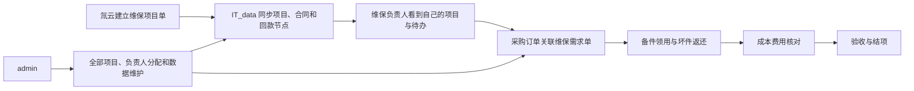
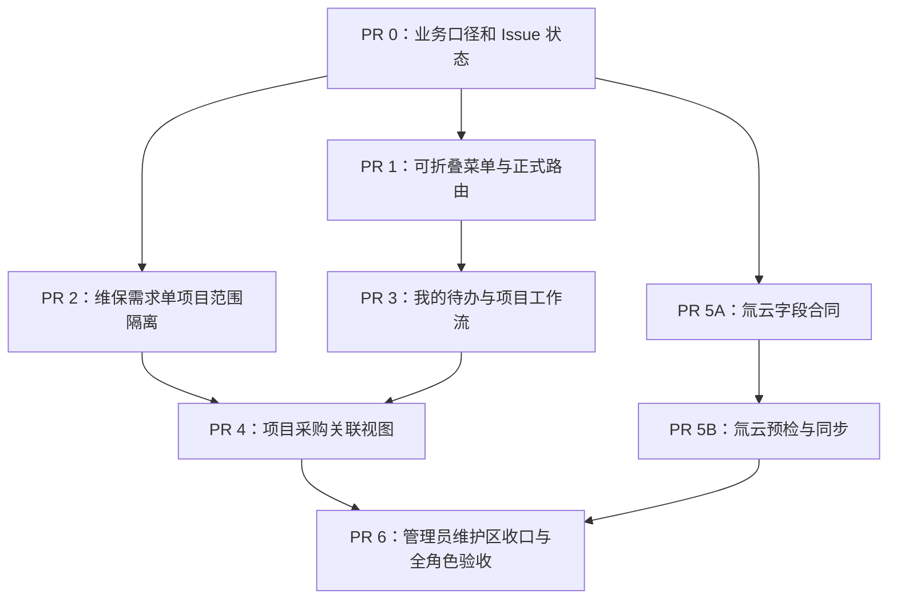

# 维保业务工作台重构与氚云项目同步开发计划

> 基线：`origin/main@caf4a9737bf62495f3c81761d37d7989bb0b765e`（PR #244 已合并，main CI 通过）
>
> 实施原则：从该基线建立隔离 worktree；不继续合并旧堆叠 Draft PR；每个 PR 先写失败测试，再做最小实现。

## 1. 目标

把已经进入 `main` 的维保功能重新组织成维保负责人能够直接理解和操作的业务工作台，并补齐当前真正缺失的三条数据链：

1. 氚云维保项目单 → IT_data 项目、合同、回款计划的受控同步；
2. 采购订单 → 维保需求单 → 维保项目的只读关联；
3. 维保需求单按项目负责人隔离，避免普通账号跨项目读取。

本轮不重写 #199、#201、#204—#210 已经进入 `main` 的后端能力。

## 2. 已确认的业务事实

以下内容作为本计划的权威口径，覆盖旧文档和旧 Issue 中相反的描述：

- “项目经理”和“维保人员”是同一类业务角色，产品统一称为“维保负责人”。
- 维保项目由合同签订后在氚云建立；IT_data 不负责业务立项和日常手工新建项目。
- 氚云项目表是项目资料来源，预计包含项目、合同额、维保期限、回款期限等字段；最终字段必须以脱敏真实样表为准。
- 后续维保备件购入走采购订单，采购订单关联维保需求单，再归集到维保项目。
- `admin` 能看到全部维保项目，并管理全部维保数据维护入口；普通维保负责人只看自己负责的项目。
- 仓库真实模板尚未完成业务确认时，系统必须显示“仓库数据尚未接入”，不能把必然失败的导入按钮作为主操作。

## 3. 产品主干



### 3.1 一级、二级导航

```text
维保工作台                    ← 可展开/收起
├── 我的待办
├── 项目总览
├── 月度项目更新
└── 验收与结项

维保数据维护                  ← 仅 admin/相应 capability 可见，可展开/收起
├── 项目资料同步              ← 氚云同步完成后再显示
├── 异常维保单处理
├── 仓库单据核对
├── 历史单据归属
└── 历史数据迁移核对
```

“采购与备件、领用与返还、成本与费用”不再散落成全局菜单，而是进入具体项目后的业务阶段，避免用户脱离项目上下文。

### 3.2 项目内工作流

```text
项目资料与合同/回款
        ↓
采购与备件
        ↓
现场领用与返还
        ↓
成本与费用
        ↓
验收与结项
```

每一阶段只回答三件事：

1. 这一阶段在处理什么业务；
2. 当前缺什么、下一步做什么；
3. 完成后会形成什么结果。

稳定 ID、WBDD、source_order_id、adapter、manifest、协议版本、dry-run、哈希和接口事件统一收进“查看数据依据”，不作为普通页面的主文案。

## 4. Git 和 Issue 先行整理

### 4.1 不再重复合并的旧工作

PR #244 已将 #201、#203—#210 的主要实现整合进 `main`。下列 Draft 不能再次合并：

- PR #194
- PR #202
- PR #211—#216
- PR #243

处理方式：逐项比较 `main` 后，评论 `superseded by #244` 并关闭；若某项仍有真实缺口，拆成新的窄 Issue，而不是恢复旧分支。

### 4.2 更新现有 Issue

- #128：改为本轮维保业务工作台总控，补充 #244 的实际合入状态和本计划依赖图。
- #136：把 B1 更新为“项目由氚云建立，IT_data 负责同步”；保留“稳定来源 ID 和真实表头待样表确认”。
- #193：统一“维保负责人”术语，删除 IT_data 日常新建项目的业务描述。
- #201、#203—#210：按 `main` 实际验收后关闭已完成项；#209 的真实仓库样表接入另开问题单。
- #240：标记原 Beta 交接已被 #244 取代，停止作为当前开发入口。

### 4.3 新建开发 Issues

1. `[MAINT-UX-P0] 维保工作台可折叠导航与正式路由`
2. `[MAINT-SEC-P0] 维保需求单按项目负责人范围隔离`
3. `[MAINT-UX-P0] 我的待办与项目详情业务化重构`
4. `[MAINT-DATA-P0/question] 氚云维保项目表字段合同与同步`
5. `[MAINT-LINK-P0] 项目采购订单与维保需求链展示`
6. `[MAINT-DATA-P1/question] 仓库真实模板与字段合同接入`

## 5. PR 依赖图



PR 1 与 PR 2 可并行；PR 5A 在取得脱敏真实样表后可与前端工作并行。

---

## 6. PR 0：固定业务口径和 Git 状态

**Issue：** #128、#136、#193；旧 Draft 清理

**目标：** 先让文档、Issue、代码现状一致，避免后续开发再次按过期口径实现。

**修改文件：**

- `docs/maintenance/business-handbook.md`
- `docs/maintenance/import-field-contract.md`
- `docs/maintenance/README.md`

**实施步骤：**

1. 在手册写明“氚云立项、IT_data 同步和履约跟进”。
2. 将“项目经理”“维保人员”统一为“维保负责人”。
3. 写清采购链：采购订单 → 维保需求单 → 项目。
4. 更新 #244 后的完成矩阵，不再把 #201、#204—#210 标成未开发。
5. 给旧 Draft 添加取代说明并关闭；不删除分支、不重放提交。
6. 新建本计划列出的六个窄 Issue，并把依赖关系写入 #128。

**验收：**

- 文档不再出现“IT_data 日常新建维保项目”的业务要求。
- 文档不再把项目经理和维保人员拆成两类工作台用户。
- 每个旧 Issue 都能落到“已由 #244 交付”或新的窄 Issue，不能同时存在两个开发入口。

---

## 7. PR 1：可折叠菜单与正式路由

**Issue：** `[MAINT-UX-P0] 维保工作台可折叠导航与正式路由`

**目标：** 先修复用户每天进入系统就会遇到的信息架构问题，不等待任何新后端。

**修改文件：**

- `frontend/src/nav.tsx`
- `frontend/src/AppShell.tsx`
- `frontend/src/App.tsx`
- `frontend/src/__tests__/maintenanceNavigation.test.tsx`
- `frontend/src/pages/__tests__/AppShell.test.ts`
- `frontend/src/__tests__/App.test.tsx`

**测试先行：**

1. 改写 `maintenanceNavigation.test.tsx`，让旧的“两个同名维保管理组”断言先失败。
2. 在 `AppShell.test.ts` 增加失败用例：
   - 点击一级菜单可以展开/收起；
   - 当前子路由所在一级菜单自动展开；
   - 用户无任何子项权限时，一级菜单不出现；
   - 键盘可聚焦并用 Enter/Space 展开；
   - 移动抽屉与桌面侧栏行为一致。
3. 在 `App.test.tsx` 增加旧 URL 带 query/hash 的兼容跳转测试。

**实现：**

1. 将 `NavGroup` 从静态 `type: "group"` 变为真正嵌套菜单项。
2. 在 `AppShell` 增加受控 `openKeys`，当前路由自动展开；桌面展开状态写入非敏感的 `localStorage`。
3. 合并两个“维保管理”组，拆成“维保工作台”和“维保数据维护”。
4. 建立正式路由：
   - `/maintenance/workbench`
   - `/maintenance/projects`
   - `/maintenance/projects/:projectId`
   - `/maintenance/monthly-updates`
   - `/maintenance/acceptance`
   - `/maintenance/admin/demands`
   - `/maintenance/admin/warehouse`
   - `/maintenance/admin/source-orders`
   - `/maintenance/admin/migration`
5. 保留 `/maintenance`、`/maintenance/downloads`、`/maintenance/reminders` 和 `/maintenance/beta/*` 兼容跳转，并保留 query/hash。
6. 普通维保负责人不显示数据迁移、来源归属、仓库导入等管理员入口。
7. `admin` 显示全部维保入口。

**聚焦验证：**

```bash
cd frontend
npm run test -- src/__tests__/maintenanceNavigation.test.tsx src/pages/__tests__/AppShell.test.ts src/__tests__/App.test.tsx
npm run build
```

**验收：**

- 一级、二级菜单可展开和折叠。
- 不再出现两个“维保管理”。
- 当前页面刷新后，所属一级菜单仍自动展开并正确高亮。
- 所有现有书签都能到达等价新页面。

---

## 8. PR 2：维保需求单按项目范围隔离

**Issue：** `[MAINT-SEC-P0] 维保需求单按项目负责人范围隔离`

**目标：** 在把需求单放进项目工作流前，先关闭普通账号可能跨项目读取维保需求单的缺口。

**修改文件：**

- `backend/app/api/maintenance_demands.py`
- `backend/app/services/maintenance_demands.py`
- `backend/app/api/maintenance_project_scope.py`
- `backend/tests/test_maintenance_demand_safe_delete.py`
- 新建 `backend/tests/test_maintenance_demand_project_scope.py`
- `frontend/src/api/maintenanceDemands.ts`
- `frontend/src/api/__tests__/maintenanceDemands.test.ts`

**测试先行：**

1. 维保负责人 A 查询时不能看到负责人 B 项目的需求单。
2. 未分配项目的需求单对普通账号不可见。
3. admin 能看到全部项目和未分配需求单。
4. 指定无权访问的 `project_id` 返回 403，而不是空列表掩盖越权。
5. 安全删除和恢复继续服从原有权限与引用保护。

**实现：**

1. 给需求单搜索合同增加可选 `project_id`。
2. API 将 `UserContext` 和项目范围传入 service，不再只验证页面权限。
3. 复用现有项目负责人范围解析；不另建“项目经理”角色。
4. 未分配需求单仅进入管理员的“异常维保单处理”。
5. 增加审计字段：查询范围、操作者、是否 admin 全量范围；不记录敏感响应内容。

**聚焦验证：**

```bash
cd backend
uv run --extra dev pytest -q \
  tests/test_maintenance_demand_project_scope.py \
  tests/test_maintenance_demand_safe_delete.py
```

**验收：**

- admin 看全部、维保负责人只看本人项目、无项目账号看不到任何项目需求单。
- 前端无法通过手工修改请求参数绕过后端项目范围。

---

## 9. PR 3：我的待办和项目页面业务化

**Issue：** `[MAINT-UX-P0] 我的待办与项目详情业务化重构`

**目标：** 复用现有 #199/#205 工作台接口，把页面从技术组件集合变成维保负责人的行动工作台。

**新建文件：**

- `frontend/src/pages/maintenance/MaintenanceWorkDashboardPage.tsx`
- `frontend/src/components/maintenance/MaintenanceWorkflowNav.tsx`
- `frontend/src/components/maintenance/BusinessActionCard.tsx`
- `frontend/src/components/maintenance/TechnicalDetails.tsx`
- `frontend/src/components/maintenance/maintenanceLanguage.ts`
- 对应 `__tests__` 文件

**修改文件：**

- `frontend/src/pages/maintenance/MaintenanceProjectsPage.tsx`
- `frontend/src/pages/maintenance/MaintenanceProjectWorkspacePage.tsx`
- `frontend/src/components/maintenance/MaintenanceProjectCard.tsx`
- `frontend/src/components/maintenance/ContractPortfolio.tsx`
- `frontend/src/components/maintenance/ProjectFinancialProgress.tsx`
- `frontend/src/components/maintenance/SiteIssueWorkflowPanel.tsx`
- `frontend/src/components/maintenance/BadReturnPanel.tsx`
- `frontend/src/components/maintenance/MaintenanceAcceptancePanel.tsx`
- `frontend/src/components/maintenance/ProjectWorkbookActions.tsx`
- `frontend/src/components/maintenance/maintenanceOperations.css`
- `frontend/src/api/maintenanceOperations.ts`

**测试先行：**

1. admin 首次进入能看到“全部项目”，并可切换“我负责的项目”。
2. 普通维保负责人默认只看到自己的未完成和逾期待办。
3. 项目卡能直接回答“当前卡点、下一步、截止时间”。
4. 项目详情按五个业务阶段排序，而不是按接口模块平铺。
5. 普通业务层不出现以下词语：`Beta`、`dry-run`、`manifest`、`source_order_id`、`stable ID`、`协议 v3`、`原子应用`。
6. 技术信息仍可在“查看数据依据”中查询，不能删除审计证据。

**实现：**

1. “我的待办”首版直接复用现有项目任务摘要，不新建 `/maintenance/tasks` API。
2. 待办按“逾期 → 本周到期 → 资料待补 → 正常跟进”排序。
3. 统一业务按钮：
   - `打开项目详情`
   - `更新本月进展`
   - `登记现场领用`
   - `跟进坏件返还`
   - `补充缺失成本`
   - `提交验收资料`
4. 项目详情顶部固定显示：项目状态、维保负责人、最近截止事项、下一步操作。
5. 将现有组件放入五阶段工作流；保留其 API 和审计语义。
6. 页面中的“项目经理”全部改为“维保负责人”。
7. 普通页面移除“新建项目”入口；在氚云同步完成前，管理员页面只显示来源待接入说明。
8. 项目生命周期在读模型中按日期派生：资料待补、待开始、进行中、已结束；不每日写库刷新状态。

**聚焦验证：**

```bash
cd frontend
npm run test -- \
  src/pages/maintenance/__tests__/MaintenanceProjectsPage.test.tsx \
  src/pages/maintenance/__tests__/MaintenanceProjectWorkspacePage.test.tsx \
  src/components/maintenance/__tests__
npm run build
```

**业务验收：**

- 随机给维保负责人看页面 10 秒，能回答：这是哪个项目、现在要做什么、完成后得到什么。
- admin 能看全部项目和负责人分配；普通账号没有“全部项目”入口。
- 页面不要求用户理解数据库、接口或迁移术语。

---

## 10. PR 4：项目采购订单与维保需求链

**Issue：** `[MAINT-LINK-P0] 项目采购订单与维保需求链展示`

**目标：** 复用已有 `linked_maintenance_order_no` 和项目来源归属，展示备件为什么属于当前项目。

**新建文件：**

- `backend/app/services/maintenance_project_procurement.py`
- `backend/tests/test_maintenance_project_procurement.py`
- `frontend/src/api/maintenanceProjectProcurement.ts`
- `frontend/src/api/__tests__/maintenanceProjectProcurement.test.ts`
- `frontend/src/components/maintenance/ProjectProcurementPanel.tsx`
- `frontend/src/components/maintenance/__tests__/ProjectProcurementPanel.test.tsx`

**修改文件：**

- `backend/app/api/maintenance_project_operations.py`
- `backend/app/main.py`
- `frontend/src/pages/maintenance/MaintenanceProjectWorkspacePage.tsx`

**API：**

```text
GET /api/maintenance/projects/stable/{project_id}/purchases
```

返回采购订单号、日期、供应商、采购人、关联维保需求单、PN、数量、金额和关联状态。金额继续服从采购成本数据权限。

**测试先行：**

1. 唯一链路正确归入项目。
2. 重复维保单号、无项目归属、多候选、作废单均不得猜测关联。
3. admin 能查看所有项目的异常关联。
4. 维保负责人只能读取本人项目的采购链。
5. 无采购成本权限时，价格和金额必须遮罩，但订单号和数量仍按已有权限合同展示。

**实现：**

1. 仅做只读投影，不新增采购业务写入。
2. 关联失败记录进入管理员核对队列；普通项目页显示“尚未找到关联采购订单”。
3. 项目内“采购与备件”展示链路和到货/关联状态。
4. 不按项目名、供应商或日期自动猜项目。

**聚焦验证：**

```bash
cd backend
uv run --extra dev pytest -q tests/test_maintenance_project_procurement.py tests/test_maintenance_project_operations_api.py

cd ../frontend
npm run test -- src/components/maintenance/__tests__/ProjectProcurementPanel.test.tsx
npm run build
```

---

## 11. PR 5A：锁定氚云项目表字段合同

**Issue：** `[MAINT-DATA-P0/question] 氚云维保项目表字段合同与同步`

**目标：** 先拿真实脱敏样表确认字段，不凭“大概率”猜合同额和回款字段。

**输入材料：**

- 至少一份脱敏氚云项目导出表；
- 一份包含项目变更或合同变更的脱敏样例；
- 氚云中不可修改的记录 ID 字段说明；
- 取消、重开、重复导出的业务规则。

**修改文件：**

- `docs/maintenance/import-field-contract.md`
- 新建 `docs/maintenance/tritium-project-import.md`
- 新建脱敏 fixture，放入 `backend/tests/fixtures/`，禁止提交真实姓名、客户名、合同号和金额。

**需要确认的字段：**

- 氚云项目记录 ID、项目编号、项目名称；
- 合同记录 ID、合同号、合同额、合同状态；
- 维保起止日期；
- 一期或多期计划回款日期、金额；
- 验收截止日；
- 氚云负责人原文；
- 数据版本或更新时间。

**来源所有权：**

- 氚云拥有：项目/合同标识、名称、合同额、合同状态、期限、计划回款节点、验收期限。
- IT_data 拥有：系统账号负责人绑定、现场领用/返还、成本依据、验收提交、审计和人工核对结果。
- 氚云负责人原文只能生成“待匹配建议”，不得自动绑定系统账号。

**验收：**

- 每个字段都有真实表头、类型、是否必填、唯一性、更新规则和错误处理。
- 没有稳定来源 ID 时，结论必须是“进入人工核对”，不能退化为按项目名称合并。

---

## 12. PR 5B：氚云项目资料预检与同步

**依赖：** PR 5A 字段合同已批准。

**目标：** 把氚云已经存在的项目同步为 IT_data 的业务投影，而不是在 IT_data 重新立项。

**新建文件：**

- `backend/app/models/maintenance_project_import.py`
- `backend/app/services/maintenance_project_imports.py`
- `backend/app/api/maintenance_project_imports.py`
- `backend/alembic/versions/f7a2c4e8b1d6_maintenance_project_imports.py`
- `backend/tests/test_maintenance_project_imports.py`
- `backend/tests/test_maintenance_project_imports_migration.py`
- `frontend/src/api/maintenanceProjectImports.ts`
- `frontend/src/api/__tests__/maintenanceProjectImports.test.ts`
- `frontend/src/pages/maintenance/MaintenanceProjectImportPage.tsx`
- `frontend/src/pages/maintenance/__tests__/MaintenanceProjectImportPage.test.tsx`

**数据模型：**

- `maintenance_project_import_batch`：文件摘要、来源版本、操作人、预检状态、应用结果和时间。
- `maintenance_project_source_link`：氚云项目记录 ID、IT_data 项目 ID、首次/最近批次和源版本。

**API：**

```text
POST /api/maintenance/project-imports/preview
GET  /api/maintenance/project-imports/{import_id}
POST /api/maintenance/project-imports/{import_id}/apply
```

**测试先行：**

1. 同一文件和同一源版本重复上传保持幂等。
2. 修改后的来源只更新“氚云拥有”的字段。
3. 不覆盖管理员已经确认的系统负责人绑定和 IT_data 业务事实。
4. 缺稳定来源 ID、重复合同、非法金额、非法日期或歧义关联时整批零写入。
5. preview 只能生成差异，不得产生项目/合同写入。
6. apply 原子提交，失败时不留下半批项目。
7. 同一来源记录并发更新时返回冲突，不能后写覆盖新数据。
8. 审计记录能回答“谁、何时、用哪个文件、改了哪些来源字段”。

**页面流程：**

```text
上传项目表 → 字段预检 → 查看新增/变化/冲突 → 确认同步 → 查看同步记录
```

页面只对 admin/受权数据维护人员显示；普通维保负责人不能上传或应用。

**聚焦验证：**

```bash
cd backend
uv run --extra dev pytest -q tests/test_maintenance_project_imports.py tests/test_maintenance_project_imports_migration.py
uv run --extra dev alembic upgrade head
uv run --extra dev alembic check

cd ../frontend
npm run test -- src/pages/maintenance/__tests__/MaintenanceProjectImportPage.test.tsx src/api/__tests__/maintenanceProjectImports.test.ts
npm run build
```

---

## 13. PR 6：数据维护区收口和全角色验收

**目标：** 统一剩余管理员页面文案，并验证整条业务路径。

**修改文件：**

- `frontend/src/pages/maintenance/MaintenanceDemandManagementPage.tsx`
- `frontend/src/pages/maintenance/MaintenanceWarehouseWorkbenchPage.tsx`
- `frontend/src/pages/maintenance/MaintenanceSourceOrderAssignmentsPage.tsx`
- `frontend/src/pages/maintenance/MaintenanceCostRefillPage.tsx`
- `frontend/src/pages/maintenance/MaintenanceMigrationPage.tsx`
- `frontend/src/pages/maintenance/MaintenanceManagerWorkbookPage.tsx`
- `frontend/src/pages/maintenance/MaintenanceAcceptancePage.tsx`
- `frontend/src/components/maintenance/maintenancePermissions.ts`
- `backend/app/permissions.py`
- 对应前后端测试

**文案收口：**

| 当前文案 | 新业务文案 |
|---|---|
| 需求单管理 | 异常维保单处理 |
| 仓库工作台 | 仓库单据核对 |
| 经理月报 | 月度项目更新 |
| 原子应用 | 确认导入 |
| dry-run | 预检，不保存 |
| migration / manifest | 历史数据迁移核对 / 查看技术依据 |

**角色验收矩阵：**

| 场景 | admin | 维保负责人 | 无项目普通账号 |
|---|---|---|---|
| 查看项目 | 全部 | 仅本人负责 | 0 个 |
| 查看待办 | 全部/本人切换 | 仅本人 | 0 个 |
| 分配维保负责人 | 允许 | 禁止 | 禁止 |
| 氚云项目同步 | 允许 | 禁止 | 禁止 |
| 未归属维保单处理 | 允许 | 禁止 | 禁止 |
| 项目采购链 | 全部 | 仅本人项目 | 禁止 |
| 技术迁移核对 | 允许 | 按 capability；默认隐藏 | 隐藏 |

**仓库门禁：**

- 没有正式样表和批准字段合同时继续 `can_apply=false`。
- 页面明确显示“仓库数据尚未接入”；不显示伪装成可用的主操作。
- 后续取得真实样表后，以 `[MAINT-DATA-P1/question]` 单独开发和验收，不阻塞本轮前端业务化合并。

**全量验证：**

```bash
cd backend
uv run --extra dev alembic upgrade head
uv run --extra dev alembic check
uv run --extra dev pytest -q

cd ../frontend
npm ci
npm run test
npm run build
npm run audit:prod
```

**浏览器验收：**

- 宽度：1440、768、390。
- 账号：admin、一个有项目的维保负责人、一个无项目普通账号。
- 动作：菜单展开/收起、旧书签跳转、查看待办、进入项目、查看采购链、登记领用、跟进返还、补成本、提交验收、管理员同步项目资料。
- 正反向请求都必须验证；不能只证明按钮隐藏。

---

## 14. 每个 PR 的共同完成标准

1. 从 `origin/main` 建独立 worktree；不在当前 `codex/issue-228-cleaning-proposal` 工作树开发。
2. 先提交失败测试证据，再提交最小实现。
3. 聚焦测试、全量前后端测试、构建和迁移检查全部通过。
4. PR 描述写清对应 Issue、业务变化、权限矩阵和旧 URL 兼容。
5. 由独立审查人确认：
   - 没有重复开发 #244 已有能力；
   - admin 全范围和维保负责人本人范围均正确；
   - 普通页面没有泄露技术术语；
   - 新数据接口没有越权或模糊匹配。
6. PR 合并与生产发布分开判断。

## 15. 生产发布门

所有 PR 合并后，才建立一个 exact-main-SHA 发布候选。上线前只保留必要门槛：

1. 备份数据库、上传文件卷、运行镜像和配置，并在隔离环境验证可恢复。
2. 完成迁移演练；确认回滚边界。首次产生新版业务写入后，不承诺回到旧数据库并保留新数据。
3. 用真实测试账号验证：admin 全部项目、维保负责人本人项目、无项目账号零项目。
4. 部署后检查登录、首页、项目详情、采购链、关键写入与错误日志。
5. 观察 0/5/15/30 分钟；出现权限越界、迁移错误、持续 5xx 或数据不一致立即关闭入口并执行约定回退。

## 16. 开发优先级

### 第一批：立即开发

- PR 0：业务口径和 Git 状态
- PR 1：可折叠菜单与正式路由
- PR 2：维保需求单项目范围隔离
- PR 3：我的待办与项目工作流

这一批不依赖氚云样表，完成后即可解决当前“前端看不懂、菜单不能折叠、admin/负责人入口混乱”的核心问题。

### 第二批：业务数据连通

- PR 4：项目采购链
- PR 5A：氚云字段合同
- PR 5B：氚云项目同步

### 第三批：收口与发布

- PR 6：数据维护区、全角色验收和发布候选

仓库真实模板接入保持为独立 P1，不与本轮前端业务化互相阻塞。
