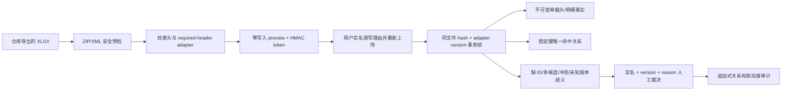

# 维保仓库单据多版本适配与歧义工作台

## 1. 边界

本模块把发货/出库、退货返库、收货/入库工作簿转换为可追溯的仓库单据事实，并维护这些事实与维保需求、PN 和上下游仓库单据之间的稳定关系。

- 本模块只新增仓库单据事实、关系证据和歧义审计。
- 本模块不修改 `inventory`、维保成本字段或返还率。
- 附件、图片、测试报告的内容不进入事实库；只记录“该受控字段存在”，交给人工在原系统查看。
- 项目名称、日期邻近、PN 邻近和列数都不是关系键。

## 2. 数据流

## 3. 适配器与版本的区别

适配器由必填内部编码集合识别，并在多个匹配项中选择 required set 最具体的唯一项。因此，可选列移动或新增不会把文件误判成另一种单据，也不会按 49/120/155/166 等列数猜类型。

完整、有序的 `(内部编码, 业务表头)` SHA-256 只用于判断是否为已经审核过的模板版本。必填集合仍匹配、但完整签名改变时：

1. 适配器仍能解析已声明的稳定字段；
2. `version_state` 为 `unknown_version`；
3. 文件级歧义进入人工队列；
4. 不会因为相同中文表头而丢失字段——字段身份始终是内部编码，中文表头同时保留供展示。

窄版返库没有稳定单据 ID 和明细 ID，因此只产生 `missing_document_id` / `missing_line_id` 歧义，不生成伪造事实键。

## 4. 失败关闭规则

以下情况在事实写入前拒绝整个文件：

- 未知或多义的 required-header adapter；
- 重复内部编码、空内部编码或数据列没有双表头；
- 任意工作表中的公式；
- 外部 relationship、external link、宏或嵌入对象；
- 加密 ZIP、路径穿越、异常压缩比、超成员/解压体积/工作表/行/列/单元格/文本上限；
- 关键稳定 ID、PN/SN、单号或状态超过存储边界。

以下情况允许固化可确认事实，但禁止自动猜关系，统一进入 `maintenance_warehouse_ambiguity`：

- 缺少稳定单据或明细 ID；
- 稳定键零命中或多候选；
- 同一稳定 ID 对应不同事实指纹；
- 未知枚举或未知完整模板版本；
- 受控附件字段非空。

## 5. preview、apply 与重放

- `POST /api/maintenance/warehouse-imports/preview` 不接收数据库 Session，不产生任何事实、缓存行或审计行。
- preview token 绑定文件 SHA-256、adapter version、完整表头签名和事实/歧义计数。
- `POST /api/maintenance/warehouse-imports/{id}/apply` 要求重新上传同一文件、同一 token、实名账号和业务理由。
- apply 通过 PostgreSQL transaction advisory lock 串行化同一文件；头、行、关系、歧义、批次和审计在同一事务内写入，任一步失败全部回滚。
- `(source_file_hash, adapter_version)` 是幂等键；成功文件再次应用时所有业务表均为 0 新增、0 更新。

## 6. 人工裁决

人工裁决使用 `version` 乐观锁。只能选择系统已验证存在的稳定目标，或对无需建立关系的问题做“已核实”确认。每次成功裁决会：

1. 把歧义从 `open` 单向转为 `resolved`；
2. 必要时追加一条 manual link；
3. 追加 before/after、理由、实名操作人和时间审计；
4. 由数据库触发器阻止审计、事实、批次和关系被更新或删除。

已有任何仓库业务历史时，迁移 downgrade 在第一条破坏性 DDL 之前中止；生产回滚应走应用回退或 forward-fix。
